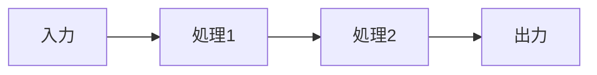
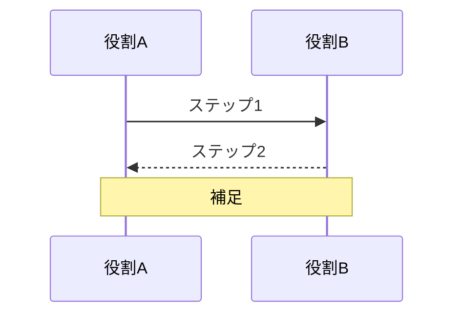
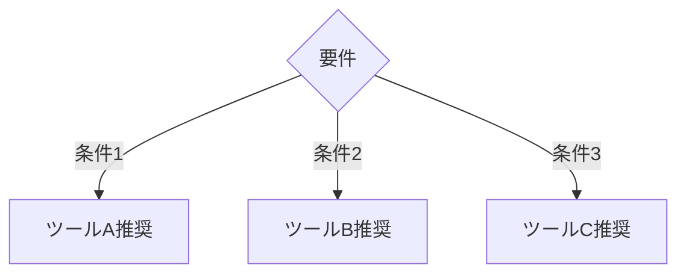
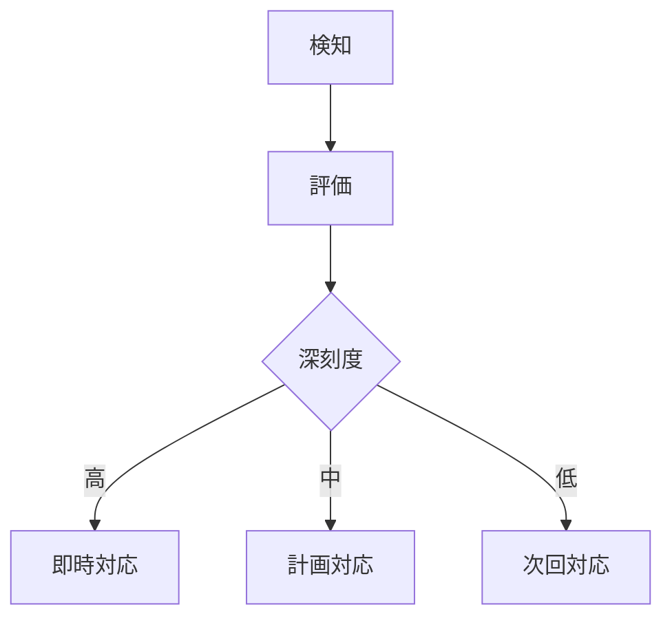

# AI活用ドキュメント テンプレート集

doc-writer がセクション執筆時に参照するテンプレート。トピックの種類に応じて適切なテンプレートを選択する。

---

## テンプレート1: ツール紹介セクション

AIツール（Claude Code, Cursor, Copilot 等）の紹介・活用法を書く際のテンプレート。

```markdown
### [番号] [ツール名] ベストプラクティス

[ツール名]は[1文での説明]。[主要な特徴や位置づけを1文で]。

#### [ツール名]の主要機能

| 機能 | 説明 | 活用シーン |
|---|---|---|
| 機能A | 説明 | シーン |
| 機能B | 説明 | シーン |

#### [ワークフロー名]



#### 典型プロンプト

```text
[具体的なプロンプト例]
```

> **ポイント**: [実務で重要な注意事項やコツ]
```

---

## テンプレート2: 手法・プロセス紹介セクション

開発手法（TDD, SDD 等）やプロセスを説明する際のテンプレート。

```markdown
### [番号] [手法名]

[手法名]は[定義を1文で]。[なぜAI駆動開発で重要かを1文で]。

#### [手法名]のフロー



#### 実践例

```text
[具体的なプロンプトや手順の例]
```

#### よくある失敗パターン

| パターン | 原因 | 対策 |
|---|---|---|
| 失敗1 | 原因 | 対策 |
| 失敗2 | 原因 | 対策 |

> **ポイント**: [成功のための重要な注意事項]
```

---

## テンプレート3: ツール比較セクション

複数のツールや手法を比較する際のテンプレート。

```markdown
### [番号] [比較テーマ]

[何を比較するかを1文で]。[比較の目的や読者が得られる判断材料を1文で]。

#### 比較表

| 観点 | ツールA | ツールB | ツールC |
|---|---|---|---|
| 用途 | — | — | — |
| 強み | — | — | — |
| 弱み | — | — | — |
| コスト | — | — | — |
| 推奨シーン | — | — | — |

#### 選択フローチャート



> **ポイント**: [選択時の重要な判断基準]
```

---

## テンプレート4: 設定・構成ガイドセクション

CLAUDE.md、MCP、CI/CD 等の設定方法を説明する際のテンプレート。

```markdown
### [番号] [設定対象名]の設計

[設定対象名]は[役割を1文で]。[適切に設計することの重要性を1文で]。

#### 基本構成

```json
{
  "設定キー": "設定値",
  "説明": "各項目の意味"
}
```

#### 設定項目一覧

| 項目 | 必須 | 説明 | 推奨値 |
|---|---|---|---|
| 項目A | ○ | 説明 | 値 |
| 項目B | — | 説明 | 値 |

#### 実践的な設定例

```yaml
# プロジェクト規模: チーム（5〜10人）
# 用途: Webアプリケーション開発
設定例の内容
```

> **ポイント**: [設定時の注意事項やよくあるミス]
```

---

## テンプレート5: セキュリティ・リスク管理セクション

セキュリティ対策やリスク管理を説明する際のテンプレート。

```markdown
### [番号] [テーマ名]

[リスクや脅威を1文で説明]。[対策の重要性を1文で]。

#### リスク一覧

| リスク | 深刻度 | 影響範囲 | 対策 |
|---|---|---|---|
| リスク1 | 高 | 範囲 | 対策 |
| リスク2 | 中 | 範囲 | 対策 |

#### 対策フロー



#### チェックリスト

- [ ] チェック項目1
- [ ] チェック項目2
- [ ] チェック項目3

> **ポイント**: [セキュリティ上の最重要注意事項]
```

---

## テンプレート選択ガイド

| 書きたい内容 | 使うテンプレート |
|---|---|
| 特定ツールの使い方・ベストプラクティス | テンプレート1: ツール紹介 |
| 開発手法・ワークフローの解説 | テンプレート2: 手法・プロセス |
| 複数の選択肢の比較・選定基準 | テンプレート3: ツール比較 |
| 設定ファイル・環境構築の手順 | テンプレート4: 設定・構成ガイド |
| セキュリティ・リスク・コンプライアンス | テンプレート5: セキュリティ |
