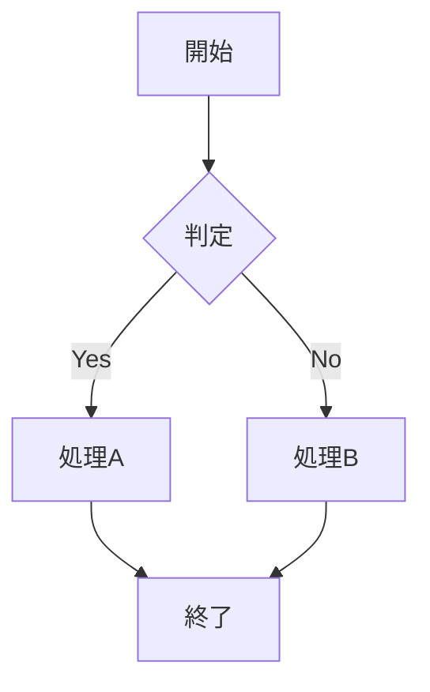
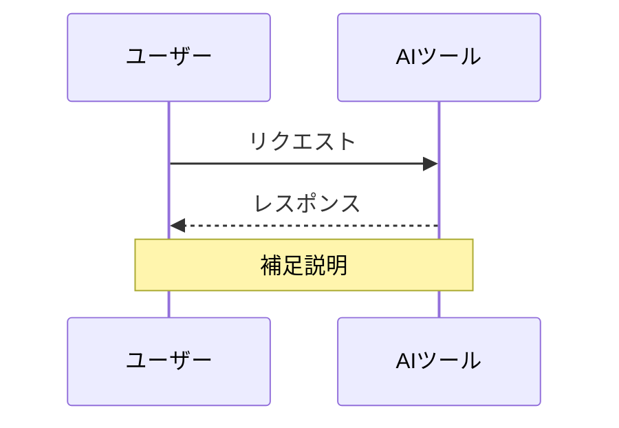
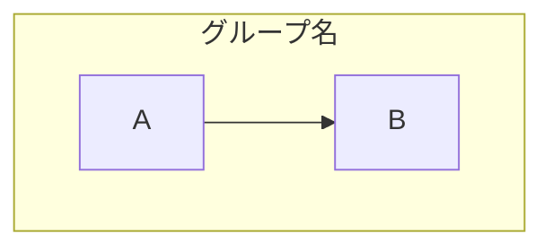

# ドキュメント標準ガイド

エージェント間で共有する、AI駆動開発.md の書式・文体・構造の標準規約。

---

## 見出し階層

```
## セクション（大分類）
### サブセクション（中分類）
#### 詳細（小分類）— これ以上深くしない
```

- `#`（h1）は使用しない（ドキュメントタイトルのみ）
- 階層スキップ禁止（`##` の直下に `####` を置かない）
- 見出しの前後に空行を1行ずつ入れる

---

## Mermaid図の記法

### フローチャート



- 方向: `TD`（上→下）、`LR`（左→右）を基本とする
- ノード形状: `[]`角丸なし、`()`角丸、`{}`菱形（判定）、`[()]`円柱（DB）
- 矢印: `-->`実線、`-.->` 点線、`==>`太線
- ラベル: `-->|ラベル|` で矢印にラベルを付ける

### シーケンス図



- `participant` で参加者定義、`as` でエイリアス
- `->>` 実線矢印、`-->>` 点線矢印
- `Note over` / `Note right of` で注釈
- `loop`, `alt`, `opt` のブロックは必ず `end` で閉じる

### サブグラフ



- `subgraph` / `end` は必ず対で使う
- 日本語のグループ名はそのまま使用可能

---

## 表（テーブル）の規約

```markdown
| 項目 | 説明 | 備考 |
|---|---|---|
| データ1 | 説明1 | — |
| データ2 | 説明2 | 注意事項 |
```

- ヘッダー行 + セパレーター行（`|---|`）は必須
- 空セルは `—`（emダッシュ）で埋める
- 1セル80文字以上になる場合は分割を検討
- 5項目以上の箇条書きは表に変換する

---

## コードブロック

| 用途 | 言語タグ |
|---|---|
| プロンプト例 | `text` |
| シェルコマンド | `bash` |
| 設定ファイル | `json`, `yaml`, `toml` |
| Mermaid図 | `mermaid` |
| プログラム | `javascript`, `typescript`, `python` 等 |
| 差分表示 | `diff` |
| その他 | `plaintext` |

- タグなしコードブロックは禁止
- インラインコードはバッククォート1つ: `` `コマンド名` ``

---

## 引用ブロックの使い方

```markdown
> **ポイント**: 重要な注意事項や推奨事項をここに書く。
```

- セクションの末尾に配置する
- 太字（`**ポイント**:`）で開始する
- 1ブロック3文以内に収める

---

## 文体ガイド

| ルール | OK | NG |
|---|---|---|
| 語尾 | 「〜する」「〜である」 | 「〜します」「〜です」（混在不可） |
| 1文の長さ | 60文字以内目安 | 長文の複文 |
| 概念数 | 1文1概念 | 1文に複数概念 |
| 受動態 | 能動態を優先 | 「〜される」の多用 |
| カタカナ語 | 初出時に補足説明 | 説明なしで使用 |

---

## 情報の正確性ラベル

数値・仕様の確度に応じて以下の表現を使い分ける：

| 確度 | 表現例 |
|---|---|
| 確実（公式情報） | そのまま記載 |
| 概算 | 「〜目安」「〜程度」「約〜」 |
| 推定・経験則 | 「一般的に〜」「多くの場合〜」 |
| 変動あり | 「〜（2026年4月時点）」と日付を付記 |
