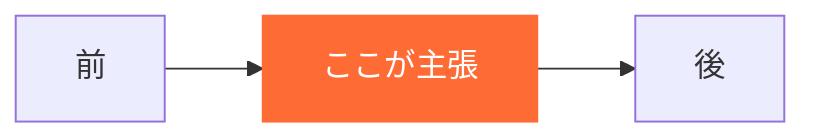

# スライド標準ガイド

エージェント間で共有する、`slide/` 配下のスライド原稿の**骨格・記法・Canva MCP への受け渡し**の標準規約。

対になるガイド：[`doc-standards.md`](doc-standards.md)（`contents/` 用の書式規約）

---

## 0. 大前提：スライドは記事の要約ではない

| | `contents/` の記事 | `slide/` の原稿 |
| --- | --- | --- |
| 読み手 | **自分のペースで読む**。戻れる | **受け身で1回だけ聞く**。戻れない |
| 情報量 | 網羅していい | **1テーマ1メッセージ**まで |
| 表・コード | 積極的に使う | **原則使わない**（後述の Canva 制約） |
| 詳細 | 本文に書く | **`contents/` へ誘導する** |

> **記事を機械的に圧縮したスライドは必ず失敗する。** 圧縮ではなく「**抜粋 + 誘導**」で作る。1ディレクトリ分の記事から、**話すのは3割・残り7割は「詳しくはこちら」**でよい。

### 図が主役、文は補足

**このリポジトリのデッキは図で説明する。** 文章スライドが続くデッキは作らない。

| | |
| --- | --- |
| 既定値 | `visual: image`（図あり）。**文字だけのスライドが例外** |
| 本文の役割 | 図の**補足**。図を見れば分かることを繰り返さない |
| 図がないスライド | 表紙・章扉・「1文だけを大きく置く」スライドのみ |

> **図が思いつかないスライドは、主張が定まっていない。** 削るか、主張を1つに絞り直す。

---

## 1. Canva MCP の制約（設計の起点）

`generate-design-structured` に渡せるのは**次の形だけ**である。ここが原稿フォーマットを決める。

```json
{
  "topic": "150字以内",
  "audience": "対象者",
  "style": "ビジュアルスタイル",
  "length": "分量",
  "presentation_outlines": [
    { "title": "スライドタイトル", "description": "スライド本文" }
  ]
}
```

### 3つの制約と、その帰結

| 制約 | 帰結 |
| --- | --- |
| **渡せるのは `title` と `description` の文字列だけ** | 表・Mermaid図・コードブロックは**構造ごと消える**。原稿に書いても届かない |
| **`description` は Canva 側の AI が書き換える** | `verbatim: true` は `doc` 専用で、**presentation では効かない**。表記が保証されない |
| **画像は `asset_ids` で最大10枚** | 図はあらかじめ画像化しておく必要がある |

> **⚠️ リライトされて壊れると困る情報を `description` に置かない。**
> コマンド・設定キー・オプション名・バージョン番号・固有名詞・厳密な数値は、AI が「自然な日本語」に整えた結果**壊れる**。
> これらは `[figure]`（画像として後入れ）か、**Canva 上で手作業**に回す。原稿にはその旨を明示する。

### 図は Mermaid で書く（ダイアグラム・アズ・コード）

**図を「Canva で描いてください」という日本語指示にしない。** 原稿に **Mermaid のソースをそのまま書く**。

| | 効果 |
| --- | --- |
| **レビューできる** | VS Code / GitHub のプレビューで**そのまま図が見える**。文字の指示を読んで想像しなくていい |
| **再現できる** | 数値や工程を直したら**再レンダリングするだけ**。描き直しが要らない |
| **統一できる** | 配色・フォント・強調色を [`../../slide/_mermaid.json`](../../slide/_mermaid.json) で一元管理する |

```bash
# 原稿の ```mermaid ブロックを PNG に書き出す
./slide/render-figures.sh 00_overview
# → slide/_assets/00_overview/S05.png ...
```

**強調は `<!-- fig: -->` のコメントではなく `classDef` で書く。** そうしないと「オレンジにして」という指示が図ごとにブレる。

```
classDef hi  fill:#ff6b35,stroke:#ff6b35,color:#fff,font-weight:bold
classDef dim fill:#1e2430,stroke:#3d4757,color:#8b95a5
class X hi
class A,B,C dim
```

### 図の種類の選び方

| 伝えたいこと | Mermaid |
| --- | --- |
| **登場人物の間で何が起きるか**（手戻り・レビューの往復・エージェント間の受け渡し） | `sequenceDiagram` |
| 工程の流れ・分岐 | `flowchart LR` / `TD` |
| 状態の遷移 | `stateDiagram-v2` |
| データ構造 | `erDiagram` / `classDiagram` |
| 時系列・導入計画 | `timeline` / `gantt` |

> **`sequenceDiagram` の `Note over` は強調帯になる。** 「ここで手戻り」のような**言いたい一言**を Note に置くと、図の中で一番目立つ。

### 図にできないもの（3択）

| 方法 | 使いどころ |
| --- | --- |
| **① 平文に落とす** | 3行以内の対比なら箇条書きで足りる |
| **② `visual: manual`** | プロンプト全文・コード断片。Canva 上で手貼りする |
| **③ 載せない** | Appendix に送るか、`contents/` へ誘導する |

### 背景色を合わせる

図は**背景 `#151a23` で書き出す**（透過にしない）。透過にすると原稿レビュー時に白背景で文字が読めず、Canva 側のスライド背景ともズレる。

> **Canva のスライド背景を `#151a23` に設定する。** 図の背景と一致していれば継ぎ目が見えない。ブランドカラーに変える場合は `_mermaid.json` と `render-figures.sh` の `-b` を同じ色に揃える。

### Canva へのアップロード

Canva MCP の `upload-asset-from-url` は**公開 HTTPS URL しか受け付けない**。このリポジトリは GitHub で公開しているので、**push 済みの図はその raw URL をそのまま渡せる**。

```
https://raw.githubusercontent.com/takuma39/ai/master/slide/_assets/<deck>/<SNN>.png
```

手順は3つ。

1. `render-figures.sh` で PNG を書き出す
2. **`git add slide/_assets/ && git commit && git push`**（push していない図は 404 になる）
3. `upload-asset-from-url` に raw URL を渡す → 返ってきた `asset_ids` を `generate-design-structured` へ

> **⚠️ 新たにホスティングサービスへ上げてはならない。** 使えるのは**すでに公開しているこのリポジトリの raw URL だけ**。非公開リポジトリに移した場合や、社外に出せない図を扱う場合は、この経路は使わず**人が Canva に手動アップロードする**。
>
> **⚠️ commit した時点で図は公開される。** 顧客名・社内固有の構成など、公開したくない情報を図に含めない。

---

## 2. デッキの共通骨格

**尺で骨格を変える。** 短尺デッキに長尺の骨格を詰めない。

| 尺 | 本編 | 1枚あたり | 骨格 |
| --- | --- | --- | --- |
| **5〜10分（LT）** | **10〜12枚** | 約45秒 | 下の「短尺版」 |
| 30〜40分（勉強会） | 20〜25枚 | 約80秒 | 下の「長尺版」 |

### 短尺版（5〜10分）— 主張は1つだけ

| # | スライド | 枚数 | 役割 |
| --- | --- | --- | --- |
| 1 | **表紙** | 1 | 自己紹介スライドは**作らない**（口頭10秒） |
| 2 | **今日持ち帰るもの** | 1 | ★**1文**。図というより「1文だけの表紙」 |
| 3 | **課題** | 1〜2 | 「こうなっていませんか」 |
| 4 | **結論** | 1 | ★**デッキの主役の図**をここに置く |
| 5 | **具体的な方法** | 3〜4 | 1枚1メッセージ。全部に図をつける |
| 6 | **注意点** | 1 | 失敗例を1枚だけ |
| 7 | **まとめ** | 1 | #2 と**同じ図・同じ文**を再掲 |
| 8 | **次の一歩** | 1 | 明日やる1個 + `contents/` へのQR |
| A | **Appendix** | 任意 | **本編に入らなかったものは全部ここ**。画像は付けない |

> **アジェンダを入れない。** 10分で章立てを説明する余裕はない。
> **Appendix には画像を付けない。** `asset_ids` の10枚枠は本編で使い切る。

### 長尺版（30〜40分）

| # | チャプター | 枚数 | 役割 |
| --- | --- | --- | --- |
| 0 | **表紙** | 1 | タイトル・日付・登壇者 |
| 1 | **自己紹介** | 1 | 全デッキ共通。使い回す |
| 2 | **今日持ち帰るもの** | 1 | ★**1文**の結論。ここで全部言ってしまう |
| 3 | **アジェンダ** | 1 | 章立て |
| 4 | **課題提起** | 2〜3 | 「こうなっていませんか」。聞き手を当事者にする |
| 5 | **結論** | 1 | 先に答えを出す。引っ張らない |
| 6 | **具体的な方法** | 8〜12 | 本編。1枚1メッセージ |
| 7 | **プロンプト実例** | 3〜5 | ★実物を見せる。ここが一番聞かれる |
| 8 | **失敗例・注意点** | 2〜3 | ★**差別化はここ**。成功例だけの発表は記憶に残らない |
| 9 | **まとめ** | 1 | #2 と**同じ内容を意図的に再掲**する |
| 10 | **次の一歩** | 1 | 明日やれる1個だけを言う |
| 11 | **参考リンク** | 1 | `contents/` の該当ディレクトリへ誘導 |
| A | **Appendix** | 任意 | 質疑で出たら開く。本編では飛ばす |

**本編20〜25枚 + Appendix。** 1枚80秒換算で、30分なら本編22枚が上限の目安。

> **#2 と #9 は同じことを2回言う。** 冗長ではない。**冒頭で言った1文を最後にもう一度出すと、持ち帰り率が変わる。**

> **Appendix を必ず持つ。** 本編を削る勇気は「捨てる」ではなく「後ろに送る」で確保する。質疑で開ければ本編に入れる必要はない。

---

## 3. スライド1枚のルール

| 項目 | 基準 |
| --- | --- |
| タイトル | **全角20字以内**。「〜について」で終わらせない。**主張を書く** |
| 本文 | **全角120字以内** |
| 箇条書き | **3項目まで**。4つ目が要るならスライドを分ける |
| 数字 | **1枚に1つ**。複数並べると全部忘れられる |

| ❌ 悪いタイトル | ✅ 良いタイトル |
| --- | --- |
| CLAUDE.md について | CLAUDE.md は「毎回読まれる」唯一の場所 |
| MCP の種類 | MCP は入れるほど遅くなる |
| テストの自動生成 | テストを先に渡すと手戻りが消える |

---

## 4. 原稿ファイルの書式

```markdown
---
deck: 00_overview
title: AI駆動開発の全体像
source: contents/00_overview/
audience: AI活用を開発プロセスに組み込みたいエンジニア・テックリード
duration: 30          # 分
takeaway: <1文。このデッキで持ち帰らせるもの>
style: シンプル・技術寄り・図中心
status: draft         # draft → review → published
updated: 2026-08-31
---

# （デッキタイトル）

## 導入                      ← チャプター（Canva には送らない）

### S01 ｜ スライドタイトル     ← Canva の title になる

`type: message` ｜ `visual: mermaid`

ここに書いた平文が Canva の description になる。図の補足に徹する。

[figure: 図の一行要約]



<!-- fig: Mermaid で表現しきれない指示だけを書く。強調は classDef 側に持たせる -->
<!-- note: 発表者ノート。Canva には送らない -->
```

> **スライドごとの `time:` は書かない。** 実際の尺と合わず当てにならない。**デッキ冒頭に総尺と1枚あたりの秒数を1行だけ**書き、削る候補のスライド番号を添える。

### 見出し階層の対応

| 記法 | 意味 | Canva へ |
| --- | --- | --- |
| `#` | デッキタイトル | `topic` |
| `##` | チャプター | **送らない**（構成把握用） |
| `### SNN ｜ タイトル` | **スライド1枚** | `title`（`SNN ｜ ` は除去） |
| 直後の平文・箇条書き | スライド本文 | `description` |
| `` `type:` `` 行 | 制作メモ | **送らない** |
| `<!-- note: -->` | 発表者ノート | **送らない** |
| `[figure: ...]` | 図の一行要約 | **送らない** |
| ```` ```mermaid ```` | **図のソース** | **送らない**。PNG 化して手動アップロード |
| `<!-- fig: -->` | Mermaid で書けない補足指示 | **送らない** |

### `type` の種類

| 値 | 意味 |
| --- | --- |
| `title` | 表紙・章扉 |
| `message` | 主張1つ（最も多い） |
| `compare` | 対比（Before/After、❌/✅） |
| `demo` | プロンプト・実行例 |
| `warn` | 失敗例・注意点 |
| `link` | 誘導・まとめ |

### `visual` の種類

| 値 | 意味 |
| --- | --- |
| `mermaid` | **既定値。** ```` ```mermaid ```` ブロックを書き、`render-figures.sh` で PNG 化して手動アップロード |
| `none` | テキストのみ（表紙・章扉・「1文だけ」のスライド） |
| `manual` | Canva 上で手作業（プロンプト全文・コード断片・QR） |

---

## 5. 発表者ノート

`<!-- note: -->` に書く。**スライド本文に書けなかったことの置き場ではない。**

| 書くもの | 例 |
| --- | --- |
| 会場への問いかけ | 「CLAUDE.md 書いてる人、挙手お願いします」 |
| 言い方の注意 | 「ここは断定しない。『うちの場合は』と前置きする」 |
| 予想される質問 | 「必ず『コストは？』が来る。Appendix A3 を開く」 |
| 時間の目安 | 「ここで10分経過。遅れていたら #6-3 を飛ばす」 |

---

## 6. ファイル分割の基準

| 単位 | 対応 |
| --- | --- |
| **1デッキ = 1 md ファイル** | `slide/NN_kebab-case.md` |
| **1デッキ = `contents/` の1ディレクトリ** | 原則1:1。ファイル名も揃える |
| 例外 | 元ディレクトリが大きい場合（`02_mcp/` など）は**総論だけをデッキにし、個別は `contents/` へ誘導**する |

- ファイル名は **ASCII 必須**（`contents/` と同じ理由。Canva / スライド生成の引数で日本語は事故る）
- 1ファイルが**35スライドを超えたら分割**を検討する

---

## 7. 公開前チェックリスト

- [ ] `takeaway` が**1文**で書けているか
- [ ] #2 と #9 が同じことを言っているか
- [ ] タイトルが全角20字以内、「〜について」で終わっていないか
- [ ] 1枚に数字が2つ以上載っていないか
- [ ] `visual: image` が**10枚以内**か
- [ ] リライトされたら壊れる情報（コマンド・設定キー・バージョン）が `description` の平文に混ざっていないか
- [ ] 失敗例のチャプターが**空でない**か
- [ ] **文字だけのスライドが連続していない**か（図が主役になっているか）
- [ ] `[figure]` に ```` ```mermaid ```` ソースが付いているか（`manual` を除く）
- [ ] `render-figures.sh` が**エラー0**で通るか
- [ ] 強調が `classDef` で書かれているか（コメントでの色指示になっていないか）
- [ ] 尺と枚数が合っているか（LTなら本編10〜12枚）
- [ ] 参考リンクが `contents/` の実在パスを指しているか
