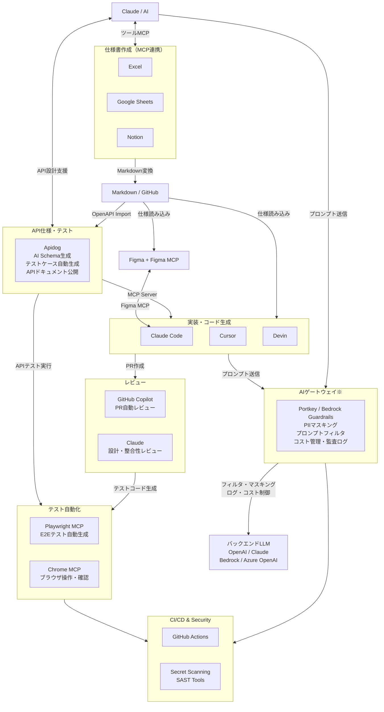
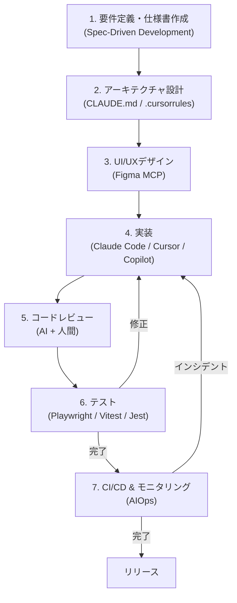
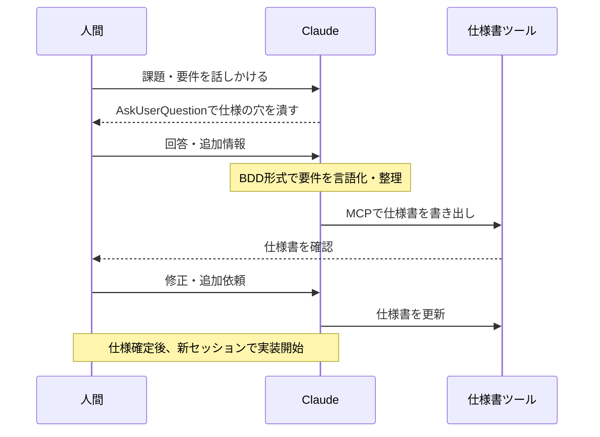
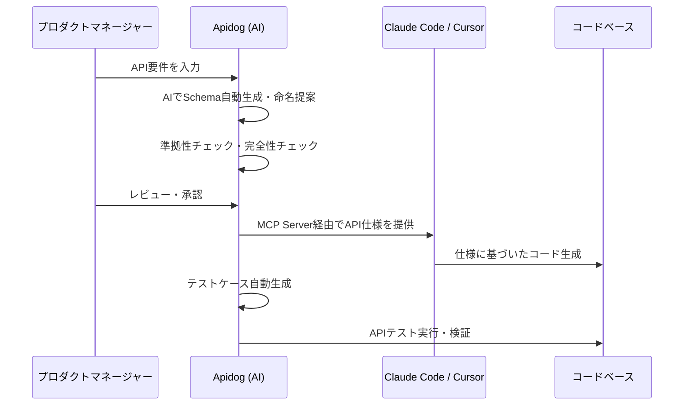
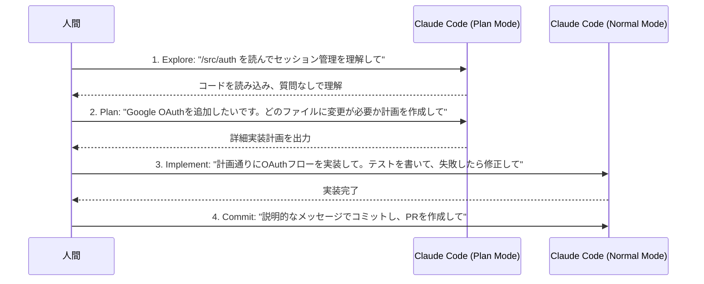
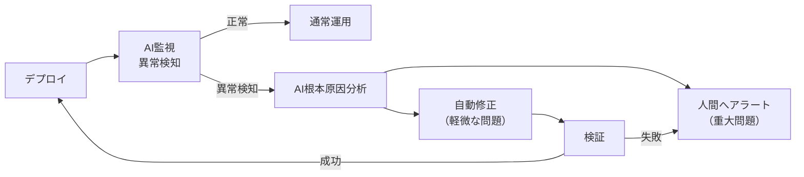
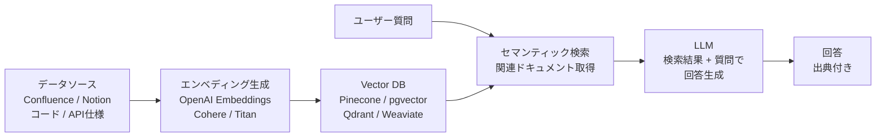
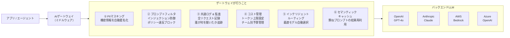

AIを活用して要件定義から実装・テストまでの開発プロセス全体を効率化する手法のまとめ（2026年4月時点）。

---

## 使用ツール

| カテゴリ | ツール | 主な役割 |
| --- | --- | --- |
| 仕様整理・思考整理 | Claude | 要件定義・設計・コードレビュー |
| 仕様書作成（MCP連携） | Excel / Google Sheets / Notion | AIと対話しながら仕様を作成・管理 |
| API仕様・ドキュメント | Apidog（AI機能） | Schema編集・テストケース自動生成・ドキュメント品質チェック |
| デザイン | Figma + Figma MCP | UI設計・デザイントークン管理 |
| エージェント実装 | Claude Code | 大規模コード生成・リファクタリング |
| エディタ補助 | Cursor | インライン修正・ファイル横断編集 |
| 補完・レビュー | GitHub Copilot | 補完・PR作成・コードレビュー支援 |
| 自律エージェント | Devin / OpenHands | 反復タスクの自動化（検証用途） |
| テスト自動化 | Playwright MCP / Chrome MCP | E2Eテスト自動生成・実行 |
| セキュリティ | GitGuardian / GitHub Secret Scanning | シークレット漏洩・脆弱性検出 |
| AIゲートウェイ | Portkey / AWS Bedrock Guardrails / Azure APIM | プロンプトフィルタ・機密情報マスキング・コスト管理 |

### ツール連携図



> **※AIゲートウェイの適用範囲**：ゲートウェイが保護できるのは「自社アプリ/コードからLLM APIを呼ぶ」経路のみ。GitHub Copilotなどの外部SaaSはそれぞれが直接LLMを呼んでいるため、ゲートウェイでは介入できない。

---

## 開発フロー

### 全体フロー図



---

## 1. 要件定義・仕様書作成（Spec-Driven Development）

### 1.1 スペック駆動開発（SDD）とは

コードを書く前に詳細な仕様書（スペック）を作成し、それをAIへのプロンプトとして使う。

**フロー：Specify（仕様定義） → Plan（計画） → Tasks（タスク分解） → Implement（実装）**

- 曖昧な要件のままコード生成すると、後工程で全て崩れる
- 仕様書の完成度 = 実装品質に直結
- 複雑度別の仕様書ボリューム目安：
  - 単純関数：100-200語
  - APIエンドポイント：300-500語
  - コンポーネント/モジュール：500-800語
  - システムアーキテクチャ：1000-2000語

### 1.2 仕様書作成ツールの選択

| ツール | 接続方法 | 特徴 |
| --- | --- | --- |
| Excel | Claude in Excel | 表形式で視覚的に編集しやすい。SharePointで管理 |
| Google Sheets | Google Sheets MCP | Web版でも完結。リアルタイム共有が簡単 |
| Notion | Notion MCP | 文章・データベースを一体で管理 |
| Apidog | Apidog AI + MCP Server | API仕様書をAIで自動生成・品質チェック。MCPでAIコーディングツールと連携 |
| GitHub + Markdown | Git管理 | 開発フェーズから直接参照できる。Claude Codeが直読みできる |

### 1.3 AIと対話しながら要件を整理する

**Claudeにインタビューさせる（推奨パターン）**

```text
I want to build [brief description]. Interview me in detail using the AskUserQuestion tool.

Ask about technical implementation, UI/UX, edge cases, concerns, and tradeoffs.
Don't ask obvious questions, dig into the hard parts I might not have considered.

Keep interviewing until we've covered everything, then write a complete spec to SPEC.md.
```

**日本語版プロンプト：**

```text
[構築したいものの簡単な説明] を構築したいと考えています。AskUserQuestion ツールを使って、私に詳しくインタビューしてください。

技術的な実装、UI/UX、エッジケース、懸念事項、トレードオフについて質問してください。
当たり前の質問は避け、私が考慮していないかもしれない難しい部分を深掘りしてください。

すべてを網羅するまでインタビューを続け、完了したら完全な仕様書を SPEC.md に作成してください。
```

> **💡 AskUserQuestion ツールとは？**
> AIエージェント（Claude CodeやCursorなど）が人間に明確な質問を投げかけ、ユーザーからの回答を待つための機能（システムツール）です。これを明示的に使うよう指示することで、AIが勝手な推測で作業を進めるのを防ぎ、対話形式で要件の解像度を確実に引き上げることができます。

**AskUserQuestion のやり取り例：**

> 🧑 ユーザー：「ユーザー管理機能を作りたい」
>
> 🤖 Claude（AskUserQuestion）：以下の点を教えてください。
> 1. ユーザーの認証方法はメール／パスワードですか？それともGoogle・GitHub等のSNSログインを想定していますか？
> 2. 管理者とエンドユーザーで権限を分ける必要はありますか？
> 3. メールアドレスの変更や退会機能は必要ですか？
>
> 🧑 ユーザー：「メール＋パスワードとGoogleログインの両方。管理者ロールあり。退会も必要。」
>
> 🤖 Claude（AskUserQuestion）：ありがとうございます。追加で確認です。
> 1. パスワードリセットはメール送信で行いますか？有効期限は何分を想定していますか？
> 2. 管理者はどの画面からユーザーを管理しますか？一覧・検索・強制退会などが必要ですか？
>
> （以降、仕様の穴がなくなるまで続く）
>
> 🤖 Claude：インタビュー完了しました。SPEC.md に仕様書を書き出します。

このアプローチで：
- AIが見落としがちなエッジケースを事前に洗い出す
- 仕様が固まったら新しいセッションで実装に移行（クリーンなコンテキストで開始）

**MCP経由でツールに書き出す**

- 決定した仕様をそのままExcel・Sheets・Notionに書き出す
- 「この要件を追記して」「不足項目を提案して」といった指示が可能
- ツールとAIが双方向につながることで、ドキュメントと対話が一体化する

### 1.4 仕様書の必須要素

効果的な仕様書に含めるべき内容：

| セクション | 内容 |
| --- | --- |
| 目的・ゴール | 解決する課題と成功の定義 |
| コンテキスト・制約 | 既存アーキテクチャ、依存関係、パフォーマンス要件 |
| 機能要件 | コア動作（BDD形式：Given/When/Then推奨） |
| 非機能要件 | セキュリティ・スケーラビリティ・アクセシビリティ |
| エッジケース | 異常系・境界値・エラーハンドリング |
| テスト基準 | 検証アプローチ・合格条件 |
| 具体例 | 入出力ペア・使用シナリオ |

### 1.5 ユーザーストーリーとBDD

```text
As a [user type],
I want to [action],
So that [benefit].

Acceptance Criteria:
GIVEN [context]
WHEN [action]
THEN [expected result]
```

**日本語版：**

```text
[ユーザー層] として、
[目的/利益] を達成するために、
[機能/アクション] を実行したい。

受け入れ基準（Acceptance Criteria）:
GIVEN（前提）: [事前条件やコンテキスト]
WHEN（操作）: [アクションの実行]
THEN（結果）: [期待される結果]
```

> **💡 BDDのシナリオはAIへのfew-shotプロンプトとして直接機能する。**
> 
> AIに対して「ログイン機能を作って」とだけ指示する（Zero-shot＝具体例なし）と、AIは勝手な推測で実装してしまい、意図と違うコードが出力されやすくなります。
> 一方で、上記のような Given/When/Then 形式のシナリオを一緒に渡すことで、それが**「ユーザーがこういう操作をした時は、システムはこう動くべき」という具体的な動作例（= Few-shot）**として機能します。
> これにより、AIはロジックの要件や書くべきテストコードの基準を正確に理解し、一発で高品質なコード（とテスト）を出力できるようになります。

### 1.6 よくある失敗パターン

- 「速くしてほしい」など数値のない曖昧な要件
- 既存アーキテクチャへの言及なし
- エッジケース・エラーシナリオの欠落
- セキュリティ・パフォーマンス仕様なし
- テスト基準・検証アプローチなし

> **ポイント**：仕様書の完成度がそのまま実装品質に直結する。コードより先に仕様を完成させる

#### シーケンス図：要件定義フェーズ



### 1.7 Apidog AI活用によるAPI仕様書作成

ApidogはAPI開発プラットフォームとして、AIを活用したAPI仕様書の作成・品質管理を一体化する。従来のPostmanやSwagger Editorと異なり、AIがAPI設計プロセス全体を支援する。

#### ApidogのAI機能一覧

| 機能 | 説明 | 活用場面 |
| --- | --- | --- |
| **Schema編集支援** | フィールド説明やMockデータを自動生成 | データモデル設計時に説明文を一括生成 |
| **API準拠性チェック** | API定義が設計ガイドラインに準拠しているか検証 | レビュー前の品質ゲート |
| **AI命名支援** | パラメーターに標準的なフィールド名を提案 | 命名規則の統一・国際化対応 |
| **テストケース自動生成** | テストデータ・アサーション・カスタムスクリプトを自動作成 | テスト工数の大幅削減 |
| **ドキュメント完全性チェック** | APIドキュメントの網羅性を分析し改善点を提案 | 公開前のドキュメント品質保証 |

#### Apidog + AI コーディングツール連携ワークフロー

ApidogはMCPサーバーを提供しており、Claude CodeやCursorなどのAIコーディングツールと直接連携できる。



**Apidog MCP Server の設定例**

Claude Code の MCP 設定に Apidog を追加：

```json
{
  "mcpServers": {
    "apidog": {
      "command": "npx",
      "args": ["-y", "apidog-mcp-server@latest", "--project", "<PROJECT_ID>"]
    }
  }
}
```

これにより、AIコーディングツールがApidogのAPI仕様を直接参照しながらコードを生成できる。


> **ポイント**：Apidogを「API仕様のSingle Source of Truth」として運用することで、設計→実装→テスト→ドキュメントの一貫性が保たれる


---

## 2. アーキテクチャ設計

### 2.1 CLAUDE.md の設計（最重要ファイル）

CLAUDE.md はClaude Codeが毎回のセッション開始時に読み込む「プロジェクトの憲法」。

**配置場所と優先度**

| 配置場所 | 用途 |
| --- | --- |
| `~/.claude/CLAUDE.md` | 全プロジェクト共通の個人設定 |
| `./CLAUDE.md` | プロジェクトルート（Gitで管理・チーム共有） |
| `./subdir/CLAUDE.md` | サブディレクトリ固有ルール（モノレポ向け） |
| `~/.claude/CLAUDE.md` + `@import` | 個人オーバーライド |

**CLAUDE.mdに含める10項目**

| # | セクション | 内容例 |
| --- | --- | --- |
| 1 | プロジェクト概要 | 技術スタック・目的・制約 |
| 2 | コードスタイル | ESModule/CommonJS選択、命名規則 |
| 3 | ディレクトリ構造 | 重要フォルダの役割説明 |
| 4 | テスト方針 | テストフレームワーク・単体テストの粒度 |
| 5 | ビルド・実行コマンド | `npm run dev`, `npm test` など |
| 6 | ブランチ・PR規約 | ブランチ命名・コミットメッセージ形式 |
| 7 | アーキテクチャ上の制約 | 使ってはいけないパターン・ライブラリ |
| 8 | 環境変数・設定 | 必須の環境変数名（値は記載しない） |
| 9 | よくある落とし穴 | プロジェクト固有の注意点 |
| 10 | 外部ドキュメントへのリンク | 設計書・API仕様書のパス or URL |

**CLAUDE.mdの実例**

```markdown
# Code style
- Use ES modules (import/export) syntax, not CommonJS (require)
- Destructure imports when possible (e.g., import { foo } from 'bar')

# Workflow
- Be sure to typecheck when you're done making a series of code changes
- Prefer running single tests, not the whole test suite, for performance

# Architecture
- API routes go in /src/api, shared types in /src/types
- Never import from /internal outside its directory

# Testing
- Use Vitest for unit tests, Playwright for E2E
- Run `npm run test:unit` for fast feedback during development

# DO NOT
- Commit secrets or API keys
- Modify /migrations without explicit instruction
- Use any as TypeScript type without comment justification
```

**日本語版：**

```markdown
# コードスタイル (Code style)
- CommonJS (require) ではなく、必ず ES modules (import/export) 構文を使用すること
- 可能な限り import の分割代入を使用すること（例: import { foo } from 'bar'）

# ワークフロー (Workflow)
- 一連のコード変更が完了したら、必ず型チェック (typecheck) を実行すること
- パフォーマンスのため、テスト全体ではなく単一のテストを実行することを優先すること

# アーキテクチャ (Architecture)
- APIルートは /src/api に、共有の型定義は /src/types に配置すること
- /internal ディレクトリ内にあるものを、そのディレクトリ外から絶対にインポートしないこと

# テスト (Testing)
- ユニットテストには Vitest、E2Eテストには Playwright を使用すること
- 開発中の迅速な確認のためには `npm run test:unit` を実行すること

# 禁止事項 (DO NOT)
- シークレット情報やAPIキーをコミットしないこと
- 明示的な指示がない限り /migrations フォルダを変更しないこと
- コメントでの明確な正当化理由なしに TypeScript の any 型を使用しないこと
```

**CLAUDE.mdのサイズ管理**

- 目標：200行以内（超えると下部の指示を無視しがちになる）
- ルールの取捨選択基準：「これを削除するとClaudeが間違いを起こすか？」→ Noなら削除
- 頻繁に変わる情報はCLAUDE.mdに書かない
- Claudeが既にデフォルトで知っていることは書かない
- `@path/to/file` 構文でファイルをインポート可能

**CLAUDE.md vs Skills の使い分け**

| | CLAUDE.md | Skills |
| --- | --- | --- |
| 読み込みタイミング | 毎セッション常時 | 必要なときだけ |
| 向いているもの | 全タスクに適用されるルール | 特定ドメインの知識・手順 |
| コンテキスト消費 | 常に消費 | 使用時のみ |

### 2.2 Cursor の .cursorrules / .mdc 設定

`.cursorrules` は非推奨。現在は `.cursor/rules/` ディレクトリに `.mdc` ファイルで管理：

```
.cursor/
  rules/
    general.mdc         # 全体ルール
    typescript.mdc      # TypeScript固有
    testing.mdc         # テスト規約
    api-conventions.mdc # API設計規約
```

各 `.mdc` ファイルの構造：

```yaml
---
description: TypeScript coding conventions
globs: ["**/*.ts", "**/*.tsx"]
---
# TypeScript Rules
- Always use strict mode
- Prefer type over interface for union types
- Never use 'any', use 'unknown' instead
```

**日本語版：**

```yaml
---
description: TypeScript のコーディング規約
globs: ["**/*.ts", "**/*.tsx"]
---
# TypeScript ルール
- 常に strict モードを使用すること
- ユニオン型（Union Types）には interface より type を優先して使用すること
- 'any' は絶対に使用せず、代わりに 'unknown' を使用すること
```

### 2.3 Skills の設計

`.claude/skills/` に `SKILL.md` を作成し、プロジェクト固有の専門知識を渡す：

```markdown
---
name: api-conventions
description: REST API design conventions for our services
---
# API Conventions
- Use kebab-case for URL paths
- Use camelCase for JSON properties
- Always include pagination for list endpoints
- Version APIs in the URL path (/v1/, /v2/)
```

**日本語版：**

```markdown
---
name: api-conventions
description: プロジェクトのREST API設計規約
---
# API 設計規約
- URLパスにはケバブケース（kebab-case）を使用すること
- JSONのプロパティにはキャメルケース（camelCase）を使用すること
- リストを返すエンドポイントには必ずページネーション（ページ分割）を含めること
- URLパスにAPIのバージョンを含めること（/v1/, /v2/ など）
```

スキル例：
- `figma-mcp.md` — デザイン連携手順
- `test-generation.md` — テスト生成ルール
- `fix-issue.md` — GitHub Issue修正ワークフロー
- `db-schema.md` — データベース設計規約

### 2.4 Hooks の設定

コード保存・編集のたびに自動実行される処理を定義：

```json
// .claude/settings.json
{
  "hooks": {
    // ツール使用後（事後）に自動実行される処理
    "PostToolUse": [
      {
        // 実行条件：AIがファイルの編集（Edit）または作成（Write）を行った時
        "matcher": "Edit|Write",
        // 実行内容：linterを実行し、コードフォーマットの自動修正を行う
        "hooks": [{ "type": "command", "command": "npm run lint --fix" }]
      }
    ],
    // ツール使用前（事前）に実行される処理
    "PreToolUse": [
      {
        // 実行条件：AIがファイルへの新規書き込み（Write）を行おうとした時
        "matcher": "Write",
        "hooks": [{
          "type": "command",
          // 実行内容：AIの操作対象（$TOOL_INPUT）に 'migrations/' フォルダが含まれていたら、エラーを出して書き込みを強制ブロックする
          "command": "if echo '$TOOL_INPUT' | grep -q 'migrations/'; then echo 'BLOCK: migrations folder is protected'; exit 1; fi"
        }]
      }
    ]
  }
}
```

Hooksの活用例：
- ファイル編集後に ESLint を自動実行
- マイグレーションフォルダへの誤書き込みをブロック
- コミット前に型チェックを強制
- テスト実行後に自動カバレッジレポート生成

> Hooksのスクリプト自体もClaudeに生成させることができる：`"Write a hook that runs eslint after every file edit"`

### 2.5 Subagents の設計

`.claude/agents/` に専門エージェントを定義：

```markdown
---
name: security-reviewer
description: Reviews code for security vulnerabilities
tools: Read, Grep, Glob, Bash
model: opus
---
You are a senior security engineer. Review code for:
- Injection vulnerabilities (SQL, XSS, command injection)
- Authentication and authorization flaws
- Secrets or credentials in code
- Insecure data handling

Provide specific line references and suggested fixes.
```

**日本語版：**

```markdown
---
name: security-reviewer
description: セキュリティ脆弱性のコードレビューを行います
tools: Read, Grep, Glob, Bash
model: opus
---
あなたはシニアセキュリティエンジニアです。以下の観点でコードをレビューしてください：
- インジェクション脆弱性（SQL、XSS、コマンドインジェクションなど）
- 認証および認可（権限）の欠陥
- コード内に含まれるシークレットや認証情報
- 安全でないデータ処理

具体的な行番号の参照と共に、推奨される修正案を提示してください。
```

#### サブエージェントのメリット（コンテキスト保護と役割分担）

AIとの対話において、コードを広く検索して該当箇所を探すような作業は、AIの「コンテキスト（記憶可能枠）」を大量に消費してしまいます。コンテキストが限界に近づくと、AIの応答が遅くなったり、直前に支持した重要なルールを忘れたり（コンテキストの希釈）しやすくなります。
サブエージェントを使うと、**「別のAIアシスタント（部下）に裏で作業を外注し、結果の要約だけをメインの会話に返す」**ことができるため、メインのコンテキストをクリーンに保つことができます。

#### エージェントの主要な設定項目（YAMLフロントマター）

- `tools`: エージェントに許可する操作権限。「調査」目的なら `Read, Grep, Glob` （読み取り限定）に制限することで、誤ってコードを書き換える事故を100%防げます。
- `model`: タスクに応じて最適なモデルを指定できます（単純な検索・要約は高速なモデル、高度な監査は高性能なモデルなど）。

#### 主要なユースケースと活用例

1. **Researcher（コードベース調査専門）**
   - **使用例**：「サブエージェントを使って、現在の決済システムがどう動いているか調査し、影響範囲を3行で要約して」
   - **効果**：数ダースのファイルを検索し読み込む「試行錯誤」の過程がメインセッションに表示されないため、ログが汚れず、トークンの節約にもなります。

2. **Security Reviewer（セキュリティ監査専門）**
   - **特長**：普段のコーディングとは全く異なる厳しい目線（SQLインジェクションやロジックの脆弱性の探索）専用のプロンプトをあらかじめ持たせておきます。これにより、専門家として偏執的に抜け穴を探させることができます。

3. **Test Generator（QA・テスト生成専門）**
   - **特長**：実装を担当したAIにそのままテストを書かせると、「自分の実装を通すための甘いテスト」を書くバイアスが働くことがあります。「品質保証（QA）」という独立したペルソナ（サブエージェント）にテストを書かせることで、より厳格な境界値テストなどを生成させることができます。

4. **DB Specialist（データベース特化型）**
   - **特長**：インデックスの最適化やN+1問題の発見など、パフォーマンスチューニングに特化した専門家です。専用ツールとしてデータベース接続権限（SQLite等へのSQL実行権限）を限定的に付与する運用が考えられます。

### 2.6 コンテキスト管理戦略

AI開発（特にClaude CodeやCursorを利用した際）において、**コンテキストウィンドウ（AIが一度に記憶・処理できる文字数の枠）は最も重要な資源（リソース）**です。
コンテキストが限界に近づくと、「直前に指示したルールを忘れる」「出力コードの品質が著しく下がる（ハルシネーションの増加）」「APIコストが高騰する」といった問題（**コンテキストの希釈**）が発生します。

そのため、以下の戦略で常にコンテキストをクリーンに保つ必要があります。

#### 状況別の具体的な対処法

| 状況 | 対処法 | 理由・背景 |
| --- | --- | --- |
| **無関係なタスクへの切り替え** | `/clear`（または新規チャット）で完全にリセットする | 前のタスクの思考プロセスやコード差分が記憶に残っていると、次のタスクのコード生成に悪影響（ノイズ）を与えるため。 |
| **AIが同じ間違いを2回繰り返す** | `/clear` して、より詳細なプロンプトで最初からやり直す | コンテキスト内に「間違ったコード」と「修正のやり取り」が残っていると、AIが自身の過去のミスに引きずられてループに陥りやすいため。 |
| **大規模なコードベースの調査** | Subagents（サブエージェント）に調査を委任する | メインのAIに横断検索をさせると、試行錯誤の途中経過や大量のファイル内容でメインコンテキストが汚染・消費されてしまうため。 |
| **セッションが長く冗長になった** | `/compact` コマンドで重要なポイントだけを要約する | 会話履歴が長すぎると、CLAUDE.mdなどの重要な初期ルールの存在感が薄まり、指示を無視し始めるため。 |
| **コンテキスト使用率が60%を超過** | 新しいセッションに移行する（警戒ライン） | 100%に近付くのを待つべきではありません。60%〜70%を超えたあたりからAIの注意力が散漫になり、出力品質の低下が顕著に現れます。 |

> **💡 MCPサーバーの「隠れコンテキスト消費」に注意**
> MCPサーバーは便利ですが、**接続している各サーバーの「ツールの説明文やスキーマ定義」は、毎回のやり取りの裏側で常にコンテキスト枠を消費**しています。
> 使っていないMCPサーバーを無数にオンにしたままにするのはアンチパターンです。**実用的な上限は「5〜8個程度」**に留め、プロジェクトごとに本当に必要なツールだけを有効化する運用が推奨されます。

> **設計が手薄だと後で全て崩れる。アーキテクチャ設計に時間をかけるほど手戻りが減る**

---

## 3. UI/UXデザイン

### 3.1 Figma MCP ワークフロー

**Step 1: Figmaファイルの構造化**

AI向けに最適化されたFigmaファイルの要件：
- **変数（Variables）**：カラー、スペーシング、タイポグラフィ、ボーダーラジウスをFigma Variablesで定義
- **オートレイアウト**：全コンポーネントにAuto Layoutを適用（レスポンシブ対応）
- **コンポーネント化**：バリアント付きの再利用可能コンポーネントを作成
- **レイヤー命名**：意味のある名前でレイヤーを命名（AIの解釈精度が向上）
- **アノテーション**：インタラクティブな状態・ホバー・エラー状態を注釈で明示

**Step 2: デザイントークンのエクスポート**

Open Variable Visualizerプラグインで2つのファイルを出力：
- `tokens.json` — 全デザイントークン
- `resolver.ts` — プログラマティックアクセス用ユーティリティ

**Step 3: MCPサーバーの選択**

| アプローチ | 条件 | 特徴 |
| --- | --- | --- |
| Figma Official MCP（ベータ） | Figma Dev座席が必要 | Code Connectによるコンポーネント紐付けが強力 |
| Framelink MCP（無料・コミュニティ） | 無料プランでも利用可 | 設定が独立しており導入しやすい |

**Step 4: AIへのプロンプト**

```text
Implement the component at [Figma Frame URL].
Use the design tokens from @tokens.json.
Framework: React + Tailwind CSS.
Constraints:
- Use existing components from /src/components where possible
- Follow the patterns in @CLAUDE.md
- Make it fully responsive (mobile-first)
Take a screenshot after implementation and compare to the original design.
```

**日本語版プロンプト：**

```text
[FigmaフレームURL] にあるコンポーネントを実装してください。
@tokens.json にあるデザイントークンを使用してください。
フレームワーク：React + Tailwind CSS
制約事項：
- 可能な限り /src/components 配下の既存コンポーネントを流用すること
- @CLAUDE.md に記載されたパターンに従うこと
- モバイルファーストの完全レスポンシブ対応にすること
実装完了後にスクリーンショットを撮り、元のデザインと比較してください。
```

### 3.3 デザイントークンワークフロー

```
Figma Variables (Single Source of Truth)
    ↓
tokens.json (エクスポート)
    ↓
CSS Variables / Tailwind Config / JS Constants (コードへ変換)
    ↓
コンポーネント実装で参照
```

コードとデザインの乖離を防ぐため、デザイントークンをGitで管理し、Figmaの変更を自動的にコードに反映するCI/CDパイプラインを構築することを推奨。

---

## 4. 実装

### 4.1 Claude Code ベストプラクティス

#### 基本原則：検証手段を先に用意する

Claudeに「成果を確認する方法」を渡すことが最高レバレッジの施策：

| 戦略 | Before | After |
| --- | --- | --- |
| テスト基準を提供 | 「メールのバリデーションを実装して」 | 「validateEmailを実装して。テストケース: user@example.com=true, invalid=false。実装後にテストを実行して」 |
| UIを視覚的に検証 | 「ダッシュボードの見栄えを良くして」 | 「[スクショ添付] このデザインを実装して。結果をスクショして比較し、差分をリストアップして修正して」 |
| 根本原因を提示 | 「ビルドが失敗している」 | 「ビルドが[エラー]で失敗する。これを修正し、成功するか検証して。エラーを握りつぶさず、根本原因を解決して」 |

#### 実装フェーズの標準ワークフロー（4ステップ）



> Plan Modeが必要なのは：変更が複数ファイルにまたがる場合、アプローチが不確かな場合、慣れていないコードを扱う場合。1文で差分を説明できるタスクはPlanをスキップしてよい。

#### コンテキスト効率化のためのプロンプトパターン

```bash
# ファイルを直接参照
> @./src/auth/session.ts をレビューして

# 複数ファイルを比較
> @./old.js と @./new.js の実装を比較して

# データをパイプで渡す
cat error.log | claude -p "このエラーの原因を分析して"

# git historyから背景を調査
> ExecutionFactoryのgitの履歴を確認し、APIがどう進化したか要約して
```

#### サブエージェントで調査をオフロード

```text
Use subagents to investigate how our authentication system handles token refresh,
and whether we have any existing OAuth utilities I should reuse.
```

**日本語版プロンプト：**

```text
サブエージェントを使用して、現在の認証システムがトークンの更新（リフレッシュ）をどのように処理しているか調査してください。
また、再利用できる既存のOAuth関連のユーティリティがないか確認してください。
```

サブエージェントはメインコンテキストを汚染せずにコードベースを調査できる最強ツール。

#### 並列実行・自動化

```bash
# 非インタラクティブモード（CI/CD向け）
claude -p "すべてのLintエラーを修正して" --permission-mode auto

# ファイル一括処理
for file in $(cat files.txt); do
  claude -p "$file をReactからVueに移行して。結果としてOKかFAILを返して。" \
    --allowedTools "Edit,Bash(git commit *)"
done

# 構造化出力
claude -p "すべてのAPIエンドポイントをリストアップして" --output-format json
```

#### Writer/Reviewer パターン（品質向上）

| Session A (Writer / 実装者) | Session B (Reviewer / レビュアー) |
| --- | --- |
| `APIエンドポイント用のレートリミッターを実装して` | |
| | `@src/middleware/rateLimiter.ts のレートリミッターをレビューして。エッジケース、競合状態、既存のミドルウェアとの一貫性を確認して` |
| `レビューのフィードバックに対応して：[Session Bの出力結果]` | |

### 4.2 Cursor IDE ベストプラクティス

#### モデル選択戦略

| モデル | 用途 |
| --- | --- |
| Claude Sonnet 4 系 | 日常的なコーディング・インライン修正 |
| o3 / Opus 系 | 複雑なアーキテクチャ決定・難解なバグ修正 |
| Haiku 系 | 高速な補完・単純なリファクタリング |

#### Composer / Agent Mode

- **Composer**: 増分的な変更・ルーチン編集に最適
- **Agent Mode**: 大きなタスクを委任。自律的にターミナルコマンドを実行
- Agent Modeでの推奨プロンプトパターン：

```text
Write failing tests for [feature], then implement them to make them pass.
Limit changes to these files unless you propose a plan first: [file list]
```

**日本語版プロンプト：**

```text
[機能名] に対する失敗するテストを作成し、その後、テストが通るように実装を行ってください。
事前に計画を提案して合意を得ない限り、変更は以下のファイルに限定してください：[ファイル一覧]
```

#### YOLO Mode（無人実行）の注意点

- CIグリーンを維持する厳格なポリシーと組み合わせること
- Agent生成の変更は必ずdiff reviewを実施
- テスト→実装の順序を守る（TDDアプローチ）

### 4.3 GitHub Copilot ベストプラクティス

#### カスタムインストラクションの設定

リポジトリに `.copilot/context.md` または `.github/copilot-instructions.md` を作成：

```markdown
# Team Conventions
- Use TypeScript strict mode
- Error handling: always use Result<T, E> pattern
- Testing: Vitest for unit, Playwright for E2E
- State management: Zustand
- Naming: camelCase for variables, PascalCase for components
```

**日本語版：**

```markdown
# チーム規約 (Team Conventions)
- TypeScriptのstrictモードを使用すること
- エラーハンドリング: 常に Result<T, E> パターンを使用すること
- テスト: ユニットテストにはVitest、E2EテストにはPlaywrightを使用すること
- 状態管理: Zustandを使用すること
- 命名規則: 変数はキャメルケース(camelCase)、コンポーネントはパスカルケース(PascalCase)を使用すること
```

#### 3層プロンプト戦略

効果的なCopilot Chatプロンプトの構造：
1. **Context**: アーキテクチャ・既存パターン
2. **Intent**: 達成したいこと
3. **Constraints**: 具体的な制約・要件

例：
```text
Context: We use Zustand for state management and React Query for server state.
Intent: Implement a user profile update feature.
Constraints: - Must follow the pattern in @UserSettings.tsx
             - Include optimistic updates
             - Handle network errors with retry logic
```

**日本語版プロンプト：**

```text
Context (コンテキスト): 状態管理にはZustandを、サーバー状態にはReact Queryを使用しています。
Intent (目的): ユーザープロフィール更新機能を実装したい。
Constraints (制約事項): 
- @UserSettings.tsx のパターンに従うこと
- オプティミスティック・アップデート（楽観的UI更新）を含めること
- ネットワークエラー発生時のリトライ処理を実装すること
```

#### Code Review の活用

- PRにCopilotをReviewerとして割り当てる
- 2025年末からのアップデートで、ESLint・CodeQLと組み合わせた複合レビューが可能
- Copilotのレビューは "Comment" のみ（Approve/Request changesは人間が行う）
- CodeQLとの連携でセキュリティ脆弱性を自動検出

### 4.4 アジェンティックコーディングパターン

#### Copilotモード vs Autopilotモード

| モード | ツール例 | 特徴 |
| --- | --- | --- |
| Copilot（補助） | Cursor, Windsurf, GitHub Copilot, Continue | 人間の意思決定を補助 |
| Autopilot（自律） | Devin, Claude Code (Agent), OpenHands | タスクを自律的に遂行 |

> **Windsurf (Codeium)**：Cursorの最大の競合AI IDE。エディタ・UIとターミナルが完全に协調して自律行動するエージェント機能を持つ。チーム開発での採用事例も多く、Cursorと並ぶ選択肢として検討に値する。

#### Devin の活用パターン

```
# Slackでの利用（推奨パターン）
@Devin issue #123のバグを修正して - ユーザーがパスワードをリセットできない

# 並列実行
@Devin 並列VM群で動くDevinチームを作成し、それぞれのサブタスクを委譲して処理して
```

- 定型的・反復的なタスクに最適（マイグレーション・リファクタリング）
- 新規機能開発には人間のレビューが必須
- MCPによるJira/GitHub連携でタスク自動取得が可能

#### MCP（Model Context Protocol）エコシステム

2024年11月にAnthropicが発表、2025年12月にLinux Foundation傘下に移管。AI業界のデファクトスタンダードとなった。

**Claude Code で使える主要MCPサーバー**

| カテゴリ | サーバー例 | 用途 |
| --- | --- | --- |
| デザイン | Figma MCP, Framelink | デザインからコード生成 |
| プロジェクト管理 | Jira MCP, GitHub MCP | Issue参照・PR作成 |
| ドキュメント | Notion MCP, Confluence MCP | 仕様書参照 |
| データベース | Postgres MCP, SQLite MCP | スキーマ参照・クエリ実行 |
| モニタリング | Datadog MCP, Grafana MCP | メトリクス参照 |
| ブラウザ | Playwright MCP, Chrome MCP | E2Eテスト・ブラウザ操作 |

### 4.5 テスト駆動開発（TDD）with AI

**AI-TDDの推奨サイクル**

```
1. 失敗するテストを先に書く（AIに「write failing tests for...」と指示）
2. テストを通過する最小限の実装を書く
3. リファクタリング
4. 上記サイクルをAIと一緒に繰り返す
```

**プロンプト例**

```text
Write failing tests for a validateEmail function.
Test cases must cover:
- Valid: user@example.com, user+tag@domain.co.jp
- Invalid: empty string, missing @, missing domain, double @
Then implement the function to pass all tests.
Do NOT use any email validation library.
```

**日本語版プロンプト：**

```text
validateEmail 関数の失敗するテストを作成してください。
テストケースには以下を網羅する必要があります：
- 有効（Valid）：user@example.com, user+tag@domain.co.jp
- 無効（Invalid）：空文字、@がない、ドメインがない、@が2つある
テスト作成後、すべてのテストを通過するように関数を実装してください。
既存のメールバリデーションライブラリは絶対に使用しないでください。
```

---

## 5. コードレビュー

### 5.1 AI + 人間のレビュー分担

| 担当 | 役割 | ツール |
| --- | --- | --- |
| GitHub Copilot | バグ・コーディング規約・パフォーマンス・セキュリティの自動チェック | PR Reviewer |
| Claude | 仕様書との整合性・設計方針のブレ・全体アーキテクチャ整合性 | Claude Chat / Claude Code |
| 人間 | 最終判断・ビジネスロジックの正確性・リリース可否 | 必須 |

### 5.2 Copilot PR レビューの設定

```yaml
# .github/workflows/copilot-review.yml
# PRにCopilotを自動アサインする設定
```

- PR作成時にCopilotをReviewerに追加
- カスタムインストラクションで重点チェック項目を指定
- CodeQLと組み合わせてセキュリティ脆弱性を自動検出（SQL injection, XSS等）

### 5.3 Claudeによる設計レビュープロンプト

```text
You are a senior software architect. Review this PR in context of the spec @SPEC.md and architecture @ARCHITECTURE.md.

Check:
1. Does the implementation match the specification?
2. Are there architectural inconsistencies?
3. Security: injection risks, auth flaws, secret exposure, insecure data handling
4. Edge cases not covered by tests
5. Performance bottlenecks

Reference the existing patterns in @src/middleware/ for comparison.
```

**日本語版プロンプト：**

```text
あなたはシニアソフトウェアアーキテクトです。@SPEC.md の仕様書と @ARCHITECTURE.md のアーキテクチャを踏まえて、この PR（プルリクエスト）をレビューしてください。

以下の点を確認してください：
1. 実装は仕様と一致しているか？
2. アーキテクチャ上の矛盾や一貫性の欠如はないか？
3. セキュリティ：インジェクションのリスク、認証の欠陥、機密情報の露出、安全でないデータ処理がないか？
4. テストでカバーされていないエッジケースはないか？
5. パフォーマンスのボトルネックになる部分はないか？

比較のために、@src/middleware/ の既存の実装パターンを参照してください。
```

### 5.4 セキュアコードレビューのプロンプトライブラリ

```text
# インジェクション脆弱性チェック
Review @file.ts for injection vulnerabilities: SQL injection, XSS,
command injection, path traversal. Show specific line numbers and fixes.

# 認証・認可チェック
Review authentication flow in @src/auth/. Check for:
- Insecure session handling
- Missing authorization checks
- JWT vulnerabilities
- Privilege escalation risks

# シークレット露出チェック
Scan @./src for hardcoded secrets, API keys, passwords, or credentials.
Also check for patterns that might accidentally log sensitive data.
```

**日本語版プロンプト：**

```text
# インジェクション脆弱性チェック
@file.ts のインジェクション脆弱性（SQLインジェクション、XSS、コマンドインジェクション、パストラバーサル）をレビューしてください。具体的な行番号と修正案を提示してください。

# 認証・認可チェック
@src/auth/ の認証フローをレビューしてください。以下の点を確認してください：
- 安全でないセッション管理
- 認可（権限）チェックの漏れ
- JWTの脆弱性
- 権限昇格のリスク

# シークレット露出チェック
@./src 内にハードコードされたシークレット、APIキー、パスワード、または認証情報（クレデンシャル）がないかスキャンしてください。
また、機密データを誤ってログ出力してしまうようなパターンがないかも確認してください。
```

---

## 6. テスト

### 6.1 AIテスト生成ツールの比較

| フレームワーク | 用途 | AI活用方法 |
| --- | --- | --- |
| **Vitest** | ユニット・コンポーネントテスト（Vite環境） | AIによるテストケース生成。高速フィードバックループ |
| **Jest** | ユニット・統合テスト（Webpack環境） | 既存プロジェクトの継続利用。63%採用率 |
| **Playwright** | E2Eテスト・ブラウザ自動化 | Playwright Agents（v1.56〜）でAIが自律テスト |
| **Cypress** | E2Eテスト | コンポーネントテストも可能 |

**2025年のフレームワーク選択推奨**：
- 新規プロジェクト（Vite環境）→ Vitest + Playwright
- 既存プロジェクト（Webpack環境）→ Jest + Playwright
- コンポーネントテスト → Vitest（Vite） or Storybook

### 6.2 Playwright Agents（v1.56〜）

2025年10月リリース。3つのコアエージェント：

| エージェント | 役割 |
| --- | --- |
| **Planner** | アプリを探索し、テスト計画をMarkdownで出力 |
| **Generator** | テスト計画から実行可能なコードを生成 |
| **Healer** | テスト失敗時に自動修正 |

**利用例**：

```typescript
// playwright.config.ts
import { defineConfig } from '@playwright/test';
export default defineConfig({
  use: {
    // Enable AI-powered healing
    agents: { heal: true }
  }
});
```

```bash
# AI Planning: アプリを探索してテスト計画を生成
npx playwright agent plan --url http://localhost:3000

# AI Generation: テスト計画からコードを生成
npx playwright agent generate --plan test-plan.md
```

### 6.3 AI × テストピラミッド

```
         /\
        /E2E\         ← Playwright Agents（少数・高信頼）
       /------\
      / Integ  \      ← AI生成の統合テスト
     /----------\
    /  Unit Tests \   ← Vitest/Jest（AI大量生成・高速）
   /--------------\
```

**AIユニットテスト生成プロンプト**

```text
Write comprehensive unit tests for @./src/utils/validation.ts using Vitest.

Requirements:
- Cover all exported functions
- Include happy path, edge cases, and error scenarios
- Use descriptive test names following the pattern: "should [behavior] when [condition]"
- Do NOT use mocks unless absolutely necessary
- Aim for >90% coverage
```

**日本語版プロンプト：**

```text
Vitestを使用して、@./src/utils/validation.ts の網羅的なユニットテストを作成してください。

要件（Requirements）:
- exportされているすべての関数をカバーすること
- 正常系（ハッピーパス）、エッジケース、エラーシナリオを含めること
- 次のパターンに従った説明的なテスト名を使用すること：「[condition] の場合、[behavior] であるべき（should [behavior] when [condition]）」
- 必要な場合を除き、Mock（モック）は絶対に使用しないこと
- 90%以上のカバレッジを目指すこと
```

**AIで統合テストを生成するプロンプト**

```text
Write integration tests for the user authentication flow.
Files involved: @src/api/auth.ts, @src/middleware/session.ts, @src/db/users.ts

Test scenarios:
1. Successful login with valid credentials
2. Failed login with invalid password (rate limiting after 5 attempts)
3. Token refresh flow
4. Logout and session invalidation

Use Vitest with supertest for HTTP testing.
```

**日本語版プロンプト：**

```text
ユーザー認証フローの統合テストを作成してください。
関連ファイル：@src/api/auth.ts, @src/middleware/session.ts, @src/db/users.ts

テストシナリオ：
1. 有効な認証情報を使用したログイン成功
2. 無効なパスワードでのログイン失敗（5回失敗後のレート制限処理の確認）
3. トークン更新（リフレッシュ）フロー
4. ログアウト処理およびセッションの無効化

HTTPテスト用として Vitest と supertest を使用してください。
```

### 6.4 CIへの組み込み

```yaml
# .github/workflows/test.yml
name: Tests
on: [push, pull_request]
jobs:
  test:
    steps:
      - run: npm run test:unit     # Vitest（高速）
      - run: npm run test:e2e      # Playwright（並列実行）
      - run: npm run test:coverage # カバレッジレポート
```

> **「実装→テスト→修正」を最小単位で繰り返すことでAIの連鎖バグを防ぐ**

### 6.5 AIテスト負債の管理

AIは大量のテストを高速に生成できるが、仕様変更時に「大量のテストが落ちて保守が追いつかない」問題（AIテスト負債）が発生しやすい。

**アンチパターン：個別修正をやめる**

テストが大量に落ちたとき、個別に修正するのではなく、AIに仕様変更を伝えてテストスイート全体をリファクタリングさせる：

```
仕様が変更されました。@SPEC.md の変更内容を確認し、
@tests/ 配下のテストスイート全体を新仕様に合わせてリファクタリングしてください。

重要な制約：
- 既存のテストシナリオ（Given/When/Thenの条件）は絶対に維持すること
- 実装の詳細（セレクタやMockの書き方など）のみを新仕様に合わせて修正
- テストを削除する場合は、削除理由をコメントで明記すること
- 新要件のテストは追加してください
- 全テストがパスすることを確認してください
```

> **注意**：「不要になったテストを削除」とだけ指示すると、AIが重要なエッジケースのテストを勝手に削除するリスク（サイレントなカバレッジ低下）がある。「シナリオは維持、実装詳細のみ修正」という強い制約を必ず含める

**予防策：テスト設計の原則**

| 原則 | 理由 |
| --- | --- |
| テストは「動作」を検証し、「実装」を検証しない | 実装詳細に依存するテストはリファクタのたびに壊れる |
| Mockは最小限に押さえる | 過度なMockはテストを脆弱にし、保守コストを上げる |
| AI生成テストもレビューする | 不要なテストや重複テストを剥ぎ落とす |
| カバレッジより意味のあるテストを優先 | 100%カバレッジより、重要なビジネスロジックの検証を重視 |

### 6.6 AIビジュアルリグレッションテスト（VRT）

コンポーネントを高速に自動生成・修正するAIワークフローでは、「意図したデザイン変更」と「予期せぬレイアウト崩れ」の切り分けが課題になる。AIベースのVRTツールは、ピクセル完全一致ではなく文脈で判断する。

| ツール | 特徴 |
| --- | --- |
| **Applitools Eyes** | AIが「意図した変更」と「バグ」を自動判別。クロスブラウザ対応 |
| **Chromatic** | Storybook連携。コンポーネント単位のビジュアル変更検知 |
| **Percy (BrowserStack)** | Playwright/Cypressと統合。スナップショットベース |

> **ポイント**：AIがUIを生成する時代だからこそ、AIがUIの品質を検証するプロセスが必要。Playwright E2E + VRTの組み合わせが理想

---

## 7. CI/CD & 運用

### 7.1 AI駆動のCI/CDパイプライン

2024年時点で76%のDevOpsチームがCI/CDにAIを統合。

**AI活用ポイント**

| フェーズ | AI活用 | ツール例 |
| --- | --- | --- |
| コミット前 | Secret scan, lint, type check | GitHub Secret Scanning, Claude Code hooks |
| PR作成時 | 自動コードレビュー、テスト生成 | GitHub Copilot, CodeQL |
| ビルド時 | テスト自動生成・失敗分析 | Claude (`claude -p`), AI test healing |
| デプロイ後 | 異常検知・予測的モニタリング | AIOps, Datadog AI |
| インシデント | 自動根本原因分析・修正提案 | AWS DevOps Agent |

### 7.2 Self-Healing Pipeline パターン



### 7.3 インシデント対応の自動化

**AWSのDevOps Agent（2025年12月）**：
- モニタリング・アラート・デプロイツールと統合
- インシデント発生時にタイムライン・根本原因・推奨修正を自動生成
- オンコール対応の時間を大幅削減

**Claude Code を CI/CD に組み込む**

```bash
# PRごとにAIレビューを自動実行
claude -p "Review changes in this PR for security vulnerabilities and spec compliance.
          Reference @SPEC.md and @SECURITY.md" \
  --output-format json \
  --allowedTools "Read,Grep,Glob"

# ビルド失敗時の自動分析
claude -p "Build failed with: $(cat build-error.log). Analyze and suggest fix." \
  --output-format stream-json
```

### 7.4 AIOps：AIによる運用監視

- **予測的モニタリング**：ログ・メトリクス・ユーザー行動をリアルタイム分析、障害を事前予測
- **アラート疲労の削減**：AIが低信頼度のアラートを自動フィルタリング
- **分散トレーシング**：複雑なマイクロサービス間の障害伝播を自動追跡

---

### 7.5 LLM FinOpsとコスト最適化（プロンプトキャッシュ等）

AIエージェントを活用した開発において、API利用コストの最適化（LLM FinOps）は運用上の重要課題です。とりわけ、長大なCLAUDE.mdや巨大なシステム仕様書を毎セッション読み込ませるとトークン消費量が爆発します。

**プロンプトキャッシュを前提とした配置戦略**
コスト最適化の最大の鍵は、API側の**「プロンプトキャッシュ機能（Anthropic Prompt Caching等）」**を意識した運用です。

- **長大なプロンプト（静的コンテキスト）の固定化**: 頻繁に変更されない「システム全体仕様」や「ルールファイル」は先頭に配置（またはキャッシュ指定対象とする）し再利用することで、2回目以降の読み込みコストを最大90%削減できます。
- **ファイルの明確な分割**: 「毎回の対話で更新・送信する動的な情報」と「システム共通の静的な情報」をあらかじめディレクトリレベルで分割しておき、API側のキャッシュ機構が最も効率良く働くようにプロジェクト群を設計することが必須です。

## 7.6 RAG / ナレッジベース活用

社内ドキュメント・API仕様・過去のインシデント対応などをAIに参照させることで、ハルシネーションを抑え、自社のコンテキストに即した回答を得る。

### 7.5.1 RAGのAI開発での活用パターン

| 活用パターン | 組み込むデータ | 効果 |
| --- | --- | --- |
| **社内ドキュメント検索** | Confluence・Notion・社内Wikiのページ | 新人のオンボーディング、手順書参照の自動化 |
| **コードベース理解** | リポジトリのコード・PR・Issue履歴 | 既存パターンに沿ったコード生成 |
| **API仕様参照** | OpenAPI / Apidogの仕様書 | 仕様に即した実装・テスト生成 |
| **インシデント対応** | 過去の障害報告書・ポストモーテム | 類似障害の迅速解決 |
| **カスタマーサポート** | FAQ・チケット履歴 | 回答精度向上・CS対応の自動化 |

### 7.5.2 RAGアーキテクチャ



### 7.5.3 AI開発での実装方法

| 方法 | ツール | 特徴 |
| --- | --- | --- |
| **MCPサーバー経由** | Notion MCP / Confluence MCP / Postgres MCP | Claude Codeが直接ドキュメントを参照。セットアップが最も簡単 |
| **フレームワーク** | LangChain / LlamaIndex | インデックス構築・検索・生成のパイプラインを提供 |
| **ベクトルDB** | Pinecone / pgvector / Qdrant / Weaviate | エンベディングの保存・検索 |
| **クラウドネイティブ** | Amazon Bedrock Knowledge Bases / Azure AI Search | マネージドサービスでインフラ管理不要 |

### 7.5.4 RAG品質改善のベストプラクティス

| 課題 | 対策 |
| --- | --- |
| 検索精度が低い | チャンクサイズの調整（500-1000トークン推奨）、ハイブリッド検索（キーワード+セマンティック） |
| 古い情報が返る | データソースの定期同期パイプラインを構築（CI/CDに組み込み） |
| ハルシネーション | 検索結果が0件の場合は「該当情報なし」と回答させるガードレール |
| 機密情報の漏洩 | アクセス制御（ロールベース）でユーザー権限に応じた検索結果を返す |
| コストが高い | エンベディング生成はバッチで計算。キャッシュレイヤーを導入 |

#### 7.6.5 RAG導入の最大の壁：アクセス権限（パーミッション）管理

RAGを社内で本格展開する際、技術的な精度以上に障壁となるのが**「社内ドキュメントの権限管理」**です。

- ベクトルDBに全社データを安易に統合すると、AIへの自然言語による質問を通じ、**権限のないメンバーが「他人の評価情報」「未公開のプロジェクト情報」「役員会議事録」などを引き出せてしまう危険性**があります。
- これを防ぐため、ベクトルDBへのメタデータ付与と連携ツール側でのアクセストークン検証を徹底させ、「そのユーザーがそもそも閲覧権限を持つドキュメントからしか回答を生成させない（Filter by Permissions）」という厳格なアクセス制御機構を構築することが必須条件となります。

#### GraphRAG：コードベース理解の発展形

ソースコードは「関数Aが関数Bを呼び、それがDBにアクセスする」といった複雑な依存関係（グラフ構造）を持つ。単純なベクトル検索（チャンク分割）ではこの関係性が途切れてしまうため、ナレッジグラフとLLMを組み合わせた **GraphRAG** がコード理解のベストプラクティスとなりつつある。

- 関数・クラス・モジュール間の呼び出し関係をグラフで表現
- 「この関数を変更したら影響はどこか？」といった質問に高精度で回答可能
- 大規模コードベースでのリファクタリング影響分析に有効

### 7.5.5 導入チェックリスト

```markdown
## データ準備
- [ ] 組み込むドキュメントソースを決定（Confluence / Notion / Wiki / コード）
- [ ] チャンキング戦略を設計（ドキュメント種別ごとに最適化）
- [ ] 機密情報の分類とアクセス制御を設計

## インフラ構築
- [ ] ベクトルDBを選定・構築
- [ ] エンベディングモデルを選定
- [ ] インデックス構築パイプラインを作成

## 品質担保
- [ ] 検索精度の評価指標を定義（Hit Rate / MRR）
- [ ] 定期同期パイプラインをCI/CDに組み込み
- [ ] ハルシネーションガードレールを設定
```

> **ポイント**：RAGは「AIのハルシネーション→㏂社のナレッジに基づく正確な回答」に変える最も実用的な手法。まずはMCPサーバー経由で既存ドキュメントをAIに読ませることから始める

---

## 8. プロンプトエンジニアリング

### 8.1 プロンプト設計の基本原則

**GOLDE 構造（推奨テンプレート）**

```
GOAL: [具体的な達成目標]
OUTPUT: [出力形式・構造]
LIMITS: [制約・使ってはいけないもの]
DATA: [参照すべきファイル・コンテキスト]
EVALUATION: [成功基準・検証方法]
```

**高品質プロンプトの7原則**

| # | 原則 | 具体例 |
| --- | --- | --- |
| 1 | **具体例を先に** | 抽象的な要件より前に入出力例を示す |
| 2 | **出力形式を明示** | JSON schema / TypeScript interfaceで形式を指定 |
| 3 | **ネガティブ例を含める** | `Do NOT use X` で誤った方向性を排除 |
| 4 | **既存パターンを参照** | `@file` で既存コードのパターンを示す |
| 5 | **検証手段を含める** | テストコマンド・成功基準を含める |
| 6 | **スコープを制限** | 「このファイルのみ変更すること」で予期しない変更を防ぐ |
| 7 | **段階的に詳細化** | 大きなタスクはChain of Thoughtで分解 |

**メタプロンプティング：AI自身にプロンプトを最適化させる**

プロンプトをゼロから練るのではなく、AI自身に最適なプロンプトを作らせる手法：

```
GOLDE構造に従って、以下のタスクを実行するための最適なプロンプトを作成してください。

タスク: [やりたいことの概要]
コンテキスト: [技術スタック・制約など]

プロンプトには以下を含めてください：
- 具体的な入出力例
- 制約とネガティブ例
- 検証手段
```

このメタプロンプティングにより、経験が浅いメンバーでも高品質なプロンプトを即座に作成できる。

### 8.2 プロンプトチートシート

各フェーズの詳細はセクション1～6を参照。ここでは各フェーズで最も使用頻度が高いプロンプトのみを記載。

| フェーズ | プロンプト | 参照セクション |
| --- | --- | --- |
| 要件定義 | `Interview me about [feature]. Ask about edge cases, constraints, and tradeoffs. Write SPEC.md.` | 1.3 |
| 設計 | `Review this architecture for scalability bottlenecks, security, and over-engineering risks.` | 2.1 |
| 実装 | `Implement [feature] in @[file]. Follow patterns in @[example]. Run tests after implementing.` | 4.1 |
| テスト | `Write failing tests for [feature], then implement to make them pass.` | 4.5, 6.3 |
| レビュー | `Review this PR against @SPEC.md. Check for security, performance, and spec compliance.` | 5.3 |
| リファクタ | `Refactor @[file] to improve [concern]. Preserve all behavior - run tests before and after.` | 4.1 |

### 8.3 プロンプトバージョン管理

プロンプトもコードと同様にGitでバージョン管理する：

```
.claude/
  commands/        # カスタムスラッシュコマンド
    review.md      # レビュープロンプト
    test-gen.md    # テスト生成プロンプト
    spec.md        # 仕様書生成プロンプト
  skills/          # 再利用可能な専門知識
  prompts/         # その他の共有プロンプト
```

効果が高かったプロンプトは `.claude/commands/` に格上げし、チーム全体で共有・標準化する。

---

## 9. セキュリティ

### 9.1 AI生成コードの既知リスク

**研究調査（2024-2025年）の主な知見**

- GitHub Copilot生成コードの **29.5%（Python）/ 24.2%（JavaScript）** にセキュリティ上の弱点
- Copilotアクティブなリポジトリの **6.4%** でシークレット漏洩（全リポジトリ平均4.6%の1.4倍）
- Copilotを使った開発者は使わない開発者より脆弱なコードを書く傾向があり、かつ **自信を持って提出** していた
- 「Hallucination Squatting（ハルシネーション乗っ取り）」：AIが存在しないパッケージを提案→攻撃者がそのパッケージを実際に登録してマルウェアを配布

### 9.2 OWASP Top 10 for LLMs 2025

| # | リスク | 説明 | 主な対策 |
| --- | --- | --- | --- |
| LLM01 | **プロンプトインジェクション** | 入力を通じてLLMの指示を書き換える | 入力サニタイズ、サンドボックス化、多層バリデーション |
| LLM02 | **機密情報の漏洩** | 訓練データや設定情報の意図しない露出 | データ最小化、アクセス制御、出力監視 |
| LLM03 | **サプライチェーンリスク** | 悪意のある依存関係・モデルの汚染 | 依存関係のベット、出所確認、SBOMワークフロー |
| LLM04 | **データ・モデルポイズニング** | 訓練・ファインチューニングデータへの改ざん | 出所確認、異常検知、継続的評価 |
| LLM05 | **不適切な出力処理** | LLM出力を検証なしで下流システムに渡す | 出力バリデーション、実行サンドボックス |
| LLM06 | **過剰なエージェンシー** | LLMへの過度な権限付与 | 最小権限の原則、使用量監視、ガードレール |
| LLM07 | **システムプロンプト漏洩** | 隠し指示・システムプロンプトの露出 | プロンプトのマスキング、出力監視 |
| LLM08 | **ベクター・埋め込みの脆弱性** | RAGシステムへの悪意ある埋め込み注入 | 埋め込み検証、入力サニタイズ |
| LLM09 | **誤情報** | 虚偽・誤解を招くコンテンツの生成 | 人間レビュー、ファクトチェック |
| LLM10 | **無制限の消費** | リソース枯渇・コストの急増 | レートリミット、自動スケーリング保護、コスト監視 |

### 9.3 AIコード開発のセキュリティ対策チェックリスト

**開発フェーズ別セキュリティ対策**

```markdown
## 実装フェーズ
- [ ] AI生成コードを「信頼できないコード」として扱い、必ずレビューする
- [ ] シークレット・APIキーがコードに含まれていないか確認
- [ ] AIが提案したパッケージを npm audit / pip audit で検証
- [ ] AIが提案した依存関係のGitHubリポジトリを確認（スター数・更新日・オーナー）

## レビューフェーズ
- [ ] SAST（Static Application Security Testing）ツールを実行
- [ ] 依存関係スキャン（Snyk / Dependabot）
- [ ] シークレット検出（GitGuardian / GitHub Secret Scanning）
- [ ] セキュリティ重点プロンプトでAIレビューを実施

## CI/CDフェーズ
- [ ] Secret Scanning をGitHub Actions に組み込む
- [ ] CodeQL を PRに自動実行
- [ ] Copilot Autofix を有効化（自動脆弱性修正提案）
- [ ] SBOM（Software Bill of Materials）を自動生成
```

**Hooks を使ったシークレット漏洩の自動ブロック**

```json
{
  "hooks": {
    "PreToolUse": [{
      "matcher": "Write|Edit",
      "hooks": [{
        "type": "command",
        "command": "git diff HEAD | grep -iE '(api_key|secret|password|token)\\s*=\\s*[\"\\x27][^\"\\x27]{8,}' && echo 'POTENTIAL SECRET DETECTED' && exit 1 || exit 0"
      }]
    }]
  }
}
```

### 9.4 「Vibe Coding」リスクの管理

OWASPが「Inappropriate Trust in AI Generated Code」として特定した問題：
- AIが生成したコードをレビューせずにそのままShipする行為
- 対策：全てのAI生成コードにPR必須 + AIレビュー + 人間の最終確認

### 9.5 ローカルLLM / SLM（小規模言語モデル）の選択肢

機密性が極めて高いプロジェクトでは、外部APIにコードを送信できない場合がある。そのフォールバックとしてローカルLLMの選択肢がある。

| ツール | 連携方法 | 特徴 |
| --- | --- | --- |
| **Ollama** + Continue | VS Code拡張としてローカルLLMを利用 | 完全オフライン。データが外部に出ない |
| **Ollama** + Cursor | CursorのOpenAI互換エンドポイントで接続 | ローカルでもCursorのUI/UXを活用 |
| **LM Studio** | OpenAI互換 APIをローカルで提供 | GUIでモデル管理。チーム内共有も可能 |

**推奨モデル**：
- コード生成：DeepSeek Coder V3、Qwen 2.5 Coder 32B、CodeLlama 70B
- 汎用：Llama 3.3、Gemma 2、Phi-4

> **注意**：ローカルLLMはクラウドAPIと比べて精度が劣るため、「セキュリティ要件で外部APIが使えない場合のフォールバック」として位置づける。機密情報を含まないタスクにはクラウドAPIを使い、機密タスクのみローカルLLMに回す「ハイブリッド運用」が現実的

### 9.6 AIゲートウェイによるLLM APIセキュリティ対策

AIゲートウェイは、アプリケーションからLLMへプロンプトを送信する前に配置する **ミドルウェア**。機密情報のマスキング、プロンプトフィルタ、共通ログ・監査、コスト管理を一元的に担う。アプリから直接LLMプロバイダーを呼ぶ「シャドーAI」を防ぎ、企業コンプライアンスを満たすための必須インフラ。

#### 適用範囲（重要）

AIゲートウェイが保護できるのは「自社からLLM APIを呼ぶ経路」のみ。外部SaaSが内部でLLMを呼ぶフローには介入できない。

| フェーズ | ツール例 | ゲートウェイ適用 | 理由 |
| --- | --- | --- | --- |
| 仕様整理・設計 | Claude（API経由） | **○ 適用可** | 自社からClaude APIを呼ぶ場合はゲートウェイ経由にできる |
| 実装 | 自社アプリのLLM呼び出し | **○ 適用可** | 最も重要な保護対象。本番環境のプロンプトを全てフィルタ |
| 実装 | Cursor / GitHub Copilot | **× 適用不可** | SaaS側がモデルを呼ぶため介入不可 |
| 実装 | Claude Code（API経由） | **○ 適用可** | プロキシ設定でゲートウェイ経由にルーティング可能 |
| テスト | Playwright / AIテスト | **△ 部分的** | テスト内でLLM APIを呼ぶ場合のみ適用 |

> **まとめ**：ゲートウェイの主戦場は「**実装フェーズ（自社アプリ→LLM）**」と「**Claude/AIのAPI利用（プロキシ経由）**」。GitHub Copilot等の外部SaaSツールにはそれぞれのサービス側のセキュリティ機能に依存する。

#### 外部SaaSのエンタープライズ契約による保護

ゲートウェイが使えない外部SaaSに対しては、SaaS側のエンタープライズ契約とポリシー制御でカバーする：

| SaaS | エンタープライズ機能 | 確認ポイント |
| --- | --- | --- |
| GitHub Copilot Enterprise | Zero Data Retention（学習データのオプトアウト） | 契約で「コードが学習に使われない」ことを担保 |
| Cursor Business | プライバシーモード・ SOC 2認証 | コードがモデル学習に使用されない設定 |

> **運用指針**：ゲートウェイで介入できない領域は、SaaS側のエンタープライズ契約とポリシー制御でカバーする「ハイブリッドセキュリティ」を採用する

#### AIゲートウェイの役割



#### 主要機能

| 機能 | 説明 | なぜ必要か |
| --- | --- | --- |
| **PIIマスキング** | プロンプト内の個人情報・機密データをLLM送信前に自動検出・匿名化 | 情報漏洩防止、GDPR/個人情報保護法対応 |
| **プロンプトフィルタ** | プロンプトインジェクション防御、企業ポリシー違反や有害コンテンツをブロック | OWASP LLM01対策、ブランド保護 |
| **共通ログ & 監査** | 全リクエスト/レスポンスを記録。誰が・いつ・何を聞いたか追跡可能 | コンプライアンス、インシデント対応 |
| **コスト管理** | チーム別・プロジェクト別にトークン上限を設定。超過時に自動スロットリングやアラート | コスト爆発防止、FinOps |
| **インテリジェントルーティング** | 目的・コストに応じて最適なモデル（GPT-4o, Claude, Gemini等）へ自動振り分け | マルチプロバイダー戦略 |
| **セマンティックキャッシュ** | 過去の類似プロンプトの結果を再利用し、APIコールを削減 | コスト削減、レイテンシ改善 |
| **ロードバランシング** | 複数バックエンドへの負荷分散、サーキットブレーカー | 可用性・耐障害性 |

#### AIゲートウェイサービス比較

| サービス | 種別 | 特徴 |
| --- | --- | --- |
| **Portkey** | SaaS / セルフホスト | マルチプロバイダー対応。ゲートウェイ特化型。2行のコード変更で導入可 |
| **AWS Bedrock Guardrails** | AWSネイティブ | PII検出・コンテンツフィルター内蔵。Bedrock利用時は追加設定不要 |
| **Azure API Management** | Azureネイティブ | Azure AI Content Safety連携。トークンレート制限ポリシーが強力 |
| **Kong AI Gateway** | OSS / Enterprise | 既存APIゲートウェイのAIプラグイン。オンプレミス対応 |
| **LiteLLM** | OSS | OpenAI互換プロキシ。100+モデル対応。セルフホスト可 |
| **Cloudflare AI Gateway** | SaaS | キャッシュ・レート制限・ログ。CDNエッジで低レイテンシ |

**選定指針**：
- AWS中心 → **Bedrock Guardrails** + API Gateway + Lambda
- Azure中心 → **Azure API Management** AIゲートウェイ
- マルチクラウド・マルチモデル → **Portkey** / **LiteLLM**
- オンプレミス必須 → **Kong AI Gateway** / **LiteLLM**

#### 導入チェックリスト

```markdown
## プロンプトセキュリティ
- [ ] PIIマスキングを有効化（個人情報・APIキー・社内機密情報）
- [ ] プロンプトインジェクション防御フィルターを設定
- [ ] 不適切コンテンツの自動ブロックルールを定義

## コスト管理
- [ ] チーム別・プロジェクト別のトークン上限を設定
- [ ] 予算超過アラートを構成
- [ ] セマンティックキャッシュでAPIコール数を削減

## 監査・ログ
- [ ] 全LLMリクエスト/レスポンスのログ記録を有効化
- [ ] 利用状況ダッシュボードを構築（チーム別・モデル別）
- [ ] コスト分析レポートを自動生成

## 運用
- [ ] アプリからLLMへの直接アクセスを禁止（必ずゲートウェイ経由）
- [ ] フォールバック用のバックエンドLLMを構成
- [ ] ゲートウェイ自体の可用性監視を設定
```

> **ポイント**：AIゲートウェイは「プロンプトがAIモデルに届く前の関所」。アプリからLLMを直接呼ぶ「シャドーAI」を組織として禁止し、全リクエストをゲートウェイ経由にすることで、セキュリティ・コスト・監査を一元管理する

---

## 10. チームワークフロー

### 10.1 AI導入フェーズ

| フェーズ | 期間 | 目標 | 活動 |
| --- | --- | --- | --- |
| **Pilot** | 1-4週 | 効果検証 | 1-2名の開発者で非クリティカルな機能に適用 |
| **Expansion** | 5-12週 | チーム展開 | 全チームで確立されたパターンを適用。機能の50%以上をAI活用 |
| **Rollout** | 13-24週 | 組織展開 | 80%以上の採用率。ROI測定（損益分岐は3-6ヶ月が目安） |

### 10.2 チームのための共有リソース設計

**リポジトリ構成（推奨）**

```
.claude/
  CLAUDE.md              # プロジェクト憲法（チーム共有、git管理）
  settings.json          # Hooks・権限設定
  settings.local.json    # 個人設定（.gitignore）
  commands/              # カスタムスラッシュコマンド
    spec.md              # 仕様書生成
    review.md            # コードレビュー
    fix-issue.md         # Issue修正ワークフロー
  skills/                # 専門知識ファイル
    api-conventions.md
    test-generation.md
    db-schema.md
  agents/                # サブエージェント定義
    security-reviewer.md
    test-generator.md
.cursor/
  rules/                 # Cursor AIルール
    general.mdc
    typescript.mdc
.copilot/
  context.md             # GitHub Copilotコンテキスト
```

### 10.3 チームプロセスへの統合

**週次ルーティン**

| タイミング | アクション |
| --- | --- |
| スプリント計画 | スペック作成セッション（AIインタビューで仕様を詰める） |
| 実装中 | Claude Code / Cursor でタスク実行、日次でCLAUDE.mdをレビュー |
| PR作成時 | Copilot自動レビュー + Claudeによる仕様整合性チェック |
| スプリントレビュー | AI生成コードの品質メトリクスを振り返り、CLAUDE.mdを改善 |
| 週1回 | チームでプロンプトライブラリを共有・更新 |

### 10.4 チェンジマネジメント（意識改革）とモチベーション

AI駆動開発への移行において、ツール導入と同等以上に重要なのがエンジニアの**「意識改革とモチベーション管理」**です。

- **価値観の移行（パラダイムシフト）**: これまでの「自分の手で1からコードを書く喜び」から、「システム全体を上位レイヤーで設計し、AIのアウトプットをレビュー・構築してスピーディに価値を届ける喜び（アーキテクトとしての喜び）」へ、エンジニア自身の価値観をアップデートする必要があります。
- **AI-TDDの負債化（フラストレーション）の回避**: AI任せでブラックボックス化したコードが増えると、エンジニアは「AIが作った負債の手直しばかりさせられている」と不満を抱き、モチベーションが激減します。この事態を防ぐため、AIを「ただの自動生成機」ではなく「優秀なペアプロ相手」として扱い、人間主導のコードレビューや設計判断の機会を必ず確保するチーム文化の醸成が必要です。

**共有プロンプトライブラリの管理**

- プロンプトは `.claude/commands/` でGit管理
- 効果が高かったプロンプトはチームで共有・標準化
- プロダクトマネージャー・ドメインエキスパートも参加（エンジニアだけでなく）

### 10.4 AI生成コードの品質メトリクス

追跡すべきKPI：

| メトリクス | 測定方法 | 目標 |
| --- | --- | --- |
| 生産性向上 | 速度・サイクルタイム | ベースライン比+30-50% |
| バグ密度 | AI生成コードのバグ件数/KLOC | 人間比較で同水準以下 |
| セキュリティ脆弱性 | SAST検出件数 | ゼロ（Critical/High） |
| テストカバレッジ | 行カバレッジ | >80% |
| スペック遵守率 | PR通過率・仕様からの逸脱件数 | >95% |

### 10.5 AIコーディングの役割変化

```
Before AI:            After AI:
Human writes code     Human writes SPECS
Human reviews code    Human reviews AI output
Human writes tests    Human validates AI tests
Human debugs          Human supervises AI debug
```

開発者の役割は「コードを書く人」から「AIの出力をキュレーションし、品質を担保する人」へシフトする。

---

## 付録：クイックリファレンス

### Claude Code キーコマンド

| コマンド | 用途 |
| --- | --- |
| `/init` | CLAUDE.mdの自動生成 |
| `/clear` | コンテキストリセット（タスク切り替え時） |
| `/compact focus on X` | コンテキストの要約（重点指定） |
| `/rewind` | チェックポイントへ戻る |
| `/hooks` | Hooks設定の確認・編集 |
| `/permissions` | 許可済みコマンドの管理 |
| `Ctrl+G` | プランをエディタで編集 |
| `Option+T` | 拡張思考モードの切り替え |
| `Ctrl+B` | サブエージェントをバックグラウンドへ |

### モデル選択ガイド

| タスク | 推奨モデル |
| --- | --- |
| 日常的なコーディング | Claude Sonnet 4系 |
| 複雑なアーキテクチャ設計 | Claude Opus 4系 / o3 |
| 高速補完・単純タスク | Claude Haiku 4系 |
| コスト重視の自動化 | Haiku（非インタラクティブ） |

### セキュリティ必須チェック

```
1. AI生成コードは必ずdiff確認
2. 提案されたパッケージを必ずnpm auditで検証
3. シークレットのGitコミットを防ぐHookを必ず設定
4. PRにCopilot Code Review + CodeQLを必ず組み込む
5. Vibe Codingを組織として禁止（全AI生成コードはPR必須）
```

---

## 参考リンク

- [Claude Code 公式ドキュメント](https://code.claude.com/docs/en/best-practices)
- [OWASP Top 10 for LLMs 2025](https://genai.owasp.org/llm-top-10/)
- [GitHub Copilot Best Practices](https://docs.github.com/en/copilot/get-started/best-practices)
- [Figma MCP ワークフロー](https://blog.logrocket.com/ux-design/design-to-code-with-figma-mcp/)
- [Spec-Driven Development（Thoughtworks）](https://www.thoughtworks.com/en-us/insights/blog/agile-engineering-practices/spec-driven-development-unpacking-2025-new-engineering-practices)
- [Playwright Agents ドキュメント](https://playwright.dev/docs/test-agents)
- [Awesome Claude Code（コミュニティリソース）](https://github.com/hesreallyhim/awesome-claude-code)
- [Apidog AI機能概要](https://docs.apidog.com/jp/apidog%E3%81%AEai%E6%A9%9F%E8%83%BD%E6%A6%82%E8%A6%81-1237382m0)
- [Apidog MCPサーバー](https://docs.apidog.com/jp/apidog-mcp%E3%82%B5%E3%83%BC%E3%83%90%E3%83%BC%E3%81%AE%E6%A6%82%E8%A6%81-881622m0)
- [Azure API Management AIゲートウェイ](https://learn.microsoft.com/ja-jp/azure/api-management/genai-gateway-capabilities)
- [Portkey AI Gateway](https://portkey.ai/)
- [AWS Bedrock Guardrails](https://docs.aws.amazon.com/bedrock/latest/userguide/guardrails.html)
- [LiteLLM](https://github.com/BerriAI/litellm)
