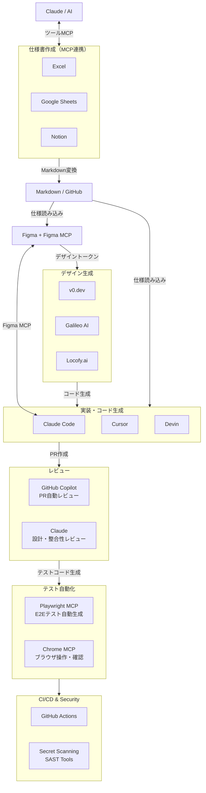
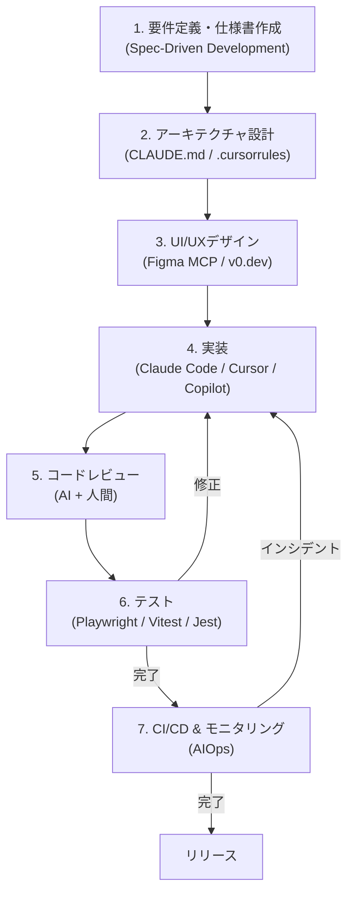
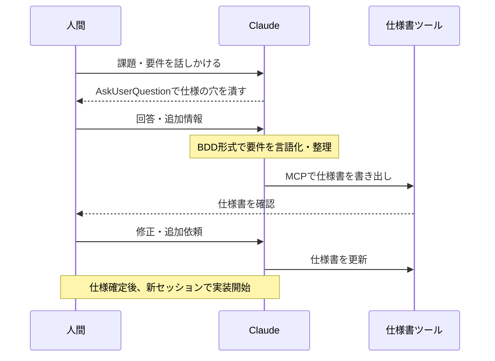
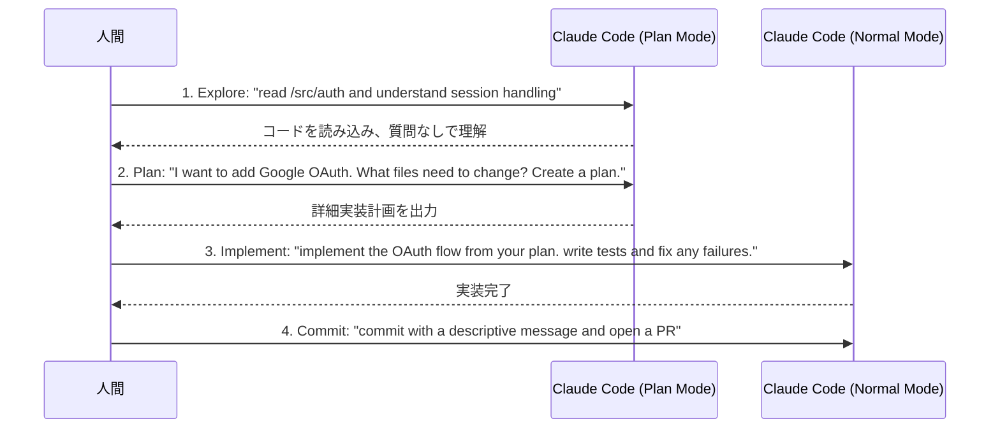
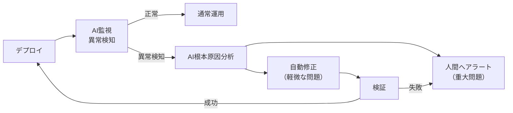

AIを活用して要件定義から実装・テストまでの開発プロセス全体を効率化する手法のまとめ。2024-2025年のベストプラクティスを網羅。

---

## 使用ツール

| カテゴリ | ツール | 主な役割 |
| --- | --- | --- |
| 仕様整理・思考整理 | Claude | 要件定義・設計・コードレビュー |
| 仕様書作成（MCP連携） | Excel / Google Sheets / Notion | AIと対話しながら仕様を作成・管理 |
| デザイン | Figma + Figma MCP | UI設計・デザイントークン管理 |
| AIデザイン生成 | v0.dev / Galileo AI / Locofy | テキストからUI生成・Figma→コード変換 |
| エージェント実装 | Claude Code | 大規模コード生成・リファクタリング |
| エディタ補助 | Cursor | インライン修正・ファイル横断編集 |
| 補完・レビュー | GitHub Copilot | 補完・PR作成・コードレビュー支援 |
| 自律エージェント | Devin / OpenHands | 反復タスクの自動化（検証用途） |
| テスト自動化 | Playwright MCP / Chrome MCP | E2Eテスト自動生成・実行 |
| セキュリティ | GitGuardian / GitHub Secret Scanning | シークレット漏洩・脆弱性検出 |

### ツール連携図



---

## 開発フロー

### 全体フロー図



---

## 1. 要件定義・仕様書作成（Spec-Driven Development）

### 1.1 スペック駆動開発（SDD）とは

2025年に主流となったアプローチ。コードを書く前に詳細な仕様書（スペック）を作成し、それをAIへのプロンプトとして使う。

**フロー：Specify → Plan → Tasks → Implement**

- 曖昧な要件のままコード生成すると、後工程で全て崩れる
- 仕様書の完成度 = 実装品質に直結
- 複雑度別の仕様書ボリューム目安：
  - 単純関数：100-200語
  - APIエンドポイント：300-500語
  - コンポーネント/モジュール：500-800語
  - システムアーキテクチャ：1000-2000語

### 1.2 仕様書作成ツールの選択

| ツール | 接続方法 | 特徴 |
| --- | --- | --- |
| Excel | Claude in Excel | 表形式で視覚的に編集しやすい。SharePointで管理 |
| Google Sheets | Google Sheets MCP | Web版でも完結。リアルタイム共有が簡単 |
| Notion | Notion MCP | 文章・データベースを一体で管理 |
| GitHub + Markdown | Git管理 | 開発フェーズから直接参照できる。Claude Codeが直読みできる |

### 1.3 AIと対話しながら要件を整理する

**Claudeにインタビューさせる（推奨パターン）**

```
I want to build [brief description]. Interview me in detail using the AskUserQuestion tool.

Ask about technical implementation, UI/UX, edge cases, concerns, and tradeoffs.
Don't ask obvious questions, dig into the hard parts I might not have considered.

Keep interviewing until we've covered everything, then write a complete spec to SPEC.md.
```

このアプローチで：
- AIが見落としがちなエッジケースを事前に洗い出す
- 仕様が固まったら新しいセッションで実装に移行（クリーンなコンテキストで開始）

**MCP経由でツールに書き出す**

- 決定した仕様をそのままExcel・Sheets・Notionに書き出す
- 「この要件を追記して」「不足項目を提案して」といった指示が可能
- ツールとAIが双方向につながることで、ドキュメントと対話が一体化する

### 1.4 仕様書の必須要素

効果的な仕様書に含めるべき内容：

| セクション | 内容 |
| --- | --- |
| 目的・ゴール | 解決する課題と成功の定義 |
| コンテキスト・制約 | 既存アーキテクチャ、依存関係、パフォーマンス要件 |
| 機能要件 | コア動作（BDD形式：Given/When/Then推奨） |
| 非機能要件 | セキュリティ・スケーラビリティ・アクセシビリティ |
| エッジケース | 異常系・境界値・エラーハンドリング |
| テスト基準 | 検証アプローチ・合格条件 |
| 具体例 | 入出力ペア・使用シナリオ |

### 1.5 ユーザーストーリーとBDD

```
As a [user type],
I want to [action],
So that [benefit].

Acceptance Criteria:
GIVEN [context]
WHEN [action]
THEN [expected result]
```

BDDのシナリオはAIへのfew-shotプロンプトとして直接機能する。

### 1.6 よくある失敗パターン

- 「速くしてほしい」など数値のない曖昧な要件
- 既存アーキテクチャへの言及なし
- エッジケース・エラーシナリオの欠落
- セキュリティ・パフォーマンス仕様なし
- テスト基準・検証アプローチなし

> **ポイント**：仕様書の完成度がそのまま実装品質に直結する。コードより先に仕様を完成させる

#### シーケンス図：要件定義フェーズ



---

## 2. アーキテクチャ設計

### 2.1 CLAUDE.md の設計（最重要ファイル）

CLAUDE.md はClaude Codeが毎回のセッション開始時に読み込む「プロジェクトの憲法」。

**配置場所と優先度**

| 配置場所 | 用途 |
| --- | --- |
| `~/.claude/CLAUDE.md` | 全プロジェクト共通の個人設定 |
| `./CLAUDE.md` | プロジェクトルート（Gitで管理・チーム共有） |
| `./subdir/CLAUDE.md` | サブディレクトリ固有ルール（モノレポ向け） |
| `~/.claude/CLAUDE.md` + `@import` | 個人オーバーライド |

**CLAUDE.mdに含める10項目**

| # | セクション | 内容例 |
| --- | --- | --- |
| 1 | プロジェクト概要 | 技術スタック・目的・制約 |
| 2 | コードスタイル | ESModule/CommonJS選択、命名規則 |
| 3 | ディレクトリ構造 | 重要フォルダの役割説明 |
| 4 | テスト方針 | テストフレームワーク・単体テストの粒度 |
| 5 | ビルド・実行コマンド | `npm run dev`, `npm test` など |
| 6 | ブランチ・PR規約 | ブランチ命名・コミットメッセージ形式 |
| 7 | アーキテクチャ上の制約 | 使ってはいけないパターン・ライブラリ |
| 8 | 環境変数・設定 | 必須の環境変数名（値は記載しない） |
| 9 | よくある落とし穴 | プロジェクト固有の注意点 |
| 10 | 外部ドキュメントへのリンク | 設計書・API仕様書のパス or URL |

**CLAUDE.mdの実例**

```markdown
# Code style
- Use ES modules (import/export) syntax, not CommonJS (require)
- Destructure imports when possible (e.g., import { foo } from 'bar')

# Workflow
- Be sure to typecheck when you're done making a series of code changes
- Prefer running single tests, not the whole test suite, for performance

# Architecture
- API routes go in /src/api, shared types in /src/types
- Never import from /internal outside its directory

# Testing
- Use Vitest for unit tests, Playwright for E2E
- Run `npm run test:unit` for fast feedback during development

# DO NOT
- Commit secrets or API keys
- Modify /migrations without explicit instruction
- Use any as TypeScript type without comment justification
```

**CLAUDE.mdのサイズ管理**

- 目標：200行以内（超えると下部の指示を無視しがちになる）
- ルールの取捨選択基準：「これを削除するとClaudeが間違いを起こすか？」→ Noなら削除
- 頻繁に変わる情報はCLAUDE.mdに書かない
- Claudeが既にデフォルトで知っていることは書かない
- `@path/to/file` 構文でファイルをインポート可能

**CLAUDE.md vs Skills の使い分け**

| | CLAUDE.md | Skills |
| --- | --- | --- |
| 読み込みタイミング | 毎セッション常時 | 必要なときだけ |
| 向いているもの | 全タスクに適用されるルール | 特定ドメインの知識・手順 |
| コンテキスト消費 | 常に消費 | 使用時のみ |

### 2.2 Cursor の .cursorrules / .mdc 設定

`.cursorrules` は非推奨。現在は `.cursor/rules/` ディレクトリに `.mdc` ファイルで管理：

```
.cursor/
  rules/
    general.mdc         # 全体ルール
    typescript.mdc      # TypeScript固有
    testing.mdc         # テスト規約
    api-conventions.mdc # API設計規約
```

各 `.mdc` ファイルの構造：

```yaml
---
description: TypeScript coding conventions
globs: ["**/*.ts", "**/*.tsx"]
---
# TypeScript Rules
- Always use strict mode
- Prefer type over interface for union types
- Never use 'any', use 'unknown' instead
```

### 2.3 Skills の設計

`.claude/skills/` に `SKILL.md` を作成し、プロジェクト固有の専門知識を渡す：

```markdown
---
name: api-conventions
description: REST API design conventions for our services
---
# API Conventions
- Use kebab-case for URL paths
- Use camelCase for JSON properties
- Always include pagination for list endpoints
- Version APIs in the URL path (/v1/, /v2/)
```

スキル例：
- `figma-mcp.md` — デザイン連携手順
- `test-generation.md` — テスト生成ルール
- `fix-issue.md` — GitHub Issue修正ワークフロー
- `db-schema.md` — データベース設計規約

### 2.4 Hooks の設定

コード保存・編集のたびに自動実行される処理を定義：

```json
// .claude/settings.json
{
  "hooks": {
    "PostToolUse": [
      {
        "matcher": "Edit|Write",
        "hooks": [{ "type": "command", "command": "npm run lint --fix" }]
      }
    ],
    "PreToolUse": [
      {
        "matcher": "Write",
        "hooks": [{
          "type": "command",
          "command": "if echo '$TOOL_INPUT' | grep -q 'migrations/'; then echo 'BLOCK: migrations folder is protected'; exit 1; fi"
        }]
      }
    ]
  }
}
```

Hooksの活用例：
- ファイル編集後に ESLint を自動実行
- マイグレーションフォルダへの誤書き込みをブロック
- コミット前に型チェックを強制
- テスト実行後に自動カバレッジレポート生成

> Hooksのスクリプト自体もClaudeに生成させることができる：`"Write a hook that runs eslint after every file edit"`

### 2.5 Subagents の設計

`.claude/agents/` に専門エージェントを定義：

```markdown
---
name: security-reviewer
description: Reviews code for security vulnerabilities
tools: Read, Grep, Glob, Bash
model: opus
---
You are a senior security engineer. Review code for:
- Injection vulnerabilities (SQL, XSS, command injection)
- Authentication and authorization flaws
- Secrets or credentials in code
- Insecure data handling

Provide specific line references and suggested fixes.
```

サブエージェントの主なユースケース：
- **Researcher**: コードベース調査（メインコンテキストを汚染しない）
- **Security Reviewer**: セキュリティ監査専門
- **Test Generator**: テスト生成専門
- **DB Specialist**: データベース最適化専門

### 2.6 コンテキスト管理戦略

コンテキストウィンドウはAI開発における最重要リソース：

| 状況 | 対処法 |
| --- | --- |
| 無関係なタスクに切り替え | `/clear` でリセット |
| 同じ間違いを2回以上修正 | `/clear` して、より具体的なプロンプトで再開 |
| コードベース調査 | Subagentsに委任（メインコンテキストを保護） |
| 長いセッション | `/compact focus on API changes` で要約 |
| コンテキスト60%超え | アウトプット品質が低下し始める警戒ライン |

MCP サーバーの実用的な上限：5-8個（各サーバーのスキーマが常時コンテキストを消費するため）

> **設計が手薄だと後で全て崩れる。アーキテクチャ設計に時間をかけるほど手戻りが減る**

---

## 3. UI/UXデザイン

### 3.1 AIデザインツールの比較

| ツール | 強み | 弱み | 最適用途 |
| --- | --- | --- | --- |
| **Galileo AI** | テキストプロンプトから完全UIを秒速生成 | Figmaへのエクスポートが必要 | ゼロからのデザイン草案 |
| **v0.dev (Vercel)** | UIとコードを同時生成、Vibe Coding向け | Figmaと疎結合 | 高速プロトタイピング |
| **Locofy.ai** | Figmaから本番品質コードへの変換 | AI生成ではなく変換ツール | フルプロジェクトの設計→コード引き渡し |
| **Figma + MCP** | デザインシステムとの完全統合 | 設定が複雑 | プロダクション開発全体 |

**推奨ワークフロー**：

```
Galileo AI でラフデザイン生成
    ↓
Figma でデザインシステムに合わせて精緻化
    ↓
Figma MCP + Claude Code でピクセルパーフェクトなコード生成
```

### 3.2 Figma MCP ワークフロー

**Step 1: Figmaファイルの構造化**

AI向けに最適化されたFigmaファイルの要件：
- **変数（Variables）**：カラー、スペーシング、タイポグラフィ、ボーダーラジウスをFigma Variablesで定義
- **オートレイアウト**：全コンポーネントにAuto Layoutを適用（レスポンシブ対応）
- **コンポーネント化**：バリアント付きの再利用可能コンポーネントを作成
- **レイヤー命名**：意味のある名前でレイヤーを命名（AIの解釈精度が向上）
- **アノテーション**：インタラクティブな状態・ホバー・エラー状態を注釈で明示

**Step 2: デザイントークンのエクスポート**

Open Variable Visualizerプラグインで2つのファイルを出力：
- `tokens.json` — 全デザイントークン
- `resolver.ts` — プログラマティックアクセス用ユーティリティ

**Step 3: MCPサーバーの選択**

| アプローチ | 条件 | 特徴 |
| --- | --- | --- |
| Figma Official MCP（ベータ） | Figma Dev座席が必要 | Code Connectによるコンポーネント紐付けが強力 |
| Framelink MCP（無料・コミュニティ） | 無料プランでも利用可 | 設定が独立しており導入しやすい |

**Step 4: AIへのプロンプト**

```
Implement the component at [Figma Frame URL].
Use the design tokens from @tokens.json.
Framework: React + Tailwind CSS.
Constraints:
- Use existing components from /src/components where possible
- Follow the patterns in @CLAUDE.md
- Make it fully responsive (mobile-first)
Take a screenshot after implementation and compare to the original design.
```

### 3.3 デザイントークンワークフロー

```
Figma Variables (Single Source of Truth)
    ↓
tokens.json (エクスポート)
    ↓
CSS Variables / Tailwind Config / JS Constants (コードへ変換)
    ↓
コンポーネント実装で参照
```

コードとデザインの乖離を防ぐため、デザイントークンをGitで管理し、Figmaの変更を自動的にコードに反映するCI/CDパイプラインを構築することを推奨。

---

## 4. 実装

### 4.1 Claude Code ベストプラクティス

#### 基本原則：検証手段を先に用意する

Claudeに「成果を確認する方法」を渡すことが最高レバレッジの施策：

| 戦略 | Before | After |
| --- | --- | --- |
| テスト基準を提供 | "implement email validation" | "write validateEmail. test cases: user@example.com=true, invalid=false. run tests after implementing" |
| UIを視覚的に検証 | "make the dashboard look better" | "[paste screenshot] implement this design. screenshot the result and compare. list differences and fix them" |
| 根本原因を提示 | "the build is failing" | "build fails with [error]. fix it and verify build succeeds. fix root cause, don't suppress error" |

#### 実装フェーズの標準ワークフロー（4ステップ）



> Plan Modeが必要なのは：変更が複数ファイルにまたがる場合、アプローチが不確かな場合、慣れていないコードを扱う場合。1文で差分を説明できるタスクはPlanをスキップしてよい。

#### コンテキスト効率化のためのプロンプトパターン

```bash
# ファイルを直接参照
> Review @./src/auth/session.ts

# 複数ファイルを比較
> Compare implementations @./old.js @./new.js

# データをパイプで渡す
cat error.log | claude

# git historyから背景を調査
> Look through ExecutionFactory's git history and summarize how its API evolved
```

#### サブエージェントで調査をオフロード

```
Use subagents to investigate how our authentication system handles token refresh,
and whether we have any existing OAuth utilities I should reuse.
```

サブエージェントはメインコンテキストを汚染せずにコードベースを調査できる最強ツール。

#### 並列実行・自動化

```bash
# 非インタラクティブモード（CI/CD向け）
claude -p "fix all lint errors" --permission-mode auto

# ファイル一括処理
for file in $(cat files.txt); do
  claude -p "Migrate $file from React to Vue. Return OK or FAIL." \
    --allowedTools "Edit,Bash(git commit *)"
done

# 構造化出力
claude -p "List all API endpoints" --output-format json
```

#### Writer/Reviewer パターン（品質向上）

| Session A (Writer) | Session B (Reviewer) |
| --- | --- |
| `Implement a rate limiter for our API endpoints` | |
| | `Review rate limiter in @src/middleware/rateLimiter.ts. Look for edge cases, race conditions, and consistency with existing middleware.` |
| `Address review feedback: [Session B output]` | |

### 4.2 Cursor IDE ベストプラクティス

#### モデル選択戦略

| モデル | 用途 |
| --- | --- |
| Claude Sonnet 4 系 | 日常的なコーディング・インライン修正 |
| o3 / Opus 系 | 複雑なアーキテクチャ決定・難解なバグ修正 |
| Haiku 系 | 高速な補完・単純なリファクタリング |

#### Composer / Agent Mode

- **Composer**: 増分的な変更・ルーチン編集に最適
- **Agent Mode**: 大きなタスクを委任。自律的にターミナルコマンドを実行
- Agent Modeでの推奨プロンプトパターン：

```
Write failing tests for [feature], then implement them to make them pass.
Limit changes to these files unless you propose a plan first: [file list]
```

#### YOLO Mode（無人実行）の注意点

- CIグリーンを維持する厳格なポリシーと組み合わせること
- Agent生成の変更は必ずdiff reviewを実施
- テスト→実装の順序を守る（TDDアプローチ）

### 4.3 GitHub Copilot ベストプラクティス

#### カスタムインストラクションの設定

リポジトリに `.copilot/context.md` または `.github/copilot-instructions.md` を作成：

```markdown
# Team Conventions
- Use TypeScript strict mode
- Error handling: always use Result<T, E> pattern
- Testing: Vitest for unit, Playwright for E2E
- State management: Zustand
- Naming: camelCase for variables, PascalCase for components
```

#### 3層プロンプト戦略

効果的なCopilot Chatプロンプトの構造：
1. **Context**: アーキテクチャ・既存パターン
2. **Intent**: 達成したいこと
3. **Constraints**: 具体的な制約・要件

例：
```
Context: We use Zustand for state management and React Query for server state.
Intent: Implement a user profile update feature.
Constraints: - Must follow the pattern in @UserSettings.tsx
             - Include optimistic updates
             - Handle network errors with retry logic
```

#### Code Review の活用

- PRにCopilotをReviewerとして割り当てる
- 2025年末からのアップデートで、ESLint・CodeQLと組み合わせた複合レビューが可能
- Copilotのレビューは "Comment" のみ（Approve/Request changesは人間が行う）
- CodeQLとの連携でセキュリティ脆弱性を自動検出

### 4.4 アジェンティックコーディングパターン

#### Copilotモード vs Autopilotモード

| モード | ツール例 | 特徴 |
| --- | --- | --- |
| Copilot（補助） | Cursor, GitHub Copilot, Continue | 人間の意思決定を補助 |
| Autopilot（自律） | Devin, Claude Code (Agent), OpenHands | タスクを自律的に遂行 |

#### Devin の活用パターン

```
# Slackでの利用（推奨パターン）
@Devin Fix the bug in issue #123 - users can't reset their password

# 並列実行
Devin can delegate subtasks to a team of managed Devins running in parallel VMs
```

- 定型的・反復的なタスクに最適（マイグレーション・リファクタリング）
- 新規機能開発には人間のレビューが必須
- MCPによるJira/GitHub連携でタスク自動取得が可能

#### MCP（Model Context Protocol）エコシステム

2024年11月にAnthropicが発表、2025年12月にLinux Foundation傘下に移管。AI業界のデファクトスタンダードとなった。

**Claude Code で使える主要MCPサーバー**

| カテゴリ | サーバー例 | 用途 |
| --- | --- | --- |
| デザイン | Figma MCP, Framelink | デザインからコード生成 |
| プロジェクト管理 | Jira MCP, GitHub MCP | Issue参照・PR作成 |
| ドキュメント | Notion MCP, Confluence MCP | 仕様書参照 |
| データベース | Postgres MCP, SQLite MCP | スキーマ参照・クエリ実行 |
| モニタリング | Datadog MCP, Grafana MCP | メトリクス参照 |
| ブラウザ | Playwright MCP, Chrome MCP | E2Eテスト・ブラウザ操作 |

### 4.5 テスト駆動開発（TDD）with AI

**AI-TDDの推奨サイクル**

```
1. 失敗するテストを先に書く（AIに「write failing tests for...」と指示）
2. テストを通過する最小限の実装を書く
3. リファクタリング
4. 上記サイクルをAIと一緒に繰り返す
```

**プロンプト例**

```
Write failing tests for a validateEmail function.
Test cases must cover:
- Valid: user@example.com, user+tag@domain.co.jp
- Invalid: empty string, missing @, missing domain, double @
Then implement the function to pass all tests.
Do NOT use any email validation library.
```

---

## 5. コードレビュー

### 5.1 AI + 人間のレビュー分担

| 担当 | 役割 | ツール |
| --- | --- | --- |
| GitHub Copilot | バグ・コーディング規約・パフォーマンス・セキュリティの自動チェック | PR Reviewer |
| Claude | 仕様書との整合性・設計方針のブレ・全体アーキテクチャ整合性 | Claude Chat / Claude Code |
| 人間 | 最終判断・ビジネスロジックの正確性・リリース可否 | 必須 |

### 5.2 Copilot PR レビューの設定

```yaml
# .github/workflows/copilot-review.yml
# PRにCopilotを自動アサインする設定
```

- PR作成時にCopilotをReviewerに追加
- カスタムインストラクションで重点チェック項目を指定
- CodeQLと組み合わせてセキュリティ脆弱性を自動検出（SQL injection, XSS等）

### 5.3 Claudeによる設計レビュープロンプト

```
You are a senior software architect. Review this PR in context of the spec @SPEC.md and architecture @ARCHITECTURE.md.

Check:
1. Does the implementation match the specification?
2. Are there architectural inconsistencies?
3. Security: injection risks, auth flaws, secret exposure, insecure data handling
4. Edge cases not covered by tests
5. Performance bottlenecks

Reference the existing patterns in @src/middleware/ for comparison.
```

### 5.4 セキュアコードレビューのプロンプトライブラリ

```
# インジェクション脆弱性チェック
Review @file.ts for injection vulnerabilities: SQL injection, XSS,
command injection, path traversal. Show specific line numbers and fixes.

# 認証・認可チェック
Review authentication flow in @src/auth/. Check for:
- Insecure session handling
- Missing authorization checks
- JWT vulnerabilities
- Privilege escalation risks

# シークレット露出チェック
Scan @./src for hardcoded secrets, API keys, passwords, or credentials.
Also check for patterns that might accidentally log sensitive data.
```

---

## 6. テスト

### 6.1 AIテスト生成ツールの比較

| フレームワーク | 用途 | AI活用方法 |
| --- | --- | --- |
| **Vitest** | ユニット・コンポーネントテスト（Vite環境） | AIによるテストケース生成。高速フィードバックループ |
| **Jest** | ユニット・統合テスト（Webpack環境） | 既存プロジェクトの継続利用。63%採用率 |
| **Playwright** | E2Eテスト・ブラウザ自動化 | Playwright Agents（v1.56〜）でAIが自律テスト |
| **Cypress** | E2Eテスト | コンポーネントテストも可能 |

**2025年のフレームワーク選択推奨**：
- 新規プロジェクト（Vite環境）→ Vitest + Playwright
- 既存プロジェクト（Webpack環境）→ Jest + Playwright
- コンポーネントテスト → Vitest（Vite） or Storybook

### 6.2 Playwright Agents（v1.56〜）

2025年10月リリース。3つのコアエージェント：

| エージェント | 役割 |
| --- | --- |
| **Planner** | アプリを探索し、テスト計画をMarkdownで出力 |
| **Generator** | テスト計画から実行可能なコードを生成 |
| **Healer** | テスト失敗時に自動修正 |

**利用例**：

```typescript
// playwright.config.ts
import { defineConfig } from '@playwright/test';
export default defineConfig({
  use: {
    // Enable AI-powered healing
    agents: { heal: true }
  }
});
```

```bash
# AI Planning: アプリを探索してテスト計画を生成
npx playwright agent plan --url http://localhost:3000

# AI Generation: テスト計画からコードを生成
npx playwright agent generate --plan test-plan.md
```

### 6.3 AI × テストピラミッド

```
         /\
        /E2E\         ← Playwright Agents（少数・高信頼）
       /------\
      / Integ  \      ← AI生成の統合テスト
     /----------\
    /  Unit Tests \   ← Vitest/Jest（AI大量生成・高速）
   /--------------\
```

**AIユニットテスト生成プロンプト**

```
Write comprehensive unit tests for @./src/utils/validation.ts using Vitest.

Requirements:
- Cover all exported functions
- Include happy path, edge cases, and error scenarios
- Use descriptive test names following the pattern: "should [behavior] when [condition]"
- Do NOT use mocks unless absolutely necessary
- Aim for >90% coverage
```

**AIで統合テストを生成するプロンプト**

```
Write integration tests for the user authentication flow.
Files involved: @src/api/auth.ts, @src/middleware/session.ts, @src/db/users.ts

Test scenarios:
1. Successful login with valid credentials
2. Failed login with invalid password (rate limiting after 5 attempts)
3. Token refresh flow
4. Logout and session invalidation

Use Vitest with supertest for HTTP testing.
```

### 6.4 CIへの組み込み

```yaml
# .github/workflows/test.yml
name: Tests
on: [push, pull_request]
jobs:
  test:
    steps:
      - run: npm run test:unit     # Vitest（高速）
      - run: npm run test:e2e      # Playwright（並列実行）
      - run: npm run test:coverage # カバレッジレポート
```

> **「実装→テスト→修正」を最小単位で繰り返すことでAIの連鎖バグを防ぐ**

---

## 7. CI/CD & 運用

### 7.1 AI駆動のCI/CDパイプライン

2024年時点で76%のDevOpsチームがCI/CDにAIを統合。

**AI活用ポイント**

| フェーズ | AI活用 | ツール例 |
| --- | --- | --- |
| コミット前 | Secret scan, lint, type check | GitHub Secret Scanning, Claude Code hooks |
| PR作成時 | 自動コードレビュー、テスト生成 | GitHub Copilot, CodeQL |
| ビルド時 | テスト自動生成・失敗分析 | Claude (`claude -p`), AI test healing |
| デプロイ後 | 異常検知・予測的モニタリング | AIOps, Datadog AI |
| インシデント | 自動根本原因分析・修正提案 | AWS DevOps Agent |

### 7.2 Self-Healing Pipeline パターン



### 7.3 インシデント対応の自動化

**AWSのDevOps Agent（2025年12月）**：
- モニタリング・アラート・デプロイツールと統合
- インシデント発生時にタイムライン・根本原因・推奨修正を自動生成
- オンコール対応の時間を大幅削減

**Claude Code を CI/CD に組み込む**

```bash
# PRごとにAIレビューを自動実行
claude -p "Review changes in this PR for security vulnerabilities and spec compliance.
          Reference @SPEC.md and @SECURITY.md" \
  --output-format json \
  --allowedTools "Read,Grep,Glob"

# ビルド失敗時の自動分析
claude -p "Build failed with: $(cat build-error.log). Analyze and suggest fix." \
  --output-format stream-json
```

### 7.4 AIOps：AIによる運用監視

- **予測的モニタリング**：ログ・メトリクス・ユーザー行動をリアルタイム分析、障害を事前予測
- **アラート疲労の削減**：AIが低信頼度のアラートを自動フィルタリング
- **分散トレーシング**：複雑なマイクロサービス間の障害伝播を自動追跡

---

## 8. プロンプトエンジニアリング

### 8.1 開発フェーズ別プロンプトテンプレート

#### 要件定義フェーズ

```
# インタビュープロンプト
I want to build [brief description].
Interview me using the AskUserQuestion tool. Ask about:
- Technical constraints and existing architecture
- User flows and edge cases
- Performance and security requirements
- Integration with existing systems
Keep interviewing until we've covered everything, then write a SPEC.md.
```

```
# ユーザーストーリー生成
Convert these requirements into user stories with acceptance criteria.
Use BDD format (Given/When/Then).
Requirements: [requirements]
Persona types: [admin, regular user, guest]
Include at least 3 edge cases per story.
```

#### アーキテクチャ設計フェーズ

```
# アーキテクチャレビュー
Review this architecture proposal for:
1. Scalability bottlenecks
2. Single points of failure
3. Security attack surfaces
4. Missing error handling
5. Over-engineering risks

Architecture: [description]
Constraints: [performance targets, team size, timeline]
```

#### 実装フェーズ

```
# コード生成（高品質版）
Implement [feature] in @[file].

Context:
- Look at @[example-file] for the existing patterns to follow
- Architecture constraints: @CLAUDE.md
- Related types: @src/types/[type].ts

Requirements:
- [requirement 1]
- [requirement 2]

Constraints:
- Do NOT use [library] - use [alternative] instead
- Must handle [edge case]
- Include JSDoc comments

After implementing:
1. Run the test suite: npm test
2. Fix any failures
3. Verify TypeScript compiles: npm run typecheck
```

```
# リファクタリング
Refactor @[file] to improve [specific concern].

Current problems:
- [problem 1]
- [problem 2]

Target: Achieve [goal] without changing the public API.
Preserve all existing behavior - run tests before and after to verify.
```

#### テストフェーズ

```
# テスト生成
Write Vitest tests for @[file].

Coverage requirements:
- All exported functions
- Happy path for each function
- At least 3 edge cases per function
- All error conditions

Test naming: "should [behavior] when [condition]"
Do not mock unless testing external side effects.
Run tests after generating to verify they pass.
```

#### コードレビューフェーズ

```
# セキュリティレビュー
Act as a security engineer. Review @[file] for:

Critical:
- SQL/NoSQL injection
- XSS vulnerabilities
- Command injection
- Path traversal
- Insecure deserialization

Important:
- Hardcoded secrets or credentials
- Missing input validation
- Improper error handling (info leakage)
- Missing rate limiting

For each finding: line number, severity (Critical/High/Medium/Low), description, fix.
```

### 8.2 プロンプト設計の基本原則

**GOAL - OUTPUT - LIMITS - DATA - EVALUATION 構造**

```
GOAL: [具体的な達成目標]
OUTPUT: [出力形式・構造]
LIMITS: [制約・使ってはいけないもの]
DATA: [参照すべきファイル・コンテキスト]
EVALUATION: [成功基準・検証方法]
```

**高品質プロンプトの7原則**

1. **具体例を先に** — 抽象的な要件より前に具体例を示す
2. **出力形式を明示** — JSON schema / TypeScript interfaceで形式を指定
3. **ネガティブ例を含める** — "do NOT do X" で誤った方向性を排除
4. **既存パターンを参照** — `@file` で既存コードのパターンを示す
5. **検証手段を含める** — テストコマンド・成功基準を含める
6. **スコープを制限** — 「このファイルのみ変更すること」で予期しない変更を防ぐ
7. **段階的に詳細化** — 大きなタスクはChain of Thoughtで分解

### 8.3 プロンプトバージョン管理

2025年はプロンプトもコードと同様にバージョン管理が標準：

```
.claude/
  commands/        # カスタムスラッシュコマンド
    review.md      # レビュープロンプト
    test-gen.md    # テスト生成プロンプト
    spec.md        # 仕様書生成プロンプト
  skills/          # 再利用可能な専門知識
  prompts/         # その他の共有プロンプト
```

---

## 9. セキュリティ

### 9.1 AI生成コードの既知リスク

**研究調査（2024-2025年）の主な知見**

- GitHub Copilot生成コードの **29.5%（Python）/ 24.2%（JavaScript）** にセキュリティ上の弱点
- Copilotアクティブなリポジトリの **6.4%** でシークレット漏洩（全リポジトリ平均4.6%の1.4倍）
- Copilotを使った開発者は使わない開発者より脆弱なコードを書く傾向があり、かつ **自信を持って提出** していた
- 「Hallucination Squatting（ハルシネーション乗っ取り）」：AIが存在しないパッケージを提案→攻撃者がそのパッケージを実際に登録してマルウェアを配布

### 9.2 OWASP Top 10 for LLMs 2025

| # | リスク | 説明 | 主な対策 |
| --- | --- | --- | --- |
| LLM01 | **プロンプトインジェクション** | 入力を通じてLLMの指示を書き換える | 入力サニタイズ、サンドボックス化、多層バリデーション |
| LLM02 | **機密情報の漏洩** | 訓練データや設定情報の意図しない露出 | データ最小化、アクセス制御、出力監視 |
| LLM03 | **サプライチェーンリスク** | 悪意のある依存関係・モデルの汚染 | 依存関係のベット、出所確認、SBOMワークフロー |
| LLM04 | **データ・モデルポイズニング** | 訓練・ファインチューニングデータへの改ざん | 出所確認、異常検知、継続的評価 |
| LLM05 | **不適切な出力処理** | LLM出力を検証なしで下流システムに渡す | 出力バリデーション、実行サンドボックス |
| LLM06 | **過剰なエージェンシー** | LLMへの過度な権限付与 | 最小権限の原則、使用量監視、ガードレール |
| LLM07 | **システムプロンプト漏洩** | 隠し指示・システムプロンプトの露出 | プロンプトのマスキング、出力監視 |
| LLM08 | **ベクター・埋め込みの脆弱性** | RAGシステムへの悪意ある埋め込み注入 | 埋め込み検証、入力サニタイズ |
| LLM09 | **誤情報** | 虚偽・誤解を招くコンテンツの生成 | 人間レビュー、ファクトチェック |
| LLM10 | **無制限の消費** | リソース枯渇・コストの急増 | レートリミット、自動スケーリング保護、コスト監視 |

### 9.3 AIコード開発のセキュリティ対策チェックリスト

**開発フェーズ別セキュリティ対策**

```markdown
## 実装フェーズ
- [ ] AI生成コードを「信頼できないコード」として扱い、必ずレビューする
- [ ] シークレット・APIキーがコードに含まれていないか確認
- [ ] AIが提案したパッケージを npm audit / pip audit で検証
- [ ] AIが提案した依存関係のGitHubリポジトリを確認（スター数・更新日・オーナー）

## レビューフェーズ
- [ ] SAST（Static Application Security Testing）ツールを実行
- [ ] 依存関係スキャン（Snyk / Dependabot）
- [ ] シークレット検出（GitGuardian / GitHub Secret Scanning）
- [ ] セキュリティ重点プロンプトでAIレビューを実施

## CI/CDフェーズ
- [ ] Secret Scanning をGitHub Actions に組み込む
- [ ] CodeQL を PRに自動実行
- [ ] Copilot Autofix を有効化（自動脆弱性修正提案）
- [ ] SBOM（Software Bill of Materials）を自動生成
```

**Hooks を使ったシークレット漏洩の自動ブロック**

```json
{
  "hooks": {
    "PreToolUse": [{
      "matcher": "Write|Edit",
      "hooks": [{
        "type": "command",
        "command": "git diff HEAD | grep -iE '(api_key|secret|password|token)\\s*=\\s*[\"\\x27][^\"\\x27]{8,}' && echo 'POTENTIAL SECRET DETECTED' && exit 1 || exit 0"
      }]
    }]
  }
}
```

### 9.4 「Vibe Coding」リスクの管理

OWASPが「Inappropriate Trust in AI Generated Code」として特定した問題：
- AIが生成したコードをレビューせずにそのままShipする行為
- 対策：全てのAI生成コードにPR必須 + AIレビュー + 人間の最終確認

---

## 10. チームワークフロー

### 10.1 AI導入フェーズ

| フェーズ | 期間 | 目標 | 活動 |
| --- | --- | --- | --- |
| **Pilot** | 1-4週 | 効果検証 | 1-2名の開発者で非クリティカルな機能に適用 |
| **Expansion** | 5-12週 | チーム展開 | 全チームで確立されたパターンを適用。機能の50%以上をAI活用 |
| **Rollout** | 13-24週 | 組織展開 | 80%以上の採用率。ROI測定（損益分岐は3-6ヶ月が目安） |

### 10.2 チームのための共有リソース設計

**リポジトリ構成（推奨）**

```
.claude/
  CLAUDE.md              # プロジェクト憲法（チーム共有、git管理）
  settings.json          # Hooks・権限設定
  settings.local.json    # 個人設定（.gitignore）
  commands/              # カスタムスラッシュコマンド
    spec.md              # 仕様書生成
    review.md            # コードレビュー
    fix-issue.md         # Issue修正ワークフロー
  skills/                # 専門知識ファイル
    api-conventions.md
    test-generation.md
    db-schema.md
  agents/                # サブエージェント定義
    security-reviewer.md
    test-generator.md
.cursor/
  rules/                 # Cursor AIルール
    general.mdc
    typescript.mdc
.copilot/
  context.md             # GitHub Copilotコンテキスト
```

### 10.3 チームプロセスへの統合

**週次ルーティン**

| タイミング | アクション |
| --- | --- |
| スプリント計画 | スペック作成セッション（AIインタビューで仕様を詰める） |
| 実装中 | Claude Code / Cursor でタスク実行、日次でCLAUDE.mdをレビュー |
| PR作成時 | Copilot自動レビュー + Claudeによる仕様整合性チェック |
| スプリントレビュー | AI生成コードの品質メトリクスを振り返り、CLAUDE.mdを改善 |
| 週1回 | チームでプロンプトライブラリを共有・更新 |

**共有プロンプトライブラリの管理**

- プロンプトは `.claude/commands/` でGit管理
- 効果が高かったプロンプトはチームで共有・標準化
- プロダクトマネージャー・ドメインエキスパートも参加（エンジニアだけでなく）

### 10.4 AI生成コードの品質メトリクス

追跡すべきKPI：

| メトリクス | 測定方法 | 目標 |
| --- | --- | --- |
| 生産性向上 | 速度・サイクルタイム | ベースライン比+30-50% |
| バグ密度 | AI生成コードのバグ件数/KLOC | 人間比較で同水準以下 |
| セキュリティ脆弱性 | SAST検出件数 | ゼロ（Critical/High） |
| テストカバレッジ | 行カバレッジ | >80% |
| スペック遵守率 | PR通過率・仕様からの逸脱件数 | >95% |

### 10.5 AIコーディングの役割変化

```
Before AI:            After AI:
Human writes code     Human writes SPECS
Human reviews code    Human reviews AI output
Human writes tests    Human validates AI tests
Human debugs          Human supervises AI debug
```

開発者の役割は「コードを書く人」から「AIの出力をキュレーションし、品質を担保する人」へシフトする。

---

## 付録：クイックリファレンス

### Claude Code キーコマンド

| コマンド | 用途 |
| --- | --- |
| `/init` | CLAUDE.mdの自動生成 |
| `/clear` | コンテキストリセット（タスク切り替え時） |
| `/compact focus on X` | コンテキストの要約（重点指定） |
| `/rewind` | チェックポイントへ戻る |
| `/hooks` | Hooks設定の確認・編集 |
| `/permissions` | 許可済みコマンドの管理 |
| `Ctrl+G` | プランをエディタで編集 |
| `Option+T` | 拡張思考モードの切り替え |
| `Ctrl+B` | サブエージェントをバックグラウンドへ |

### モデル選択ガイド

| タスク | 推奨モデル |
| --- | --- |
| 日常的なコーディング | Claude Sonnet 4系 |
| 複雑なアーキテクチャ設計 | Claude Opus 4系 / o3 |
| 高速補完・単純タスク | Claude Haiku 4系 |
| コスト重視の自動化 | Haiku（非インタラクティブ） |

### セキュリティ必須チェック

```
1. AI生成コードは必ずdiff確認
2. 提案されたパッケージを必ずnpm auditで検証
3. シークレットのGitコミットを防ぐHookを必ず設定
4. PRにCopilot Code Review + CodeQLを必ず組み込む
5. Vibe Codingを組織として禁止（全AI生成コードはPR必須）
```

---

## 参考リンク

- [Claude Code 公式ドキュメント](https://code.claude.com/docs/en/best-practices)
- [OWASP Top 10 for LLMs 2025](https://genai.owasp.org/llm-top-10/)
- [GitHub Copilot Best Practices](https://docs.github.com/en/copilot/get-started/best-practices)
- [Figma MCP ワークフロー](https://blog.logrocket.com/ux-design/design-to-code-with-figma-mcp/)
- [Spec-Driven Development（Thoughtworks）](https://www.thoughtworks.com/en-us/insights/blog/agile-engineering-practices/spec-driven-development-unpacking-2025-new-engineering-practices)
- [Playwright Agents ドキュメント](https://playwright.dev/docs/test-agents)
- [Awesome Claude Code（コミュニティリソース）](https://github.com/hesreallyhim/awesome-claude-code)
