AIを活用して要件定義から実装・テストまでの開発プロセス全体を効率化する手法のまとめ（2026年4月時点）。

---

## 0. はじめに

### 対象読者

- AI活用を開発プロセスに組み込みたいエンジニア・テックリード
- 既存開発フロー（要件定義、実装、レビュー、CI/CD）を改善したいチーム

### AI駆動開発の3大原則

| # | 原則 | 背景 |
|---|------|------|
| 1 | **コードより先に仕様書（SPEC.md）を書く** | 曖昧な要件のままAIにコードを書かせると、後工程で修正コストが膨らみやすい |
| 2 | **AIには「検証手段（テスト）」をセットで渡す** | テスト基準がないコード生成は、品質の確認が困難になる |
| 3 | **AI生成コードも人間がレビューする** | 最終的な品質・セキュリティの責任は人間が担う |

---

## AI駆動開発の仕組み

### 概要

AI（Claude Code）を中心に据えた開発手法を体系的に解説します。要件定義・設計・実装・テスト・運用の各フェーズで AI をどう活用するか、ツールの選び方・プロンプトの書き方・チームへの展開方法をまとめています。

AI駆動開発を支える主要な仕組みは **skills**・**sub-agent**・**MCP** の3つです。skills が「知識の提供」、sub-agent が「処理の実行」を担い、組み合わせることで Claude Code が高品質な成果物を返す。

---

### skills とは

`.claude/skills/` に配置する**共有ナレッジファイル**。Claude Code（メインエージェント）と sub-agent が参照することで、文体・規約・タスク手順をプロジェクト全体で統一する。

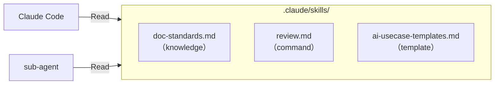

| 種別 | 例 | 用途 |
|---|---|---|
| **knowledge**（知識） | `doc-standards.md`、`api-conventions.md` | 文体・規約・設計パターンの共有 |
| **command**（手順） | `review.md`、`spec.md` | 繰り返し実行するタスクフローの定義 |
| **template**（テンプレート） | `ai-usecase-templates.md` | ドキュメント・プロンプトの雛形 |

#### 活用方法

- CLAUDE.md の肥大化を防ぐため、**特定ドメインの知識や手順は skills ファイルに切り出す**
- sub-agent に Read させることで、文体や規約の統一が自動的に担保される
- プロンプト内で `@.claude/skills/doc-standards.md` のように参照し、任意のタイミングで読み込ませられる

---

### sub-agent とは

`.claude/agents/` に定義する、**役割特化した独立エージェント**。メインの Claude Code セッションとはコンテキストが隔離されており、並列実行しても互いに干渉しない。

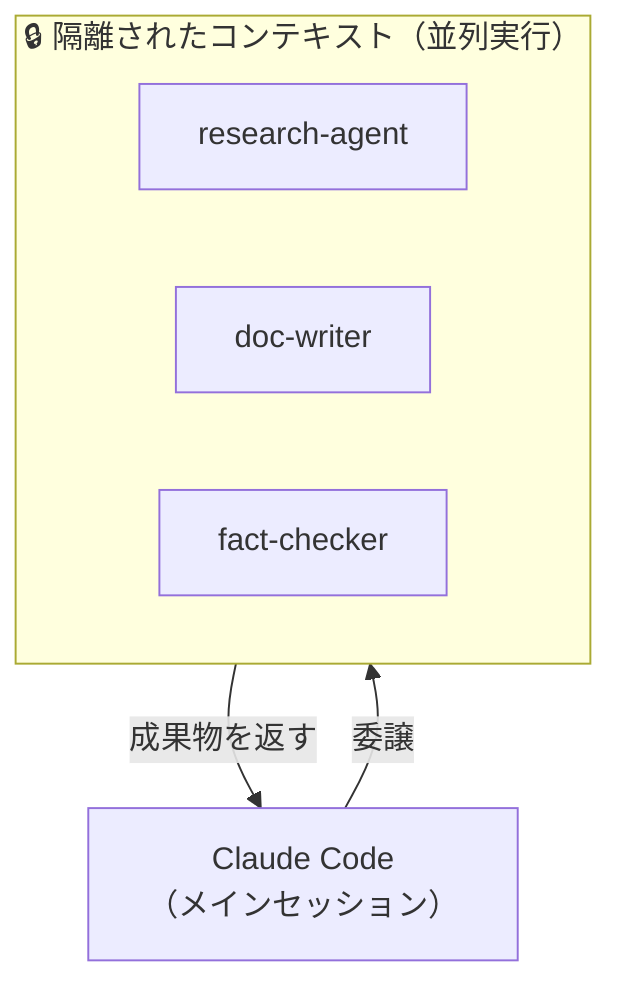

#### 活用方法

- **コンテキスト保護**：大量のファイル調査など重い処理を外注し、メインセッションを汚染しない
- **並列実行**：research-agent と fact-checker を同時に走らせ、成果物を高速に生成する
- **役割特化**：セキュリティレビュー・テスト生成など、観点を固定した専門エージェントを定義できる

---

### skills と sub-agent の違い

| | Skills | Sub-agent |
|---|---|---|
| **役割** | ナレッジ・手順を注入する | 処理を外注・並列実行する |
| **実行タイミング** | メインセッション内で参照 | 別プロセスで隔離実行 |
| **コンテキスト消費** | 読み込んだ分だけ消費 | メインを汚染しない |
| **向いているもの** | 規約・テンプレート・手順書 | 調査・レビュー・生成タスク |
| **使うタイミング** | 毎セッション共通ルールを渡したい | 重い処理を外注・並列で捌きたい |

> - skills は全 sub-agent の**共通知識**として機能し、文体・規約・調査手順を統一する
> - sub-agent はコンテキストが**隔離**されているため、並列実行しても互いに干渉しない

#### 組み合わせた活用フロー

skills と sub-agent を組み合わせることで、Claude Code がエンジニアの指示を受け取り、共有ナレッジを参照した専門エージェントが並列実行して成果物を返すフローを構成できる。

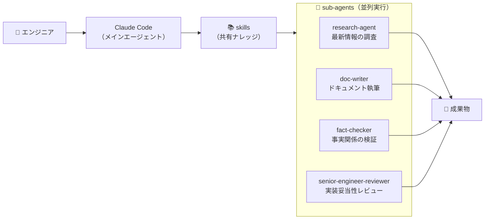

---

### MCP とは

**Model Context Protocol**。AIエージェントが外部ツールやデータソースに接続するための標準プロトコル。2025年12月に Linux Foundation 傘下（AAIF）へ移管され、AI業界のデファクトスタンダードとなった。

#### 活用方法

Claude Code は MCP サーバー経由で GitHub・Jira・Figma・Slack などをリアルタイムに参照・操作できる。

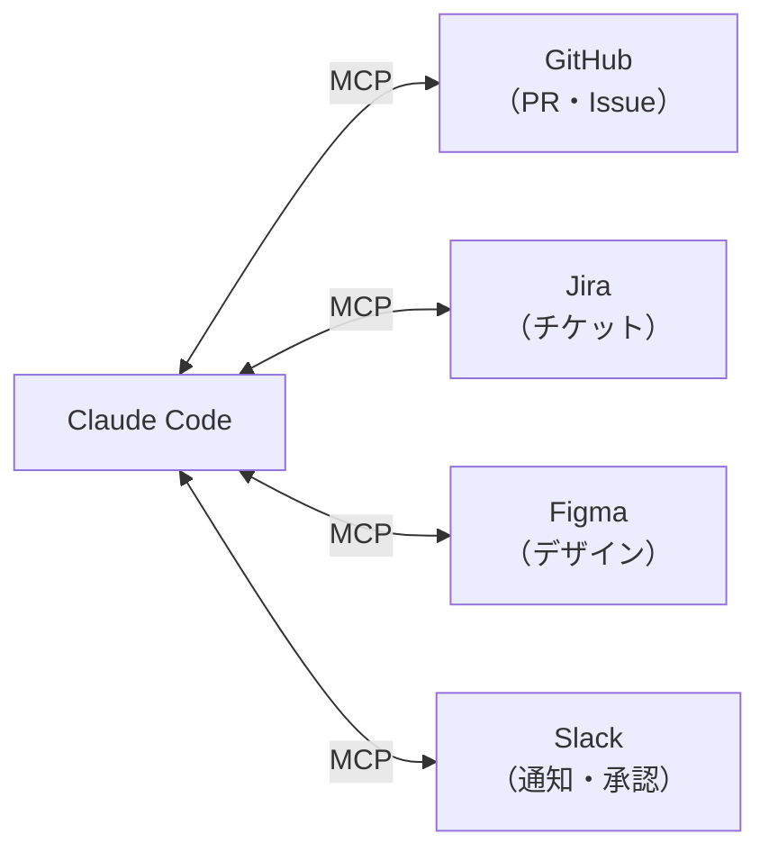

> - MCP 経由の情報は**リアルタイム取得**のため、AI の知識カットオフに縛られない

---

## 使用ツール

| カテゴリ              | ツール                                        | 主な役割                                                   |
| --------------------- | --------------------------------------------- | ---------------------------------------------------------- |
| 仕様整理・思考整理    | Claude                                        | 要件定義・設計・コードレビュー                             |
| 仕様書作成（MCP連携） | Excel / Notion                                | AIと対話しながら仕様を作成・管理                           |
| タスク管理（MCP連携） | Jira MCP / GitHub MCP                         | Issueやタスクの取得、ステータス更新                        |
| API仕様・ドキュメント | Apidog（AI機能）/ Apidog MCP                  | Schema編集・テストケース自動生成・ドキュメント品質チェック。MCP経由で Claude Code から OpenAPI 仕様を直接参照 |
| デザイン              | Figma + Figma MCP                             | UI設計・デザイントークン管理                               |
| CLIエージェント       | Claude Code                                   | ターミナルでの自律的コード生成・ビルド・テスト実行         |
| IDE（選択肢A）        | Cursor                                        | AI内蔵エディタ。補完＋エージェント機能を一体提供           |
| IDE（選択肢B）        | VS Code + GitHub Copilot                      | 補完・PR作成・コードレビュー支援                           |
| データベース（MCP連携）| Postgres MCP                                  | AIによるスキーマ参照・クエリ実行の支援                     |
| 自律エージェント      | Devin                                         | 反復タスクの自動化（検証用途）                             |
| テスト自動化          | Playwright MCP                                | E2Eテスト自動生成・実行                                    |
| UX解析（MCP連携）     | Amplitude / Mixpanel / GA4 + Analytics MCP    | ユーザー行動分析・離脱検知・AIによるUX改善提案             |
| 監視・運用（MCP連携） | Datadog MCP                                   | 障害ログ・メトリクスの自動取得、根本原因調査               |
| コミュニケーション（MCP連携） | Slack MCP                             | 過去の議論コンテキスト検索、インシデント報告と承認         |
| セキュリティ          | GitHub Secret Scanning                        | シークレット漏洩・脆弱性検出                               |
| AIゲートウェイ        | AWS Bedrock Guardrails                        | プロンプトフィルタ・機密情報マスキング・コスト管理         |

### ツール連携図

> 開発フローの各フェーズに対応するツール連携を示す。セキュリティ・ガバナンスはすべてのフェーズに横断的に適用される。

#### 全体フロー図

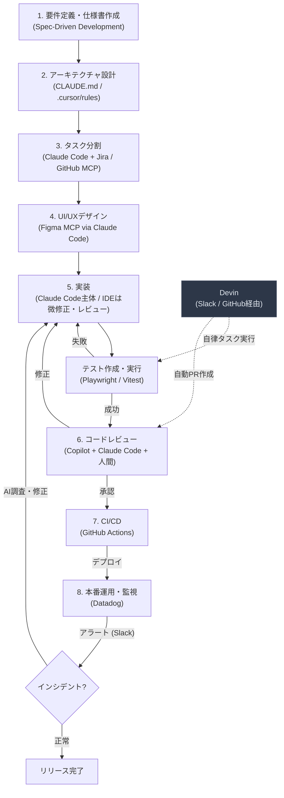

> **Devinの位置づけ**：Devinはメインの開発フローと並行して動く自律エージェントです。Slack や GitHub Issue 経由でタスクを受け取り、独立して実装・テスト・PR作成まで行います（詳細は 4.4 参照）。

#### 各フェーズの成果物と完了条件

| フェーズ        | 成果物                   | 完了条件                               | よくある失敗                | 主なMCP用途（※Claude Code経由を推奨） |
| --------------- | ------------------------ | -------------------------------------- | --------------------------- | ------------------------------------- |
| 要件定義        | `SPEC.md`                | 受け入れ基準と非機能要件が記載済み     | 曖昧な目標のまま実装開始    | 仕様書の連携管理（Notion MCP）、API仕様連携（Apidog MCP） |
| 設計            | `CLAUDE.md` / ルール定義 | 変更方針と制約が合意済み               | 既存制約を無視した設計      | 既存スキーマ調査（DB MCP）            |
| タスク分割      | タスクチケット一覧（Jira / GitHub Issues） | 全タスクにストーリーポイント・優先度・依存関係が設定済み | 粒度が粗すぎて見積もり不能 / 依存関係の未整理 | Jira MCP、GitHub MCP（チケット自動生成） |
| UI/UXデザイン   | Figma デザインファイル + デザイントークン（tokens.json） | Figma MCP連携済み + デザイントークンがコードに反映済み | スペックなしにFigmaで作り込み開始 | Figma MCP、Framelink MCP              |
| 実装            | 実装PR                   | テスト成功 + 仕様準拠（Apidog MCP 導入時は API仕様差分が解消済み） | 1セッションに複数課題を混在 | タスク取得（GitHub/Jira MCP）、DB MCP、Apidog MCP（仕様差分検知） |
| テスト          | テスト結果 + 視覚差分レポート | 自動テスト全件通過 + UI 視覚差分が許容範囲内 | E2Eテストの未整備           | Playwright MCP、Figma MCP（視覚一致検証） |
| レビュー        | レビュー記録             | Copilot + Claude Code + 人間承認       | AIレビューのみでマージ      | GitHub MCP（PR差分取得）              |
| CI/CD           | デプロイ完了             | デプロイ成功 + ロールバック手順を確認  | 自動化だけ導入し監視未整備  | ―                                     |
| 運用・監視      | インシデント対応記録     | アラート設定 + 対応フロー確認済み      | 監視未設定でリリース        | Datadog MCP、Slack MCP                |

---

#### ① 要件定義・設計フェーズ

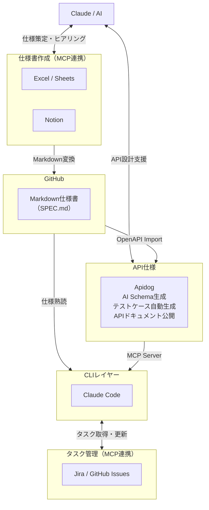

**要件定義・設計フロー詳細**

| ステップ | 担当 | アクション |
|---|---|---|
| 要件ヒアリング | Claude（AskUserQuestion） | 対話型インタビューで要件の穴を洗い出す |
| 仕様書作成 | Claude + Excel / Notion MCP | BDD形式で仕様書を起草・MCP経由で書き出し |
| API設計 | Apidog AI | Schema自動生成・命名提案・準拠性チェック |
| 仕様書レビュー | Claude Code | SPEC.md の網羅性・矛盾チェック |
| タスク分解 | Claude Code + Jira / GitHub MCP | 仕様からタスクを自動生成・チケット化 |

---

#### ② 実装フェーズ

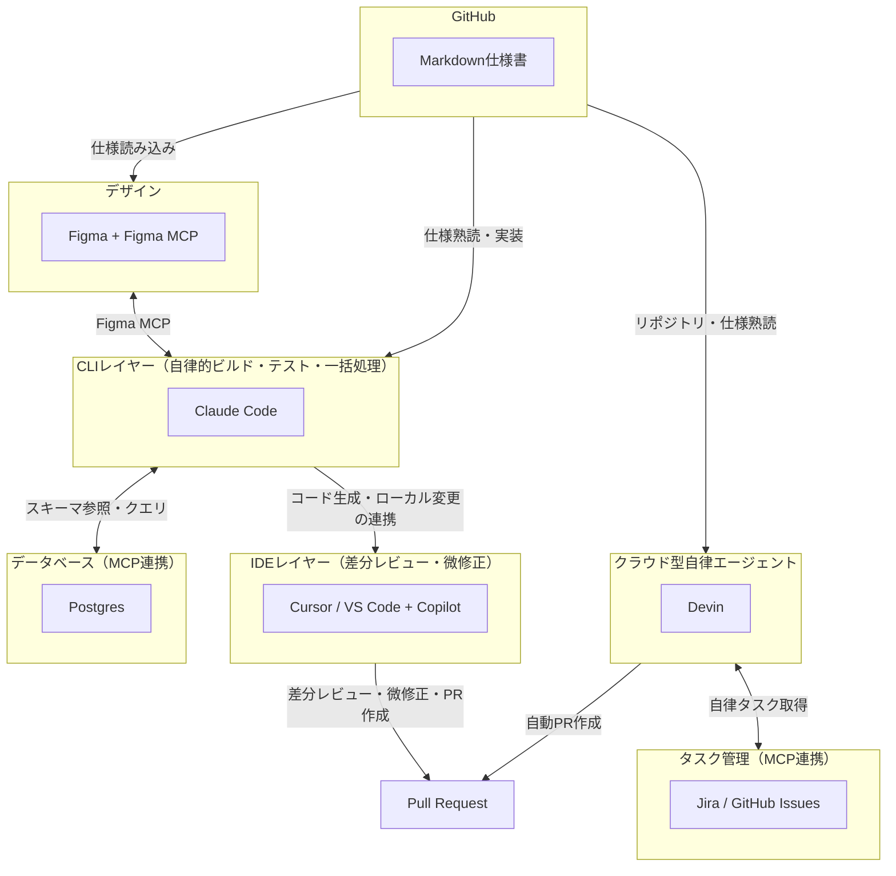

**実装フロー詳細**

| ステップ | 担当 | アクション |
|---|---|---|
| デザイン取得 | Claude Code + Figma MCP | Figma からデザイントークン・コンポーネント仕様を取得 |
| コード生成 | Claude Code | SPEC.md + CLAUDE.md を参照して実装コードを生成 |
| DB操作 | Claude Code + Postgres MCP | スキーマ参照・マイグレーション生成 |
| IDE連携 | Cursor / VS Code + Copilot | 差分レビュー・微修正・フォーマット |
| PR作成 | IDE / Devin | 変更差分のPR作成・レビュー依頼 |

---

#### ③ テストフェーズ

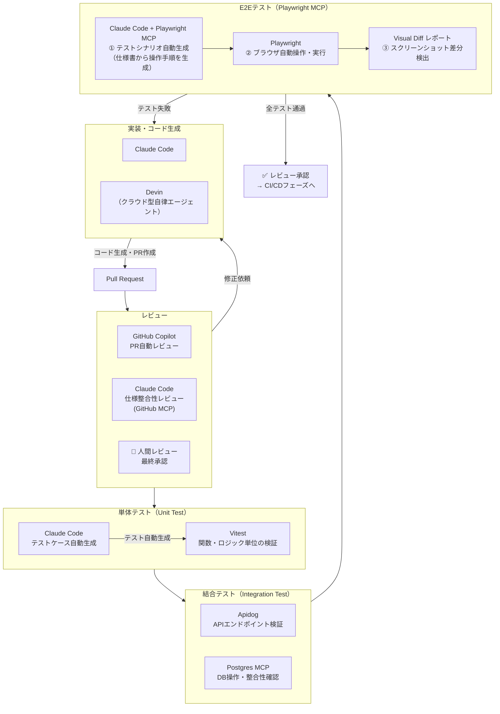

**テストフロー詳細**

| ステップ | 担当 | アクション |
|---|---|---|
| レビュー | Copilot + Claude Code + 人間 | PR自動レビュー → 仕様整合性レビュー → 最終承認 |
| 単体テスト | Claude Code + Vitest | テストケース自動生成・関数単位の検証 |
| 結合テスト | Apidog + Postgres MCP | APIエンドポイント検証・DB整合性確認 |
| E2Eテスト | Claude Code + Playwright MCP | シナリオ自動生成・ブラウザ実行・Visual Diff |
| テスト失敗時 | Claude Code | エラーログ解析・修正コード提案・再実行 |

**Playwright MCP による E2E 自動化の流れ**

| ステップ | 操作 | Playwright MCP の役割 |
|---|---|---|
| ① シナリオ生成 | Claude Code が仕様書（SPEC.md）を読み込み | 操作ステップを自然言語 → テストコードに変換 |
| ② テスト実行 | `playwright test` を CLI から自動実行 | ブラウザを起動しシナリオを再生 |
| ③ 差分検出 | スクリーンショットをベースラインと比較 | Visual Diff レポートをリポジトリに保存 |
| ④ 失敗時 | Claude Code がエラーログを解析 | 修正コードを提案 → 再実行 |

```text
# Playwright MCP テスト自動生成プロンプト例
@SPEC.md を読み込んで、ログイン〜商品購入完了までの
E2Eシナリオを Playwright のテストコードとして生成してください。
- ページ遷移・入力・アサーションを含めること
- エラーケース（必須入力漏れ・在庫切れ）も含めること
- tests/e2e/ 配下に feature 別で保存すること
```

---

#### ④ CI/CD・運用フェーズ

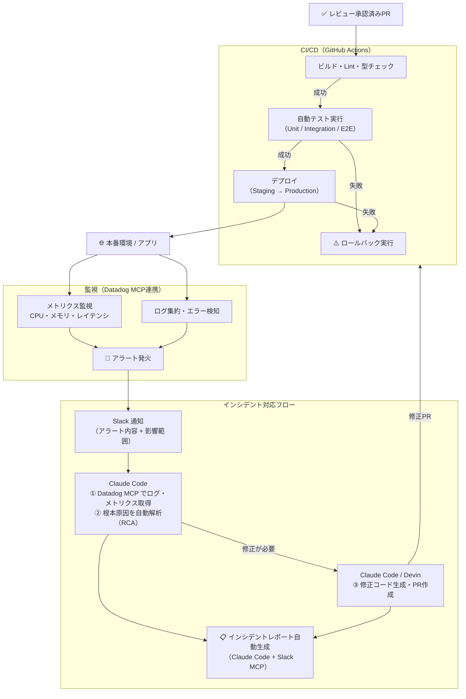


**インシデント対応フロー詳細**

| フェーズ | 担当 | アクション |
|---|---|---|
| 検知 | Datadog | SLO違反・レイテンシ異常・エラーレート急増を検知 |
| 通知 | Slack MCP | アラート内容・影響範囲・発生時刻を自動投稿 |
| トリアージ | Claude Code + Datadog MCP | ログ・トレースを取得し根本原因（RCA）を解析 |
| 修正 | Claude Code / Devin | 修正コード生成・PR作成・レビュー依頼 |
| ロールバック | GitHub Actions | 修正が間に合わない場合は自動ロールバック発動 |
| レポート | Claude Code + Slack MCP | インシデントレポート（事象・原因・対策・再発防止策）を自動生成 |

---

#### ⑤ セキュリティ・ガバナンス（横断）

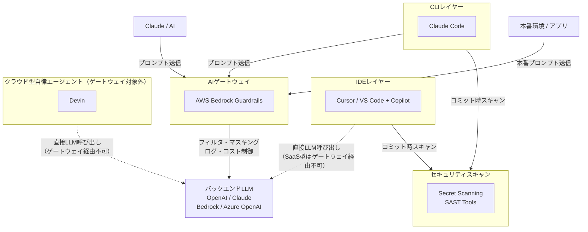

> **※AIゲートウェイの適用範囲**：ゲートウェイが保護できるのは「自社アプリ/コードからLLM APIを呼ぶ」経路のみ。GitHub Copilotなどの外部SaaSはそれぞれが直接LLMを呼ぶため、ゲートウェイでは介入できない。詳細は `9.6` を参照。

**セキュリティフロー詳細**

| ステップ | 担当 | アクション |
|---|---|---|
| プロンプトフィルタ | AWS Bedrock Guardrails | 機密情報のマスキング・不正プロンプトのブロック |
| コミットスキャン | Secret Scanning / SAST | シークレット漏洩・脆弱性の検出 |
| コスト制御 | AIゲートウェイ | LLM API の利用量ログ・コスト上限設定 |
| SaaS型エージェント | Devin / Copilot | ゲートウェイ経由不可のため、個別にアクセス制御を設定 |

---

#### ⑥ UX解析・継続的改善フェーズ（デプロイ後）

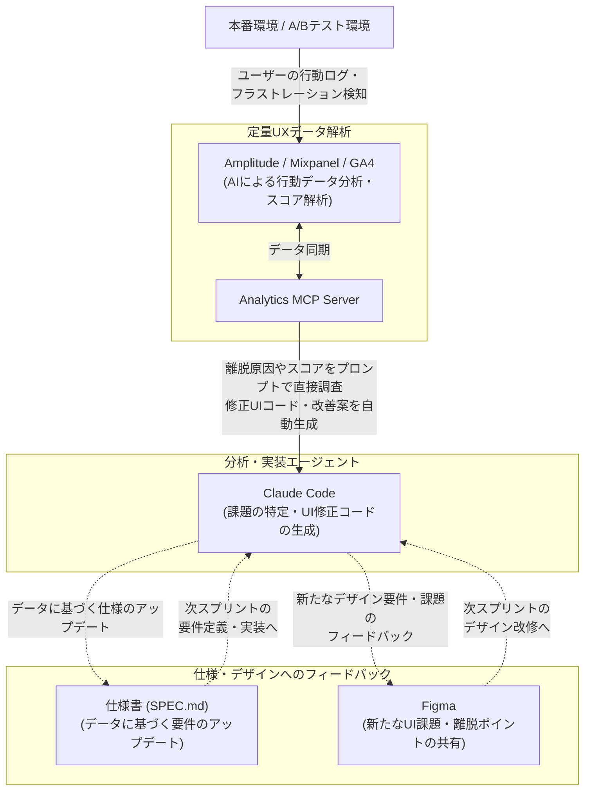

**UX解析フロー詳細**

| ステップ | 担当 | アクション |
|---|---|---|
| データ収集 | Amplitude / Mixpanel / GA4 | ユーザー行動ログ・フラストレーション検知 |
| データ分析 | Analytics MCP + Claude Code | 離脱原因・スコア解析をプロンプトで調査 |
| 改善案生成 | Claude Code | UIの修正コード・改善案を自動生成 |
| フィードバック | SPEC.md / Figma | 仕様・デザインに課題をフィードバック |
| 次スプリント | Claude Code | データに基づく要件・デザインの改修を実行 |

---

## 1. 要件定義・仕様書作成（Spec-Driven Development）

### 1.1 スペック駆動開発（SDD）とは

コードを書く前に詳細な仕様書（スペック）を作成し、それをAIへのプロンプトとして使う。

**フロー：Specify（仕様定義） → Plan（計画） → Tasks（タスク分解） → Implement（実装）**

- 曖昧な要件のままコード生成すると、後工程で全て崩れる
- 仕様書の完成度 = 実装品質に直結
- 複雑度別の仕様書ボリューム目安：
  - 単純関数：100-200語
  - APIエンドポイント：300-500語
  - コンポーネント/モジュール：500-800語
  - システムアーキテクチャ：1000-2000語

### 1.2 仕様書作成ツールの選択

| ツール            | 接続方法               | 特徴                                                                   |
| ----------------- | ---------------------- | ---------------------------------------------------------------------- |
| Excel             | Claude in Excel        | 表形式で視覚的に編集しやすい。SharePointで管理                         |
| Notion            | Notion MCP             | 文章・データベースを一体で管理                                         |
| Apidog            | Apidog AI + MCP Server | API仕様書をAIで自動生成・品質チェック。MCPでAIコーディングツールと連携 |
| GitHub + Markdown | Git管理                | 開発フェーズから直接参照できる。Claude Codeが直読みできる              |

### 1.3 AIと対話しながら要件を整理する

**Claudeにインタビューさせる（推奨パターン）**

```text
[構築したいものの簡単な説明] を構築したいと考えています。AskUserQuestion ツールを使って、私に詳しくインタビューしてください。

技術的な実装、UI/UX、エッジケース、懸念事項、トレードオフについて質問してください。
当たり前の質問は避け、私が考慮していないかもしれない難しい部分を深掘りしてください。

すべてを網羅するまでインタビューを続け、完了したら完全な仕様書を SPEC.md に作成してください。
```

> **💡 AskUserQuestion ツールとは？**
> AIエージェント（Claude CodeやCursorなど）が人間に明確な質問を投げかけ、ユーザーからの回答を待つための機能（システムツール）です。これを明示的に使うよう指示することで、AIが勝手な推測で作業を進めるのを防ぎ、対話形式で要件の解像度を確実に引き上げることができます。

**AskUserQuestion のやり取り例：**

> 🧑 ユーザー：「ユーザー管理機能を作りたい」
>
> 🤖 Claude（AskUserQuestion）：以下の点を教えてください。
>
> 1. ユーザーの認証方法はメール／パスワードですか？それともGoogle・GitHub等のSNSログインを想定していますか？
> 2. 管理者とエンドユーザーで権限を分ける必要はありますか？
> 3. メールアドレスの変更や退会機能は必要ですか？
>
> 🧑 ユーザー：「メール＋パスワードとGoogleログインの両方。管理者ロールあり。退会も必要。」
>
> 🤖 Claude（AskUserQuestion）：ありがとうございます。追加で確認です。
>
> 1. パスワードリセットはメール送信で行いますか？有効期限は何分を想定していますか？
> 2. 管理者はどの画面からユーザーを管理しますか？一覧・検索・強制退会などが必要ですか？
>
> （以降、仕様の穴がなくなるまで続く）
>
> 🤖 Claude：インタビュー完了しました。SPEC.md に仕様書を書き出します。

このアプローチで：

- AIが見落としがちなエッジケースを事前に洗い出す
- 仕様が固まったら新しいセッションで実装に移行（クリーンなコンテキストで開始）

**MCP経由でツールに書き出す**

- 決定した仕様をそのままExcel・Sheets・Notionに書き出す
- 「この要件を追記して」「不足項目を提案して」といった指示が可能
- ツールとAIが双方向につながることで、ドキュメントと対話が一体化する

### 1.4 仕様書の必須要素

効果的な仕様書に含めるべき内容：

| セクション         | 内容                                             |
| ------------------ | ------------------------------------------------ |
| 目的・ゴール       | 解決する課題と成功の定義                         |
| コンテキスト・制約 | 既存アーキテクチャ、依存関係、パフォーマンス要件 |
| 機能要件           | コア動作（BDD形式：Given/When/Then推奨）         |
| 非機能要件         | セキュリティ・スケーラビリティ・アクセシビリティ |
| エッジケース       | 異常系・境界値・エラーハンドリング               |
| テスト基準         | 検証アプローチ・合格条件                         |
| 具体例             | 入出力ペア・使用シナリオ                         |

### 1.5 ユーザーストーリーとBDD

```text
[ユーザー層] として、
[目的/利益] を達成するために、
[機能/アクション] を実行したい。

受け入れ基準（Acceptance Criteria）:
GIVEN（前提）: [事前条件やコンテキスト]
WHEN（操作）: [アクションの実行]
THEN（結果）: [期待される結果]
```

> **💡 BDDのシナリオはAIへのfew-shotプロンプトとして直接機能する。**
>
> AIに対して「ログイン機能を作って」とだけ指示する（Zero-shot＝具体例なし）と、AIは勝手な推測で実装してしまい、意図と違うコードが出力されやすくなります。
> 一方で、上記のような Given/When/Then 形式のシナリオを一緒に渡すことで、それが**「ユーザーがこういう操作をした時は、システムはこう動くべき」という具体的な動作例（= Few-shot）**として機能します。
> これにより、AIはロジックの要件や書くべきテストコードの基準を正確に理解し、一発で高品質なコード（とテスト）を出力できるようになります。

### 1.6 よくある失敗パターン

- 「速くしてほしい」など数値のない曖昧な要件
- 既存アーキテクチャへの言及なし
- エッジケース・エラーシナリオの欠落
- セキュリティ・パフォーマンス仕様なし
- テスト基準・検証アプローチなし

> **ポイント**：仕様書の完成度がそのまま実装品質に直結する。コードより先に仕様を完成させる

#### シーケンス図：要件定義フェーズ

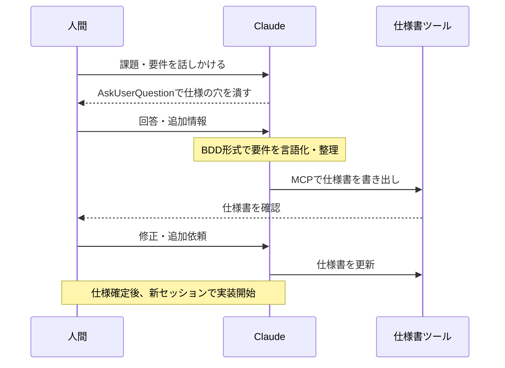

### 1.7 Apidog AI活用によるAPI仕様書作成

ApidogはAPI開発プラットフォームとして、AIを活用したAPI仕様書の作成・品質管理を一体化する。従来のPostmanやSwagger Editorと異なり、AIがAPI設計プロセス全体を支援する。

#### ApidogのAI機能一覧

| 機能                           | 説明                                                     | 活用場面                             |
| ------------------------------ | -------------------------------------------------------- | ------------------------------------ |
| **Schema編集支援**             | フィールド説明やMockデータを自動生成                     | データモデル設計時に説明文を一括生成 |
| **API準拠性チェック**          | API定義が設計ガイドラインに準拠しているか検証            | レビュー前の品質ゲート               |
| **AI命名支援**                 | パラメーターに標準的なフィールド名を提案                 | 命名規則の統一・国際化対応           |
| **テストケース自動生成**       | テストデータ・アサーション・カスタムスクリプトを自動作成 | テスト工数の大幅削減                 |
| **ドキュメント完全性チェック** | APIドキュメントの網羅性を分析し改善点を提案              | 公開前のドキュメント品質保証         |

#### Apidog + AI コーディングツール連携ワークフロー

ApidogはMCPサーバーを提供しており、Claude Codeと連携することで仕様を直接参照できる（IDEなどに読ませるとコンテキストを大量消費するため、Claude Codeに一任するのが推奨される）。

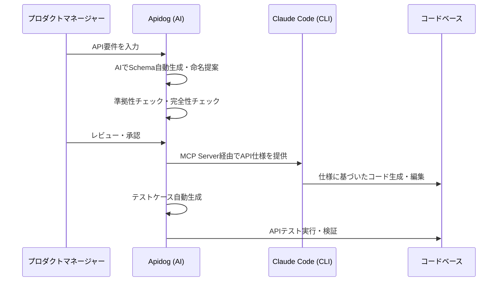

**Apidog MCP Server の設定例**

Claude Code の MCP 設定に Apidog を追加：

```json
{
  "mcpServers": {
    "apidog": {
      "command": "npx",
      "args": ["-y", "apidog-mcp-server@latest", "--project", "<PROJECT_ID>"]
    }
  }
}
```

これにより、Claude Codeが重いコンテキスト管理を引き受けつつ、ApidogのAPI仕様を直接参照してコードを生成できる。

> **ポイント**：Apidogを「API仕様のSingle Source of Truth」として運用することで、設計→実装→テスト→ドキュメントの一貫性が保たれる

### 1.8 モデル別の得意領域と使い分け

要件定義フェーズでも、モデルごとの特性を踏まえて役割を分担すると、ヒアリング漏れと手戻りが減る。

| モデル系統         | 得意領域                                             | 要件定義での推奨用途                                   |
| ------------------ | ---------------------------------------------------- | ------------------------------------------------------ |
| **Claude 4.6系**   | 長文コンテキスト保持・深い対話・成功率の安定性       | AskUserQuestion による要件ヒアリング、SPEC.md 起草     |
| **GPT系（GPT-5 / o3 / o4-mini）** | 構造化ドキュメント整形・網羅的な観点出し       | SPEC.md のレビュー、抜け漏れチェック、目次構造の整備   |
| **Gemini系**       | マルチモーダル（画像・PDF）理解、速度                | 既存資料・スクリーンショットからの要件抽出（叩き台）   |

> **ポイント**：1モデルで完結させず、「ヒアリング → 叩き台整形 → レビュー」の各ステップで得意なモデルに切り替える。モデル切替コスト（目安）は、手戻り削減効果を下回ることが多い。

---

## 2. アーキテクチャ設計

### 2.1 CLAUDE.md の設計（最重要ファイル）

CLAUDE.md はClaude Codeが毎回のセッション開始時に読み込む「プロジェクトの憲法」。

**配置場所と優先度**

| 配置場所                          | 用途                                        |
| --------------------------------- | ------------------------------------------- |
| `~/.claude/CLAUDE.md`             | 全プロジェクト共通の個人設定                |
| `./CLAUDE.md`                     | プロジェクトルート（Gitで管理・チーム共有） |
| `./subdir/CLAUDE.md`              | サブディレクトリ固有ルール（モノレポ向け）  |
| `~/.claude/CLAUDE.md` + `@import` | 個人オーバーライド                          |

**CLAUDE.mdに含める10項目**

| #   | セクション                 | 内容例                                 |
| --- | -------------------------- | -------------------------------------- |
| 1   | プロジェクト概要           | 技術スタック・目的・制約               |
| 2   | コードスタイル             | ESModule/CommonJS選択、命名規則        |
| 3   | ディレクトリ構造           | 重要フォルダの役割説明                 |
| 4   | テスト方針                 | テストフレームワーク・単体テストの粒度 |
| 5   | ビルド・実行コマンド       | `npm run dev`, `npm test` など         |
| 6   | ブランチ・PR規約           | ブランチ命名・コミットメッセージ形式   |
| 7   | アーキテクチャ上の制約     | 使ってはいけないパターン・ライブラリ   |
| 8   | 環境変数・設定             | 必須の環境変数名（値は記載しない）     |
| 9   | よくある落とし穴           | プロジェクト固有の注意点               |
| 10  | 外部ドキュメントへのリンク | 設計書・API仕様書のパス or URL         |

**CLAUDE.mdの実例**

```markdown
# コードスタイル (Code style)

- CommonJS (require) ではなく、必ず ES modules (import/export) 構文を使用すること
- 可能な限り import の分割代入を使用すること（例: import { foo } from 'bar'）

# ワークフロー (Workflow)

- 一連のコード変更が完了したら、必ず型チェック (typecheck) を実行すること
- パフォーマンスのため、テスト全体ではなく単一のテストを実行することを優先すること

# アーキテクチャ (Architecture)

- APIルートは /src/api に、共有の型定義は /src/types に配置すること
- /internal ディレクトリ内にあるものを、そのディレクトリ外から絶対にインポートしないこと

# テスト (Testing)

- ユニットテストには Vitest、E2Eテストには Playwright を使用すること
- 開発中の迅速な確認のためには `npm run test:unit` を実行すること

# 禁止事項 (DO NOT)

- シークレット情報やAPIキーをコミットしないこと
- 明示的な指示がない限り /migrations フォルダを変更しないこと
- コメントでの明確な正当化理由なしに TypeScript の any 型を使用しないこと
```

**CLAUDE.mdのサイズ管理**

- 目標：200行以内（超えると下部の指示を無視しがちになる）
- ルールの取捨選択基準：「これを削除するとClaudeが間違いを起こすか？」→ Noなら削除
- 頻繁に変わる情報はCLAUDE.mdに書かない
- Claudeが既にデフォルトで知っていることは書かない
- `@path/to/file` 構文でファイルをインポート可能

**CLAUDE.md vs Skills の使い分け**

|                    | CLAUDE.md                  | Skills                   |
| ------------------ | -------------------------- | ------------------------ |
| 読み込みタイミング | 毎セッション常時           | 必要なときだけ           |
| 向いているもの     | 全タスクに適用されるルール | 特定ドメインの知識・手順 |
| コンテキスト消費   | 常に消費                   | 使用時のみ               |

### 2.2 Cursor のルール設定（.cursor/rules/*.mdc）

`.cursorrules` は非推奨。現在は `.cursor/rules/` ディレクトリに `.mdc` ファイルで管理：

```text
.cursor/
  rules/
    general.mdc         # 全体ルール
    typescript.mdc      # TypeScript固有
    testing.mdc         # テスト規約
    api-conventions.mdc # API設計規約
```

各 `.mdc` ファイルの構造：

```yaml
---
description: TypeScript のコーディング規約
globs: ["**/*.ts", "**/*.tsx"]
---
# TypeScript ルール
- 常に strict モードを使用すること
- ユニオン型（Union Types）には interface より type を優先して使用すること
- 'any' は絶対に使用せず、代わりに 'unknown' を使用すること
```

### 2.3 Skills の設計

`.claude/skills/` に `SKILL.md` を作成し、プロジェクト固有の専門知識を渡す：

```markdown
---
name: api-conventions
description: プロジェクトのREST API設計規約
---

# API 設計規約

- URLパスにはケバブケース（kebab-case）を使用すること
- JSONのプロパティにはキャメルケース（camelCase）を使用すること
- リストを返すエンドポイントには必ずページネーション（ページ分割）を含めること
- URLパスにAPIのバージョンを含めること（/v1/, /v2/ など）
```

スキル例：

- `figma-mcp.md` — デザイン連携手順
- `test-generation.md` — テスト生成ルール
- `fix-issue.md` — GitHub Issue修正ワークフロー
- `db-schema.md` — データベース設計規約

### 2.4 Hooks の設定

コード保存・編集のたびに自動実行される処理を定義：

```jsonc
// .claude/settings.json
{
  "hooks": {
    // ツール使用後（事後）に自動実行される処理
    "PostToolUse": [
      {
        // 実行条件：AIがファイルの編集（Edit）または作成（Write）を行った時
        "matcher": "Edit|Write",
        // 実行内容：linterを実行し、コードフォーマットの自動修正を行う
        "hooks": [{ "type": "command", "command": "npm run lint --fix" }]
      }
    ],
    // ツール使用前（事前）に実行される処理
    "PreToolUse": [
      {
        // 実行条件：AIがファイルへの新規書き込み（Write）を行おうとした時
        "matcher": "Write",
        "hooks": [
          {
            "type": "command",
            // 実行内容：AIの操作対象（$TOOL_INPUT）に 'migrations/' フォルダが含まれていたら、エラーを出して書き込みを強制ブロックする
            "command": "if echo '$TOOL_INPUT' | grep -q 'migrations/'; then echo 'BLOCK: migrations folder is protected'; exit 1; fi"
          }
        ]
      }
    ]
  }
}
```

Hooksの活用例：

- ファイル編集後に ESLint を自動実行
- マイグレーションフォルダへの誤書き込みをブロック
- コミット前に型チェックを強制
- テスト実行後に自動カバレッジレポート生成

> Hooksのスクリプト自体もClaudeに生成させることができる：`"Write a hook that runs eslint after every file edit"`

### 2.5 Subagents の設計

`.claude/agents/` に専門エージェントを定義：

```markdown
---
name: security-reviewer
description: セキュリティ脆弱性のコードレビューを行います
tools: Read, Grep, Glob, Bash
model: opus
---

あなたはシニアセキュリティエンジニアです。以下の観点でコードをレビューしてください：

- インジェクション脆弱性（SQL、XSS、コマンドインジェクションなど）
- 認証および認可（権限）の欠陥
- コード内に含まれるシークレットや認証情報
- 安全でないデータ処理

具体的な行番号の参照と共に、推奨される修正案を提示してください。
```

#### サブエージェントのメリット（コンテキスト保護と役割分担）

AIとの対話において、コードを広く検索して該当箇所を探すような作業は、AIの「コンテキスト（記憶可能枠）」を大量に消費してしまいます。コンテキストが限界に近づくと、AIの応答が遅くなったり、直前に指示した重要なルールを忘れたり（コンテキストの希釈）しやすくなります。
サブエージェントを使うと、**「別のAIアシスタント（部下）に裏で作業を外注し、結果の要約だけをメインの会話に返す」**ことができるため、メインのコンテキストをクリーンに保つことができます。

#### エージェントの主要な設定項目（YAMLフロントマター）

- `tools`: エージェントに許可する操作権限。「調査」目的なら `Read, Grep, Glob` （読み取り限定）に制限することで、誤ってコードを書き換える事故を100%防げます。
- `model`: タスクに応じて最適なモデルを指定できます（単純な検索・要約は高速なモデル、高度な監査は高性能なモデルなど）。

#### 主要なユースケースと活用例

1. **Researcher（コードベース調査専門）**
   - **使用例**：「サブエージェントを使って、現在の決済システムがどう動いているか調査し、影響範囲を3行で要約して」
   - **効果**：数ダースのファイルを検索し読み込む「試行錯誤」の過程がメインセッションに表示されないため、ログが汚れず、トークンの節約にもなります。

2. **Security Reviewer（セキュリティ監査専門）**
   - **特長**：普段のコーディングとは全く異なる厳しい目線（SQLインジェクションやロジックの脆弱性の探索）専用のプロンプトをあらかじめ持たせておきます。これにより、専門家として偏執的に抜け穴を探させることができます。

3. **Test Generator（QA・テスト生成専門）**
   - **特長**：実装を担当したAIにそのままテストを書かせると、「自分の実装を通すための甘いテスト」を書くバイアスが働くことがあります。「品質保証（QA）」という独立したペルソナ（サブエージェント）にテストを書かせることで、より厳格な境界値テストなどを生成させることができます。

4. **DB Specialist（データベース特化型）**
   - **特長**：インデックスの最適化やN+1問題の発見など、パフォーマンスチューニングに特化した専門家です。専用ツールとしてデータベース接続権限（Postgres等へのSQL実行権限）を限定的に付与する運用が考えられます。

### 2.6 コンテキスト管理戦略

AI開発（特にClaude CodeやCursorを利用した際）において、**コンテキストウィンドウ（AIが一度に記憶・処理できる文字数の枠）は最も重要な資源（リソース）**です。
コンテキストが限界に近づくと、「直前に指示したルールを忘れる」「出力コードの品質が著しく下がる（ハルシネーションの増加）」「APIコストが高騰する」といった問題（**コンテキストの希釈**）が発生します。

そのため、以下の戦略で常にコンテキストをクリーンに保つ必要があります。

#### 状況別の具体的な対処法

| 状況                              | 対処法                                                | 理由・背景                                                                                                                       |
| --------------------------------- | ----------------------------------------------------- | -------------------------------------------------------------------------------------------------------------------------------- |
| **無関係なタスクへの切り替え**    | `/clear`（または新規チャット）で完全にリセットする    | 前のタスクの思考プロセスやコード差分が記憶に残っていると、次のタスクのコード生成に悪影響（ノイズ）を与えるため。                 |
| **AIが同じ間違いを2回繰り返す**   | `/clear` して、より詳細なプロンプトで最初からやり直す | コンテキスト内に「間違ったコード」と「修正のやり取り」が残っていると、AIが自身の過去のミスに引きずられてループに陥りやすいため。 |
| **大規模なコードベースの調査**    | Subagents（サブエージェント）に調査を委任する         | メインのAIに横断検索をさせると、試行錯誤の途中経過や大量のファイル内容でメインコンテキストが汚染・消費されてしまうため。         |
| **セッションが長く冗長になった**  | `/compact` コマンドで重要なポイントだけを要約する     | 会話履歴が長すぎると、CLAUDE.mdなどの重要な初期ルールの存在感が薄まり、指示を無視し始めるため。                                  |
| **コンテキスト使用率が60%を超過** | 新しいセッションに移行する（警戒ライン）              | 100%に近付くのを待つべきではありません。60%〜70%を超えたあたりからAIの注意力が散漫になり、出力品質の低下が顕著に現れます。       |

> **💡 MCPサーバーの「隠れコンテキスト消費」に注意**
> MCPサーバーは便利ですが、**接続している各サーバーの「ツールの説明文やスキーマ定義」は、毎回のやり取りの裏側で常にコンテキスト枠を消費**しています。
> CursorなどのIDE（UIツール）に過剰なMCPを紐付けると、エディタ本来の軽快なコード補完やレビュー機能まで遅延・劣化する恐れがあります。そのため、**「重い仕様読み込みとMCPツールの利用はターミナルのClaude Codeに一任し、IDEはコード差分の確認・補完に専念させる」**分業が推奨されます。プロジェクトごとに本当に必要なツールだけを有効化する運用を徹底してください。

> **設計が手薄だと後で全て崩れる。アーキテクチャ設計に時間をかけるほど手戻りが減る**

---

## 3. UI/UXデザイン

本章では、UI/UXデザインプロセスにおけるAI活用を解説します。特に、近年重要視されている「AIによるUXの自律評価とペルソナテスト」のベストプラクティスを含めています。


### 3.1 AIによるUIラフ案の生成（仕様 → デザイン）

仕様書（SPEC.md）からいきなりFigmaで作り込むのではなく、**AIに初期のUIラフ案を生成させてから、人間のデザイナーが洗練する**ワークフローが効率的です。

#### AIデザイン生成ツール

| ツール | 特徴 | 推奨用途 |
|--------|------|----------|
| **Claude Code + スクリーンショット** | HTMLを生成→ブラウザで表示→スクショ撮影→AIが自己評価 | エンジニア主導のプロトタイピング |
| **Figma AI (Make Designs)** | Figma内蔵のAIでフレーム・コンポーネントを自動生成 | デザイナー主導のラフ案作成 |

#### ワークフロー：仕様書 → AIラフ案 → デザイナーの洗練

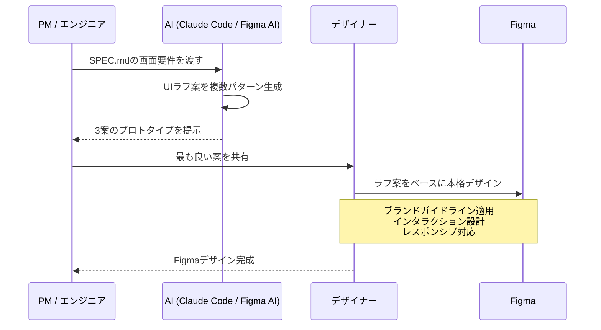

**AIへのプロンプト例（Claude Code）：**

```text
以下の仕様に基づいて、ダッシュボード画面のUIを3パターン設計してください。

仕様：@SPEC.md の「ダッシュボード画面」セクション
技術スタック：React + Tailwind CSS
要件：
- サイドバーナビゲーション
- KPIカード（売上、ユーザー数、コンバージョン率）
- 直近7日間のチャートグラフ
- モバイルファースト設計

各パターンの設計意図（なぜそのレイアウトにしたか）も説明してください。
```

> **ポイント**：AIが得意なのは「それっぽいUI」の高速な量産。ブランドの世界観やユーザー心理を踏まえた「こだわり」は人間のデザイナーが加える。AIは速度、人間は品質を担当するのが理想の分業。

### 3.2 AIによるデザインレビュー・評価

作成したデザインの品質をAIに評価させることで、人間のレビュー前に基本的な問題を検出できます。

#### AIデザインレビューの観点

| 観点 | AIがチェックできること | ツール |
|------|----------------------|--------|
| **アクセシビリティ** | コントラスト比（WCAG AA/AAA）、フォントサイズ、タッチターゲットサイズ | Claude + スクリーンショット |
| **一貫性** | カラー・スペーシング・タイポグラフィがデザインシステムと一致しているか | Claude Code + Figma MCP |
| **ユーザビリティ** | Nielsenのヒューリスティクス（10原則）に基づく評価 | Claude（プロンプト） |
| **レスポンシブ** | モバイル/タブレット/デスクトップでのレイアウト破綻 | Playwright MCP |

**デザインレビュープロンプト例：**

```text
添付したダッシュボード画面のスクリーンショットを、以下の観点でレビューしてください。

1. アクセシビリティ
   - WCAG 2.1 AA準拠のコントラスト比か？
   - タッチターゲットは44x44px以上あるか？

2. ユーザビリティ（Nielsenの10原則）
   - 現在地の認識性（ユーザーが今どこにいるか分かるか）
   - エラー防止（操作ミスを防ぐUIになっているか）
   - 一貫性（同じ操作が同じ見た目で表現されているか）

3. 情報設計
   - 視線の流れ（Z/Fパターン）が自然か
   - 重要な情報が優先的に目に入る配置になっているか

問題点ごとに「深刻度（高/中/低）」と「具体的な改善案」を提示してください。
```

> **ポイント**：AIによるデザインレビューは「機械的にチェック可能な指標（コントラスト比、サイズ等）」において特に有効。感性的な判断（ブランドとの適合性等）は人間のデザイナーに委ねる。

### 3.3 AIエージェントによるUX自動テストとペルソナ評価（ベストプラクティス）

近年、静的なスクリーンショットのUIチェックを超え、**AIエージェントにペルソナ（特定のユーザー像）を与え、実際のユーザー観点でUXを評価させる**手法がベストプラクティスとして普及しています。

#### 3.3.1 ペルソナ駆動型AIレビュー

特定のターゲットユーザー（例：ITリテラシーの低い高齢者、急いでいるビジネスパーソン）のコンテキストをプロンプトで定義し、その視点でUIの課題を抽出させます。「AIの客観的な正解」ではなく「特定のユーザーにとっての摩擦（フリクション）」を発見するのが目的です。

**ペルソナ評価のプロンプト例：**

```text
あなたは「ITリテラシーが低く、スマートフォンの操作に不慣れな65歳のユーザー」です。
提供されたスクリーンショット（会員登録画面）を見て、以下の観点で「あなたが感じる不安や迷い」をレビューしてください。

1. 次に何をすべきか直感的に理解できるか？
2. 入力項目の中に、専門用語や意味が分からない言葉はあるか？
3. エラーが起きたと仮定した場合、どうすれば直せるか理解できるか？

プロのデザイナーの視点ではなく、あくまで「このペルソナとしての率直な感想」と「どこで操作をやめたくなるか（離脱ポイント）」を提示してください。
```

#### 3.3.2 自律エージェント（LLM + Playwright等）による動的UXテスト

Playwrightなどの操作自動化ツールとLLMを掛け合わせ、AIエージェントに実際のサイトやプロトタイプを自律的に操作させながらユーザビリティを評価させる高度な手法です（メルカリなどの先進企業で導入事例あり）。

1. **AIへの目標指示**: 「商品をカートに入れ、チェックアウトまで進んでください。その過程で分かりにくいUIがあれば指摘してください。」
2. **エージェントの自律探索**: AIが自身で画面内の要素を解釈し、クリックし、画面遷移を繰り返す。
3. **UX課題のリアルなレポート**: 「カートボタンがスクロールしないと見えない」「エラーメッセージが専門的すぎて解決方法が分からない」といった動的なUXの欠陥をレポートに出力する。

#### 3.3.3 UXデザインにおけるAI活用の原則 (Human-in-the-Loop)

AIは「規約への準拠」や「論理的な情報設計」の評価は得意ですが、最終的なユーザーの「感情的な体験」や「プロジェクトの文脈」を完全に理解することはできません。

> **重要**：AIによるレビューはあくまで「ヒューリスティック評価（経験則に基づくチェック）の自動化」と「ユーザーテスト前の明らかな欠陥の除去（スクリーニング）」として活用します。AIに全てを決定させるのではなく、最終的な意思決定、共感、戦略的な判断は必ず人間のデザイナーと実際のUXリサーチに委ねる「**Human-in-the-Loop**」の体制を組むことが最大のベストプラクティスです。

### 3.4 AIによる定量UX・行動データ解析（Analytics SaaS連携）

リリース後やA/Bテスト時の定量的なUXデータ（ユーザースコア、クリック率、離脱率など）の解析においても、既存のAnalytics（分析）SaaSとAIを組み合わせるアプローチがスタンダードになりつつあります。これまでデータサイエンティストが手動でデータを抽出・可視化していた作業を、AIが自然言語の対話を通して代行してくれます。

#### 主なツールとAIの活用法

| ツール名 | 特徴とAIの活用方法 |
|----------|-----------------|
| **Amplitude AI** | 「なぜコンバージョン率が下がったのか？」といった問いに対し、**AIが根本原因（Root Cause）を自動調査**してダッシュボードを生成します。Claude等のMCP機能とも直接連携するサーバーを提供中。 |
| **Mixpanel AI** | SQL等を知らなくても「過去30日間でカート落ちしたユーザーの共通点は？」と**自然言語でプロンプト入力**するだけで、イベントデータとセッション動画を組み合わせて解像度の高いインサイト（インサイトボード）を生成します。 |
| **Hotjar AI / Contentsquare** | ユーザーのセッション録画から「最もフラストレーション（怒り・迷い・クリック連打）を感じている瞬間」をAIが自動で検出し要約します。また、NPSアンケートの自由記述などを自動で感情分析・カテゴリ分けします。 |
| **GA4 (Google Analytics 4)** | 機械学習をコアに組み込み、クッキーレスで欠損したデータを補完しつつ、過去の行動データから「7日以内の購入確率」「離脱確率」といった**予測的メトリクス（Predictive Metrics）**を自動算出します。 |

#### AI連携の実践イメージ（MCPを活用したインサイトループ）

例えばAmplitudeが提供するMCPサーバーとClaude Codeを連携させることで、AIエディタの画面から直接「本番環境のクリック率低下の原因」を探り、そのまま改善に向けたコードの修正案を書かせることが可能です。

**Claude Codeへの指示例：**

```text
@amplitude-mcp を使用して、直近1週間の「新規登録ボタン（signup_btn_click）」のファネル低下要因を調査してください。
特にモバイル環境での離脱が大幅に増えていれば、@src/components/SignupForm.tsx のモバイルレイアウトの問題点を洗い出し、クリック率を改善するための修正UIコードを提案してください。
```

### 3.5 Figma MCP → コード実装ワークフロー

**Step 1: Figmaファイルの構造化**

AI向けに最適化されたFigmaファイルの要件：

- **変数（Variables）**：カラー、スペーシング、タイポグラフィ、ボーダーラジウスをFigma Variablesで定義
- **オートレイアウト**：全コンポーネントにAuto Layoutを適用（レスポンシブ対応）
- **コンポーネント化**：バリアント付きの再利用可能コンポーネントを作成
- **レイヤー命名**：意味のある名前でレイヤーを命名（AIの解釈精度が向上）
- **アノテーション**：インタラクティブな状態・ホバー・エラー状態を注釈で明示

**Step 2: デザイントークンのエクスポート**

Open Variable Visualizerプラグインで2つのファイルを出力：

- `tokens.json` — 全デザイントークン
- `resolver.ts` — プログラマティックアクセス用ユーティリティ

**Step 3: MCPサーバーの選択**

| アプローチ                          | 条件                 | 特徴                                         |
| ----------------------------------- | -------------------- | -------------------------------------------- |
| Figma Official MCP（ベータ）        | Figma Dev座席が必要  | Code Connectによるコンポーネント紐付けが強力 |
| Framelink MCP（無料・コミュニティ） | 無料プランでも利用可 | 設定が独立しており導入しやすい               |

**Step 4: AIへのプロンプト**

```text
[FigmaフレームURL] にあるコンポーネントを実装してください。
@tokens.json にあるデザイントークンを使用してください。
フレームワーク：React + Tailwind CSS
制約事項：
- 可能な限り /src/components 配下の既存コンポーネントを流用すること
- @CLAUDE.md に記載されたパターンに従うこと
- モバイルファーストの完全レスポンシブ対応にすること
実装完了後にスクリーンショットを撮り、元のデザインと比較してください。
```

### 3.6 デザイントークンワークフロー

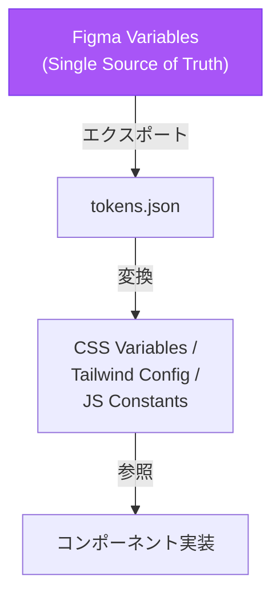

コードとデザインの乖離を防ぐため、デザイントークンをGitで管理し、Figmaの変更を自動的にコードに反映するCI/CDパイプラインを構築することを推奨。

---

## 4. 実装

> **プロンプト集への導線**：各ツールのプロンプト例は本セクション内に記載しているが、フェーズ横断のチートシートは「8.2 プロンプトチートシート」にまとめている。

### 4.1 Claude Code ベストプラクティス

#### 基本原則：検証手段を先に用意する

Claudeに「成果を確認する方法」を渡すことが最高レバレッジの施策：

| 戦略             | Before                               | After                                                                                                      |
| ---------------- | ------------------------------------ | ---------------------------------------------------------------------------------------------------------- |
| テスト基準を提供 | 「メールのバリデーションを実装して」 | 「validateEmailを実装して。テストケース: user@example.com=true, invalid=false。実装後にテストを実行して」  |
| UIを視覚的に検証 | 「ダッシュボードの見栄えを良くして」 | 「[スクショ添付] このデザインを実装して。結果をスクショして比較し、差分をリストアップして修正して」        |
| 根本原因を提示   | 「ビルドが失敗している」             | 「ビルドが[エラー]で失敗する。これを修正し、成功するか検証して。エラーを握りつぶさず、根本原因を解決して」 |

#### 実装フェーズの標準ワークフロー（4ステップ）

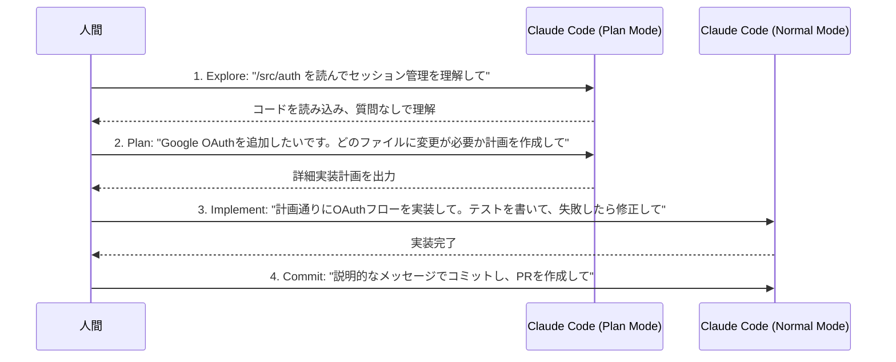

> Plan Modeが必要なのは：変更が複数ファイルにまたがる場合、アプローチが不確かな場合、慣れていないコードを扱う場合。1文で差分を説明できるタスクはPlanをスキップしてよい。

#### コンテキスト効率化のためのプロンプトパターン

```bash
# ファイルを直接参照
> @./src/auth/session.ts をレビューして

# 複数ファイルを比較
> @./old.js と @./new.js の実装を比較して

# データをパイプで渡す
cat error.log | claude -p "このエラーの原因を分析して"

# git historyから背景を調査
> ExecutionFactoryのgitの履歴を確認し、APIがどう進化したか要約して
```

#### サブエージェントで調査をオフロード

```text
サブエージェントを使用して、現在の認証システムがトークンの更新（リフレッシュ）をどのように処理しているか調査してください。
また、再利用できる既存のOAuth関連のユーティリティがないか確認してください。
```

サブエージェントはメインコンテキストを汚染せずにコードベースを調査できる有効な手段。

#### 並列実行・自動化

```bash
# 非インタラクティブモード（CI/CD向け）
claude -p "すべてのLintエラーを修正して" --permission-mode auto

# ファイル一括処理
for file in $(cat files.txt); do
  claude -p "$file をReactからVueに移行して。結果としてOKかFAILを返して。" \
    --allowedTools "Edit,Bash(git commit *)"
done

# 構造化出力
claude -p "すべてのAPIエンドポイントをリストアップして" --output-format json
```

> **注意**：`--permission-mode auto` はファイル書き込み・コマンド実行をすべて自動承認する。CI/CD など隔離された環境専用で使用し、ローカル開発環境での多用は避けること。

#### Writer/Reviewer パターン（品質向上）

実装用セッション（Writer）とレビュー専用セッション（Reviewer）を分け、レビュー結果を Writer に戻して修正する流れの例です。**別チャット／別 Composer ウィンドウ**にすると、レビュー側が実装時の文脈に引きずられにくくなります。

| 手順 | セッション | やること |
| ---- | ---------- | -------- |
| 1 | **Session A（Writer）** | 機能を実装させる。プロンプト例：「APIエンドポイント用のレートリミッターを実装して」 |
| 2 | **Session B（Reviewer）** | 実装後のファイルを指定してレビューさせる。プロンプト例：「`@src/middleware/rateLimiter.ts` のレートリミッターをレビューして。エッジケース、競合状態、既存のミドルウェアとの一貫性を確認して」 |
| 3 | **Session A（Writer）** | Session B の出力（指摘・改善案）を**そのまま貼り付け**たうえで修正を依頼する。プロンプト例：「次のレビュー指摘に対応してコードを修正して：」のあとにレビュー全文を続ける |

ポイント：手順 3 では `[Session Bの出力結果]` のようなプレースホルダではなく、実際のレビュー本文をコピーして渡す。

> **コスト注意（FinOps観点）**：Writer/Reviewer パターンは2つの独立したセッションを使うため、トークン消費が実質2倍になる。**コアロジックやセキュリティが重要なファイルに限定して使用**し、単純な修正やUI調整には通常の1セッションで完結させるのが経済的。LLMコストの全体管理については「9.6 AIゲートウェイ」を参照。

### 4.2 Cursor IDE (v2) ベストプラクティス

前述の通り、要件定義やMCPツール（Jira/Notion/Figma）を介した重い外部コンテキスト処理は **Claude Code** に一任します。
一方で、Cursorは「バックグラウンドで生成されたコードの差分レビュー」「局所的なコード補完」「コードベース内部で完結するリファクタリング」において真価を発揮します。Cursorの「Composer」を中心としたエージェント機能は以下のルールで活用します。

> **💡 Claude Codeとの使い分けの境界線**：
> 「仕様書(SPEC.md)やFigmaを読み込んで外部要件からコードを作るタスク」はClaude Codeに委ねます。CursorのComposerは「既存クラスの全ファイルリネーム」「使われていない変数の削除」など、**コードベース内部のコンテキストだけで完結する作業**に専念させると、ハルシネーションなく最強のパフォーマンスを出します。

#### モデル選択戦略

| モデル             | 用途                                             |
| ------------------ | ------------------------------------------------ |
| Claude Sonnet 4.6 系 | 日常的なコーディング・複数ファイルを含む機能実装 |
| Claude Opus 4.6 / o3 系 | 複雑なアーキテクチャ設計・難解なバグ修正    |
| Claude Haiku 4.5     | 高速な補完・単純なリファクタリング・文言修正     |

#### Composer を活用した自律ワークフロー

Composerは、単なるコード補完ではなく、要件からターミナルコマンドの実行、テストの作成と修正までを自律的に行う機能です。これを効果的に使うには、タスクと制約を明確に与えることが鍵となります。

- **1セッション1タスクの原則**: ひとつの機能実装やバグ修正が終わったら新しいComposerを開き直すことで、コンテキストをクリーンに保ち、AIのパフォーマンス低下を防ぎます。
- **タスク委任時のプロンプトパターン**:

```text
[機能名] に対する失敗するテストを作成し、その後、テストが通るように実装を行ってください。
事前に計画を提案して合意を得ない限り、変更は以下のファイルに限定してください：[ファイル一覧]
```

#### YOLO Mode（ターミナルの無人実行）と品質担保

Composerにターミナル上で自律的にテストやコマンドを実行させる（YOLO Mode等）際は、以下のルールを徹底します。

- エージェントが生成した変更は、必ず Diff を人間が目視レビューしてから Commit する
- 常に「テスト失敗 → 実装 → テスト成功」の順序（TDDアプローチ）を守らせて挙動を保証する

#### Agent Window による並列タスク処理

複数のAgentを並行して走らせることができる「Agent Window」を活用することで、メインの開発作業を止めずに重いタスクをバックグラウンドで処理させます。

- 大規模なファイルのリファクタリングや型定義の修正
- 複雑な依存関係やレガシーコードの影響範囲調査

メインのComposerのコンテキストを汚さずにサブタスクを進行できるため、開発のスピードを飛躍的に向上させます。

### 4.3 GitHub Copilot (v2) ベストプラクティス

最新の GitHub Copilot（v2）では、Claude Sonnet 4.6 や OpenAI o3 といった強力なモデルが選択可能になりました。これにより、Cursorと同等の「プロジェクト全体（Workspace）を把握し、複数ファイルを一括で自律編集するエージェント機能（Copilot Edits等）」が利用可能になっています。

#### モデル選択とCopilot Editsの活用

従来のインライン補完（Ghost Text）と「Copilot Edits」などのエージェント型UIを組み合わせて活用するのが最新のベストプラクティスです。

| 選択モデル        | 用途・得意領域                                                             |
| ----------------- | -------------------------------------------------------------------------- |
| Claude Sonnet 4.6 | 新規機能の実装、フロントエンドコンポーネント・UIの生成（現在もっとも推奨） |
| GPT-4o / o3-mini  | 複雑なバックエンドロジックの構築や、難解なエラーのデバッグ                 |

- **Copilot Editsのアジェンティックな利用**: プロンプトウィンドウに「機能要件」や「追加したい仕様」を入力するだけで、AIがワークスペース全体の依存関係を読み取り、作成・修正すべき複数ファイルへの差分（Diff）を一度に提案します。
- **コンテキストの分離**: 異なるタスクを連続させるとAIのパフォーマンスが落ちるため、タスクが変わるたびに新しいCopilot Editセッションを開き直すのが鉄則です。

#### カスタムインストラクションによる規約の徹底

AIがチームのルールに沿って自立的にコードを生成できるよう、リポジトリに `.github/copilot-instructions.md` を作成してプロジェクト全体のルールを定義します。

```markdown
# チーム規約 (Team Conventions)

- TypeScriptのstrictモードを使用すること
- エラーハンドリング: 常に Result<T, E> パターンを使用すること
- テスト: ユニットテストにはVitest、E2EテストにはPlaywrightを使用すること
- 状態管理: Zustandを使用すること
- 命名規則: 変数はキャメルケース(camelCase)、コンポーネントはパスカルケース(PascalCase)を使用すること
```

#### GitHub Copilot Workspace と PRレビューの連携

- **Copilot Workspace による Issue 駆動開発**: GitHub の Issue から「Open in Workspace」のボタン一つで、AIが要件の理解 → 解決策の提案 → 初期実装 → PR（プルリクエスト）の作成までを一気通貫で自律実行します。
- **Code Review の自律化**: PR作成後は、CopilotをReviewerとして割り当てることで、CodeQLと連携した厳格なセキュリティスキャン（脆弱性の自動検知と Fix 提案）を人間が行う前に処理させます。

#### Copilot エコシステムの5コンポーネント

GitHub Copilot は単一機能ではなく、5つのインターフェースを横断する統合エコシステムとして設計されている。それぞれを正しい場面で使い分けることが効率の最大化につながる。

| コンポーネント         | 役割                                                       | 主な利用場面                       |
| ---------------------- | ---------------------------------------------------------- | ---------------------------------- |
| **VS Code 拡張**       | インライン補完・Edits・チャット                            | 日常的なコーディング               |
| **Copilot CLI**        | ターミナル上での対話・自動実行・スクリプト連携             | シェル操作・CI/CD・ローカル自動化  |
| **Cloud Agent**        | Issue から自律的に PR を作成するクラウド側エージェント     | 反復的なタスク・小規模バグ修正     |
| **Code Review**        | agentic な PR レビュー（関連コード・ディレクトリも参照）   | PR 作成時の自動レビュー            |
| **Spaces**             | チームで共有するコンテキスト集約スペース                   | 仕様書・規約・参照コードの一元管理 |

> **ポイント**：Copilot はモデル呼び出し回数が **月次プレミアムリクエスト予算制**で管理される。重い Edits・Cloud Agent ジョブは予算を急速に消費するため、チーム内で「予算ダッシュボードを共有 → 重いタスクは Cloud Agent や CLI に逃がす」運用が現実的。

#### Copilot CLI マスタークラス

Copilot CLI はターミナルから Copilot を呼ぶための公式 CLI で、エディタ外の作業（シェル操作・CI スクリプト・スキャフォールド生成）を AI に任せたい場面で威力を発揮する。

**4つの動作モード**

| モード             | 用途                                                     |
| ------------------ | -------------------------------------------------------- |
| **対話型**         | チャットライクに質問しながら作業を進める                 |
| **プログラム型**   | 単発コマンドとして実行（パイプ・スクリプト連携向け）     |
| **計画立案型**     | 大きなタスクを分解して計画を出力（実行は人間が承認）     |
| **自動実行型**     | 計画から実装・テスト・PR 作成までを連続実行              |

**実用機能**

- **`/review`**：ローカル変更や PR をターミナルから直接 AI レビュー
- **`SKILL.md`**：再利用可能な手順（スキャフォールド生成、リリース手順等）を Markdown で定義し、CLI から呼び出し
- **MCP サーバー連携**：エディタ版と同じ MCP 群を CLI からも利用可能

```bash
# 例：ローカル変更を AI レビューしてから PR を作成
gh copilot /review
gh copilot run "current branch をプッシュして PR を作成し、Copilot をレビュアーに指定"
```

> **ポイント**：CI コンテナや SSH 越しの作業など「VS Code が使えない環境」で Copilot を活かせるのが CLI の最大の利点。`SKILL.md` をリポジトリにコミットしておくと、新メンバーも `gh copilot run <skill>` だけで定型作業を再現できる。

### 4.4 Devin の活用パターン

Devinは、Claude CodeやCursorのような「手元のエディタで動くAI」とは異なり、**クラウド上のVM（仮想マシン）で独立して動く自律型エージェント**です。人間がSlackやWebから指示を出すと、自分でコードを読み、実装し、テストを実行し、PRを作成するところまでを自律的にこなします。

#### Devin vs Claude Code / Cursor の使い分け

| 項目 | Claude Code / Cursor | Devin |
|------|---------------------|-------|
| 動作場所 | ローカルPC（エディタ内） | クラウドVM |
| 操作方法 | エディタのチャット画面 | Slack / Web UI |
| 得意なタスク | 設計判断を伴う実装 | 定型的・反復的タスク |
| 人間の関与 | リアルタイムで対話 | 完了後にPRをレビュー |
| AIゲートウェイ | 経由可能 | 経由不可（SaaS内部で完結） |

#### 利用例

```text
# Slackでの利用（推奨パターン）
@Devin issue #123のバグを修正して - ユーザーがパスワードをリセットできない

# 並列実行
@Devin 並列VM群で動くDevinチームを作成し、それぞれのサブタスクを委譲して処理して
```

#### 運用上の注意点

- **向いているタスク**：マイグレーション、リファクタリング、テスト追加、ドキュメント更新
- **向いていないタスク**：新規アーキテクチャ設計、仕様の曖昧なタスク
- **必須ルール**：本番投入するコードは、Devin作成のPRでも**人間のレビューをMUST**とする
- MCPによるJira/GitHub連携でタスク自動取得が可能

### 4.5 MCP（Model Context Protocol）エコシステム

2024年11月にAnthropicが発表。2025年12月9日にLinux Foundation傘下のAgentic AI Foundation（AAIF）へ移管され、AI業界のデファクトスタンダードとなった。

**Claude Code で使える主要MCPサーバー**

| カテゴリ         | サーバー例                 | 用途                     |
| ---------------- | -------------------------- | ------------------------ |
| デザイン         | Figma MCP, Framelink       | デザインからコード生成   |
| プロジェクト管理 | Jira MCP, GitHub MCP       | Issue参照・PR作成        |
| ドキュメント     | Notion MCP, Confluence MCP | 仕様書参照               |
| データベース     | Postgres MCP               | スキーマ参照・クエリ実行 |
| モニタリング     | Datadog MCP, Grafana MCP   | メトリクス参照           |
| ブラウザ         | Playwright MCP             | E2Eテスト・ブラウザ操作  |

### 4.6 テスト駆動開発（TDD）with AI

**AI-TDDの推奨サイクル**

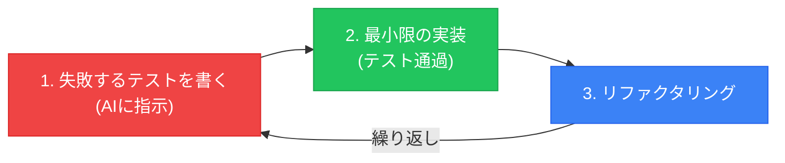

**プロンプト例**

```text
Write failing tests for a validateEmail function.
Test cases must cover:
- Valid: user@example.com, user+tag@domain.co.jp
- Invalid: empty string, missing @, missing domain, double @
Then implement the function to pass all tests.
Do NOT use any email validation library.
```

**日本語版プロンプト：**

```text
validateEmail 関数の失敗するテストを作成してください。
テストケースには以下を網羅する必要があります：
- 有効（Valid）：user@example.com, user+tag@domain.co.jp
- 無効（Invalid）：空文字、@がない、ドメインがない、@が2つある
テスト作成後、すべてのテストを通過するように関数を実装してください。
既存のメールバリデーションライブラリは絶対に使用しないでください。
```

### 4.7 プロジェクト管理 MCP連携（GitHub / Jira）

自律的な開発フローにおいて、AIに「次にやるべきタスクを取得し、要件を理解して実装する」ところまでを委ねる構成です。

**ワークフロー:**
1. AIが `Jira MCP` または `GitHub MCP` を用いて、現在割り当てられているIn ProgressのチケットやIssueを検索・取得します。
2. チケットの詳細（ユーザー要件、完了条件）や関連するコメントを自動で読み込みます。
3. コードベース内の該当箇所を特定し、機能実装やバグ修正を行います。
4. チケット番号を含めたPRを作成し、ステータスを自動更新します。

**AIへのプロンプト例:**
```text
@github-mcp または @jira-mcp を使用して、現在私に割り当てられている一番優先度の高いバグ修正チケットを取得してください。
チケットの詳細を読み、原因を調査して修正を実装してください。
完了後、チケット番号をコミットメッセージとPRのタイトルに含めて提出してください。
```

### 4.8 データベース MCP連携（Postgres）

バックエンドやデータ処理の実装時に、AIが実際のデータベーススキーマを参照することで「ハルシネーションによる誤ったSQLテーブル/カラム生成」や「O/Rマッパーの型定義ミス」を防ぎます。

**シーケンス図：DB連携ワークフロー**
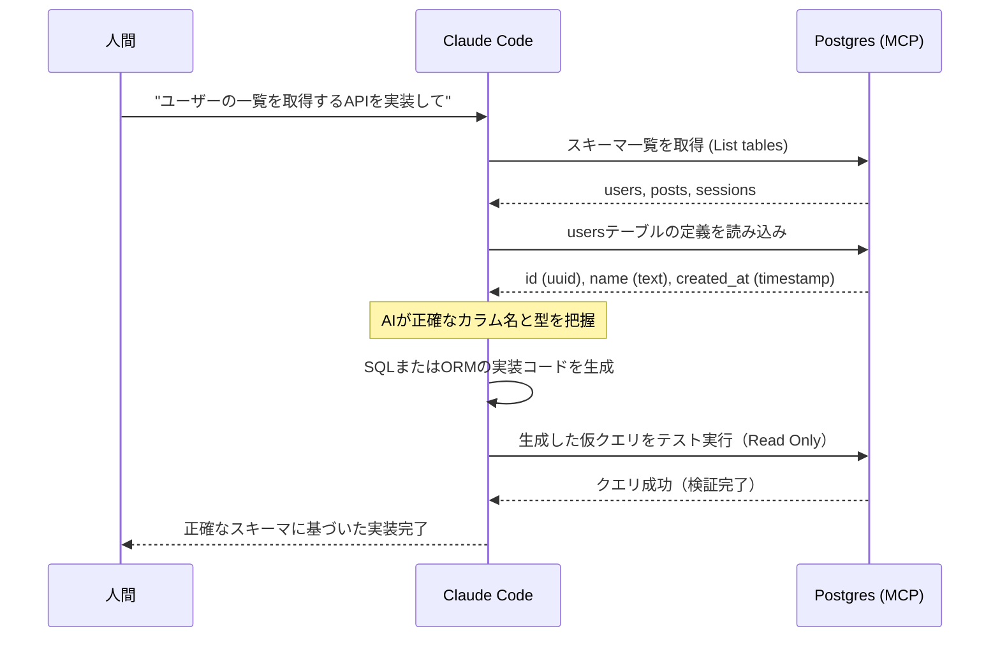

> **ポイント**：実行環境のDB（テスト用・ローカル開発用）にのみMCP接続権限を与えることで、セキュアに「生きたスキーマ」をAIに共有できます。

### 4.9 Apidog MCP × Claude Code で仕様-実装ギャップを埋める

1.7 では Apidog を「仕様作成の SSoT」として導入した。実装フェーズでは、同じ Apidog MCP を Claude Code から参照することで、**既存コードと最新仕様の差分検知 → 修正 PR 草案** までを一貫して自動化できる。仕様変更が発生しやすい並行開発で特に効果が高い。

#### 典型プロンプト

```text
Apidog MCP から `/users` エンドポイントの最新仕様を取得し、
@src/api/users/handler.ts の実装と比較してください。

出力:
1. 差分一覧（パラメータ・レスポンス型・ステータスコード・バリデーション）
2. 必要な修正箇所（ファイル:行）
3. 修正 PR 草案（コード diff 形式）

制約: 既存のユニットテストが落ちない範囲で最小変更に留めること。
```

#### GitHub Actions での継続的 API 品質モニタリング

プルリクエスト時に Apidog MCP 経由で仕様との差分を検査し、未同期ならコメントで警告する運用が有効（概要のみ）。

```yaml
# .github/workflows/api-spec-check.yml（擬似例）
# ※ 実際は CI スクリプトから MCP クライアント経由で Apidog から仕様を取得し、
#    既存ハンドラと比較するジョブを組む想定
- name: Check API spec drift (pseudo)
  run: node scripts/check-apidog-drift.js --project ${{ secrets.APIDOG_PROJECT_ID }}
```

> **注意**：認証付き API の差分検知では、Header / Cookie / 環境変数などの認証情報を MCP に直接渡さず、Apidog 側の「環境変数」機能に登録して参照させる。MCP の設定ファイル（`.claude/mcp.json`）にトークンを平文で書き込まない。

---

## 5. コードレビュー

### 5.1 AI + 人間のレビュー分担

| 担当           | 役割                                                               | ツール                    |
| -------------- | ------------------------------------------------------------------ | ------------------------- |
| GitHub Copilot | バグ・コーディング規約・パフォーマンス・セキュリティの自動チェック | PR Reviewer               |
| Claude Code    | 仕様書との整合性・設計方針のブレ・全体アーキテクチャ整合性         | Claude Code（GitHub MCP経由でPR参照） |
| 人間           | 最終判断・ビジネスロジックの正確性・リリース可否                   | 必須                      |

### 5.2 Copilot PR レビューの設定

**設定方法：**

1. リポジトリの Settings → Copilot → Code Review で「Copilot code review」を有効化
2. PRの Reviewers に `copilot` を追加（手動、または下記のActionsで自動化）

```yaml
# .github/workflows/copilot-review.yml
name: Auto-assign Copilot Review
on:
  pull_request:
    types: [opened, ready_for_review]
jobs:
  assign-reviewer:
    runs-on: ubuntu-latest
    steps:
      - uses: actions/github-script@v7
        with:
          script: |
            await github.rest.pulls.requestReviewers({
              owner: context.repo.owner,
              repo: context.repo.repo,
              pull_number: context.issue.number,
              reviewers: ['copilot']  // Copilotを自動アサイン
            });
```

- カスタムインストラクション（`.github/copilot-review-instructions.md`）で重点チェック項目を指定可能
- CodeQLと組み合わせてセキュリティ脆弱性を自動検出（SQL injection, XSS等）

### 5.3 Claudeによる設計レビュープロンプト

```text
あなたはシニアソフトウェアアーキテクトです。@SPEC.md の仕様書と @ARCHITECTURE.md のアーキテクチャを踏まえて、この PR（プルリクエスト）をレビューしてください。

以下の点を確認してください：
1. 実装は仕様と一致しているか？
2. アーキテクチャ上の矛盾や一貫性の欠如はないか？
3. セキュリティ：インジェクションのリスク、認証の欠陥、機密情報の露出、安全でないデータ処理がないか？
4. テストでカバーされていないエッジケースはないか？
5. パフォーマンスのボトルネックになる部分はないか？

比較のために、@src/middleware/ の既存の実装パターンを参照してください。
```

### 5.4 セキュアコードレビューのプロンプトライブラリ

```text
# インジェクション脆弱性チェック
@file.ts のインジェクション脆弱性（SQLインジェクション、XSS、コマンドインジェクション、パストラバーサル）をレビューしてください。具体的な行番号と修正案を提示してください。

# 認証・認可チェック
@src/auth/ の認証フローをレビューしてください。以下の点を確認してください：
- 安全でないセッション管理
- 認可（権限）チェックの漏れ
- JWTの脆弱性
- 権限昇格のリスク

# シークレット露出チェック
@./src 内にハードコードされたシークレット、APIキー、パスワード、または認証情報（クレデンシャル）がないかスキャンしてください。
また、機密データを誤ってログ出力してしまうようなパターンがないかも確認してください。
```

### 5.5 ペルソナ並列レビューと自動改善ループ

単一の AI レビューでは観点が偏るため、**役割の異なる複数ペルソナを並列で走らせる** 構成が高い検出精度をもたらす。実運用では「却下理由が無ければ Approve」という明確な原則と、過去の見逃しから自動でルールを更新する夜間ループを組み合わせる。

> **「却下理由なければ Approve」導入の前提条件チェックリスト**
> この原則を採用する前に、以下がすべて整っていることを確認すること：
> - [ ] E2E テストカバレッジが主要フロー全体に整備されている
> - [ ] 即時ロールバック手順が文書化・テスト済みである
> - [ ] カナリアデプロイまたはフィーチャーフラグによる段階的リリースが可能
> - [ ] 本番モニタリング・アラートが設定済みである
>
> 上記を満たさない場合は **AIレビュー + 人間1名以上の Approve** をデフォルトとすること。

#### 3ペルソナ並列レビューの例

| ペルソナ                  | レビュー観点                                       |
| ------------------------- | -------------------------------------------------- |
| **Language Engineer**     | 言語固有のイディオム・並行性・パフォーマンス       |
| **Software Architect**    | 設計の一貫性・モジュール境界・依存方向             |
| **Cloud / Infra Expert**  | クラウドリソースの設定・コスト・セキュリティ境界   |

各ペルソナを独立した Claude/Copilot セッションとして PR に並列適用し、コメントを集約する。

#### 夜間自動改善ループ

| ステージ     | 役割                                                       |
| ------------ | ---------------------------------------------------------- |
| **計測**     | 過去 PR でのレビュー見逃し（後続コミットでの修正）を抽出   |
| **発見**     | 共通する見逃しパターンを LLM で抽象化                      |
| **改善**     | 新しいレビュールールを生成                                 |
| **統合**     | 既存ルールセットへマージ（重複は効果スコアでマージ）       |
| **監査**     | 生成ルールを人間が週次レビューし、不要分を削除             |

> **ポイント**：「却下理由が無ければ Approve」原則は **E2E テスト基盤と即時ロールバック体制が前提**。ロールバック手段が無いまま自動マージを許すと、AI レビューの偽陰性が即座に本番障害に直結する。

---

## 6. テスト

### 6.1 AIテスト生成ツールの比較

| フレームワーク | 用途                                       | AI活用方法                                         |
| -------------- | ------------------------------------------ | -------------------------------------------------- |
| **Vitest**     | ユニット・コンポーネントテスト（Vite環境） | AIによるテストケース生成。高速フィードバックループ |
| **Jest**       | ユニット・統合テスト（Webpack環境）        | 既存プロジェクトの継続利用。63%採用率（2024年調査・目安） |
| **Playwright** | E2Eテスト・ブラウザ自動化                  | Playwright Agents（v1.56〜）でAIが自律テスト       |
| **Cypress**    | E2Eテスト                                  | コンポーネントテストも可能                         |

**2026年時点のフレームワーク選択推奨**：

- 新規プロジェクト（Vite環境）→ Vitest + Playwright
- 既存プロジェクト（Webpack環境）→ Jest + Playwright
- コンポーネントテスト → Vitest（Vite） or Storybook

### 6.2 Playwright Agents（v1.56〜）

2025年10月リリース。3つのコアエージェント：

| エージェント  | 役割                                       |
| ------------- | ------------------------------------------ |
| **Planner**   | アプリを探索し、テスト計画をMarkdownで出力 |
| **Generator** | テスト計画から実行可能なコードを生成       |
| **Healer**    | テスト失敗時に自動修正                     |

**利用例**：

```typescript
// playwright.config.ts
import { defineConfig } from "@playwright/test";
export default defineConfig({
  use: {
    // Enable AI-powered healing
    agents: { heal: true },
  },
});
```

```bash
# AI Planning: アプリを探索してテスト計画を生成
npx playwright agent plan --url http://localhost:3000

# AI Generation: テスト計画からコードを生成
npx playwright agent generate --plan test-plan.md
```

### 6.3 AI × テストピラミッド

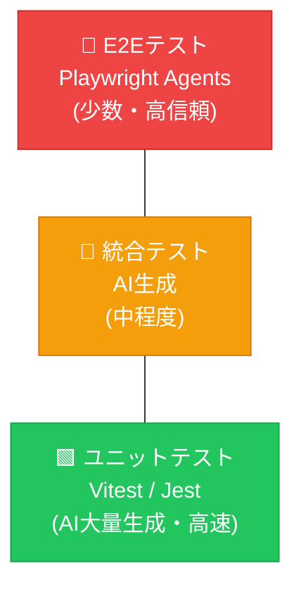

> ピラミッドの下層ほどAI生成の比率を高めるのが基本戦略。上層（E2E）は数を絞り、重要な業務フローのみをカバーする。

**AIユニットテスト生成プロンプト**

```text
Vitestを使用して、@./src/utils/validation.ts の網羅的なユニットテストを作成してください。

要件（Requirements）:
- exportされているすべての関数をカバーすること
- 正常系（ハッピーパス）、エッジケース、エラーシナリオを含めること
- 次のパターンに従った説明的なテスト名を使用すること：「[condition] の場合、[behavior] であるべき（should [behavior] when [condition]）」
- 必要な場合を除き、Mock（モック）は絶対に使用しないこと
- 90%以上のカバレッジを目指すこと
```

**AIで統合テストを生成するプロンプト**

```text
ユーザー認証フローの統合テストを作成してください。
関連ファイル：@src/api/auth.ts, @src/middleware/session.ts, @src/db/users.ts

テストシナリオ：
1. 有効な認証情報を使用したログイン成功
2. 無効なパスワードでのログイン失敗（5回失敗後のレート制限処理の確認）
3. トークン更新（リフレッシュ）フロー
4. ログアウト処理およびセッションの無効化

HTTPテスト用として Vitest と supertest を使用してください。
```

### 6.4 CIへの組み込み

```yaml
# .github/workflows/test.yml
name: Tests
on: [push, pull_request]
jobs:
  test:
    steps:
      - run: npm run test:unit # Vitest（高速）
      - run: npm run test:e2e # Playwright（並列実行）
      - run: npm run test:coverage # カバレッジレポート
```

> **「実装→テスト→修正」を最小単位で繰り返すことでAIの連鎖バグを防ぐ**

### 6.5 AIテスト負債の管理

AIは大量のテストを高速に生成できるが、仕様変更時に「大量のテストが落ちて保守が追いつかない」問題（AIテスト負債）が発生しやすい。

**アンチパターン：個別修正をやめる**

テストが大量に落ちたとき、個別に修正するのではなく、AIに仕様変更を伝えてテストスイート全体をリファクタリングさせる：

```text
仕様が変更されました。@SPEC.md の変更内容を確認し、
@tests/ 配下のテストスイート全体を新仕様に合わせてリファクタリングしてください。

重要な制約：
- 既存のテストシナリオ（Given/When/Thenの条件）は絶対に維持すること
- 実装の詳細（セレクタやMockの書き方など）のみを新仕様に合わせて修正
- テストを削除する場合は、削除理由をコメントで明記すること
- 新要件のテストは追加してください
- 全テストがパスすることを確認してください
```

> **注意**：「不要になったテストを削除」とだけ指示すると、AIが重要なエッジケースのテストを勝手に削除するリスク（サイレントなカバレッジ低下）がある。「シナリオは維持、実装詳細のみ修正」という強い制約を必ず含める

**予防策：テスト設計の原則**

| 原則                                           | 理由                                                   |
| ---------------------------------------------- | ------------------------------------------------------ |
| テストは「動作」を検証し、「実装」を検証しない | 実装詳細に依存するテストはリファクタのたびに壊れる     |
| Mockは最小限に押さえる                         | 過度なMockはテストを脆弱にし、保守コストを上げる       |
| AI生成テストもレビューする                     | 不要なテストや重複テストを剥ぎ落とす                   |
| カバレッジより意味のあるテストを優先           | 100%カバレッジより、重要なビジネスロジックの検証を重視 |

### 6.6 AIビジュアルリグレッションテスト（VRT）

コンポーネントを高速に自動生成・修正するAIワークフローでは、「意図したデザイン変更」と「予期せぬレイアウト崩れ」の切り分けが課題になる。AIベースのVRTツールは、ピクセル完全一致ではなく文脈で判断する。

| ツール                   | 特徴                                                         |
| ------------------------ | ------------------------------------------------------------ |
| **Applitools Eyes**      | AIが「意図した変更」と「バグ」を自動判別。クロスブラウザ対応 |
| **Chromatic**            | Storybook連携。コンポーネント単位のビジュアル変更検知        |
| **Percy (BrowserStack)** | Playwright/Cypressと統合。スナップショットベース             |

> **ポイント**：AIがUIを生成する時代だからこそ、AIがUIの品質を検証するプロセスが必要。Playwright E2E + VRTの組み合わせが理想

### 6.7 Figma MCP × Playwright MCP の視覚一致検証ループ

生成コードとデザインの視覚的ズレを、AI エージェントだけで検出・修正するループ。従来の VRT（6.6）がピクセル差分を「検出」する役割なら、このループは Figma の設計意図と照合して **「修正まで自動化」** する点が新しい。

```mermaid
flowchart LR
    Figma["Figma MCP<br/>デザイン取得"] --> Gen["Claude Code<br/>コンポーネント生成"]
    Gen --> PW["Playwright MCP<br/>スクリーンショット"]
    PW --> Diff["差分判定<br/>（Figma ↔ 実装）"]
    Diff -->|差分あり| Fix["Claude Code<br/>自動修正"]
    Fix --> PW
    Diff -->|許容範囲| Done["PR 作成"]
```

**典型プロンプト：**

```text
Figma MCP から nodeId=xxx のデザインを取得し、
Playwright MCP で @src/components/Card.tsx を localhost:3000 でレンダリングしたスクリーンショットを撮影してください。

両者の差分（余白・色・タイポグラフィ）を列挙し、
デザイン側を正として実装を修正してください。差分がしきい値以下になるまでループしてください。
```

> **注意**：WSL2 や CI コンテナ環境では、Chromium の起動が不安定になりスクショが欠損することがある。Playwright MCP 起動前に `npx playwright install --with-deps` でブラウザ依存を確実にインストールし、失敗時はリトライ回数を上限付きで設定する。

---

## 7. CI/CD・運用・高度化パターン

> 本章ではCI/CDの自動化から、コスト最適化（FinOps）・RAGによるナレッジ管理・ChatOpsまで横断的に扱う。

### 7.1 AI駆動のCI/CDパイプライン

多くのDevOpsチームがCI/CDにAIを統合しつつあり（2024年調査で7割以上との報告もある）、AI駆動のパイプラインは急速に標準化が進んでいる。

**AI活用ポイント**

| フェーズ     | AI活用                         | ツール例                                  |
| ------------ | ------------------------------ | ----------------------------------------- |
| コミット前   | Secret scan, lint, type check  | GitHub Secret Scanning, Claude Code hooks |
| PR作成時     | 自動コードレビュー、テスト生成 | GitHub Copilot, CodeQL                    |
| ビルド時     | テスト自動生成・失敗分析       | Claude (`claude -p`), AI test healing     |
| デプロイ後   | 異常検知・予測的モニタリング   | AIOps, Datadog AI                         |
| インシデント | 自動根本原因分析・修正提案     | AWS DevOps Agent                          |

### 7.2 Self-Healing Pipeline パターン

```mermaid
flowchart LR
    Deploy["デプロイ"] --> Monitor["AI監視<br/>異常検知"]
    Monitor -->|"正常"| OK["通常運用"]
    Monitor -->|"異常検知"| Analyze["AI根本原因分析"]
    Analyze --> Auto["自動修正<br/>（軽微な問題）"]
    Analyze --> Alert["人間へアラート<br/>（重大問題）"]
    Auto --> Verify["検証"]
    Verify -->|"成功"| Deploy
    Verify -->|"失敗"| Alert
```

### 7.3 インシデント対応の自動化

**AWSのDevOps Agent（2026年4月）**：

- モニタリング・アラート・デプロイツールと統合
- インシデント発生時にタイムライン・根本原因・推奨修正を自動生成
- オンコール対応の時間を大幅削減

**Claude Code を CI/CD に組み込む**

```bash
# PRごとにAIレビューを自動実行
claude -p "Review changes in this PR for security vulnerabilities and spec compliance.
          Reference @SPEC.md and @SECURITY.md" \
  --output-format json \
  --allowedTools "Read,Grep,Glob"

# ビルド失敗時の自動分析
claude -p "Build failed with: $(cat build-error.log). Analyze and suggest fix." \
  --output-format stream-json
```

### 7.4 AIOps：AIによる運用監視

- **予測的モニタリング**：ログ・メトリクス・ユーザー行動をリアルタイム分析、障害を事前予測
- **アラート疲労の削減**：AIが低信頼度のアラートを自動フィルタリング
- **分散トレーシング**：複雑なマイクロサービス間の障害伝播を自動追跡

### 7.5 LLM FinOpsとコスト最適化（プロンプトキャッシュ等）

AIエージェントを活用した開発において、API利用コストの最適化（LLM FinOps）は運用上の重要課題です。とりわけ、長大なCLAUDE.mdや巨大なシステム仕様書を毎セッション読み込ませるとトークン消費量が爆発します。

**プロンプトキャッシュを前提とした配置戦略**
コスト最適化の最大の鍵は、API側の**「プロンプトキャッシュ機能（Anthropic Prompt Caching等）」**を意識した運用です。

- **長大なプロンプト（静的コンテキスト）の固定化**: 頻繁に変更されない「システム全体仕様」や「ルールファイル」は先頭に配置（またはキャッシュ指定対象とする）し再利用することで、2回目以降の読み込みコストを最大90%削減できます。
- **ファイルの明確な分割**: 「毎回の対話で更新・送信する動的な情報」と「システム共通の静的な情報」をあらかじめディレクトリレベルで分割し、API側のキャッシュ機構が効率良く働くように設計することを推奨します（SHOULD）。

### 7.6 RAG / ナレッジベース活用

社内ドキュメント・API仕様・過去のインシデント対応などをAIに参照させることで、ハルシネーションを抑え、自社のコンテキストに即した回答を得る。

#### 7.6.1 RAGのAI開発での活用パターン

| 活用パターン             | 組み込むデータ                       | 効果                                       |
| ------------------------ | ------------------------------------ | ------------------------------------------ |
| **社内ドキュメント検索** | Confluence・Notion・社内Wikiのページ | 新人のオンボーディング、手順書参照の自動化 |
| **コードベース理解**     | リポジトリのコード・PR・Issue履歴    | 既存パターンに沿ったコード生成             |
| **API仕様参照**          | OpenAPI / Apidogの仕様書             | 仕様に即した実装・テスト生成               |
| **インシデント対応**     | 過去の障害報告書・ポストモーテム     | 類似障害の迅速解決                         |
| **カスタマーサポート**   | FAQ・チケット履歴                    | 回答精度向上・CS対応の自動化               |

#### 7.6.2 RAGアーキテクチャ

```mermaid
flowchart LR
    Docs["データソース<br/>Confluence / Notion<br/>コード / API仕様"] --> Embed["エンベディング生成<br/>OpenAI Embeddings<br/>Cohere / Titan"]
    Embed --> VDB["Vector DB<br/>Pinecone / pgvector<br/>Qdrant / Weaviate"]

    User["ユーザー質問"] --> Search["セマンティック検索<br/>関連ドキュメント取得"]
    VDB --> Search
    Search --> LLM2["LLM<br/>検索結果 + 質問で<br/>回答生成"]
    LLM2 --> Ans["回答<br/>出典付き"]
```

#### 7.6.3 AI開発での実装方法

| 方法                   | ツール                                           | 特徴                                                        |
| ---------------------- | ------------------------------------------------ | ----------------------------------------------------------- |
| **MCPサーバー経由**    | Notion MCP / Confluence MCP / Postgres MCP       | Claude Codeが直接ドキュメントを参照。セットアップが最も簡単 |
| **フレームワーク**     | LangChain / LlamaIndex                           | インデックス構築・検索・生成のパイプラインを提供            |
| **ベクトルDB**         | Pinecone / pgvector / Qdrant / Weaviate          | エンベディングの保存・検索                                  |
| **クラウドネイティブ** | Amazon Bedrock Knowledge Bases / Azure AI Search | マネージドサービスでインフラ管理不要                        |

#### 7.6.4 RAG品質改善のベストプラクティス

| 課題             | 対策                                                                                        |
| ---------------- | ------------------------------------------------------------------------------------------- |
| 検索精度が低い   | チャンクサイズの調整（500-1000トークン推奨）、ハイブリッド検索（キーワード+セマンティック） |
| 古い情報が返る   | データソースの定期同期パイプラインを構築（CI/CDに組み込み）                                 |
| ハルシネーション | 検索結果が0件の場合は「該当情報なし」と回答させるガードレール                               |
| 機密情報の漏洩   | アクセス制御（ロールベース）でユーザー権限に応じた検索結果を返す                            |
| コストが高い     | エンベディング生成はバッチで計算。キャッシュレイヤーを導入                                  |

#### 7.6.5 RAG導入の最大の壁：アクセス権限（パーミッション）管理

RAGを社内で本格展開する際、技術的な精度以上に障壁となるのが**「社内ドキュメントの権限管理」**です。

- ベクトルDBに全社データを安易に統合すると、AIへの自然言語による質問を通じ、**権限のないメンバーが「他人の評価情報」「未公開のプロジェクト情報」「役員会議事録」などを引き出せてしまう危険性**があります。
- これを防ぐため、ベクトルDBへのメタデータ付与と連携ツール側でのアクセストークン検証を徹底し、「そのユーザーが閲覧権限を持つドキュメントからのみ回答を生成する（Filter by Permissions）」アクセス制御機構を構築することが重要です（MUST）。

#### GraphRAG：コードベース理解の発展形

ソースコードは「関数Aが関数Bを呼び、それがDBにアクセスする」といった複雑な依存関係（グラフ構造）を持つ。単純なベクトル検索（チャンク分割）ではこの関係性が途切れてしまうため、ナレッジグラフとLLMを組み合わせた **GraphRAG** がコード理解のベストプラクティスとなりつつある。

- 関数・クラス・モジュール間の呼び出し関係をグラフで表現
- 「この関数を変更したら影響はどこか？」といった質問に高精度で回答可能
- 大規模コードベースでのリファクタリング影響分析に有効

#### 7.6.6 導入チェックリスト

```markdown
## データ準備

- [ ] 組み込むドキュメントソースを決定（Confluence / Notion / Wiki / コード）
- [ ] チャンキング戦略を設計（ドキュメント種別ごとに最適化）
- [ ] 機密情報の分類とアクセス制御を設計

## インフラ構築

- [ ] ベクトルDBを選定・構築
- [ ] エンベディングモデルを選定
- [ ] インデックス構築パイプラインを作成

## 品質担保

- [ ] 検索精度の評価指標を定義（Hit Rate / MRR）
- [ ] 定期同期パイプラインをCI/CDに組み込み
- [ ] ハルシネーションガードレールを設定
```

> **ポイント**：RAGは「AIのハルシネーション→自社のナレッジに基づく正確な回答」に変える最も実用的な手法。まずはMCPサーバー経由で既存ドキュメントをAIに読ませることから始める

### 7.7 モニタリング・インシデント対応 MCP連携（Datadog）

本番稼働中のサービスで障害が発生した際、AIエージェントに初期調査や根本原因の特定を委ねる（AIOps）ワークフローです。エラー発生時の通知を受け取った開発者が、そのままAIに解決への調査を任せます。

**シーケンス図：インシデント対応ワークフロー**
```mermaid
sequenceDiagram
    participant 人間
    participant CC as Claude Code
    participant Datadog as Datadog (MCP)
    participant Code as コードベース
    
    人間->>CC: "Datadogの最新のCriticalエラーを調査して"
    CC->>Datadog: 最近のエラーログとスタックトレースを取得
    Datadog-->>CC: "NullReferenceException in paymentFlow.ts line 42"
    CC->>Code: paymentFlow.ts の該当行を読み込み
    CC->>Datadog: エラー発生時刻前後の関連APIメトリクスを取得
    Datadog-->>CC: 関連する他サービスAPIからの500エラー急増を確認
    Note over CC: エラー内容、メトリクス、コードを総合して分析
    CC->>Code: 根本原因の修正コードを提案・パッチ作成
    CC-->>人間: "原因は外部APIのタイムアウト処理漏れです。修正パッチを作成しました"
```

> **ポイント**：この連携を導入することで、システムの不具合発生時に開発者が複数のダッシュボード（Datadog、ソースコード）を行き来する「コンテキストスイッチ」がなくなり、原因究明までの時間（MTTR）が劇的に短縮されます。

### 7.8 ChatOpsと人間参加型（Human-in-the-Loop）インシデント対応

「7.7 モニタリング連携」の発展形として、Slackのようなコミュニケーションツールを「AIへの依頼窓口」と「過去議論のデータベース」として活用する構成です。アラートの検知から承認までがチャットツール上で完結します。

**シーケンス図：Slack連携フロー（ChatOps）**
```mermaid
sequenceDiagram
    participant Datadog as Datadog
    participant Slack as Slack (連携先/MCP)
    participant CC as AIエージェント
    participant 人間
    
    Datadog->>Slack: "Critical: NullReferenceException" 発生通知
    Slack->>人間: アラートを受信
    人間->>Slack: (メンション) "@AI-Agent このエラーの原因を調査して"
    Note over CC: AIが直接エラー内容を把握して調査開始
    CC->>Datadog: 詳細情報と関連メトリクスを取得 (MCP)
    CC->>Slack: (検索) 過去の類似エラー対応履歴を検索 (MCP)
    CC->>CC: エラー分析とパッチの作成
    CC->>Slack: "原因は外部APIのタイムアウト処理漏れです。修正PRを作成しました。マージしますか？"
    人間->>Slack: "マージしてデプロイを実行してください" (承認)
    CC->>CC: PRのマージとデプロイパイプラインのトリガー
```

このアプローチでは、AIが自律的に裏で調査からパッチ作成までを行う一方で、最終的な意思決定（デプロイ承認など）は人間がSlack上の見慣れたUI（スレッドの返信やボタン）で行うという理想的な「Human-in-the-Loop」を実現できます。

---

## 8. プロンプトエンジニアリング

### 8.1 プロンプト設計の基本原則

**GOLDE 構造（推奨テンプレート）**（本資料で実践知を整理した構造化テンプレート。Goal/Output/Limits/Details/Examples の頭文字）

```text
GOAL: [具体的な達成目標]
OUTPUT: [出力形式・構造]
LIMITS: [制約・使ってはいけないもの]
DATA: [参照すべきファイル・コンテキスト]
EVALUATION: [成功基準・検証方法]
```

**高品質プロンプトの7原則**

| #   | 原則                     | 具体例                                                 |
| --- | ------------------------ | ------------------------------------------------------ |
| 1   | **具体例を先に**         | 抽象的な要件より前に入出力例を示す                     |
| 2   | **出力形式を明示**       | JSON schema / TypeScript interfaceで形式を指定         |
| 3   | **ネガティブ例を含める** | `Do NOT use X` で誤った方向性を排除                    |
| 4   | **既存パターンを参照**   | `@file` で既存コードのパターンを示す                   |
| 5   | **検証手段を含める**     | テストコマンド・成功基準を含める                       |
| 6   | **スコープを制限**       | 「このファイルのみ変更すること」で予期しない変更を防ぐ |
| 7   | **段階的に詳細化**       | 大きなタスクはChain of Thoughtで分解                   |

**メタプロンプティング：AI自身にプロンプトを最適化させる**

プロンプトをゼロから練るのではなく、AI自身に最適なプロンプトを作らせる手法：

```text
GOLDE構造に従って、以下のタスクを実行するための最適なプロンプトを作成してください。

タスク: [やりたいことの概要]
コンテキスト: [技術スタック・制約など]

プロンプトには以下を含めてください：
- 具体的な入出力例
- 制約とネガティブ例
- 検証手段
```

このメタプロンプティングにより、経験が浅いメンバーでも高品質なプロンプトを即座に作成できる。

### 8.2 プロンプトチートシート

各フェーズの詳細はセクション1～6を参照。ここでは各フェーズで最も使用頻度が高いプロンプトのみを記載。

> **プロンプトの言語について**：以下は英語で記載しているが、日本語でも同等の効果が得られる。各セクション（参照列）には日本語版プロンプト例も併記しているので、チームの言語方針に合わせて参照のこと。チーム標準プロンプトの言語を統一すると、ナレッジ共有がスムーズになる。

| フェーズ   | プロンプト                                                                                       | 参照セクション |
| ---------- | ------------------------------------------------------------------------------------------------ | -------------- |
| 要件定義   | `Interview me about [feature]. Ask about edge cases, constraints, and tradeoffs. Write SPEC.md.` | 1.3            |
| 設計       | `Review this architecture for scalability bottlenecks, security, and over-engineering risks.`    | 2.1            |
| 実装       | `Implement [feature] in @[file]. Follow patterns in @[example]. Run tests after implementing.`   | 4.1            |
| テスト     | `Write failing tests for [feature], then implement to make them pass.`                           | 4.6, 6.3       |
| レビュー   | `Review this PR against @SPEC.md. Check for security, performance, and spec compliance.`         | 5.3            |
| リファクタ | `Refactor @[file] to improve [concern]. Preserve all behavior - run tests before and after.`     | 4.1            |

### 8.3 プロンプトバージョン管理

プロンプトもコードと同様にGitでバージョン管理する：

```text
.claude/
  commands/        # カスタムスラッシュコマンド
    review.md      # レビュープロンプト
    test-gen.md    # テスト生成プロンプト
    spec.md        # 仕様書生成プロンプト
  skills/          # 再利用可能な専門知識
  prompts/         # その他の共有プロンプト
```

効果が高かったプロンプトは `.claude/commands/` に格上げし、チーム全体で共有・標準化する。

### 8.4 MCP ツールの"減らす"最適化

MCP は便利だが、登録しすぎると **AI のツール選択ミスとコンテキスト膨張** によりむしろ精度が落ちる。「足す」より「減らす・遅延ロードする」設計が重要になる。

#### Skills（ナレッジ層）と MCP（通信層）の使い分け

| 層        | 役割                                   | 採用順序                           |
| --------- | -------------------------------------- | ---------------------------------- |
| **Skills**| 静的なナレッジ・定型手順を AI に注入   | まずここで解決できないか検討する   |
| **MCP**   | 外部システムへの通信・状態取得         | Skills で済まないときだけ追加する  |

Skills はコンテキスト消費が小さく、更新も git 管理できる。外部 API への通信が本当に必要な場面だけ MCP を足す、という順序が現実的。

#### コンテキスト消費を抑える設計原則

| 原則                                         | 具体策                                                   |
| -------------------------------------------- | -------------------------------------------------------- |
| **1呼び出しで必要情報を返しきる**            | 複数ツール往復を避け、集約エンドポイントを MCP 側に用意  |
| **遅延ロード（Modular MCP）**                | 起動時は最小限、タスクに応じてツール群を動的有効化       |
| **Intent 検索・信頼スコアで選別**            | 類似機能の MCP が複数ある場合、成功率の高いものを優先    |
| **不要になった MCP は即削除**                | `.claude/mcp.json` を定期的に棚卸しする                  |

> **ポイント**：「多いほど賢くなる」は誤解。Claude Code では登録 MCP が増えるほどツール説明だけでコンテキストを数%〜十数%程度消費するため、使わない MCP は削ることが精度向上の近道。

---

## 9. セキュリティ

### 9.1 AI生成コードの既知リスク

**研究調査（2024-2025年）の主な知見**

- GitHub Copilot生成コードの **29.5%（Python）/ 24.2%（JavaScript）** にセキュリティ上の弱点
- Copilotアクティブなリポジトリの **6.4%** でシークレット漏洩（全リポジトリ平均4.6%の1.4倍）
- Copilotを使った開発者は使わない開発者より脆弱なコードを書く傾向があり、かつ **自信を持って提出** していた
- 「Hallucination Squatting（ハルシネーション乗っ取り）」：AIが存在しないパッケージを提案→攻撃者がそのパッケージを実際に登録してマルウェアを配布

### 9.2 OWASP Top 10 for LLMs 2025

| #     | リスク                         | 説明                                       | 主な対策                                             |
| ----- | ------------------------------ | ------------------------------------------ | ---------------------------------------------------- |
| LLM01 | **プロンプトインジェクション** | 入力を通じてLLMの指示を書き換える          | 入力サニタイズ、サンドボックス化、多層バリデーション |
| LLM02 | **機密情報の漏洩**             | 訓練データや設定情報の意図しない露出       | データ最小化、アクセス制御、出力監視                 |
| LLM03 | **サプライチェーンリスク**     | 悪意のある依存関係・モデルの汚染           | 依存関係のベット、出所確認、SBOMワークフロー         |
| LLM04 | **データ・モデルポイズニング** | 訓練・ファインチューニングデータへの改ざん | 出所確認、異常検知、継続的評価                       |
| LLM05 | **不適切な出力処理**           | LLM出力を検証なしで下流システムに渡す      | 出力バリデーション、実行サンドボックス               |
| LLM06 | **過剰なエージェンシー**       | LLMへの過度な権限付与                      | 最小権限の原則、使用量監視、ガードレール             |
| LLM07 | **システムプロンプト漏洩**     | 隠し指示・システムプロンプトの露出         | プロンプトのマスキング、出力監視                     |
| LLM08 | **ベクター・埋め込みの脆弱性** | RAGシステムへの悪意ある埋め込み注入        | 埋め込み検証、入力サニタイズ                         |
| LLM09 | **誤情報**                     | 虚偽・誤解を招くコンテンツの生成           | 人間レビュー、ファクトチェック                       |
| LLM10 | **無制限の消費**               | リソース枯渇・コストの急増                 | レートリミット、自動スケーリング保護、コスト監視     |

### 9.3 AIコード開発のセキュリティ対策チェックリスト

**開発フェーズ別セキュリティ対策**

```markdown
## 実装フェーズ

- [ ] AI生成コードを「信頼できないコード」として扱い、必ずレビューする
- [ ] シークレット・APIキーがコードに含まれていないか確認
- [ ] AIが提案したパッケージを npm audit / pip audit で検証
- [ ] AIが提案した依存関係のGitHubリポジトリを確認（スター数・更新日・オーナー）
- [ ] 新規 MCP サーバー追加時は出所・権限・メンテナを確認しレビューする
- [ ] `.claude/mcp.json` の変更は PR で承認必須
- [ ] MCP に渡すシークレットは環境変数経由のみ（平文記載なし）

## レビューフェーズ

- [ ] SAST（Static Application Security Testing）ツールを実行
- [ ] 依存関係スキャン（Snyk / Dependabot）
- [ ] シークレット検出（GitHub Secret Scanning）
- [ ] セキュリティ重点プロンプトでAIレビューを実施

## CI/CDフェーズ

- [ ] Secret Scanning をGitHub Actions に組み込む
- [ ] CodeQL を PRに自動実行
- [ ] Copilot Autofix を有効化（自動脆弱性修正提案）
- [ ] SBOM（Software Bill of Materials）を自動生成
```

**Hooks を使ったシークレット漏洩の自動ブロック**

```json
{
  "hooks": {
    "PreToolUse": [
      {
        "matcher": "Write|Edit",
        "hooks": [
          {
            "type": "command",
            "command": "git diff HEAD | grep -iE '(api_key|secret|password|token)\\s*=\\s*[\"\\x27][^\"\\x27]{8,}' && echo 'POTENTIAL SECRET DETECTED' && exit 1 || exit 0"
          }
        ]
      }
    ]
  }
}
```

### 9.4 「Vibe Coding」リスクの管理

OWASPが「Inappropriate Trust in AI Generated Code」として特定した問題：

- AIが生成したコードをレビューせずにそのままShipする行為
- 対策：全てのAI生成コードにPR必須 + AIレビュー + 人間の最終確認

### 9.5 ローカルLLM / SLM（小規模言語モデル）の選択肢

機密性が極めて高いプロジェクトでは、外部APIにコードを送信できない場合がある。そのフォールバックとしてローカルLLMの選択肢がある。

| ツール                | 連携方法                               | 特徴                                 |
| --------------------- | -------------------------------------- | ------------------------------------ |
| **Ollama** + Continue | VS Code拡張としてローカルLLMを利用     | 完全オフライン。データが外部に出ない |
| **Ollama** + Cursor   | CursorのOpenAI互換エンドポイントで接続 | ローカルでもCursorのUI/UXを活用      |
| **LM Studio**         | OpenAI互換 APIをローカルで提供         | GUIでモデル管理。チーム内共有も可能  |

**推奨モデル**：

- コード生成：DeepSeek Coder V3、Qwen 2.5 Coder 32B、CodeLlama 70B
- 汎用：Llama 3.3、Gemma 2、Phi-4

> **注意**：ローカルLLMはクラウドAPIと比べて精度が劣るため、「セキュリティ要件で外部APIが使えない場合のフォールバック」として位置づける。機密情報を含まないタスクにはクラウドAPIを使い、機密タスクのみローカルLLMに回す「ハイブリッド運用」が現実的

### 9.6 AIゲートウェイによるLLM APIセキュリティ対策

AIゲートウェイは、アプリケーションからLLMへプロンプトを送信する前に配置する **ミドルウェア**。機密情報のマスキング、プロンプトフィルタ、共通ログ・監査、コスト管理を一元的に担う。アプリから直接LLMプロバイダーを呼ぶ「シャドーAI」を防ぎ、企業コンプライアンスを満たすための中核インフラ。

#### 適用範囲（重要）

AIゲートウェイが保護できるのは「自社からLLM APIを呼ぶ経路」のみ。外部SaaSが内部でLLMを呼ぶフローには介入できない。

| フェーズ       | ツール例                | ゲートウェイ適用 | 理由                                                   |
| -------------- | ----------------------- | ---------------- | ------------------------------------------------------ |
| 仕様整理・設計 | Claude（API経由）       | **○ 適用可**     | 自社からClaude APIを呼ぶ場合はゲートウェイ経由にできる |
| 実装           | 自社アプリのLLM呼び出し | **○ 適用可**     | 最も重要な保護対象。本番環境のプロンプトを全てフィルタ |
| 実装           | Cursor / GitHub Copilot | **× 適用不可**   | SaaS側がモデルを呼ぶため介入不可                       |
| 実装           | Claude Code（API経由）  | **○ 適用可**     | プロキシ設定でゲートウェイ経由にルーティング可能       |
| テスト         | Playwright / AIテスト   | **△ 部分的**     | テスト内でLLM APIを呼ぶ場合のみ適用                    |

> **まとめ**：ゲートウェイの主戦場は「**実装フェーズ（自社アプリ→LLM）**」と「**Claude/AIのAPI利用（プロキシ経由）**」。GitHub Copilot等の外部SaaSツールにはそれぞれのサービス側のセキュリティ機能に依存する。

#### 外部SaaSのエンタープライズ契約による保護

ゲートウェイが使えない外部SaaSに対しては、SaaS側のエンタープライズ契約とポリシー制御でカバーする：

| SaaS                      | エンタープライズ機能                            | 確認ポイント                                 |
| ------------------------- | ----------------------------------------------- | -------------------------------------------- |
| GitHub Copilot Enterprise | Zero Data Retention（学習データのオプトアウト） | 契約で「コードが学習に使われない」ことを担保 |
| Cursor Business           | プライバシーモード・ SOC 2認証                  | コードがモデル学習に使用されない設定         |

> **運用指針**：ゲートウェイで介入できない領域は、SaaS側のエンタープライズ契約とポリシー制御でカバーする「ハイブリッドセキュリティ」を採用する

#### AIゲートウェイの役割

```mermaid
flowchart LR
    App["アプリ / エージェント"] --> GW["AIゲートウェイ<br/>（ミドルウェア）"]

    subgraph gw_func["ゲートウェイが行うこと"]
        PII["① PIIマスキング<br/>機密情報を自動匿名化"]
        Filter["② プロンプトフィルタ<br/>インジェクション防御<br/>ポリシー違反ブロック"]
        Log["③ 共通ログ & 監査<br/>全リクエスト記録<br/>誰が何を聞いたか追跡"]
        Cost["④ コスト管理<br/>トークン上限設定<br/>チーム別予算管理"]
        Route["⑤ インテリジェント<br/>ルーティング<br/>最適モデル自動選択"]
        Cache["⑥ セマンティック<br/>キャッシュ<br/>類似プロンプトの結果再利用"]
    end

    subgraph backends["バックエンドLLM"]
        GPT["OpenAI<br/>GPT-4o"]
        Claude2["Anthropic<br/>Claude"]
        Bedrock2["AWS<br/>Bedrock"]
        AOAI["Azure<br/>OpenAI"]
    end

    GW --> gw_func
    gw_func --> backends
```

#### 主要機能

| 機能                             | 説明                                                                               | なぜ必要か                            |
| -------------------------------- | ---------------------------------------------------------------------------------- | ------------------------------------- |
| **PIIマスキング**                | プロンプト内の個人情報・機密データをLLM送信前に自動検出・匿名化                    | 情報漏洩防止、GDPR/個人情報保護法対応 |
| **プロンプトフィルタ**           | プロンプトインジェクション防御、企業ポリシー違反や有害コンテンツをブロック         | OWASP LLM01対策、ブランド保護         |
| **共通ログ & 監査**              | 全リクエスト/レスポンスを記録。誰が・いつ・何を聞いたか追跡可能                    | コンプライアンス、インシデント対応    |
| **コスト管理**                   | チーム別・プロジェクト別にトークン上限を設定。超過時に自動スロットリングやアラート | コスト爆発防止、FinOps                |
| **インテリジェントルーティング** | 目的・コストに応じて最適なモデル（GPT-4o, Claude, Gemini等）へ自動振り分け         | マルチプロバイダー戦略                |
| **セマンティックキャッシュ**     | 過去の類似プロンプトの結果を再利用し、APIコールを削減                              | コスト削減、レイテンシ改善            |
| **ロードバランシング**           | 複数バックエンドへの負荷分散、サーキットブレーカー                                 | 可用性・耐障害性                      |

#### AIゲートウェイサービス比較

| サービス                   | 種別                | 特徴                                                                |
| -------------------------- | ------------------- | ------------------------------------------------------------------- |
| **AWS Bedrock Guardrails** | AWSネイティブ       | PII検出・コンテンツフィルター内蔵。Bedrock利用時は追加設定不要      |
| **Azure API Management**   | Azureネイティブ     | Azure AI Content Safety連携。トークンレート制限ポリシーが強力       |
| **Kong AI Gateway**        | OSS / Enterprise    | 既存APIゲートウェイのAIプラグイン。オンプレミス対応                 |
| **LiteLLM**                | OSS                 | OpenAI互換プロキシ。100+モデル対応。セルフホスト可                  |
| **Cloudflare AI Gateway**  | SaaS                | キャッシュ・レート制限・ログ。CDNエッジで低レイテンシ               |

**選定指針**：

- AWS中心 → **Bedrock Guardrails** + API Gateway + Lambda
- Azure中心 → **Azure API Management** AIゲートウェイ
- マルチクラウド・マルチモデル → **LiteLLM**
- オンプレミス必須 → **Kong AI Gateway** / **LiteLLM**

#### 導入チェックリスト

```markdown
## プロンプトセキュリティ

- [ ] PIIマスキングを有効化（個人情報・APIキー・社内機密情報）
- [ ] プロンプトインジェクション防御フィルターを設定
- [ ] 不適切コンテンツの自動ブロックルールを定義

## コスト管理

- [ ] チーム別・プロジェクト別のトークン上限を設定
- [ ] 予算超過アラートを構成
- [ ] セマンティックキャッシュでAPIコール数を削減

## 監査・ログ

- [ ] 全LLMリクエスト/レスポンスのログ記録を有効化
- [ ] 利用状況ダッシュボードを構築（チーム別・モデル別）
- [ ] コスト分析レポートを自動生成

## 運用

- [ ] アプリからLLMへの直接アクセスを禁止（必ずゲートウェイ経由）
- [ ] フォールバック用のバックエンドLLMを構成
- [ ] ゲートウェイ自体の可用性監視を設定
```

> **ポイント**：AIゲートウェイは「プロンプトがAIモデルに届く前の関所」。アプリからLLMを直接呼ぶ「シャドーAI」を組織として禁止し、全リクエストをゲートウェイ経由にすることで、セキュリティ・コスト・監査を一元管理する

### 9.7 MCP サーバー固有のリスクと運用ルール

MCP は「任意のコードを AI エージェントの権限で実行するミドルウェア」である以上、**悪意ある / 検証不足の MCP サーバーを無防備に追加するのは極めて危険**。コミュニティ公開 MCP の一部にはコマンドインジェクション相当の脆弱性や、認証情報の外部送信を行うものが確認されたという報告が複数ある。

#### 運用ルール

| # | ルール                                           | 目的                                         |
| - | ------------------------------------------------ | -------------------------------------------- |
| 1 | **公式 / 検証済み MCP のみ許可リスト化**         | 出所不明の npm パッケージの無断実行を防ぐ    |
| 2 | **`.claude/mcp.json` を PR レビュー対象化**      | 追加・変更を必ず人間がレビューする           |
| 3 | **権限スコープの最小化**                         | 読み取り専用 / 特定ディレクトリのみ許可      |
| 4 | **監査ログを必須化**                             | 呼び出し履歴を後追い可能にする               |
| 5 | **シークレットは環境変数経由・平文禁止**         | MCP 設定ファイルへのトークン直書きを禁止     |

#### セキュリティチェックリスト

MCP 固有のチェック項目は **9.3 セキュリティ対策チェックリスト（実装フェーズ）** に反映済み。

> **ポイント**：MCP の利便性と攻撃面はトレードオフ。「動けば追加」ではなく、「依存パッケージと同じ基準でサプライチェーンリスクを評価する」運用に揃える。

### 9.8 AIエージェント認証：秘密鍵署名方式

AI エージェントが外部 API を呼ぶ際、最も普及している「APIキーを環境変数に置く」方式には次の問題がある：

- プロンプトインジェクションで AI が環境変数を読み出し、外部送信する恐れ
- ログ・コンテキスト履歴に秘密情報が混入しやすい
- 一度漏洩すると即座に全権限が奪われる

代替として、**リクエスト署名方式**（HMAC / 公開鍵暗号）を AI エージェント認証に採用するパターンが提案されている。

#### 仕組み

| 要素                       | 内容                                                                 |
| -------------------------- | -------------------------------------------------------------------- |
| **タイムスタンプ**         | リプレイ攻撃防止（数分以内のリクエストのみ受理）                     |
| **ボディハッシュ**         | リクエストボディの改ざん検知                                         |
| **秘密鍵で署名**           | 鍵そのものは AI のコンテキスト外（KMS or 署名専用プロセス）に保管    |
| **サーバー側で署名検証**   | 秘密鍵を持たないと正しい署名を作れない                               |

```text
Authorization: Signature keyId="agent-01",
  ts="<unix-epoch-seconds>",
  bodyHash="sha256:...",
  signature="..."
```

> **ポイント**：秘密鍵を AI エージェントのコンテキストに乗せないことが本質。署名は **KMS / 署名専用サイドカー / Vault Transit Engine** など、エージェントから隔離されたプロセスに任せ、AI 側は「署名済みリクエスト」だけを受け取る設計にする。これにより、たとえプロンプトインジェクションが成功しても秘密鍵自体は漏れない。

### 9.9 Claude Code セキュリティ初期設定の見直し

Claude Code のデフォルト設定は利便性優先で緩めに振られているため、業務利用時には **明示的な絞り込み** が必要。最低限押さえるべき7項目を以下に示す。

| #   | 設定項目                             | 目的                                                       |
| --- | ------------------------------------ | ---------------------------------------------------------- |
| 1   | `.env` を読み書き禁止に追加          | 環境変数ファイルの誤読み出し・誤コミット防止               |
| 2   | 編集履歴・チェックポイントの自動削除 | 機密データを含む履歴の長期残存を防ぐ                       |
| 3   | **dotenvx** で環境変数を暗号化       | 平文 `.env` を排除し、復号鍵は別管理                       |
| 4   | コマンド実行のサンドボックス制限     | `permissions` 設定で許可コマンドを許可リスト化             |
| 5   | `CLAUDE.md` にチームルールを明記     | 「触ってはいけないファイル」「禁止操作」を文書化           |
| 6   | 重要ロジックへのテストファースト推奨 | Hook や CLAUDE.md で品質重要箇所に「実装前テスト作成」を推奨※ |
| 7   | 定期的な `/clear` でコンテキスト整理 | 機密情報を含む長大セッションの放置を防ぐ                   |

> **※6の補足**：全機能への厳密なTDD強制は開発速度を著しく落とす場合がある。ビジネスロジック・APIエンドポイント・セキュリティ関連など**品質インパクトが大きい箇所に絞って**テストファーストを適用し、UIの微調整や文言修正などは事後テストで十分。

```json
// .claude/settings.json（抜粋例）
{
  "permissions": {
    "deny": ["Read(./.env)", "Edit(./.env)", "Bash(rm -rf*)"],
    "allow": ["Bash(npm test*)", "Bash(git diff*)"]
  },
  "cleanup": {
    "checkpoints": "auto-delete-after-7d"
  }
}
```

> **注意**：これらは「デフォルトが安全ではない」前提での最低ラインであり、実際の業務適用ではさらに 9.6 の AI ゲートウェイ・9.7 の MCP 監査と組み合わせる。個人検証用のままチーム配布しないこと。

---

## 10. チームワークフロー

### 10.1 AI導入フェーズ

| フェーズ      | 期間    | 目標       | 活動                                                      |
| ------------- | ------- | ---------- | --------------------------------------------------------- |
| **Pilot**     | 1-4週   | 効果検証   | 1-2名の開発者で非クリティカルな機能に適用                 |
| **Expansion** | 5-12週  | チーム展開 | 全チームで確立されたパターンを適用。機能の50%以上をAI活用 |
| **Rollout**   | 13-24週 | 組織展開   | 80%以上の採用率。ROI測定（損益分岐は3-6ヶ月が目安）       |

### 10.2 チームのための共有リソース設計

**リポジトリ構成（推奨）**

```text
.claude/
  CLAUDE.md              # プロジェクト憲法（チーム共有、git管理）
  settings.json          # Hooks・権限設定
  settings.local.json    # 個人設定（.gitignore）
  commands/              # カスタムスラッシュコマンド
    spec.md              # 仕様書生成
    review.md            # コードレビュー
    fix-issue.md         # Issue修正ワークフロー
  skills/                # 専門知識ファイル
    api-conventions.md
    test-generation.md
    db-schema.md
  agents/                # サブエージェント定義
    security-reviewer.md
    test-generator.md
.cursor/
  rules/                 # Cursor AIルール
    general.mdc
    typescript.mdc
.copilot/
  context.md             # GitHub Copilotコンテキスト
```

### 10.3 チームプロセスへの統合

**週次ルーティン**

| タイミング         | アクション                                                   |
| ------------------ | ------------------------------------------------------------ |
| スプリント計画     | スペック作成セッション（AIインタビューで仕様を詰める）       |
| 実装中             | Claude Code / Cursor でタスク実行、日次でCLAUDE.mdをレビュー |
| PR作成時           | Copilot自動レビュー + Claudeによる仕様整合性チェック         |
| スプリントレビュー | AI生成コードの品質メトリクスを振り返り、CLAUDE.mdを改善      |
| 週1回              | チームでプロンプトライブラリを共有・更新                     |

### 10.4 チェンジマネジメント（意識改革）とモチベーション

AI駆動開発への移行において、ツール導入と同等以上に重要なのがエンジニアの**「意識改革とモチベーション管理」**です。

- **価値観の移行（パラダイムシフト）**: これまでの「自分の手で1からコードを書く喜び」から、「システム全体を上位レイヤーで設計し、AIのアウトプットをレビュー・構築してスピーディに価値を届ける喜び（アーキテクトとしての喜び）」へ、エンジニア自身の価値観をアップデートする必要があります。
- **AI-TDDの負債化（フラストレーション）の回避**: AI任せでブラックボックス化したコードが増えると、エンジニアは「AIが作った負債の手直しばかりさせられている」と不満を抱き、モチベーションが激減します。この事態を防ぐため、AIを「ただの自動生成機」ではなく「優秀なペアプロ相手」として扱い、人間主導のコードレビューや設計判断の機会を必ず確保するチーム文化の醸成が必要です。

**共有プロンプトライブラリの管理**

- プロンプトは `.claude/commands/` でGit管理
- 効果が高かったプロンプトはチームで共有・標準化
- プロダクトマネージャー・ドメインエキスパートも参加（エンジニアだけでなく）

### 10.5 AI生成コードの品質メトリクス

追跡すべきKPI：

| メトリクス         | 測定方法                     | 目標                  |
| ------------------ | ---------------------------- | --------------------- |
| 生産性向上         | 速度・サイクルタイム         | ベースライン比+30-50% |
| バグ密度           | AI生成コードのバグ件数/KLOC  | 人間比較で同水準以下  |
| セキュリティ脆弱性 | SAST検出件数                 | ゼロ（Critical/High） |
| テストカバレッジ   | 行カバレッジ                 | >80%                  |
| スペック遵守率     | PR通過率・仕様からの逸脱件数 | >95%                  |

### 10.6 AIコーディングの役割変化

| 従来の開発者の役割 | AI駆動開発での役割 |
|---|---|
| コードを **書く** | **仕様を書き**、AIにコードを生成させる |
| コードを **レビューする** | AIの出力を **レビュー・修正する** |
| テストを **書く** | AIが生成したテストを **検証・補強する** |
| バグを **修正する** | AIのデバッグを **監督・判断する** |

> **開発者の役割は「コードを書く人」から「AIの出力をキュレーションし、品質を担保するアーキテクト」へシフトする。**

### 10.7 30/60/90日導入ロードマップ

| 期間      | 重点テーマ     | 実施内容                                         | 判定指標                      |
| --------- | -------------- | ------------------------------------------------ | ----------------------------- |
| Day 1-30  | 最小導入の定着 | `SPEC.md`、PRレビュー、テスト実行をMUST化        | 主要PRの仕様準拠率            |
| Day 31-60 | 品質ゲート強化 | CIで静的解析・セキュリティスキャンを標準化       | Critical/High脆弱性件数       |
| Day 61-90 | チーム最適化   | プロンプト資産化、ロール別運用、コスト監視を実装 | サイクルタイム、LLMコスト/KPI |

### 10.8 マルチエージェント協調時の中央メモリ

Claude Code / Cursor / Devin / Codex CLI など、複数の AI エージェントが同時に動くチームでは、**エージェント間で情報が散逸する** 問題が顕在化する。各エージェントが独立したコンテキストを持つため、同じ調査・同じ修正を重複して行ったり、ある AI が得た結論を別の AI が知らずに矛盾した変更を入れたりする。

解決策として、軽量 DB を MCP 経由で「中央メモリ」として共有する構成が有効。

```mermaid
flowchart TB
    CC["Claude Code"] --> Mem["中央メモリ<br/>軽量DB (MCP)"]
    Mem --> CC
    Cur["Cursor"] --> Mem
    Mem --> Cur
    Dev["Devin"] --> Mem
    Mem --> Dev
    Cod["Codex CLI"] --> Mem
    Mem --> Cod
    Mem --> Log["決定ログ / 調査結果 /<br/>タスク状態"]
```

| 用途               | 保存内容                                       |
| ------------------ | ---------------------------------------------- |
| 決定ログ           | 設計判断・採用したパターンと理由               |
| 調査結果キャッシュ | 既に調べた API 仕様・ライブラリ挙動            |
| タスク状態         | 誰が（どのエージェントが）何を進行中か         |

> **ポイント**：中央メモリは AI ゲートウェイ（9.6）とは別レイヤー。ゲートウェイが「LLM 呼び出しの関所」なのに対し、中央メモリは「エージェント間の共有ホワイトボード」。両者を併用することで、**コスト管理（ゲートウェイ）と情報一貫性（中央メモリ）** を両立できる。

---

## 付録：クイックリファレンス

### Claude Code キーコマンド

| コマンド              | 用途                                     |
| --------------------- | ---------------------------------------- |
| `/init`               | CLAUDE.mdの自動生成                      |
| `/clear`              | コンテキストリセット（タスク切り替え時） |
| `/compact focus on X` | コンテキストの要約（重点指定）           |
| `/rewind`             | チェックポイントへ戻る                   |
| `/hooks`              | Hooks設定の確認・編集                    |
| `/permissions`        | 許可済みコマンドの管理                   |
| `Ctrl+G`              | プランをエディタで編集                   |
| `Option+T`            | 拡張思考モードの切り替え                 |
| `Ctrl+B`              | サブエージェントをバックグラウンドへ     |

### モデル選択ガイド

| タスク                   | 推奨モデル                  |
| ------------------------ | --------------------------- |
| 日常的なコーディング     | Claude Sonnet 4.6           |
| 複雑なアーキテクチャ設計 | Claude Opus 4.6 / o3        |
| 高速補完・単純タスク     | Claude Haiku 4.5            |
| コスト重視の自動化       | Claude Haiku 4.5（非インタラクティブ） |
| 規制産業・Azure 統制下   | **Claude on Azure**（Azure AI Foundry 経由で Haiku / Sonnet / Opus 4.5〜4.6 系を利用可。Microsoft 365 Copilot・Copilot Studio・GitHub Copilot からモデル選択可能。Microsoft for Startups クレジットは対象外） |

### セキュリティ必須チェック

```text
1. AI生成コードは必ずdiff確認
2. 提案されたパッケージを必ずnpm auditで検証
3. シークレットのGitコミットを防ぐHookを必ず設定
4. PRにCopilot Code Review + CodeQLを必ず組み込む
5. Vibe Codingを組織として禁止（全AI生成コードはPR必須）
```

---

## 参考リンク

- [Claude Code 公式ドキュメント](https://docs.anthropic.com/ja/docs/claude-code/)
- [OWASP Top 10 for LLMs 2025](https://genai.owasp.org/llm-top-10/)
- [GitHub Copilot Best Practices](https://docs.github.com/en/copilot/get-started/best-practices)
- [Figma MCP ワークフロー](https://blog.logrocket.com/ux-design/design-to-code-with-figma-mcp/)
- [Spec-Driven Development（Thoughtworks）](https://www.thoughtworks.com/en-us/insights/blog/agile-engineering-practices/spec-driven-development-unpacking-2025-new-engineering-practices)
- [Playwright Agents ドキュメント](https://playwright.dev/docs/test-agents)
- [Awesome Claude Code（コミュニティリソース）](https://github.com/hesreallyhim/awesome-claude-code)
- [Apidog AI機能概要](https://docs.apidog.com/jp/apidog%E3%81%AEai%E6%A9%9F%E8%83%BD%E6%A6%82%E8%A6%81-1237382m0)
- [Apidog MCPサーバー](https://docs.apidog.com/jp/apidog-mcp%E3%82%B5%E3%83%BC%E3%83%90%E3%83%BC%E3%81%AE%E6%A6%82%E8%A6%81-881622m0)
- [Azure API Management AIゲートウェイ](https://learn.microsoft.com/ja-jp/azure/api-management/genai-gateway-capabilities)
- [AWS Bedrock Guardrails](https://docs.aws.amazon.com/bedrock/latest/userguide/guardrails.html)
- [LiteLLM](https://github.com/BerriAI/litellm)
