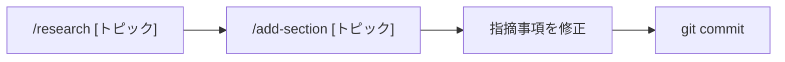

# 言語設定

必ず日本語で返答してください。

---

# プロジェクト概要

AIを活用した開発手法・ツールに関する技術資料を作成・管理するリポジトリ。
対象読者はAI活用を開発プロセスに組み込みたいエンジニア・テックリード。

---

# ドキュメント規約

## ファイル構成

| ファイル               | 役割                                     |
| ---------------------- | ---------------------------------------- |
| `AI駆動開発.md`        | メイン資料（要件定義〜運用まで全フェーズ） |

## Markdown スタイル

- 見出しは `##`（セクション）→ `###`（サブセクション）→ `####`（詳細）の3階層まで
- 表・Mermaid図・コードブロックを積極的に使用し、テキストだけの羅列を避ける
- コードブロックには必ず言語タグを付ける（` ```mermaid `, ` ```json `, ` ```text ` など）
- プロンプト例は ` ```text ` で囲む
- 注意点・ポイントは `>` 引用ブロックで強調する
- 詳細な書式ルールは `.claude/skills/doc-standards.md` を参照

## 情報の正確性基準

- ツール名・バージョン・日付は必ず最新情報に基づく（知識カットオフ: 2025年8月）
- 現時点（2026年4月）での推奨モデル：Claude Sonnet 4.6 / Claude Opus 4.6
- MCP の Linux Foundation 移管：2025年3月
- 数値・仕様は出典が不明な場合は「〜目安」「〜程度」と明記する

## セクション構成パターン

新しいセクションを追加する際は以下の構成を基本とする：

1. **概要説明**（1〜2文）
2. **比較表またはフロー図**（Mermaid推奨）
3. **具体的なプロンプト例またはコード例**
4. **ポイント・注意事項**（`>` ブロック）

テンプレート集は `.claude/skills/ai-usecase-templates.md` を参照。

---

# エージェント委譲ルール

## エージェント一覧とモデル割り当て

| エージェント | 役割 | model | tools |
|---|---|---|---|
| `doc-reviewer` | 総合品質レビュー | sonnet | Read, Glob |
| `format-checker` | 書式・Mermaid構文チェック | haiku | Read, Grep |
| `research-agent` | Web検索で最新情報調査 | sonnet | WebSearch, Read |
| `fact-checker` | 事実関係のWeb検証 | sonnet | WebSearch, Read |
| `senior-engineer-reviewer` | ベテラン視点の実用性レビュー | opus | Read, Glob |
| `doc-writer` | セクション執筆・改善 | sonnet | Read, Edit, Write, Glob, WebSearch |
| `skill-architect` | スキルファイルの設計・生成 | sonnet | Read, Write, Edit, Glob |
| `readme-updater` | README.md をスキル構成に同期 | sonnet | Read, Edit, Glob |

### モデル選択の基準

- **haiku**: パターンマッチ中心の軽量タスク（書式チェック）
- **sonnet**: 調査・執筆・標準レビューなど大半のタスク
- **opus**: 深い判断力が必要なタスク（アーキテクチャ評価、実務妥当性の判断）

## 共有ナレッジ（skills/）

エージェントが参照する共通知識ファイル：

| ファイル | 内容 | 主な参照元 |
|---|---|---|
| `skills/doc-standards.md` | Mermaid記法、見出し規約、文体ガイド | doc-writer, format-checker |
| `skills/research-patterns.md` | 調査の型、情報源の優先順位、信頼度基準 | research-agent, fact-checker |
| `skills/ai-usecase-templates.md` | AI活用ドキュメントのテンプレート集 | doc-writer |

## 自動委譲の判断基準

以下の条件でサブエージェントに自動委譲すること：

| 状況 | 委譲先 |
|---|---|
| `AI駆動開発.md` を編集した後 | `/review` で品質確認 |
| 新セクションを追加する指示を受けた | `/add-section [トピック]` を実行 |
| 最新情報の確認が必要な場合 | `/research [トピック]` を実行 |
| ゼロからドキュメントを作成する指示を受けた | `/new-doc [テーマ]` を実行 |
| 大量の事実情報を含む記述を追加した場合 | `fact-checker` を個別に呼び出し |

---

# スラッシュコマンド

| コマンド | 説明 | 呼び出されるエージェント |
|---|---|---|
| `/review` | 包括的レビュー（書式 + 品質 + ベテラン視点） | format-checker → doc-reviewer → senior-engineer-reviewer |
| `/research [トピック]` | Web調査 + ファクトチェック | research-agent + fact-checker |
| `/add-section [トピック]` | 調査→執筆→レビューの一貫フロー | research-agent → doc-writer → doc-reviewer |
| `/new-doc [テーマ]` | ゼロからドキュメント生成 | research-agent → doc-writer → 全レビューエージェント |
| `/create-skill [タイプ] [名前]` | agent/command/knowledge を新規作成・更新 | skill-architect → readme-updater |
| `/update-readme` | README.md をスキル構成に同期 | readme-updater |
| `/update-doc [セクション名]` | 既存セクションを最新情報で更新 | research-agent + fact-checker → doc-writer → doc-reviewer |

---

# ワークフローパターン

## 新規セクション追加フロー



1. `/research [トピック]` で最新情報を調査
2. `/add-section [トピック]` でセクション作成（調査→作成→レビューまで自動実行）
3. 指摘事項を修正
4. `git add AI駆動開発.md && git commit`

## 既存セクション更新フロー

1. 対象セクションを特定し修正を実施
2. `/review` で包括的レビューを実行
3. 指摘事項を修正
4. 必要に応じて `/research [関連トピック]` で最新情報を確認

## 定期メンテナンスフロー（月次推奨）

1. `/research` （引数なし）で全ツールの最新バージョンを一括調査
2. Outdated / Incorrect の項目を更新
3. `/review` で品質確認

## ゼロからドキュメント生成フロー

1. `/new-doc [テーマ]` で構成案作成→ユーザー承認→執筆→全面レビュー
2. 指摘事項を修正
3. `git commit`

---

# 作業ルール

- 既存セクションを修正する場合は、前後の文体・トーンと一致させる
- 新セクション追加時は「各フェーズの成果物と完了条件」テーブル（開発フロー直下）も更新する
- ファイルへの変更後は必ず `/review` でレビューを実行する
- シークレット・APIキーは絶対にコミットしない
- エージェントに共通知識を参照させる場合は `skills/` 内のファイルを Read させること

---

# よく使うコマンド

```bash
# プレビュー確認（VS Code）
Ctrl+Shift+V

# 変更をコミット
git add AI駆動開発.md
git commit -m "update: AI駆動開発.mdを更新"
```
