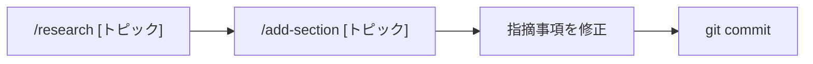

# 言語設定

必ず日本語で返答してください。

---

# プロジェクト概要

AIを活用した開発手法・ツールに関する技術資料を作成・管理するリポジトリ。
対象読者はAI活用を開発プロセスに組み込みたいエンジニア・テックリード。

---

# ドキュメント規約

## ファイル構成

このリポジトリは **蓄積（インプット）** と **発信（アウトプット）** を分離している。

| パス | 役割 | 編集ルール |
| ---- | ---- | ---- |
| `AI駆動開発.md` | **蓄積**：調査結果を溜め込む一次ソース（要件定義〜運用まで全フェーズ） | 網羅性優先。長さ・重複は許容する |
| `contents/` | **発信**：Zenn記事・勉強会スライド向けに再編集した成果物 | 1ファイル = 1テーマ。単体で読み切れること |
| `構成.md` | `contents/` の構成設計書（確定方針・命名規則・執筆テンプレート） | 方針を変更するときのみ更新 |
| `slide/` | 勉強会用スライド原稿 | `contents/` から派生させる |

> **重要**：`contents/` は `AI駆動開発.md` のコピーではない。**読者を1人決めて書き直したもの**として扱う。蓄積側の網羅性をそのまま持ち込むと「長すぎて読めない」問題が再発する。

## Markdown スタイル

- 見出しは `##`（セクション）→ `###`（サブセクション）→ `####`（詳細）の3階層まで
- 表・Mermaid図・コードブロックを積極的に使用し、テキストだけの羅列を避ける
- コードブロックには必ず言語タグを付ける（` ```mermaid `, ` ```json `, ` ```text ` など）
- プロンプト例は ` ```text ` で囲む
- 注意点・ポイントは `>` 引用ブロックで強調する
- 詳細な書式ルールは `.claude/skills/doc-standards.md` を参照

## 情報の正確性基準

- ツール名・バージョン・日付は必ず最新情報に基づく（知識カットオフ: 2025年8月）
- 現時点（2026年8月）での推奨モデル：**Claude Sonnet 5**（デフォルト） / **Claude Opus 5** / **Claude Fable 5**（最難度）
  - モデルID：`claude-sonnet-5` / `claude-opus-5` / `claude-fable-5` / `claude-haiku-4-5-20251001`
  - エージェント定義（`.claude/agents/*.md`）の `model:` には**エイリアス**（`sonnet` / `opus` / `haiku`）を指定する。バージョン固定IDは陳腐化するため使わない
  - Sonnet 5 以降は Adaptive Thinking がデフォルトON（Extended Thinking は廃止）
- MCP の Linux Foundation（AAIF）移管：2025年12月9日（2026年3月時点で SDK 月次DL 9,700万）
- Antigravity は 2.0 でIDEではなくエージェントオーケストレーションデスクトップアプリに再定義（2026年5月、Google I/O 2026）
- Devin は 2.0 で $500/月 → $20/月〜 に大幅値下げ、Cognition が Windsurf を買収し傘下統合（2025年12月）
- 数値・仕様は出典が不明な場合は「〜目安」「〜程度」と明記する

## セクション構成パターン

新しいセクションを追加する際は以下の構成を基本とする：

1. **概要説明**（1〜2文）
2. **比較表またはフロー図**（Mermaid推奨）
3. **具体的なプロンプト例またはコード例**
4. **ポイント・注意事項**（`>` ブロック）

テンプレート集は `.claude/skills/ai-usecase-templates.md` を参照。

---

# contents/ 執筆規約

## ディレクトリ構成

番号帯でパートを分ける。**番号は 10 番刻み**（連番だと途中挿入のたびに全リネームが発生するため）。

| 番号帯 | パート | 内容 |
|---|---|---|
| `00_` | 導入 | 全体像・読み方 |
| `01_`〜`09_` | Part 1：仕組み編 | AIエージェントを構成する部品そのものの解説 |
| `10_`〜`19_` | Part 2：開発フェーズ編 | 要件定義〜テストまで、工程に沿った活用法 |
| `20_`〜`29_` | Part 3：横断・運用編 | 特定フェーズに属さない、通しで効くテーマ |

現在 16 セクション / 98 ファイルを計画。セクション一覧は `構成.md`、**ファイル単位の内訳は各ディレクトリの `README.md`** を唯一の情報源とする（二重管理しない）。

## 命名規則

| 対象 | 規則 | 例 |
|---|---|---|
| ディレクトリ | `NN_kebab-case` | `01_claude-code/` |
| ファイル | `NN_kebab-case.md` | `04_skills.md` |
| セクション目次 | 各ディレクトリ直下の `README.md` | GitHub がフォルダ閲覧時に自動表示 |
| 画像 | 各ディレクトリ直下の `_assets/` | `01_claude-code/_assets/flow.png` |

- **ファイル名は ASCII 必須**。Zenn slug・GitHub の URL・スライド生成ツールの引数で日本語は事故る。日本語は H1 タイトルで表現する
- Zenn へ公開するときは `contents/` を原本とし、`articles/` に公開用ファイルを**別途生成**する（Zenn CLI は `articles/` 直下フラット＋専用 frontmatter が必須でサブディレクトリを許さない）

## 執筆ルール

- frontmatter に `title` / `status` / `updated` / `source` / `tags` を必ず付ける
  - `source` は **`AI駆動開発.md § 6.11 Context7 MCP` のようにセクション番号＋見出しで書く**
    - **行番号は使わない。** 原本に加筆すると以降の行番号が全てずれ、追跡できなくなる（実際に発生済み）
    - 原本に対応セクションがない場合は `新規（AI駆動開発.md に対応セクションなし）` と書く
  - `status` は `draft` → `review` → `published`
- 本文構成は **結論 → 背景・課題 → 具体的な方法 → 実際のプロンプト例 → 注意点 → 参考リンク**
- 「具体的な方法」には Mermaid図 / 表 / コード例のいずれかを必ず1つ以上入れる
- 1ファイル 3,000〜6,000字。超えるならファイルを分割する
- 執筆・更新したら、そのセクションの `README.md` の「状態」列を `未着手 → 執筆中 → レビュー中 → 完了` で更新する
- テンプレート全文は `構成.md` を参照

## 02_mcp/ の追記ルール

新しい MCP を追加するときは以下の4点セットで書く。

1. 何ができるか（できないことも）
2. 導入手順
3. 実際に使ったプロンプト例
4. 使わないほうがいいケース

> 2 だけの記事は公式ドキュメントに勝てない。3 と 4 が記事の価値になる。

## 重複を避けるルール

| 内容 | 置き場所 |
|---|---|
| 個別 MCP の解説 | `02_mcp/` に集約（`13_implementation/` には書かない） |
| Claude Code の環境設定（CLAUDE.md / hooks / skills） | `01_claude-code/` に集約（フェーズ編には書かない） |
| ファイル単位の一覧・進捗 | 各セクションの `README.md`（`構成.md` には書かない） |

---

# エージェント委譲ルール

## エージェント一覧とモデル割り当て

| エージェント | 役割 | model | tools |
|---|---|---|---|
| `doc-reviewer` | 総合品質レビュー | sonnet | Read, Glob |
| `format-checker` | 書式・Mermaid構文チェック | haiku | Read, Grep |
| `research-agent` | Web検索で最新情報調査 | sonnet | WebSearch, Read |
| `fact-checker` | 事実関係のWeb検証 | sonnet | WebSearch, Read |
| `senior-engineer-reviewer` | ベテラン視点の実用性レビュー | opus | Read, Glob |
| `doc-writer` | セクション執筆・改善 | sonnet | Read, Edit, Write, Glob, WebSearch |
| `skill-architect` | スキルファイルの設計・生成 | sonnet | Read, Write, Edit, Glob |
| `readme-updater` | README.md をスキル構成に同期 | sonnet | Read, Edit, Glob |

### モデル選択の基準

- **haiku**: パターンマッチ中心の軽量タスク（書式チェック）
- **sonnet**: 調査・執筆・標準レビューなど大半のタスク
- **opus**: 深い判断力が必要なタスク（アーキテクチャ評価、実務妥当性の判断）

## 共有ナレッジ（skills/）

エージェントが参照する共通知識ファイル：

| ファイル | 内容 | 主な参照元 |
|---|---|---|
| `skills/doc-standards.md` | Mermaid記法、見出し規約、文体ガイド | doc-writer, format-checker |
| `skills/research-patterns.md` | 調査の型、情報源の優先順位、信頼度基準 | research-agent, fact-checker |
| `skills/ai-usecase-templates.md` | AI活用ドキュメントのテンプレート集 | doc-writer |

## 自動委譲の判断基準

以下の条件でサブエージェントに自動委譲すること：

| 状況 | 委譲先 |
|---|---|
| `AI駆動開発.md` を編集した後 | `/review` で品質確認 |
| `contents/` 配下のファイルを編集した後 | `/review` で品質確認 |
| 新セクションを追加する指示を受けた | `/add-section [トピック]` を実行 |
| 最新情報の確認が必要な場合 | `/research [トピック]` を実行 |
| ゼロからドキュメントを作成する指示を受けた | `/new-doc [テーマ]` を実行 |
| 大量の事実情報を含む記述を追加した場合 | `fact-checker` を個別に呼び出し |

---

# スラッシュコマンド

| コマンド | 説明 | 呼び出されるエージェント |
|---|---|---|
| `/review` | 包括的レビュー（書式 + 品質 + ベテラン視点） | format-checker → doc-reviewer → senior-engineer-reviewer |
| `/research [トピック]` | Web調査 + ファクトチェック | research-agent + fact-checker |
| `/add-section [トピック]` | 調査→執筆→レビューの一貫フロー | research-agent → doc-writer → doc-reviewer |
| `/new-doc [テーマ]` | ゼロからドキュメント生成 | research-agent → doc-writer → 全レビューエージェント |
| `/create-skill [タイプ] [名前]` | agent/command/knowledge を新規作成・更新 | skill-architect → readme-updater |
| `/update-readme` | README.md をスキル構成に同期 | readme-updater |
| `/update-doc [セクション名]` | 既存セクションを最新情報で更新 | research-agent + fact-checker → doc-writer → doc-reviewer |

---

# ワークフローパターン

## 新規セクション追加フロー


```mermaid
flowchart LR
    A["/research [トピック]"] --> B["/add-section [トピック]"]
    B --> C[指摘事項を修正]
    C --> D["git commit"]
```

1. `/research [トピック]` で最新情報を調査
2. `/add-section [トピック]` でセクション作成（調査→作成→レビューまで自動実行）
3. 指摘事項を修正
4. `git add AI駆動開発.md && git commit`

## 既存セクション更新フロー

1. 対象セクションを特定し修正を実施
2. `/review` で包括的レビューを実行
3. 指摘事項を修正
4. 必要に応じて `/research [関連トピック]` で最新情報を確認

## 定期メンテナンスフロー（月次推奨）

1. `/research` （引数なし）で全ツールの最新バージョンを一括調査
2. Outdated / Incorrect の項目を更新
3. `/review` で品質確認

## ゼロからドキュメント生成フロー

1. `/new-doc [テーマ]` で構成案作成→ユーザー承認→執筆→全面レビュー
2. 指摘事項を修正
3. `git commit`

---

# 作業ルール

- 既存セクションを修正する場合は、前後の文体・トーンと一致させる
- 新セクション追加時は「各フェーズの成果物と完了条件」テーブル（開発フロー直下）も更新する
- ファイルへの変更後は必ず `/review` でレビューを実行する
- 調査で得た新情報は**まず `AI駆動開発.md` に追記**する。`contents/` へ直接書かない
- `contents/` に記事を書いたら frontmatter の `source` に出典行を残し、セクション `README.md` の状態列を更新する
- `contents/` に新しいファイル・ディレクトリを追加したら、そのセクションの `README.md` と `構成.md` のセクション一覧も更新する
- シークレット・APIキーは絶対にコミットしない
- エージェントに共通知識を参照させる場合は `skills/` 内のファイルを Read させること

---

# よく使うコマンド

```bash
# プレビュー確認（VS Code）
Ctrl+Shift+V

# 蓄積側の変更をコミット
git add AI駆動開発.md
git commit -m "update: AI駆動開発.mdを更新"

# 発信側の変更をコミット
git add contents/
git commit -m "docs(contents): 01_claude-code/04_skills.md を追加"

# 未着手の記事を一覧する
grep -rn "未着手" contents/*/README.md
```
