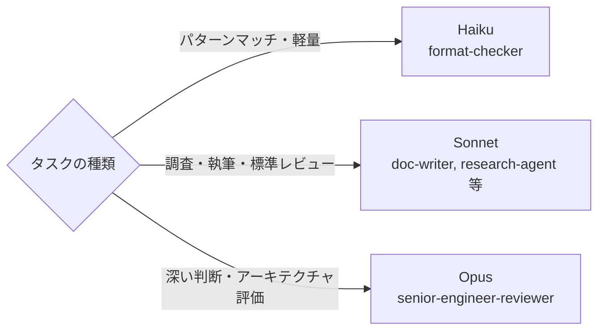
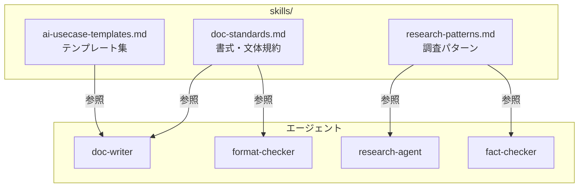
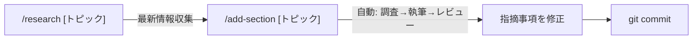
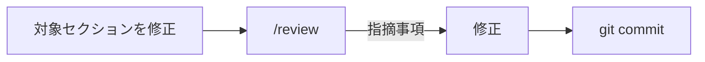
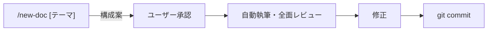
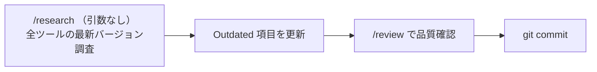
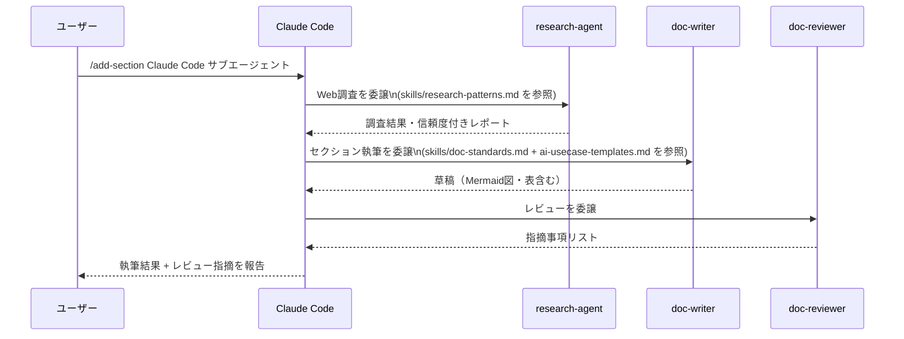

# AI駆動開発 ドキュメントリポジトリ

AI を活用した開発手法・ツールに関する技術資料を作成・管理するリポジトリ。
**対象読者**: AI活用を開発プロセスに組み込みたいエンジニア・テックリード

---

## ファイル構成

```
AI駆動開発/
├── AI駆動開発.md               # メイン資料（要件定義〜運用まで全フェーズ）
├── CLAUDE.md                   # Claude Code の設定・規約・エージェント定義
├── .mcp.json                   # MCP サーバー設定（Context7 等）
└── .claude/
    ├── commands/               # スラッシュコマンド定義
    │   ├── review.md           # /review
    │   ├── research.md         # /research
    │   ├── add-section.md      # /add-section
    │   ├── new-doc.md          # /new-doc
    │   ├── create-skill.md     # /create-skill（新規）
    │   ├── update-readme.md    # /update-readme（新規）
    │   └── update-doc.md       # /update-doc（新規）
    ├── agents/                 # サブエージェント定義
    │   ├── doc-writer.md
    │   ├── doc-reviewer.md
    │   ├── format-checker.md
    │   ├── research-agent.md
    │   ├── fact-checker.md
    │   ├── senior-engineer-reviewer.md
    │   ├── skill-architect.md  # スキル設計担当（新規）
    │   └── readme-updater.md   # README同期担当（新規）
    └── skills/                 # エージェント共有ナレッジ
        ├── doc-standards.md        # 書式・Mermaid記法・文体ガイド
        ├── research-patterns.md    # 調査パターン・情報源優先順位
        └── ai-usecase-templates.md # セクション執筆用テンプレート集
```

| ファイル | 役割 |
|---|---|
| `AI駆動開発.md` | メイン技術資料。このリポジトリで唯一編集する成果物 |
| `CLAUDE.md` | Claude Code の動作規約・エージェント委譲ルール・スラッシュコマンド定義 |
| `skills/doc-standards.md` | Mermaid記法・見出し規約・文体ガイド（エージェントが参照） |
| `skills/research-patterns.md` | 情報源の優先順位・検索クエリパターン（エージェントが参照） |
| `skills/ai-usecase-templates.md` | ツール紹介・比較・設定ガイドなど5種類のテンプレート |

---

## Claude Code の活用方法

このリポジトリは **Claude Code** を使ってドキュメントを作成・更新する。
スラッシュコマンドを叩くだけで、調査→執筆→レビューまでが自動で実行される。

### スラッシュコマンド一覧

#### ドキュメント操作

| コマンド | 用途 | 呼び出されるエージェント |
|---|---|---|
| `/review` | 書式・品質・実用性を一括レビュー | format-checker → doc-reviewer → senior-engineer-reviewer |
| `/research [トピック]` | Web調査 + ファクトチェック | research-agent + fact-checker（並列） |
| `/add-section [トピック]` | 新セクションを調査→執筆→レビューまで一貫実行 | research-agent → doc-writer → doc-reviewer |
| `/update-doc [セクション名]` | 既存セクションを最新情報で更新 | research-agent + fact-checker → doc-writer → doc-reviewer |
| `/new-doc [テーマ]` | ゼロからドキュメントを生成 | research-agent → doc-writer → 全レビューエージェント |

#### スキル管理

| コマンド | 用途 | 呼び出されるエージェント |
|---|---|---|
| `/create-skill [タイプ] [名前]` | agent/command/knowledge を新規作成・更新 | skill-architect → readme-updater |
| `/update-readme` | README.md をスキル構成に自動同期 | readme-updater |

#### 使用例

```bash
# 新セクションを追加する
/add-section Claude Code サブエージェント活用

# 既存の「使用ツール」セクションを最新情報に更新する
/update-doc 使用ツール

# 新しいエージェントを作成する
/create-skill agent 月次レポートを自動生成するエージェント monthly-reporter

# ドキュメント全体をレビューする
/review

# スキル追加後に README を同期する
/update-readme
```

---

## サブエージェントシステム

### エージェント一覧

| エージェント | 役割 | 使用モデル |
|---|---|---|
| `doc-writer` | セクション執筆・改善 | Claude Sonnet 4.6 |
| `doc-reviewer` | 総合品質レビュー | Claude Sonnet 4.6 |
| `format-checker` | 書式・Mermaid構文チェック | Claude Haiku 4.5 |
| `research-agent` | Web検索・公式ドキュメント調査 | Claude Sonnet 4.6 |
| `fact-checker` | 事実関係のWeb検証 | Claude Sonnet 4.6 |
| `senior-engineer-reviewer` | ベテラン視点の実用性レビュー | Claude Opus 4.6 |
| `skill-architect` | スキルファイルの設計・生成 | Claude Sonnet 4.6 |
| `readme-updater` | README.md をスキル構成に同期 | Claude Sonnet 4.6 |

#### モデル選択の基準



### Skills（共有ナレッジ）との連携

`skills/` ディレクトリのファイルはエージェント間で共有される知識ベース。
エージェントは実行時にこれらのファイルを Read して、一貫した品質を保つ。



---

## MCP 連携

### Context7（公式ドキュメント取得）

`.mcp.json` に Context7 MCP サーバーを設定済み。
research-agent・fact-checker が**ライブラリ/ツールの公式ドキュメントを直接参照**できるようになる。

```
従来: WebSearch → 検索結果ページ → 内容を解析
Context7: resolve_library_id → get_library_docs → 公式ドキュメント本文を直接取得
```

| MCP サーバー | 用途 | 設定ファイル |
|---|---|---|
| `context7` | 公式ライブラリ・ツールのドキュメントを直接取得 | `.mcp.json` |
| Notion | ドキュメント・ページ管理 | Claude Code の設定から追加 |

> **ポイント**: Context7 は初回起動時に `npx -y @upstash/context7-mcp` が自動実行される。Node.js が必要。

---

## 活用フロー

### 新規セクション追加



1. `/research [トピック]` でWeb情報を収集・検証
2. `/add-section [トピック]` でセクション作成（research-agent → doc-writer → doc-reviewer が順次自動実行）
3. レビュー指摘を修正
4. `git add AI駆動開発.md && git commit`

### 既存セクション更新



1. 対象セクションを直接編集
2. `/review` で書式・内容・実用性を確認
3. 指摘事項を修正してコミット

### ゼロからドキュメント生成



### 定期メンテナンス（月次推奨）



---

## `/add-section` の内部動作

スラッシュコマンドがどのようにサブエージェントを呼び出すかを示す。



### 自動委譲の判断基準

CLAUDE.md に定義された条件に応じて、Claude Code が自動でエージェントを選択する。

| 状況 | 自動委譲先 |
|---|---|
| `AI駆動開発.md` を編集した後 | `/review`（品質確認） |
| 新セクションの追加指示を受けた | `/add-section [トピック]` |
| 最新情報の確認が必要な場合 | `/research [トピック]` |
| ゼロからドキュメント作成の指示を受けた | `/new-doc [テーマ]` |
| 大量の事実情報を含む記述を追加した場合 | `fact-checker`（個別呼び出し） |

---

## よく使うコマンド

```bash
# VS Code でマークダウンプレビュー
Ctrl+Shift+V

# 変更をコミット
git add AI駆動開発.md
git commit -m "update: AI駆動開発.mdを更新"

# 変更差分の確認
git diff AI駆動開発.md
```

---

## ドキュメント規約（概要）

詳細は [CLAUDE.md](CLAUDE.md) および [.claude/skills/doc-standards.md](.claude/skills/doc-standards.md) を参照。

| ルール | 内容 |
|---|---|
| 見出し階層 | `##` → `###` → `####` の3階層まで |
| 図表 | Mermaid図・表を積極的に使用し、テキスト羅列を避ける |
| コードブロック | 言語タグ必須（`mermaid`, `bash`, `json`, `text` 等） |
| プロンプト例 | ` ```text ` で囲む |
| 注意事項 | `>` 引用ブロックで強調 |
| 語尾 | 「〜する」「〜である」統一（「〜です」「〜ます」は混在不可） |
