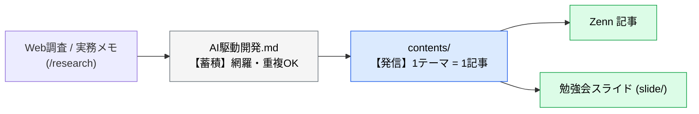
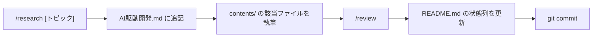
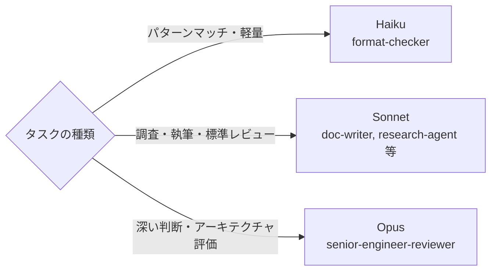
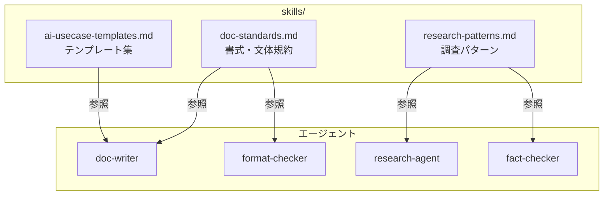
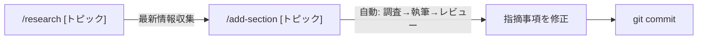
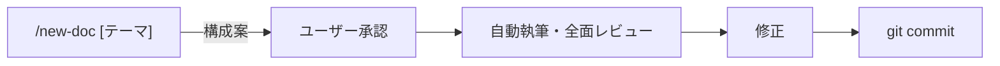
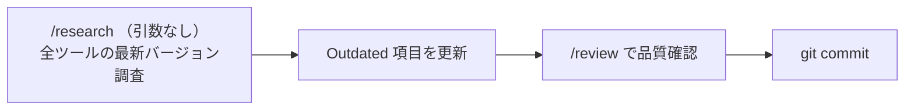
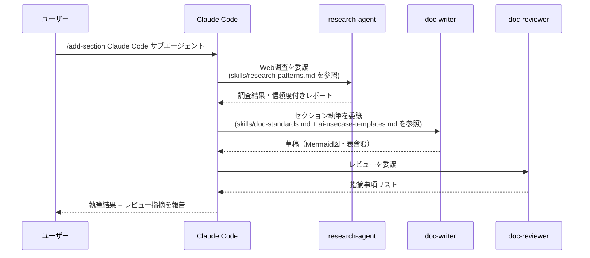

# AI駆動開発 ドキュメントリポジトリ

AI を活用した開発手法・ツールに関する技術資料を作成・管理するリポジトリ。
**対象読者**: AI活用を開発プロセスに組み込みたいエンジニア・テックリード

---

## ファイル構成

```
AI駆動開発/
├── AI駆動開発.md               # 【蓄積】調査結果を溜め込む一次ソース
├── 構成.md                     # contents/ の構成設計書（確定方針・命名規則・テンプレート）
├── contents/                   # 【発信】Zenn記事・スライド向けに再編集した成果物
│   ├── README.md               # 全体目次（16セクション / 98ファイル）
│   ├── 00_overview/            # 導入・全体像
│   ├── 01_claude-code/         # Part 1: Claude Code の仕組み
│   ├── 02_mcp/                 # Part 1: MCP カタログ
│   ├── 03_rag/                 # Part 1: RAG
│   ├── 04_multi-agent/         # Part 1: マルチエージェント・多モデル議論
│   ├── 05_prompt-engineering/  # Part 1: プロンプトエンジニアリング
│   ├── 10_requirements/        # Part 2: 要件定義・仕様書作成
│   ├── 11_design/              # Part 2: 基本設計・詳細設計
│   ├── 12_ui-ux/               # Part 2: UI/UX デザイン
│   ├── 13_implementation/      # Part 2: 実装
│   ├── 14_code-review/         # Part 2: コードレビュー
│   ├── 15_test/                # Part 2: テスト活用
│   ├── 20_github-claude/       # Part 3: GitHub × Claude
│   ├── 21_cicd-ops/            # Part 3: CI/CD・運用・監視
│   ├── 22_security/            # Part 3: セキュリティ
│   └── 23_team-workflow/       # Part 3: チームワークフロー
├── slide/                      # 勉強会用スライド原稿
├── CLAUDE.md                   # Claude Code の設定・規約・エージェント定義
├── .mcp.json                   # MCP サーバー設定（Context7 等）
└── .claude/
    ├── agents/                 # サブエージェント定義
    │   ├── doc-writer.md
    │   ├── doc-reviewer.md
    │   ├── format-checker.md
    │   ├── research-agent.md
    │   ├── fact-checker.md
    │   ├── senior-engineer-reviewer.md
    │   ├── skill-architect.md
    │   └── readme-updater.md
    └── skills/                 # スラッシュコマンド & 共有ナレッジ
        ├── review/SKILL.md         # /review
        ├── research/SKILL.md       # /research
        ├── add-section/SKILL.md    # /add-section
        ├── new-doc/SKILL.md        # /new-doc
        ├── update-doc/SKILL.md     # /update-doc
        ├── create-skill/SKILL.md   # /create-skill
        ├── update-readme/SKILL.md  # /update-readme
        ├── doc-standards.md        # 書式・Mermaid記法・文体ガイド
        ├── research-patterns.md    # 調査パターン・情報源優先順位
        └── ai-usecase-templates.md # セクション執筆用テンプレート集
```

| パス | 役割 |
|---|---|
| `AI駆動開発.md` | **【蓄積】** 調査結果を溜め込む一次ソース。網羅性優先で、長さ・重複は許容する |
| `contents/` | **【発信】** 読者に届ける単位に再編集した成果物。1ファイル = Zenn記事1本 |
| `構成.md` | `contents/` の構成設計書。確定方針・命名規則・執筆テンプレート |
| `slide/` | 勉強会用スライド原稿。`contents/` から派生させる |
| `CLAUDE.md` | Claude Code の動作規約・エージェント委譲ルール・スラッシュコマンド定義 |
| `skills/doc-standards.md` | Mermaid記法・見出し規約・文体ガイド（エージェントが参照） |
| `skills/research-patterns.md` | 情報源の優先順位・検索クエリパターン（エージェントが参照） |
| `skills/ai-usecase-templates.md` | ツール紹介・比較・設定ガイドなど5種類のテンプレート |

---

## コンテンツ構成（`contents/`）

このリポジトリは **蓄積（インプット）** と **発信（アウトプット）** を分離している。


```mermaid
flowchart LR
    W["Web調査 / 実務メモ<br/>(/research)"] --> S["AI駆動開発.md<br/>【蓄積】網羅・重複OK"]
    S --> C["contents/<br/>【発信】1テーマ = 1記事"]
    C --> Z["Zenn 記事"]
    C --> P["勉強会スライド (slide/)"]

    style S fill:#f5f5f5,stroke:#6c757d,color:#000
    style C fill:#dbeafe,stroke:#2563eb,color:#000
    style Z fill:#dcfce7,stroke:#16a34a,color:#000
    style P fill:#dcfce7,stroke:#16a34a,color:#000
```

> `contents/` は `AI駆動開発.md` のコピーではなく、**読者を1人決めて書き直したもの**。

### 番号帯によるグルーピング

番号は **10 番刻み**。連番だと途中挿入のたびに全リネームが発生するため。

| 番号帯 | パート | 内容 |
|---|---|---|
| `00_` | 導入 | 全体像・読み方 |
| `01_`〜`09_` | Part 1：仕組み編 | AIエージェントを構成する部品そのものの解説 |
| `10_`〜`19_` | Part 2：開発フェーズ編 | 要件定義〜テストまで、工程に沿った活用法 |
| `20_`〜`29_` | Part 3：横断・運用編 | 特定フェーズに属さない、通しで効くテーマ |

### 執筆ルール（要点）

| ルール | 内容 |
|---|---|
| ファイル名 | `NN_kebab-case.md`（**ASCII 必須**。日本語は H1 タイトルで表現） |
| frontmatter | `title` / `status` / `updated` / `source` / `tags` を必須。`source` に出典行を残す |
| 本文構成 | 結論 → 背景・課題 → 具体的な方法 → プロンプト例 → 注意点 → 参考リンク |
| 分量 | 1ファイル 3,000〜6,000字。超えたら分割 |
| 目次 | 各ディレクトリの `README.md` がファイル一覧の唯一の情報源 |

詳細な規約とテンプレートは [構成.md](構成.md) および [CLAUDE.md](CLAUDE.md) を参照。

### 執筆フロー


```mermaid
flowchart LR
    A["/research [トピック]"] --> B["AI駆動開発.md に追記"]
    B --> C["contents/ の該当ファイルを執筆"]
    C --> D["/review"]
    D --> E["README.md の状態列を更新"]
    E --> F["git commit"]
```

**着手順の推奨**：`01_claude-code`（土台）→ `02_mcp`（量産しやすい）→ `20_github-claude`（実務で即使える）→ 以降フェーズ順

---

## Claude Code の活用方法

このリポジトリは **Claude Code** を使ってドキュメントを作成・更新する。
スラッシュコマンドを叩くだけで、調査→執筆→レビューまでが自動で実行される。

### スラッシュコマンド一覧

#### ドキュメント操作

| コマンド | 用途 | 呼び出されるエージェント |
|---|---|---|
| `/review` | 書式・品質・実用性を一括レビュー | format-checker → doc-reviewer → senior-engineer-reviewer |
| `/research [トピック]` | Web調査 + ファクトチェック | research-agent + fact-checker（並列） |
| `/add-section [トピック]` | 新セクションを調査→執筆→レビューまで一貫実行 | research-agent → doc-writer → doc-reviewer |
| `/update-doc [セクション名]` | 既存セクションを最新情報で更新 | research-agent + fact-checker → doc-writer → doc-reviewer |
| `/new-doc [テーマ]` | ゼロからドキュメントを生成 | research-agent → doc-writer → 全レビューエージェント |

#### スキル管理

| コマンド | 用途 | 呼び出されるエージェント |
|---|---|---|
| `/create-skill [タイプ] [名前]` | agent/command/knowledge を新規作成・更新 | skill-architect → readme-updater |
| `/update-readme` | README.md をスキル構成に自動同期 | readme-updater |

#### 使用例

```bash
# 新セクションを追加する
/add-section Claude Code サブエージェント活用

# 既存の「使用ツール」セクションを最新情報に更新する
/update-doc 使用ツール

# 新しいエージェントを作成する
/create-skill agent 月次レポートを自動生成するエージェント monthly-reporter

# ドキュメント全体をレビューする
/review

# スキル追加後に README を同期する
/update-readme
```

---

## サブエージェントシステム

### エージェント一覧

| エージェント | 役割 | `model` 指定 |
|---|---|---|
| `doc-writer` | セクション執筆・改善 | `sonnet` |
| `doc-reviewer` | 総合品質レビュー | `sonnet` |
| `format-checker` | 書式・Mermaid構文チェック | `haiku` |
| `research-agent` | Web検索・公式ドキュメント調査 | `sonnet` |
| `fact-checker` | 事実関係のWeb検証 | `sonnet` |
| `senior-engineer-reviewer` | ベテラン視点の実用性レビュー | `opus` |
| `skill-architect` | スキルファイルの設計・生成 | `sonnet` |
| `readme-updater` | README.md をスキル構成に同期 | `sonnet` |

> **エイリアス指定にしている理由**：`model:` にはバージョン固定のモデルID（`claude-sonnet-4-6` 等）ではなく **エイリアス**（`sonnet` / `opus` / `haiku`）を指定する。固定IDはモデルが更新されるたびに陳腐化し、実際の挙動とドキュメントがずれる。
>
> **現時点（2026年8月）のエイリアス解決先**：`sonnet` → Claude Sonnet 5 ／ `opus` → Claude Opus 5 ／ `haiku` → Claude Haiku 4.5。最難度タスク向けに Claude Fable 5（`claude-fable-5`）もある。

#### モデル選択の基準


```mermaid
flowchart LR
    A{タスクの種類} -->|パターンマッチ・軽量| B[Haiku<br/>format-checker]
    A -->|調査・執筆・標準レビュー| C[Sonnet<br/>doc-writer, research-agent 等]
    A -->|深い判断・アーキテクチャ評価| D[Opus<br/>senior-engineer-reviewer]
```

### Skills（共有ナレッジ）との連携

`skills/` ディレクトリのファイルはエージェント間で共有される知識ベース。
エージェントは実行時にこれらのファイルを Read して、一貫した品質を保つ。


```mermaid
flowchart TD
    subgraph skills/
        S1[doc-standards.md<br/>書式・文体規約]
        S2[research-patterns.md<br/>調査パターン]
        S3[ai-usecase-templates.md<br/>テンプレート集]
    end

    subgraph エージェント
        A1[doc-writer]
        A2[format-checker]
        A3[research-agent]
        A4[fact-checker]
    end

    S1 -->|参照| A1
    S1 -->|参照| A2
    S2 -->|参照| A3
    S2 -->|参照| A4
    S3 -->|参照| A1
```

---

## MCP 連携

### Context7（公式ドキュメント取得）

`.mcp.json` に Context7 MCP サーバーを設定済み。
research-agent・fact-checker が**ライブラリ/ツールの公式ドキュメントを直接参照**できるようになる。

```
従来: WebSearch → 検索結果ページ → 内容を解析
Context7: resolve_library_id → get_library_docs → 公式ドキュメント本文を直接取得
```

| MCP サーバー | 用途 | 設定ファイル |
|---|---|---|
| `context7` | 公式ライブラリ・ツールのドキュメントを直接取得 | `.mcp.json` |
| Notion | ドキュメント・ページ管理 | Claude Code の設定から追加 |

> **ポイント**: Context7 は初回起動時に `npx -y @upstash/context7-mcp` が自動実行される。Node.js が必要。

---

## 活用フロー

### 新規セクション追加


```mermaid
flowchart LR
    A["/research [トピック]"] -->|最新情報収集| B["/add-section [トピック]"]
    B -->|自動: 調査→執筆→レビュー| C[指摘事項を修正]
    C --> D["git commit"]
```

1. `/research [トピック]` でWeb情報を収集・検証
2. `/add-section [トピック]` でセクション作成（research-agent → doc-writer → doc-reviewer が順次自動実行）
3. レビュー指摘を修正
4. `git add AI駆動開発.md && git commit`

### 既存セクション更新


```mermaid
flowchart LR
    A[対象セクションを修正] --> B["/review"]
    B -->|指摘事項| C[修正]
    C --> D["git commit"]
```

1. 対象セクションを直接編集
2. `/review` で書式・内容・実用性を確認
3. 指摘事項を修正してコミット

### ゼロからドキュメント生成


```mermaid
flowchart LR
    A["/new-doc [テーマ]"] -->|構成案| B[ユーザー承認]
    B --> C[自動執筆・全面レビュー]
    C --> D[修正] --> E["git commit"]
```

### 定期メンテナンス（月次推奨）


```mermaid
flowchart LR
    A["/research （引数なし）<br/>全ツールの最新バージョン調査"] --> B[Outdated 項目を更新]
    B --> C["/review で品質確認"]
    C --> D["git commit"]
```

---

## `/add-section` の内部動作

スラッシュコマンドがどのようにサブエージェントを呼び出すかを示す。


```mermaid
sequenceDiagram
    participant U as ユーザー
    participant CC as Claude Code
    participant RA as research-agent
    participant DW as doc-writer
    participant DR as doc-reviewer

    U->>CC: /add-section Claude Code サブエージェント
    CC->>RA: Web調査を委譲<br/>(skills/research-patterns.md を参照)
    RA-->>CC: 調査結果・信頼度付きレポート
    CC->>DW: セクション執筆を委譲<br/>(skills/doc-standards.md + ai-usecase-templates.md を参照)
    DW-->>CC: 草稿（Mermaid図・表含む）
    CC->>DR: レビューを委譲
    DR-->>CC: 指摘事項リスト
    CC-->>U: 執筆結果 + レビュー指摘を報告
```

### 自動委譲の判断基準

CLAUDE.md に定義された条件に応じて、Claude Code が自動でエージェントを選択する。

| 状況 | 自動委譲先 |
|---|---|
| `AI駆動開発.md` を編集した後 | `/review`（品質確認） |
| `contents/` 配下のファイルを編集した後 | `/review`（品質確認） |
| 新セクションの追加指示を受けた | `/add-section [トピック]` |
| 最新情報の確認が必要な場合 | `/research [トピック]` |
| ゼロからドキュメント作成の指示を受けた | `/new-doc [テーマ]` |
| 大量の事実情報を含む記述を追加した場合 | `fact-checker`（個別呼び出し） |

---

## よく使うコマンド

```bash
# VS Code でマークダウンプレビュー
Ctrl+Shift+V

# 蓄積側の変更をコミット
git add AI駆動開発.md
git commit -m "update: AI駆動開発.mdを更新"

# 発信側の変更をコミット
git add contents/
git commit -m "docs(contents): 01_claude-code/04_skills.md を追加"

# 未着手の記事を一覧する
grep -rn "未着手" contents/*/README.md

# 変更差分の確認
git diff AI駆動開発.md
```

---

## ドキュメント規約（概要）

詳細は [CLAUDE.md](CLAUDE.md) および [.claude/skills/doc-standards.md](.claude/skills/doc-standards.md) を参照。

| ルール | 内容 |
|---|---|
| 見出し階層 | `##` → `###` → `####` の3階層まで |
| 図表 | Mermaid図・表を積極的に使用し、テキスト羅列を避ける |
| コードブロック | 言語タグ必須（`mermaid`, `bash`, `json`, `text` 等） |
| プロンプト例 | ` ```text ` で囲む |
| 注意事項 | `>` 引用ブロックで強調 |
| 語尾 | 「〜する」「〜である」統一（「〜です」「〜ます」は混在不可） |
