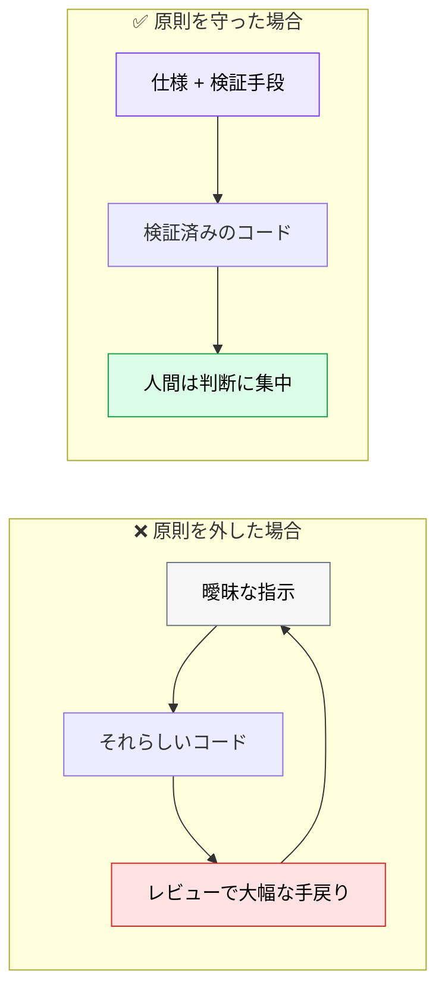

# AI駆動開発とは

> **この記事でわかること**：AI駆動開発の3大原則と、それぞれが「何を防ぐための原則か」。

## 結論

AI駆動開発の原則は3つだけである。**すべて「AI を賢くする方法」ではなく「人間が何を用意するか」の話**である。

| # | 原則 | これが防ぐもの |
| --- | --- | --- |
| 1 | **コードより先に仕様書（`SPEC.md`）を書く** | 後工程での手戻り |
| 2 | **AI には「検証手段（テスト）」をセットで渡す** | 品質が確認できないコード |
| 3 | **AI 生成コードも人間がレビューする** | 責任の所在の消失 |

この3つを外すと、AI を使うほど手戻りが増える。

## 背景・課題

AI コーディングツールを導入したのに「思ったほど速くならない」と感じるチームは多い。原因はツールの性能ではなく、**渡す情報の設計**にある。



> **「AI が賢くなる」のではなく、「渡す情報と役割の設計で結果が決まる」。**

## 具体的な方法

### 原則1：コードより先に仕様書を書く

曖昧な要件のまま AI にコードを書かせると、後工程で修正コストが膨らむ。

**AI は「曖昧だ」と言わずに、それらしく埋める。** ここが人間との違いである。人間の実装者なら「この場合どうしますか？」と聞くところを、AI は推測で進む。

| 曖昧な指示 | 仕様を持たせた指示 |
| --- | --- |
| 「ログイン機能を作って」 | 「`SPEC.md` のログイン要件を読んで実装して。書かれていない判断が必要になったら実装を止めて質問して」 |

**「書かれていないことは聞く」と明示する**のが実務上の要点である（→ [`../10_requirements/`](../10_requirements/)）。

### 原則2：検証手段をセットで渡す

テスト基準がないコード生成は、品質の確認ができない。逆に**検証手段があれば AI は自分で直せる**。


検証手段は「テスト」に限らない。

| 種類 | 渡し方 |
| --- | --- |
| テスト | 「実装後に `npm test` を実行して、失敗したら修正して」 |
| 型チェック | 「`npx tsc --noEmit` が通ることを確認して」 |
| 視覚 | 「実装後にスクショを撮り、元のデザインと比較して」 |
| 実データ | 「生成した SQL を読み取り専用で実行して、通ることを確認して」 |

### 原則3：AI 生成コードも人間がレビューする

最終的な品質・セキュリティの責任は人間が担う。これは AI の性能とは無関係の、**責任分界の問題**である。

| 判断 | 担当 |
| --- | --- |
| 構文・パターンの誤り | AI で検出できる |
| 仕様との整合性 | AI で一次チェックできる |
| **トレードオフの判断** | **人間** |
| **マージの承認** | **人間** |

> AI レビューは補助であり、**最終 Approve は人間が行う**。Branch Protection Rule で技術的にも担保する（→ [`../20_github-claude/03_auto-review.md`](../20_github-claude/03_auto-review.md)）。

### 対象読者

本資料は次の読者を想定している。

- AI 活用を開発プロセスに組み込みたいエンジニア・テックリード
- 既存の開発フロー（要件定義、実装、レビュー、CI/CD）を改善したいチーム

## 実際のプロンプト例

3原則を1つのプロンプトに落とすと、次の形になる。

```text
@docs/spec/SPEC.md の「パスワードリセット」要件を実装して。

【原則1：仕様に従う】
仕様に書かれていない判断が必要になったら、実装を止めて質問して。
推測で埋めないで。

【原則2：検証する】
実装後に npm test を実行して、失敗したら根本原因を直して。
テストを緩めて通すことはしないで。

【原則3：レビューできる形にする】
変更は最小限にして、なぜその実装にしたかを PR の説明文に書いて。
```

```text
# 自分のチームの現状を診断させる
このリポジトリを読んで、AI駆動開発の3原則がどの程度満たされているか診断して。

1. 仕様書が存在し、実装と対応しているか
2. AI が自己検証できる手段（テスト・型チェック）が整っているか
3. AI 生成コードのレビュー体制が定義されているか（CLAUDE.md / Branch Protection）

満たされていない項目について、最初の1歩を具体的に提案して。
```

## 注意点

> **3原則はどれか1つでは効かない。** 仕様だけあってテストがなければ品質が不安定になり、テストだけあって仕様がなければ「間違ったものが正しく動く」。

> **原則2を「テストを書かせる」と誤解しない。** 渡すべきは**検証手段**であり、AI にテストを書かせることではない。実装者にテストを書かせると、自分の実装が通るテストになりやすい（→ [`../01_claude-code/05_sub-agents.md`](../01_claude-code/05_sub-agents.md)）。

> **原則3は形骸化しやすい。** 「レビューする」と決めても、AI レビューが通った PR を人間が流し読みするだけになりがちである。人間が見る観点を明示的に絞る（→ [`../14_code-review/00_ai-human-split.md`](../14_code-review/00_ai-human-split.md)）。

## 参考リンク

- 次に読む：[`01_dev-flow-overview.md`](01_dev-flow-overview.md) — 開発フロー全体像
- 実践：[`../01_claude-code/`](../01_claude-code/) — Claude Code の仕組み
