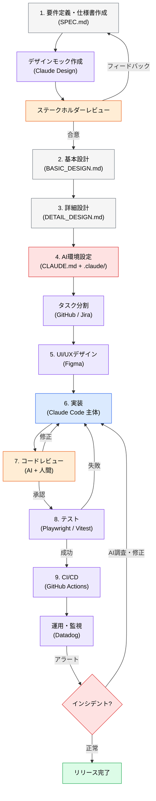
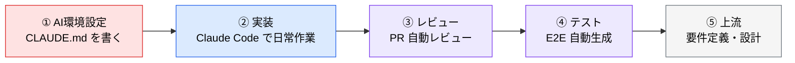

# 開発フロー全体像

> **この記事でわかること**：要件定義から運用までの全体像と、各フェーズでどのツールが効くか。個々の詳細に入る前の地図。

## 結論

AI 駆動開発のフローは、**従来の開発工程に「AI 環境設定」という新しいフェーズが1つ増える**という理解でよい。

```
要件定義 → 基本設計 → 詳細設計 → 【AI環境設定】→ UI/UX → 実装 → レビュー → テスト → CI/CD → 運用
                                    ↑ ここだけが新しい
```

`CLAUDE.md` と `.claude/` を整えるこの工程を飛ばすと、以降の全フェーズで AI の出力が安定しない。

## 背景・課題

「どこから手をつければいいか分からない」という状態は、**全体像がないまま個別のツールの話を聞く**ことから生じる。

先に地図を持てば、次の判断ができる。

- 自分のチームは今どのフェーズが弱いか
- そこで効くツールはどれか
- 今は入れなくていいものはどれか

## 具体的な方法

### 全体フロー



**セキュリティ・ガバナンスは全フェーズに横断的に適用される**（→ [`../22_security/`](../22_security/)）。

### フェーズ別のツール

| フェーズ | 主なツール | 本資料の該当セクション |
| --- | --- | --- |
| 1. 要件定義 | Claude / Apidog / Claude Design | [`../10_requirements/`](../10_requirements/) |
| 2〜3. 設計 | Claude / Postgres MCP | [`../11_design/`](../11_design/) |
| **4. AI環境設定** | **CLAUDE.md / skills / hooks / MCP** | [`../01_claude-code/`](../01_claude-code/) |
| 5. UI/UX | Figma + Figma MCP | [`../12_ui-ux/`](../12_ui-ux/) |
| 6. 実装 | Claude Code / Cursor / Copilot | [`../13_implementation/`](../13_implementation/) |
| 7. レビュー | Claude / Copilot Code Review | [`../14_code-review/`](../14_code-review/) |
| 8. テスト | Playwright MCP / Chrome DevTools MCP | [`../15_test/`](../15_test/) |
| 9. CI/CD | GitHub Actions + Claude Code Action | [`../20_github-claude/`](../20_github-claude/) |
| 運用・監視 | Datadog MCP / Terraform MCP | [`../21_cicd-ops/`](../21_cicd-ops/) |

### 自律エージェントの位置づけ

Devin のような自律エージェントは、**メインの開発フローと並行して動く**。Slack や GitHub Issue 経由でタスクを受け取り、独立して実装・テスト・PR 作成まで行う。フローの中に組み込むというより、横で走らせる形になる。

### 導入順序

全フェーズを同時に変えることはできない。**効果が出やすい順**は次のとおりである。



**①を飛ばさない。** `CLAUDE.md` が無い状態で他を整えても、AI の出力基準が揃わないため効果が薄い。

## 実際のプロンプト例

```text
# 自分のチームの現在地を診断させる
このリポジトリを読んで、AI駆動開発の各フェーズの整備状況を診断して。

| フェーズ | 現状 | 次の1歩 |

で表にして。「整備済み / 部分的 / 未着手」の3段階で判定し、
最も効果が出そうな改善を1つだけ挙げて。
```

```text
# フェーズ間の断絶を探す
docs/ 配下の設計書と、実際の src/ の構成、CLAUDE.md の記述を突き合わせて、
「上流で決めたのに下流に反映されていないもの」を洗い出して。
```

## 注意点

> **フェーズ4（AI環境設定）が新しい。** 従来の開発工程には存在しない。ここを「設定作業」と軽視すると、以降のフェーズすべてで品質が安定しない。

> **上流から順に整備しない。** 要件定義から手を付けたくなるが、効果が見えにくく挫折しやすい。**日常の実装で効果を体感してから上流に戻る**ほうが定着する。

> **ツールを全部揃えない。** 表に挙げたツールは選択肢であって、必須リストではない。フェーズごとに「今困っていること」があるものだけ入れる。

## 参考リンク

- 次に読む：[`02_deliverables-and-dod.md`](02_deliverables-and-dod.md) — 各フェーズの完了条件
- 実践：[`../01_claude-code/`](../01_claude-code/) — フェーズ4の詳細
