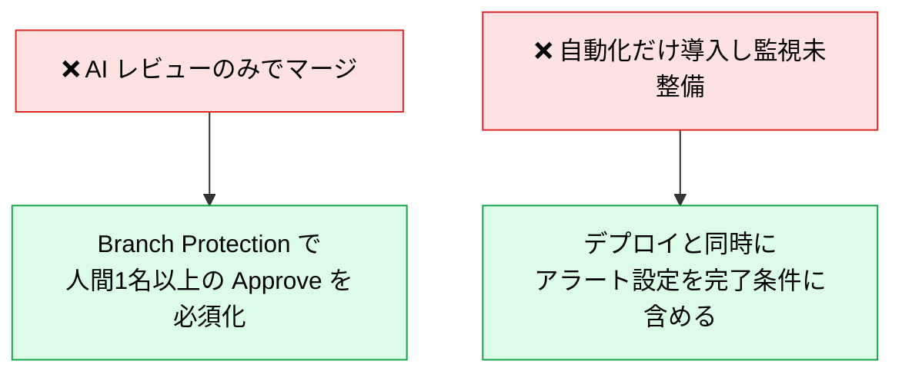

# 各フェーズの成果物と完了条件

> **この記事でわかること**：各フェーズを「終わった」と判断する基準と、そこでよく起きる失敗。

## 結論

**完了条件を決めていないフェーズは、必ず前に進みすぎる。**

AI を使うと各工程が速くなるぶん、「まだ決まっていないのに次に進む」が起きやすい。成果物と完了条件を先に決めておくことが、速度を活かす前提になる。

## 背景・課題

AI 駆動開発でよく起きる失敗は、**速さそのものではなく「速く進んだ結果、後戻りが大きくなる」**ことである。


各フェーズに「ここを満たすまで次に行かない」という線を引く。

## 具体的な方法

### 成果物・完了条件・よくある失敗

| フェーズ | 成果物（配置） | 完了条件 | よくある失敗 |
| --- | --- | --- | --- |
| **1. 要件定義** | `SPEC.md`（`docs/spec/`） | 受け入れ基準と非機能要件が記載済み | 曖昧な目標のまま設計開始 |
| **2. 基本設計** | `BASIC_DESIGN.md`（`docs/basic_design/`）※1 | 各設計書の AI レビュー完了、ステークホルダー合意済み | 設計書なしで詳細設計に着手 / AI に丸投げで人間レビューなし |
| **3. 詳細設計** | `DETAIL_DESIGN.md`（`docs/detail_design/`）※2 | 実装可能な粒度まで詳細化、変更方針と制約が合意済み | 既存制約を無視した設計 / 実装者が解釈できない粒度 |
| **4. AI環境設定** ※3 | `CLAUDE.md` + `.claude/`（ルート直下・固定） | Skills/Hooks/Subagents が配置され、AI が規約に沿って動作することを確認済み | `CLAUDE.md` の肥大化 / コンテキスト管理戦略の未策定 |
| **(4′). タスク分割** ※4 | タスクチケット一覧（Jira / GitHub Issues） | 全タスクにストーリーポイント・優先度・依存関係が設定済み | 粒度が粗すぎて見積もり不能 / 依存関係の未整理 |
| **5. UI/UXデザイン** | Figma ファイル + デザイントークン（`tokens.json`） | Figma MCP 連携済み + トークンがコードに反映済み | スペックなしに Figma で作り込み開始 |
| **6. 実装** | 実装 PR | テスト成功 + 仕様準拠 | 1セッションに複数課題を混在 |
| **7. コードレビュー** | レビュー記録 | AI レビュー + 人間承認 | **AI レビューのみでマージ** |
| **8. テスト** | テスト結果 + 視覚差分レポート | 自動テスト全件通過 + UI 視覚差分が許容範囲内 | E2E テストの未整備 |
| **9. CI/CD・運用** | デプロイ完了 + インシデント対応記録 | デプロイ成功 + ロールバック手順確認 + アラート設定 + IaC 静的解析パス | 自動化だけ導入し監視未整備 |

> **※1**：`BASIC_DESIGN.md` はシステム構成図・ER図・API仕様書・画面遷移図・非機能要件を Mermaid / 表で内包する。
> **※2**：`DETAIL_DESIGN.md` はクラス図・シーケンス図・コンポーネント設計を内包する。
> **※3**：AI環境設定は**設計書とは別カテゴリ（開発環境）**。`docs/` 配下ではなくプロジェクトルート直下に配置する。
> **※4**：タスク分割はフェーズではなく**詳細設計と UI/UX・実装を繋ぐ中間工程**。章番号なし。

### 完了条件に共通する形

上表を眺めると、完了条件は3つの型に分類できる。

| 型 | 例 | 判定者 |
| --- | --- | --- |
| **成果物が存在する** | `SPEC.md` がある | 機械的に判定できる |
| **検証が通っている** | テスト全件通過、静的解析パス | **自動化できる** |
| **人間が合意している** | ステークホルダー合意、人間承認 | **省略できない** |

**2番目は CI に組み込み、3番目は Branch Protection で担保する。** 1番目は hooks でチェックすることもできる。

### 特に守るべき2つ



この2つは**技術的に強制できる**。ルールとして書くだけでなく、設定で担保する。

## 実際のプロンプト例

```text
# 現在のフェーズの完了判定
このプロジェクトの現状を確認して、要件定義フェーズが完了しているか判定して。

判定基準:
- docs/spec/SPEC.md が存在するか
- 受け入れ基準が記載されているか
- 非機能要件（性能・可用性・セキュリティ）が記載されているか

満たしていない項目があれば、何を追記すべきか具体的に示して。
```

```text
# よくある失敗のチェック
このリポジトリで、以下の「よくある失敗」に該当するものがないか確認して。

1. 設計書なしに実装が進んでいる箇所
2. CLAUDE.md が肥大化していないか（行数と、削れそうなルール）
3. 人間の Approve なしでマージできる設定になっていないか
4. デプロイはあるがアラート設定がない箇所

該当するものを、危険度の高い順に報告して。
```

## 注意点

> **完了条件は「終わったことにする理由」ではない。** 形式的に埋めても、後工程で必ず表面化する。特に「ステークホルダー合意済み」は、合意した相手と日付を記録に残す。

> **AI を使うと「成果物が存在する」は簡単に満たせる。** 中身が薄い `SPEC.md` を生成するのは一瞬である。**存在するかではなく、判断に使えるかで見る。**

> **完了条件を増やしすぎない。** 各フェーズ3〜4項目で足りる。多すぎると誰も確認しなくなる。

## 参考リンク

- 関連：[`01_dev-flow-overview.md`](01_dev-flow-overview.md) — フロー全体像
- 関連：[`03_design-doc-structure.md`](03_design-doc-structure.md) — 成果物の配置
- 関連：[`../23_team-workflow/00_adoption-roadmap.md`](../23_team-workflow/00_adoption-roadmap.md) — 導入の進め方
