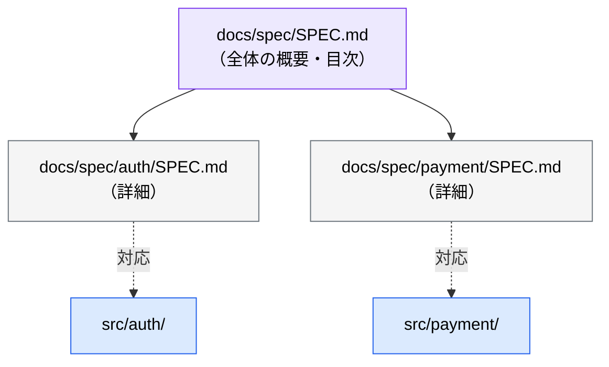

# 設計書ディレクトリの標準

> **この記事でわかること**：AI が設計書を確実に見つけられるディレクトリ構造と、規模別の2パターン。

## 結論

**ファイル名とディレクトリ名を揃える。** これだけで AI の参照精度が上がる。

| カテゴリ | フェーズ | ファイル名 | 配置ディレクトリ |
| --- | --- | --- | --- |
| 設計書 | 要件定義 | `SPEC.md` | `docs/spec/` |
| 設計書 | 基本設計 | `BASIC_DESIGN.md` | `docs/basic_design/` |
| 設計書 | 詳細設計 | `DETAIL_DESIGN.md` | `docs/detail_design/` |
| **開発環境** | AI環境設定 | `CLAUDE.md` + `.claude/` | **プロジェクトルート（固定）** |

**AI 環境設定は設計書ではない。** 別カテゴリとしてルート直下に置く。

## 背景・課題

設計書の置き場所がばらばらだと、次が起きる。

- AI が探せず、「仕様書を読んで」と言っても見つからない
- 人間が毎回パスを指定する羽目になる
- 設計書と実装の対応関係が追えなくなる

**命名を揃えるだけで、`@docs/spec/SPEC.md` のような短い参照で済む。**

## 具体的な方法

### パターンA：小〜中規模プロジェクト（単層）

機能数が少なく、1ファイルで全体を記述できる場合。

```text
プロジェクトルート
├── docs/
│   ├── spec/
│   │   └── SPEC.md
│   ├── basic_design/
│   │   └── BASIC_DESIGN.md
│   └── detail_design/
│       └── DETAIL_DESIGN.md
├── CLAUDE.md              # 開発環境（別カテゴリ）
├── .claude/
│   ├── settings.json
│   ├── commands/
│   ├── skills/
│   └── agents/
└── src/
```

### パターンB：大規模プロジェクト（機能別）

機能数が多い場合、**`src/` のモジュール名と `docs/*/` のサブフォルダ名を一致させる**。これで設計書と実装の対応関係が追跡可能になる。

```text
プロジェクトルート
├── docs/
│   ├── spec/
│   │   ├── SPEC.md                     # プロジェクト全体
│   │   ├── auth/
│   │   │   └── SPEC.md                 # 認証機能の仕様
│   │   └── payment/
│   │       └── SPEC.md                 # 決済機能の仕様
│   ├── basic_design/
│   │   ├── BASIC_DESIGN.md
│   │   ├── auth/
│   │   │   └── BASIC_DESIGN.md
│   │   └── payment/
│   │       └── BASIC_DESIGN.md
│   └── detail_design/
│       ├── DETAIL_DESIGN.md
│       ├── auth/
│       │   └── DETAIL_DESIGN.md
│       └── payment/
│           └── DETAIL_DESIGN.md
├── CLAUDE.md
├── .claude/
└── src/
    ├── auth/                           # docs/*/auth/ と対応
    └── payment/                        # docs/*/payment/ と対応
```

### 運用のポイント



- ルート設計書は「**全体の概要・目次**」として機能させ、詳細は機能別サブフォルダに委譲する
- 機能別設計書は**段階的に追加できる**（最初はルート直下のみ、機能が増えた時点でサブフォルダ化）
- `CLAUDE.md` はモノレポの場合に限りサブディレクトリにも配置可（`./packages/foo/CLAUDE.md`）。**設計書のように `docs/` 配下には置かない**

### 最初からパターンBにしない

機能が3つ以下の段階でサブフォルダを切ると、空のディレクトリと薄いファイルが並ぶだけになる。**パターンAで始め、1ファイルが読みづらくなった時点で分割する。**

## 実際のプロンプト例

```text
# 既存プロジェクトの棚卸し
このリポジトリの docs/ 配下を読んで、
設計書の配置が標準（docs/spec/SPEC.md 等）に沿っているか確認して。

沿っていない場合、移動先の対応表を作って。
実際の移動はまだしないで。
```

```text
# パターンBへの移行判断
現在の docs/spec/SPEC.md の行数と、扱っている機能の数を確認して。
機能別サブフォルダへの分割が必要な段階か判定して。

分割すべきなら、どの単位で分けるか（src/ のモジュール構成と揃える前提で）提案して。
```

```text
# 設計書と実装の乖離チェック
docs/detail_design/ 配下の設計書と、対応する src/ の実装を突き合わせて、
設計書に書かれているが実装されていない項目を一覧にして。
逆に、実装にあるが設計書に無いものも列挙して。
```

## 注意点

> **AI 環境設定を `docs/` に入れない。** `CLAUDE.md` と `.claude/` は「設計書」ではなく「開発環境」である。Claude Code はプロジェクトルートの `CLAUDE.md` を読むため、移動すると読まれなくなる。

> **命名を途中で変えない。** 一度決めたら守る。`SPEC.md` と `spec.md` と `要件定義.md` が混在すると、`@` 参照が効かなくなる。

> **設計書は生成して終わりにしない。** 実装が進むと乖離する。定期的に突き合わせる仕組みを作る（→ [`../02_mcp/14_apidog.md`](../02_mcp/14_apidog.md)）。

## 参考リンク

- 関連：[`02_deliverables-and-dod.md`](02_deliverables-and-dod.md) — 各フェーズの成果物
- 関連：[`../01_claude-code/09_directory-structure.md`](../01_claude-code/09_directory-structure.md) — `.claude/` 側の構成
