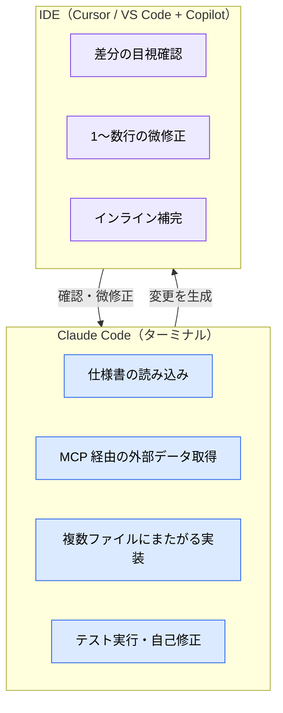

# Claude Code とは何か

> **この記事でわかること**：Claude Code が「補完ツール」ではなく「エージェント」である理由と、IDE 系 AI ツールとの役割分担の決め方。

## 結論

Claude Code は **ターミナル常駐の自律エージェント**である。コード補完ではなく、「調べる → 計画する → 変更する → 検証する」というループを人間の代わりに回す。したがって IDE 系ツールと競合するのではなく、**重い文脈処理は Claude Code、差分確認と微修正は IDE** という分業が最も効率が良い。

## 背景・課題

AI コーディングツールを導入したチームが最初に躓くのは、「Copilot も Cursor も Claude Code も入れたが、どれをいつ使うのか決まっていない」状態である。ツールの性質を「補完型」と「エージェント型」に分けて理解しないと、この整理はできない。

| 型 | 代表 | 動作単位 | 人間の関与 |
| --- | --- | --- | --- |
| **補完型** | GitHub Copilot（インライン補完） | 数行〜1関数 | 常時（Tab を押すのは人間） |
| **IDE 統合型** | Cursor / Windsurf | ファイル〜機能単位 | 頻繁（エディタ上で対話） |
| **エージェント型** | **Claude Code** / Devin | タスク全体（複数ファイル・テスト実行まで） | 節目のみ（計画承認・PR レビュー） |

> 各ツールの詳細比較は [`../13_implementation/01_ide-comparison.md`](../13_implementation/01_ide-comparison.md) で扱う。ここでは「Claude Code がどの型か」だけ押さえる。

補完型は「書く速度」を上げる。エージェント型は「書かずに済ませる」。この違いを踏まえないと、エージェントに補完型の使い方をして「思ったほど速くない」という感想になる。

## 具体的な方法

### エージェントとしての動作ループ


重要なのは **Verify のループが閉じていること**である。Claude Code は自分でテストを実行して結果を読めるため、失敗すれば自分で直す。逆に言えば、**検証手段を渡していないタスクでは品質が安定しない**。

### 検証手段を先に渡す

Claude Code に対する最大レバレッジの施策は「成果を確認する方法」を渡すことである。

| 戦略 | 弱い指示 | 強い指示 |
| --- | --- | --- |
| テスト基準を提供 | 「メールのバリデーションを実装して」 | 「`validateEmail` を実装して。テストケース: `user@example.com`=true, `invalid`=false。実装後にテストを実行して」 |
| UI を視覚的に検証 | 「ダッシュボードの見栄えを良くして」 | 「[スクショ添付] このデザインを実装して。結果をスクショして比較し、差分をリストアップして修正して」 |
| 根本原因を提示 | 「ビルドが失敗している」 | 「ビルドが [エラー] で失敗する。修正し、成功するか検証して。エラーを握りつぶさず根本原因を解決して」 |

### 提供形態

同じエージェントが複数の入口から使える。プロジェクトに置いた設定（`CLAUDE.md` / `.claude/`）は各形態で共通に効くが、`~/.claude/`（ユーザースコープ）はローカル環境の設定であり Web や GitHub Actions では読まれない。

| 形態 | 用途 | 特徴 |
| --- | --- | --- |
| **CLI（ターミナル）** | メインの作業場所 | 非対話モード（`claude -p`）でスクリプト・CI に組み込める |
| **IDE 拡張**（VS Code / JetBrains） | 差分の視覚確認 | エディタ上で diff をレビューできる |
| **デスクトップアプリ**（Mac / Windows） | 長時間タスクの並行実行 | ターミナルを占有しない |
| **Web**（claude.ai/code） | 環境構築なしの利用 | クラウド上で実行 |
| **GitHub Actions** | 自動化 | PR レビュー・`@claude` 対話（→ [`../20_github-claude/`](../20_github-claude/)） |

### IDE 系ツールとの分業



この分業を推奨する実務上の理由は **コンテキスト消費**にある。MCP サーバーを IDE に大量接続すると、ツール定義がエディタ側のコンテキストを圧迫し、本来の補完・レビューまで劣化する。重い外部接続は Claude Code に寄せるのが安全である（→ [`10_context-management.md`](10_context-management.md)）。

> **実装フェーズの具体的な進め方**（Explore → Plan → Implement → Commit の4ステップ、コンテキスト節約のコマンドパターン、Writer/Reviewer パターン）は [`../13_implementation/00_claude-code-practice.md`](../13_implementation/00_claude-code-practice.md) に集約している。本記事では扱わない。

## 実際のプロンプト例

エージェントらしい使い方の基本形は、**Explore → Plan → Implement → Commit** の4ステップである。

```text
1. Explore（読ませる）
@src/auth を読んで、現在のセッション管理の仕組みを理解して。
まだ何も変更しないで。

2. Plan（計画させる）
Google OAuth を追加したい。どのファイルにどんな変更が必要か、計画を作成して。

3. Implement（実装させる）
計画通りに OAuth フローを実装して。テストも書いて、失敗したら修正して。

4. Commit
説明的なメッセージでコミットし、PR を作成して。
```

コンテキストを節約する入力パターンも覚えておく。

```bash
# ファイルを直接参照する（AI に探させない）
> @./src/auth/session.ts をレビューして

# 2ファイルを比較させる
> @./old.js と @./new.js の実装を比較して

# 標準入力からデータを渡す
cat error.log | claude -p "このエラーの原因を分析して"

# git 履歴から背景を調べさせる
> ExecutionFactory の git 履歴を確認し、API がどう進化したか要約して
```

## 注意点

> **Plan Mode は常に使うものではない。** 変更が複数ファイルにまたがる場合、アプローチが不確かな場合、慣れていないコードを扱う場合に使う。1文で差分を説明できるタスクで計画を挟むのは、時間とトークンの無駄になる。

> **`--permission-mode` の値は `default` / `acceptEdits` / `plan` / `bypassPermissions` である。** `auto` という値は存在しない。編集を自動承認したいなら `acceptEdits`、すべての確認を飛ばす `bypassPermissions`（および `--dangerously-skip-permissions`）は**コンテナ等の隔離環境かつネットワーク制限とセット**でのみ使う。

> **「AI が賢くなる」のではなく「渡す情報と役割の設計で結果が決まる」。** Claude Code の出力品質は、モデルの性能より `CLAUDE.md` / skills / 検証手段の設計で決まる部分が大きい。次章以降はその設計方法を扱う。

## 参考リンク

- [Claude Code 公式ドキュメント](https://docs.anthropic.com/ja/docs/claude-code/)
- 関連：[`02_architecture.md`](02_architecture.md) — 内部でどう動いているか
- 関連：[`03_claude-md.md`](03_claude-md.md) — 最初に整備すべき設定ファイル
