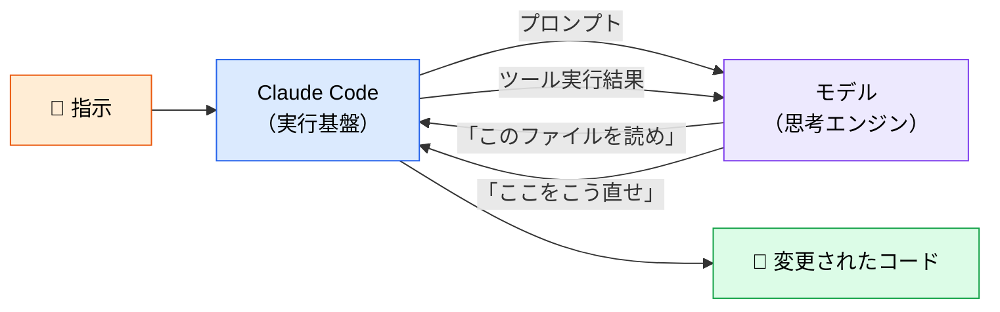

# モデルとは何か、どう選ぶか

> **この記事でわかること**：Claude Code の「モデル」が何を指すか、Fable 5 / Opus 5 / Sonnet 5 / Haiku 4.5 をどう使い分けるか、そして設定にバージョン固定IDを書いてはいけない理由。

## 結論

**日常のコーディングは Sonnet 5（デフォルト）で足りる。** 迷ったら変えなくてよい。変えるべきは次の2ケースだけである。

- **軽い定型作業**（書式チェック・分類・要約）→ `haiku` に落としてコストと速度を稼ぐ
- **深い判断**（アーキテクチャ評価・難しいバグの根本原因）→ `opus`、それでも足りなければ Fable 5

そして設定ファイルには **エイリアス（`sonnet` / `opus` / `haiku`）** を書く。`claude-sonnet-4-6` のようなバージョン固定IDは、モデル更新のたびに陳腐化して実挙動とドキュメントがずれる。

## 背景・課題

「モデル」とは、Claude Code の**思考エンジンそのもの**である。Claude Code は入れ物（ツール実行・ファイル操作・権限管理）であり、実際に「どう直すか」を考えているのはモデルだ。



同じ Claude Code でも、モデルを変えれば**判断の質・速度・コスト**がすべて変わる。逆に言えば、モデルを変えても「何を読ませるか」「どう検証させるか」の設計が悪ければ結果は改善しない。**モデル選定は最後の調整項目**であり、最初の打ち手ではない。

## 具体的な方法

### モデル一覧（2026年8月時点）

| モデル | エイリアス | モデルID | 位置づけ |
| --- | --- | --- | --- |
| **Claude Sonnet 5** | `sonnet` | `claude-sonnet-5` | **デフォルト。** 日常のコーディング全般 |
| **Claude Opus 5** | `opus` | `claude-opus-5` | 複雑なアーキテクチャ設計・深い判断 |
| **Claude Fable 5** | （なし） | `claude-fable-5` | 最難度の推論・長期エージェント |
| **Claude Haiku 4.5** | `haiku` | `claude-haiku-4-5-20251001` | 高速・低コスト。単純タスクの大量処理 |

> **Fable 5 にはエイリアスがない。** 例外的にモデルID を直接指定する。世代が更新されたら見直す対象として、設定の棚卸しリストに載せておく。

### 料金とプランの考え方

具体的な単価は変動するため公式の料金ページを参照するが、**判断に必要なのは相対比と契約形態**である。

| 観点 | 押さえること |
| --- | --- |
| **相対単価** | `haiku` < `sonnet` < `opus` < Fable 5 の順に高い。**桁が変わる**ため、並列実行で opus を複数使うと請求が跳ねる |
| **契約形態** | 定額のシート契約（Max / Team）と API キーの従量課金がある。**個人の日常利用はシート、CI での自動処理は API キー**が基本形 |
| **レート上限** | シート契約には利用上限がある。**上限に当たるとチーム開発が止まる**ため、当たったときの運用（`haiku` へ落とす、時間帯を分散する）を事前に決めておく |

> 上限に当たったときの計画がないまま導入すると、繁忙期に全員の手が止まる。**導入前に「止まったらどうするか」を決める**のが、料金試算より重要である。

### タスク別の選び方

| タスク | 推奨 | 理由 |
| --- | --- | --- |
| 日常的なコーディング | **Sonnet 5** | 速度・品質・コストのバランスが最良 |
| 複雑なアーキテクチャ設計 | Opus 5 | 制約が絡み合う判断で差が出る |
| 最難度の推論・長時間の自律実行 | Fable 5 | 長い依存関係を追い切れる |
| 書式チェック・分類・要約 | Haiku 4.5 | パターンマッチ中心なら品質差が出にくい |
| CI での大量自動処理 | Haiku 4.5 | 単価が効いてくる領域 |
| 規制産業・Azure 統制下 | Claude on Azure | Azure AI Foundry 経由で利用可能 |

### サブエージェントへの割り当て

モデル選定が最も効くのは、**サブエージェントごとに役割とモデルを対応させる**ときである（→ [`05_sub-agents.md`](05_sub-agents.md)）。

```markdown
---
name: format-checker
description: Markdown の書式・Mermaid 構文をチェックする
tools: Read, Grep
model: haiku          # パターンマッチ中心なので haiku で十分
---
```

```markdown
---
name: senior-engineer-reviewer
description: ベテラン視点で実用性・アーキテクチャ妥当性をレビューする
tools: Read, Glob
model: opus           # 深い判断が要るので opus
---
```

判断基準は単純である。

| `model` 指定 | 使うとき |
| --- | --- |
| `haiku` | 答えが機械的に決まる（形式・分類・抽出） |
| `sonnet` | 調査・執筆・標準レビューなど大半のタスク |
| `opus` | トレードオフの判断が要る（設計評価・実務妥当性） |

### 異種モデルの併用

Claude 単独で完結させず、フェーズごとに得意なモデルへ切り替える方法もある。

| モデル系統 | 得意領域 | 推奨用途 |
| --- | --- | --- |
| **Claude 5 系** | 長文コンテキスト保持・深い対話・安定性 | 要件ヒアリング、`SPEC.md` 起草、実装 |
| **GPT 系** | 構造化ドキュメント整形・網羅的な観点出し | 仕様書のレビュー、抜け漏れチェック |
| **Gemini 系** | マルチモーダル（画像・PDF）理解、速度 | 既存資料・スクショからの要件抽出 |

複数モデルに同じ問いを解かせて指摘を突き合わせる手法は、精度向上に有効とされる（→ [`../04_multi-agent/01_multi-model-debate.md`](../04_multi-agent/01_multi-model-debate.md)）。

## 実際のプロンプト例

```text
# セッション中にモデルを切り替える
/model opus

# この判断だけ重いモデルに任せたい、というとき
このモジュール分割案について、5年後の保守性の観点でトレードオフを評価して。
判断が割れる点があれば、両論を併記して。
```

```bash
# 非対話モードでモデルを指定する（CI での一括処理）
claude -p "すべての Lint エラーを修正して" --model haiku
```

## 注意点

> **Sonnet 5 以降の仕様変更に注意。** Adaptive Thinking がデフォルト ON になり、手動の Extended Thinking 設定は廃止された（設定すると 400 エラー）。`temperature` / `top_p` / `top_k` を非デフォルト値にしても 400 エラーになる。旧世代向けのコードをそのまま移植しないこと。

> **トークン計上が変わっている。** 新トークナイザーにより、同一テキストでも約30%多くトークンが計上される。旧モデル時代のコスト試算をそのまま使うと見誤る。コンテキスト窓は Sonnet 5 / Opus 5 / Fable 5 いずれも 1M トークン。

> **設定にバージョン固定IDを書かない。** `.claude/agents/*.md` の `model:` には必ずエイリアス（`sonnet` / `opus` / `haiku`）を書く。固定IDはモデル世代が変わるたびに古い挙動へ張り付き、ドキュメントとの乖離を生む。

> **正確な単価・プラン条件は公式の料金ページで確認する。** 本記事の相対比は 2026年8月時点の目安であり、数値は変動する。

> **モデルを上げる前に、渡している情報を見直す。** 「Opus にしても直らない」ケースの大半は、モデルの能力不足ではなく、必要なファイル・仕様・検証手段を渡していないことが原因である。

## 参考リンク

- [Claude Code 公式ドキュメント](https://docs.anthropic.com/ja/docs/claude-code/)
- 関連：[`05_sub-agents.md`](05_sub-agents.md) — 役割ごとのモデル割り当て
- 関連：[`10_context-management.md`](10_context-management.md) — コンテキストとコストの関係
