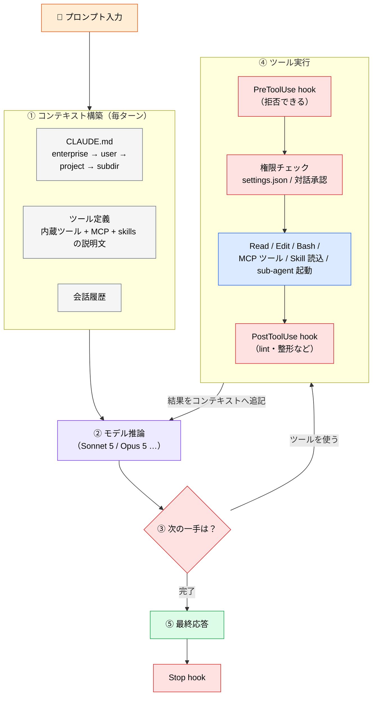
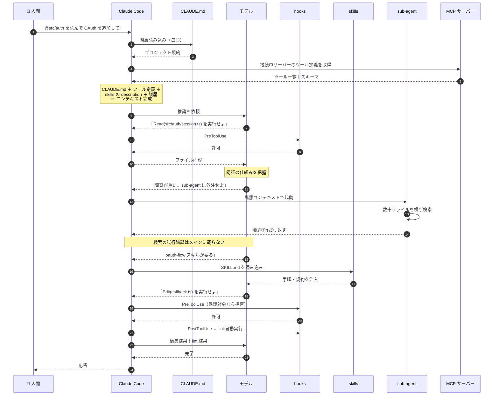
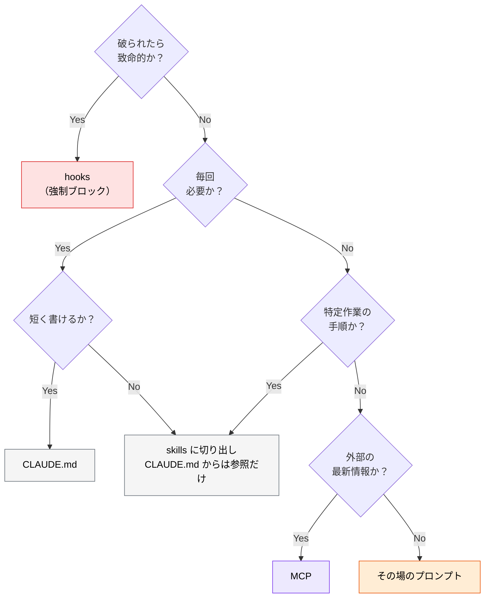

# Claude Code の構成図 ― プロンプトを入れると何が起きるか

> **この記事でわかること**：プロンプトを1行入力してから応答が返るまでに、`CLAUDE.md` / skills / sub-agent / hooks / MCP がどの順番で関わるか。そして「何がコンテキストに載るか」という一点で、これら全部品の設計方針が導けること。

## 結論

Claude Code の全部品は、**「モデルに渡すコンテキストへ、何を・いつ載せるか」** を制御する仕組みだと理解すればよい。

| 部品 | コンテキストに載るタイミング | 載る量 |
| --- | --- | --- |
| **CLAUDE.md** | セッション開始時に読み込み、毎ターン送信 | 全文（だから短く保つ） |
| **MCP** | 接続中は常時（**ツール定義が**） | サーバー数に比例（だから棚卸しする） |
| **skills** | 必要と判断されたときだけ | 説明文は常時 / 本文は使用時のみ（`<name>/SKILL.md` 形式に限る） |
| **sub-agent** | **載らない**（結果の要約だけ返る） | ほぼゼロ（だから重い調査を外注する） |
| **hooks** | 載らない（コンテキスト外で実行） | ゼロ（だから確実性が要るルールに使う） |

この表が本記事の要約である。以降はこの動きを順に追う。

## 背景・課題

Claude Code の設定項目は多い。`CLAUDE.md`、`.claude/skills/`、`.claude/agents/`、`settings.json` の hooks、`.mcp.json` の MCP サーバー——初見では「どれに何を書けばいいのか」が判断できない。

判断できない原因は、**実行時にそれらがどう合流するかを知らない**ことにある。逆に処理の流れさえ掴めば、「このルールは CLAUDE.md か skills か hooks か」は自動的に決まる。

## 具体的な方法

### 全体像



**④ → ② のループ**が本体である。Claude Code は一度で答えを出すのではなく、「ツールを実行 → 結果を読む → 次を考える」を完了まで繰り返す。ループが回るたびにコンテキストは増え続ける。ここが後述の設計指針すべての根拠になる。

### 時系列で追う

具体例として「`@src/auth` を読んで OAuth を追加して」という指示を追う。



### 部品ごとの役割

前掲の流れを、設計判断に使える形に整理する。

| 部品 | 実行される場所 | 効き方 | 向いているもの |
| --- | --- | --- | --- |
| **CLAUDE.md** | コンテキスト内（常時） | 強い示唆。ただし**守らないこともある** | 全タスク共通の規約 |
| **skills** | コンテキスト内（必要時） | 強い示唆。使用時のみ消費 | 特定ドメインの知識・手順 |
| **sub-agent** | 別コンテキスト | メインを汚さず並列で働く | 重い調査、独立した観点のレビュー |
| **hooks** | **コンテキスト外**（シェル） | **強制。モデルは拒否できない** | 破ってはいけない禁止事項、自動整形 |
| **MCP** | 外部プロセス | リアルタイムの事実を注入 | 知識カットオフ後の情報、社内データ |

> **最重要の区別**：`CLAUDE.md` と skills は「お願い」であり、hooks は「強制」である。「絶対に `migrations/` を触るな」のような要件は、CLAUDE.md に書くだけでは不十分で、PreToolUse hook でブロックする必要がある。

### 「どこに書くか」の判断フロー



### コンテキストの収支

ループが回るほどコンテキストは増える。増え方を部品ごとに把握しておくと、劣化の原因を切り分けられる。

| 増える要因 | 増え方 | 対処 |
| --- | --- | --- |
| CLAUDE.md | 固定（毎回同じ量） | 短く保つ（経験則として200行程度が目安） |
| MCP ツール定義 | サーバー数に比例、**固定的に**消費 | 使わない MCP を切る |
| ファイル読み込み | 読んだ分だけ累積 | `@` で対象を限定、Serena MCP で symbol 単位に |
| ツール実行結果 | 実行のたびに累積 | 重い調査は sub-agent へ |
| 会話履歴 | ターンごとに累積 | `/clear`・`/compact` |

> コンテキスト使用率が **60〜70% 程度**（経験則の目安）を超えると出力品質の低下が顕著になる。100% を待たずにセッションを切り替える（→ [`10_context-management.md`](10_context-management.md)）。

## 実際のプロンプト例

構成を理解しているかどうかで、指示の書き方は変わる。

```text
# ❌ 構成を知らない指示
決済まわりを直して。

# ✅ 構成を踏まえた指示
まず sub-agent で決済フローの現状を調査して、影響範囲を3行で要約して。
（メインコンテキストを汚さずに全体像を掴む）

そのうえで @src/payment/charge.ts の該当箇所だけ読んで、
CLAUDE.md のエラーハンドリング規約に従って修正して。
修正後は npm test を実行して、失敗したら根本原因を直して。
```

自分の環境で何が読み込まれているかは、次で確認できる。

```bash
# 読み込まれている CLAUDE.md・設定の確認
/memory

# 接続中の MCP サーバーとツール数
/mcp

# hooks の設定確認
/hooks

# コンテキスト使用状況
/context
```

## 注意点

> **CLAUDE.md は「読まれる」が「必ず守られる」わけではない。** コンテキストが膨らむほど、冒頭に置いた規約の影響力は薄まる。守らせたい度合いが高い順に `hooks > CLAUDE.md > skills > その場の指示` と考え、重要なものほど強制力のある層に置く。

> **MCP は「繋いだ瞬間から」コストを払っている。** 実際に呼び出さなくても、ツール定義とスキーマは毎ターン送信される。「便利そうだから入れておく」を繰り返すと、モデルの注意力が分散して精度が落ちる。

> **設定を変えたらセッションを再起動する。** `CLAUDE.md` / `.mcp.json` / `agents` / `hooks` はセッション開始時に読み込まれるため、編集しても実行中のセッションには反映されない。「CLAUDE.md に書いたのに守らない」の相当数は、単に再起動していないだけである。`/memory` で実際に読み込まれている内容を確認する。

> **信頼できない入力もコンテキストに載る。** Web ページ、MCP 経由で取得した外部データ、Issue の本文——これらはすべてモデルが読む。そこに書かれた指示めいた文字列が意図せず作用しうる（プロンプトインジェクション）。外部由来の内容は「データ」として扱わせる指示を添える（→ [`../22_security/`](../22_security/)）。

> **sub-agent は万能な軽量化手段ではない。** 隔離されている＝メインの文脈を知らない、ということでもある。前提を持たせないと的外れな調査結果が返る。委譲時は「何を前提に、何を、どの形式で返すか」を明示する。

## 参考リンク

- [Claude Code 公式ドキュメント](https://docs.anthropic.com/ja/docs/claude-code/)
- 次に読む：[`03_claude-md.md`](03_claude-md.md) → [`04_skills.md`](04_skills.md) → [`05_sub-agents.md`](05_sub-agents.md) → [`06_hooks.md`](06_hooks.md)
- 組み合わせ方の実例：[`08_combination-patterns.md`](08_combination-patterns.md)
