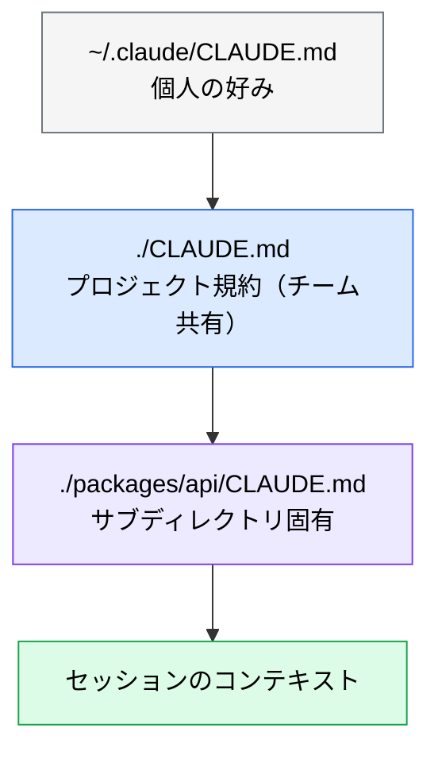

# CLAUDE.md の設計

> **この記事でわかること**：毎セッション読み込まれる「プロジェクトの憲法」に何を書き、何を書かないか。そして肥大化を防ぐ判断基準。

## 結論

CLAUDE.md は **200 行以内**に保つ。判断基準は1つだけ。

> **「これを削除すると Claude が間違いを起こすか？」→ No なら削除する。**

書きたくなる情報の大半は、(a) Claude が既に知っている、(b) 頻繁に変わる、(c) 特定作業でしか使わない、のいずれかである。(c) は skills に切り出す。

## 背景・課題

CLAUDE.md は毎セッションの開始時に**全文がコンテキストへ載る**。つまり書けば書くほど、以下が同時に起きる。

- 常時消費されるトークンが増える
- 会話が進むにつれ、相対的に規約の存在感が薄れる
- **下部に書いた指示ほど無視されやすくなる**

「守ってほしいから詳しく書く」が、「長いから守られなくなる」を招く。これが CLAUDE.md 設計の中心的な難しさである。

## 具体的な方法

### 配置場所と優先度

CLAUDE.md は階層的に読み込まれ、より具体的なスコープが優先される。

| 配置場所 | 用途 | Git 管理 |
| --- | --- | --- |
| `~/.claude/CLAUDE.md` | 全プロジェクト共通の個人設定 | しない |
| `./CLAUDE.md` | **プロジェクトルート（チーム共有の本体）** | する |
| `./subdir/CLAUDE.md` | サブディレクトリ固有ルール（モノレポ向け） | する |



> チーム共有したいものは必ず `./CLAUDE.md`（Git 管理下）に書く。`~/.claude/` に書くと自分の環境でしか効かず、「自分の手元では守られるのに CI では守られない」という混乱を生む。

### 含めるべき 10 項目

| # | セクション | 内容例 |
| --- | --- | --- |
| 1 | プロジェクト概要 | 技術スタック・目的・制約 |
| 2 | コードスタイル | ESModule/CommonJS の選択、命名規則 |
| 3 | ディレクトリ構造 | 重要フォルダの役割 |
| 4 | テスト方針 | フレームワーク・単体テストの粒度 |
| 5 | ビルド・実行コマンド | `npm run dev`、`npm test` など |
| 6 | ブランチ・PR 規約 | ブランチ命名・コミットメッセージ形式 |
| 7 | アーキテクチャ上の制約 | 使ってはいけないパターン・ライブラリ |
| 8 | 環境変数・設定 | 必須の環境変数名（**値は書かない**） |
| 9 | よくある落とし穴 | プロジェクト固有の注意点 |
| 10 | 外部ドキュメントへのリンク | 設計書・API 仕様書のパス or URL |

### 書き方の実例

```markdown
# コードスタイル (Code style)

- CommonJS (require) ではなく、必ず ES modules (import/export) 構文を使用すること
- 可能な限り import の分割代入を使用すること（例: import { foo } from 'bar'）

# ワークフロー (Workflow)

- 一連のコード変更が完了したら、必ず型チェック (typecheck) を実行すること
- パフォーマンスのため、テスト全体ではなく単一のテストを実行することを優先すること

# アーキテクチャ (Architecture)

- API ルートは /src/api に、共有の型定義は /src/types に配置すること
- /internal ディレクトリ内にあるものを、そのディレクトリ外から絶対にインポートしないこと

# テスト (Testing)

- ユニットテストには Vitest、E2E テストには Playwright を使用すること
- 開発中の迅速な確認には `npm run test:unit` を実行すること

# 禁止事項 (DO NOT)

- シークレット情報や API キーをコミットしないこと
- 明示的な指示がない限り /migrations フォルダを変更しないこと
- コメントでの明確な正当化理由なしに TypeScript の any 型を使用しないこと
```

書き方のコツは3つある。

- **具体的な命令形で書く。** 「読みやすいコードを書く」ではなく「関数は 50 行以内にする」
- **禁止事項は独立セクションにする。** 埋もれさせない
- **理由は1行まで。** 理由が無いとルールの遵守率が下がり、半年後に人間が「これは消してよいか」を判断できなくなる。ただし長い背景説明が要るものは skills 側に置く

### 肥大化を防ぐ

| 書かないもの | 理由 |
| --- | --- |
| Claude が既に知っていること | 「React ではフックをトップレベルで呼ぶ」等は不要 |
| 頻繁に変わる情報 | 更新されない古い記述はむしろ有害 |
| 特定ドメインの詳細手順 | skills に切り出す |
| API 仕様の全文 | `@docs/api/SPEC.md` のようにリンクで参照させる |

`@path/to/file` 構文でファイルをインポートできる。

> **ただしインポートは先読みで展開される。** CLAUDE.md 本体の行数は減るが、**コンテキスト消費は減らない**。「短く見せる」効果はあっても「軽くする」効果はない点に注意する。本当に消費を減らしたいなら、skills に切り出して必要時のみ読ませる。

```markdown
# 設計書

- API 仕様: @docs/spec/API.md
- DB スキーマ: @docs/design/SCHEMA.md
```

### CLAUDE.md と skills の使い分け

| | CLAUDE.md | skills |
| --- | --- | --- |
| 読み込みタイミング | 毎セッション常時 | 必要なときだけ |
| 向いているもの | 全タスクに適用されるルール | 特定ドメインの知識・手順 |
| コンテキスト消費 | 常に消費 | 使用時のみ |

判断は単純である。**「全部のタスクで要るか？」→ Yes なら CLAUDE.md、No なら skills。**

### Cursor を併用する場合

Cursor では `.cursorrules` は非推奨となり、`.cursor/rules/` 配下の `.mdc` ファイルで管理する。

```text
.cursor/
  rules/
    general.mdc         # 全体ルール
    typescript.mdc      # TypeScript 固有
    testing.mdc         # テスト規約
```

```yaml
---
description: TypeScript のコーディング規約
globs: ["**/*.ts", "**/*.tsx"]
---
# TypeScript ルール
- 常に strict モードを使用すること
- ユニオン型には interface より type を優先して使用すること
- 'any' は絶対に使用せず、代わりに 'unknown' を使用すること
```

`globs` で適用対象を絞れる点が CLAUDE.md との違いである。両方使う場合、**規約の実体は一方に置き、他方からは参照する**ことで二重管理を避ける。

## 実際のプロンプト例

```text
# 既存リポジトリから CLAUDE.md の叩き台を生成する
/init

# 肥大化した CLAUDE.md を棚卸しする
@CLAUDE.md を読んで、各ルールを次の基準で分類して。

A: 削除するとあなたが間違いを起こす（残す）
B: あなたが既に知っている一般知識（削除）
C: 特定作業でしか使わない（.claude/skills/ へ切り出し）
D: 頻繁に変わる情報（外部ファイルへのリンクに置換）

分類結果を表で示し、B・C・D を除いた場合の行数も教えて。
```

```text
# 実際に守られているかを検証する
CLAUDE.md の「禁止事項」に反している箇所が現在のコードベースにないか、
違反していそうなファイルを列挙して。
```

## 注意点

> **CLAUDE.md は「お願い」であって「強制」ではない。** 破られたら困るルール（マイグレーション保護、シークレット混入防止）は hooks でブロックする。CLAUDE.md への記載だけで安心しないこと（→ [`06_hooks.md`](06_hooks.md)）。

> **環境変数は「名前」だけ書き、「値」は絶対に書かない。** CLAUDE.md は Git 管理下に置くファイルである。

> **200 行は経験則の目安であって、機械的な上限ではない。** 超えたら即座に削るのではなく、「今日のタスクで実際に効いたルールはどれか」を数セッション観察してから削る。使われていないルールは、書いた本人にしか価値が見えていない。

## 参考リンク

- [Claude Code 公式ドキュメント](https://docs.anthropic.com/ja/docs/claude-code/)
- 関連：[`04_skills.md`](04_skills.md) — 切り出し先
- 関連：[`06_hooks.md`](06_hooks.md) — 強制力が必要なルール
- 関連：[`09_directory-structure.md`](09_directory-structure.md) — 設定ファイル全体の配置
