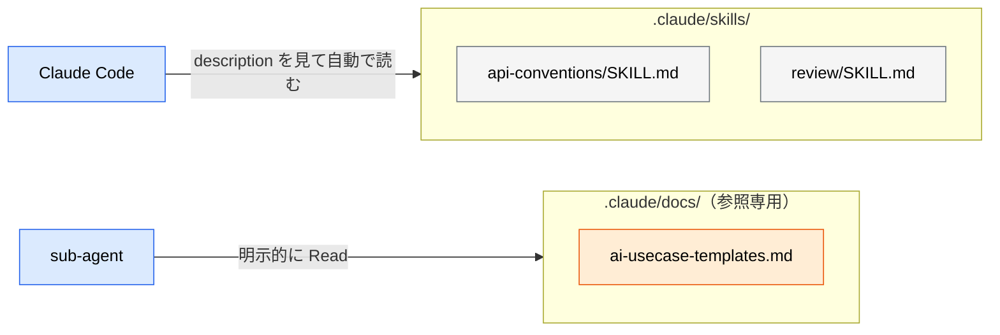
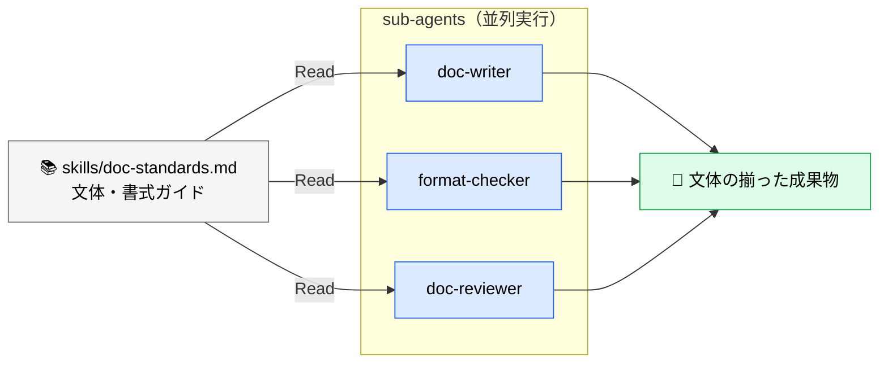

# skills とは

> **この記事でわかること**：`.claude/skills/` に置く共有ナレッジの役割と、CLAUDE.md から何を切り出すべきかの判断。

## 結論

skills は **「必要になったときだけ読み込まれる知識・手順」** である。CLAUDE.md が「常時ロードされる憲法」なら、skills は「棚から取り出す専門書」にあたる。

切り出す判断は1つ。**「全タスクで要るか？」→ No なら skills。**

そして**形式を間違えると自動発火しない**。ここが最初の関門である。

| 形式 | パス | 挙動 |
| --- | --- | --- |
| **スキル** | `.claude/skills/<name>/SKILL.md` | frontmatter の `description` が常時ロードされ、**モデルが必要時に自動で読む** |
| 参照ドキュメント | `.claude/skills/foo.md`（フラット） | 自動発火**しない**。`@` で明示参照するか Read させる |

**ディレクトリ + `SKILL.md`** がスキルの必須形式である。フラットな `.md` を置いても「ただのファイル」にしかならない。

## 背景・課題

CLAUDE.md にすべてを書くと、200 行を超えて指示が無視され始める。かといって、プロジェクト固有の API 設計規約やテスト生成ルールは、どこかに書いておかないと毎回プロンプトで説明する羽目になる。

skills はこの中間を埋める。**説明文（description）だけが常時コンテキストに載り、本文はモデルが「これが必要だ」と判断したときに初めて読み込まれる**。この段階的な開示によって、知識の量とコンテキスト消費を切り離せる。



> 自動発火させたいものと、明示的に読ませる参照ドキュメントは**置き場所を分ける**と混同しない。後者を `.claude/docs/` などに分離しておくと、「description を工夫したのに呼ばれない」という迷いが構造的に消える。

## 具体的な方法

### 3つの種別

| 種別 | 例 | 用途 |
| --- | --- | --- |
| **knowledge**（知識） | `api-conventions/SKILL.md` | 文体・規約・設計パターンの共有 |
| **command**（手順） | `review/SKILL.md` | 繰り返し実行するタスクフローの定義 |

いずれも `<name>/SKILL.md` の形式で置く。**command 型は `/review` のようにスラッシュコマンドとしても呼べる**ため、定型作業をコマンド化すればチームの誰が実行しても同じ手順が走る。

> 人間が明示的に呼ぶことしか想定しない定型フローは、`.claude/commands/deploy.md` のように **`commands/` に置く**選択肢もある（→ [`09_directory-structure.md`](09_directory-structure.md)）。

### 基本形

`.claude/skills/api-conventions/SKILL.md` として配置する。

```markdown
---
name: api-conventions
description: プロジェクトの REST API 設計規約。API のエンドポイント追加・変更時に参照する
---

# API 設計規約

- URL パスにはケバブケース（kebab-case）を使用すること
- JSON のプロパティにはキャメルケース（camelCase）を使用すること
- リストを返すエンドポイントには必ずページネーションを含めること
- URL パスに API のバージョンを含めること（/v1/, /v2/ など）
```

**`description` が最重要である。** モデルはこの一文だけを見て「今このスキルが必要か」を判断する。したがって、

- ❌ `description: API について` — いつ使うか分からない
- ✅ `description: プロジェクトの REST API 設計規約。API のエンドポイント追加・変更時に参照する` — 発動条件が明確

「**何が書いてあるか**」に加えて「**いつ使うか**」を必ず書く。

### 典型的な skill 群

| パス | 内容 |
| --- | --- |
| `api-conventions/SKILL.md` | REST API の設計規約 |
| `db-schema/SKILL.md` | データベース設計規約・命名規則 |
| `test-generation/SKILL.md` | テスト生成のルール（境界値・命名・配置） |
| `figma-mcp/SKILL.md` | デザイン連携の手順 |
| `fix-issue/SKILL.md` | GitHub Issue 修正のワークフロー |
| `doc-standards/SKILL.md` | ドキュメントの文体・書式ガイド |

### sub-agent との連携

skills の真価は、**複数の sub-agent に同じ知識を読ませて出力を揃える**点にある。



執筆する側とチェックする側が同じ規約ファイルを読むため、「書いた文体をレビューアが別基準で否定する」という無駄が起きない。

### command 型 skill の書き方

処理フローを定義する場合は、**呼び出す sub-agent と MCP まで明記する**。

```markdown
---
name: review
description: ドキュメントの包括的レビューを実行する。編集後の品質確認に使う
---

# /review

以下のサブエージェントを順に呼び出し、結果を統合して報告する。

1. `format-checker` — 書式・Mermaid 構文（`skills/doc-standards.md` を参照させる）
2. `doc-reviewer` — 内容品質・構成
3. `senior-engineer-reviewer` — 実務妥当性

## 出力形式

| 重要度 | 指摘 | 該当箇所 | 修正案 |
|---|---|---|---|

重要度は High / Medium / Low の3段階とする。
```

「いつ・なぜ・どの sub-agent / MCP を呼ぶか」まで書くことで、利用者は `/review` と打つだけで済む。

## 実際のプロンプト例

```text
# 明示的に読み込ませる
@.claude/skills/api-conventions.md に従って、
ユーザー検索エンドポイントを追加して。

# CLAUDE.md から skills へ切り出させる
@CLAUDE.md のうち「特定作業でしか使わない知識」を洗い出して、
.claude/skills/ 配下のファイルとして切り出す提案をして。
切り出し後の CLAUDE.md の行数も示して。

# skill 自体を書かせる
このリポジトリの既存テストを分析して、
テスト生成のルールを .claude/skills/test-generation/SKILL.md にまとめて。
description には「いつ使うか」を必ず含めて。
```

## 注意点

> **呼ばれないときは、まず形式を疑う。** `.claude/skills/foo.md` のようなフラットファイルは自動発火しない。`foo/SKILL.md` になっているか確認する。形式が正しければ次に `description` の発動条件を見直す。

> **1 skill = 1 関心事に保つ。** 「開発ルール全部」のような巨大 skill は、読み込まれた瞬間に CLAUDE.md 肥大化と同じ問題を起こす。

> **skills は「お願い」であり強制ではない。** 読み込まれても従わないことがある。破られたら困るものは hooks で担保する（→ [`06_hooks.md`](06_hooks.md)）。

> **Git 管理下に置く。** `.claude/skills/` はチームの共有資産である。個人環境にしか無い skill は、レビューアと執筆者で基準がずれる原因になる。

## 参考リンク

- [Claude Code 公式ドキュメント](https://docs.anthropic.com/ja/docs/claude-code/)
- 関連：[`03_claude-md.md`](03_claude-md.md) — 切り出し元
- 関連：[`05_sub-agents.md`](05_sub-agents.md) — skills を読む側
- 関連：[`08_combination-patterns.md`](08_combination-patterns.md) — skills × sub-agent × MCP
