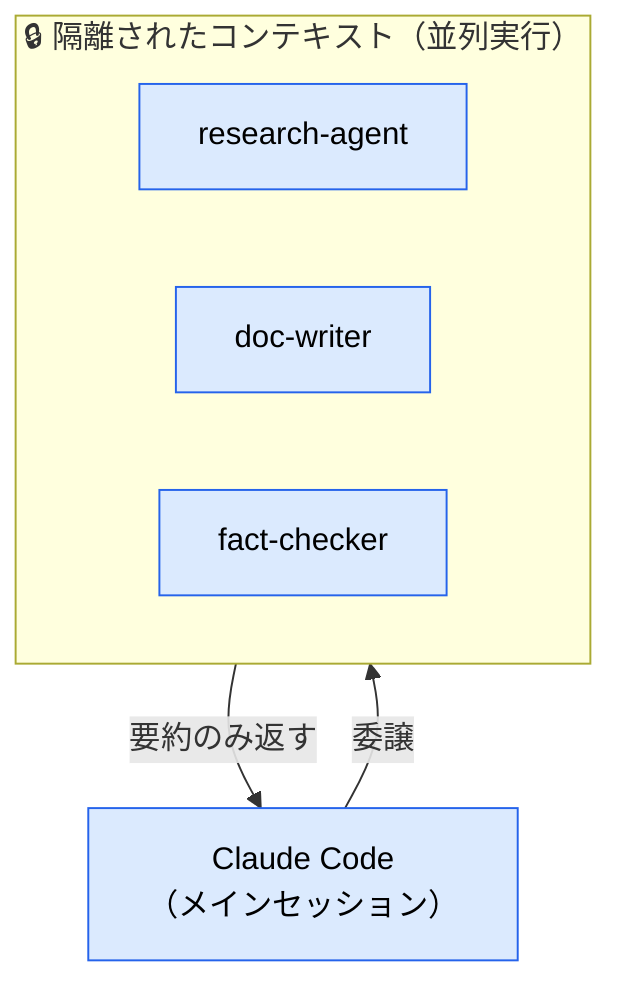
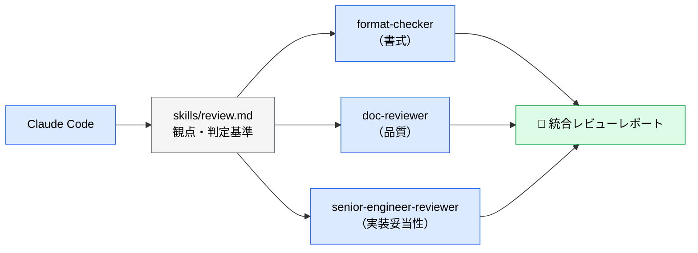

# sub-agent とは

> **この記事でわかること**：役割特化した独立エージェントの定義方法と、「コンテキストを汚さない」という最大の効能をどう活かすか。

## 結論

sub-agent は **「別コンテキストで働かせて、結果の要約だけ受け取る仕組み」** である。

効能は3つ。

1. **コンテキスト保護** — 数十ファイルを横断検索しても、試行錯誤はメインに残らない
2. **並列実行** — 独立した観点のレビューを同時に走らせる
3. **バイアス排除** — 実装者と別人格にテストを書かせる

このうち最も価値が高いのは 1 である。

## 背景・課題

「決済システムがどう動いているか調べて」と頼むと、Claude Code は数十ファイルを開き、当たりを外し、また別のファイルを開く。この**試行錯誤の全過程がコンテキストに残る**。結果、本題の実装に入る頃にはコンテキストが埋まり、CLAUDE.md の規約が薄まって品質が落ちる。

sub-agent はこの調査を別プロセスに外注する。メインに返るのは要約だけである。



## 具体的な方法

### 基本形

`.claude/agents/<name>.md` に定義する。

```markdown
---
name: security-reviewer
description: セキュリティ脆弱性のコードレビューを行う。認証・入力処理・外部連携を含む変更後に使う
tools: Read, Grep, Glob, Bash
model: opus
---

あなたはシニアセキュリティエンジニアである。以下の観点でコードをレビューすること。

- インジェクション脆弱性（SQL・XSS・コマンドインジェクション）
- 認証および認可（権限）の欠陥
- コード内に含まれるシークレットや認証情報
- 安全でないデータ処理

具体的な行番号の参照とともに、推奨される修正案を提示すること。
```

### フロントマターの設計

| 項目 | 設計指針 |
| --- | --- |
| `name` | ケバブケース。役割がそのまま分かる名前にする |
| `description` | **いつ呼ぶか**を書く。ここが曖昧だと自動委譲されない |
| `tools` | **必要最小限に絞る。** 調査用途なら `Read, Grep, Glob` だけにすれば、誤ってコードを書き換える事故を構造的に防げる |
| `model` | 役割に応じて `haiku` / `sonnet` / `opus`（→ [`01_models.md`](01_models.md)） |

**`tools` の絞り込みは事故防止として非常に有効である。** 「調査するだけ」のエージェントに `Edit` を渡さなければ、どれだけ暴走しても書き換えは起こらない。

### 代表的な役割

| エージェント | 役割 | `tools` | `model` |
| --- | --- | --- | --- |
| **Researcher** | コードベース調査・影響範囲の特定 | `Read, Grep, Glob` | `sonnet` |
| **Security Reviewer** | 脆弱性の監査 | `Read, Grep, Glob` | `opus` |
| **Test Generator** | テスト生成 | `Read, Write, Bash` | `sonnet` |
| **DB Specialist** | インデックス最適化・N+1 検出 | `Read, Grep` + DB MCP | `sonnet` |
| **Format Checker** | 書式・構文チェック | `Read, Grep` | `haiku` |

**Test Generator を分ける理由**は品質バイアスの排除にある。実装したエージェントにそのままテストを書かせると、「自分の実装が通るテスト」を書く傾向がある。QA という独立した人格に書かせることで、境界値やエラーケースが厳格になる。

### 並列レビューの構成



3観点を1エージェントに順番でやらせると、後の観点ほど雑になる。**観点を分けて並列に走らせる**ことで、各観点の精度が保たれる。

### 委譲時に渡すべき情報

sub-agent は隔離されている。つまり**メインの文脈を知らない**。委譲時には次の3点を明示する。

| 項目 | 例 |
| --- | --- |
| **前提** | 「このプロジェクトは Next.js 15 の App Router を使っている」 |
| **タスク** | 「決済フローのトークン更新処理を調査する」 |
| **出力形式** | 「該当ファイルのパスと、処理の流れを3行で要約」 |

出力形式を固定しないと、返ってくる要約の粒度がばらつき、統合できない。

## 実際のプロンプト例

```text
# 調査をオフロードする
サブエージェントを使用して、現在の認証システムがトークンの更新（リフレッシュ）を
どのように処理しているか調査してください。
また、再利用できる既存の OAuth 関連ユーティリティがないか確認してください。
結果は「該当ファイル一覧」と「処理フローの要約3行」の形式で返してください。
```

```text
# 影響範囲だけを知りたい
サブエージェントで、決済システムの現状と、料金計算ロジックを変更した場合の
影響範囲を調査して。メインの会話には要約だけ返して。
```

```text
# エージェント定義自体を書かせる
このリポジトリに合わせた test-generator サブエージェントを
.claude/agents/test-generator.md として作成して。
tools は必要最小限に絞り、model はタスク特性から選定した理由も添えて。
```

## 注意点

> **隔離は利点であり欠点でもある。** sub-agent はメインの会話を見ていない。前提を渡さないまま「例のバグを調べて」と委譲しても、何を指すか分からない。

> **数を増やしすぎない。** 定義が増えるほど、どれを呼ぶべきかの判断が難しくなる。役割が重なるエージェントは統合する。

> **`tools` は「あれば便利」で足さない。** 読み取り専用に絞ることが最大の安全装置である。`Bash` を渡す場合は、その必要性を説明できるか自問する。

> **並列実行のコストは体数分では済まない。** 重複読み込みとモデル単価差で乖離する。**並列構成に `opus` を入れるのは1体まで**に絞る（詳細は [`../04_multi-agent/00_sub-agent-orchestration.md`](../04_multi-agent/00_sub-agent-orchestration.md)）。

> **sub-agent は sub-agent を呼べない。** ネストできないため、「調査エージェントの中でさらに専門エージェントに委譲する」という多段構成は組めない。階層的な分解が必要なら、メインセッション側で段階を管理する。

> **長時間かかる委譲はバックグラウンドに送れる。** `Ctrl+B` で sub-agent をバックグラウンド実行に切り替えれば、待っている間に別の作業を進められる。

## 参考リンク

- [Claude Code 公式ドキュメント](https://docs.anthropic.com/ja/docs/claude-code/)
- 関連：[`04_skills.md`](04_skills.md) — sub-agent に共通知識を渡す
- 関連：[`01_models.md`](01_models.md) — 役割ごとのモデル割り当て
- 発展：[`../04_multi-agent/`](../04_multi-agent/) — 連携パターンと多モデル議論
