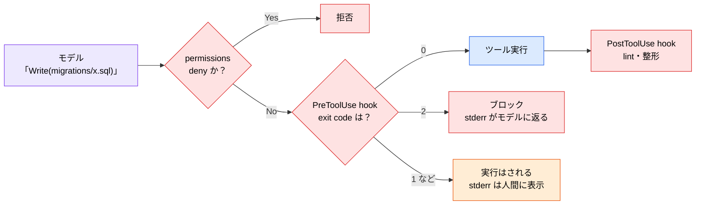
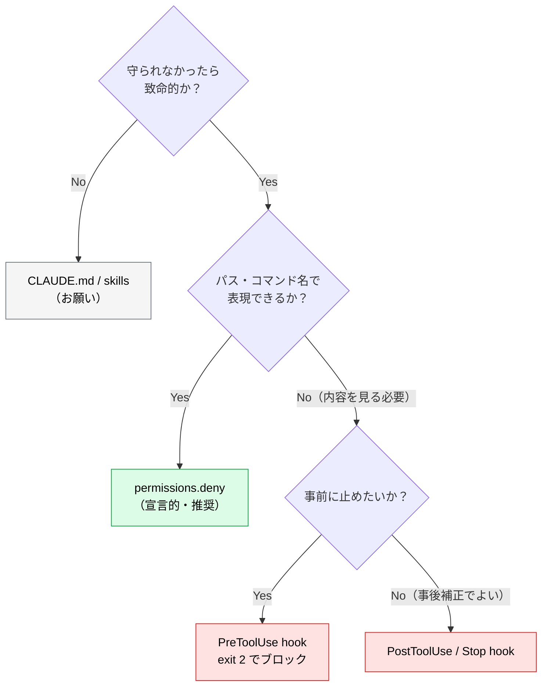

# hooks とは ― 強制力のあるルールを作る

> **この記事でわかること**：CLAUDE.md に書いても守られない禁止事項を確実に止める方法。ただし**最初に検討すべきは hooks ではなく `permissions`** である。

## 結論

強制力が必要なとき、選択肢は2つある。**順序を間違えないこと。**

| 優先 | 手段 | 向いているもの |
| --- | --- | --- |
| **1番目** | `permissions.deny`（宣言的） | パス・コマンドの禁止。**まずこれで済むか確認する** |
| **2番目** | hooks（スクリプト） | deny では表現できない内容ベースの検査、自動整形、通知 |

`permissions` で書けるものを hooks で書くと、壊れやすく・レビューしにくく・OS 依存のあるコードが増える。

そして hooks を書く場合、**押さえるべき仕様は2つ**である。

- 入力は**環境変数ではなく標準入力の JSON**
- ブロックは **`exit 2`**（`exit 1` ではブロックされない）

## 背景・課題

CLAUDE.md に「`/migrations` を変更しないこと」と書いても、セッションが長くなれば守られないことがある。モデルへの指示は確率的な制約であり、保証ではない。

一方 `permissions` と hooks は Claude Code 本体が評価する。モデルがどう判断しようと結果は変わらない。**確率ではなく決定的な制約**が手に入る。

| | CLAUDE.md / skills | permissions / hooks |
| --- | --- | --- |
| 実行場所 | コンテキスト内 | **コンテキスト外** |
| 効き方 | お願い（守らないことがある） | **強制（モデルは拒否できない）** |
| コンテキスト消費 | する | **しない** |

## 具体的な方法

### まず `permissions` で済むか確認する

`.claude/settings.json` の `permissions` は、**スクリプトを書かずに**パスやコマンドを禁止できる。

```json
{
  "permissions": {
    "deny": [
      "Edit(./migrations/**)",
      "Read(./.env)",
      "Bash(git push --force:*)"
    ],
    "allow": [
      "Bash(npm run test:*)"
    ]
  }
}
```

| キー | 意味 |
| --- | --- |
| `deny` | 禁止する。確認を挟まず拒否される |
| `allow` | 確認なしで許可する |
| `ask` | 都度確認する |

**この形で表現できる要件に hooks を使わない。** 宣言的で、レビューしやすく、シェルの落とし穴を踏まない。

### hooks が必要になる場面

`permissions` で書けないのは、次のような**中身を見て判断する**ケースである。

- 書き込もうとしている内容にシークレットらしき文字列が含まれるか
- 編集後に lint / formatter を自動実行する
- 応答完了時に通知を出す

### hooks の仕様（重要）

hooks は `.claude/settings.json` に定義するシェルコマンドで、**ツール実行に割り込む**。



#### 入力は標準入力の JSON

**環境変数では渡ってこない。** `$TOOL_INPUT` のような変数は存在しない。hook は stdin から JSON を受け取る。

```json
{
  "session_id": "...",
  "cwd": "/path/to/project",
  "hook_event_name": "PreToolUse",
  "tool_name": "Write",
  "tool_input": { "file_path": "/path/to/migrations/001.sql", "content": "..." }
}
```

#### 終了コードの意味

| exit code | 挙動 | stderr の行き先 |
| --- | --- | --- |
| `0` | 許可（正常） | — |
| **`2`** | **ブロック** | **モデル**（理由として読ませられる） |
| その他（`1` 等） | **ブロックされない**警告 | 人間（表示のみ） |

**`exit 1` ではブロックできない。** ここを間違えると「保護をかけたつもりで無防備」という最悪の状態になる。

### 実装例

インラインに長いシェルを書くと壊れやすい。**スクリプトファイルに切り出す**のを推奨形とする。

```json
{
  "hooks": {
    "PreToolUse": [
      {
        "matcher": "Edit|Write",
        "hooks": [
          { "type": "command", "command": "$CLAUDE_PROJECT_DIR/.claude/hooks/guard-path.sh" }
        ]
      }
    ],
    "PostToolUse": [
      {
        "matcher": "Edit|Write",
        "hooks": [
          { "type": "command", "command": "$CLAUDE_PROJECT_DIR/.claude/hooks/format.sh" }
        ]
      }
    ]
  }
}
```

> `.claude/settings.json` は**厳密な JSON** である。コメントは書けない。解説はドキュメント側に書く。

#### ① パス保護（`permissions.deny` で足りない場合のみ）

```bash
#!/usr/bin/env bash
# .claude/hooks/guard-path.sh
set -euo pipefail

INPUT=$(cat)
FILE=$(printf '%s' "$INPUT" | jq -r '.tool_input.file_path // ""')

case "$FILE" in
  */migrations/*)
    echo "BLOCK: migrations は手動管理です。変更が必要なら人間に確認してください" >&2
    exit 2
    ;;
esac
exit 0
```

要点は3つ。**stdin から読む**、**`>&2` で stderr に出す**、**`exit 2` で止める**。

#### ② シークレット混入の検知

内容を見る必要があるため、`permissions` では書けない。hooks の出番である。

```bash
#!/usr/bin/env bash
# .claude/hooks/guard-secret.sh
set -euo pipefail

INPUT=$(cat)
CONTENT=$(printf '%s' "$INPUT" | jq -r '.tool_input.content // .tool_input.new_string // ""')

if printf '%s' "$CONTENT" | grep -qE '(sk-[A-Za-z0-9]{20,}|AKIA[0-9A-Z]{16})'; then
  echo "BLOCK: APIキーらしき文字列を検出しました。環境変数経由に変更してください" >&2
  exit 2
fi
exit 0
```

#### ③ 編集後の自動整形

```bash
#!/usr/bin/env bash
# .claude/hooks/format.sh
set -euo pipefail

INPUT=$(cat)
FILE=$(printf '%s' "$INPUT" | jq -r '.tool_input.file_path // ""')

case "$FILE" in
  *.ts|*.tsx|*.js|*.jsx)
    npx eslint --fix "$FILE" || true
    ;;
esac
exit 0
```

**編集されたファイルだけを対象にする**のが要点である。プロジェクト全体を走らせない。

> **`npm run lint --fix` は動かない。** npm がオプションを食うため、スクリプトには渡らない。`npm run lint -- --fix` と書く。

### PostToolUse の性能指針

PostToolUse は**編集のたびに毎回**走る。10ファイル触れば10回走る。

| 処理 | PostToolUse に置いてよいか |
| --- | --- |
| 該当1ファイルへの `eslint --fix` | ✅ 1秒以内に終わる |
| プロジェクト全体の `tsc --noEmit` | ❌ 数十秒〜数分。多ファイル編集で破綻する |
| テスト全実行 | ❌ 同上 |

> **目安**：PostToolUse に置いてよいのは、単一ファイル対象で1秒以内に終わる処理だけ。重い検証は **Stop hook（応答完了時に1回）** に置く。

導入初日は感動されても、2日目に誰かがコメントアウトする——という典型的な失敗はここから起きる。

### 主なイベント

| イベント | 発火タイミング | 代表的な用途 |
| --- | --- | --- |
| **PreToolUse** | ツール実行**前** | 内容ベースのブロック |
| **PostToolUse** | ツール実行**後** | 軽量な自動整形 |
| **Stop** | 応答完了時 | 型チェック・テスト実行・カバレッジレポート生成・通知 |
| **UserPromptSubmit** | プロンプト送信時 | 共通の注意書きを注入 |
| **SubagentStop** | sub-agent 終了時 | 成果物の検証 |
| **SessionStart** | セッション開始時 | 環境チェック |
| **PreCompact** | `/compact` 実行前 | 重要情報の退避 |

### 導入したら必ず検証する

hooks の失敗モードは「**何も起きずに素通りする**」である。動いていないことに気づけない。

```bash
# 単体テスト：わざと違反する入力を流し、exit code が 2 になるか確認する
echo '{"tool_name":"Write","tool_input":{"file_path":"/x/migrations/001.sql"}}' \
  | .claude/hooks/guard-path.sh; echo "exit=$?"
# → exit=2 なら正しい。exit=0 なら効いていない

# 実際に Claude Code から違反操作を依頼し、止まることを確認する
claude --debug
```

**「ブロックされること」を一度も確認せずに運用に入れない。**

### どこに書くかの判断



## 実際のプロンプト例

```text
# permissions で書けるか先に検討させる
CLAUDE.md の「禁止事項」セクションを読んで、それぞれを次に分類して。

A: permissions.deny で表現できる（パス・コマンド名で判定可能）
B: hooks が必要（内容を見て判断する必要がある）
C: 強制できない（判断が要る）

A は settings.json の deny ルールとして、B は .claude/hooks/ 配下の
スクリプトとして実装案を出して。B は stdin の JSON を jq で読み、
ブロック時は stderr に理由を出して exit 2 する形にして。
```

```text
# 検証まで含めて依頼する
migrations/ への書き込みをブロックする hook を作って。
あわせて、わざと違反する入力を流して exit 2 になることを確認する
テストコマンドも示して。
```

```bash
# 設定の確認
/hooks
/permissions
```

## 注意点

> **`exit 1` ではブロックされない。** ブロックは `exit 2`、理由は `>&2`（stderr）に出す。ここを間違えると、保護をかけたつもりで無防備な状態が続く。

> **`$TOOL_INPUT` という環境変数は存在しない。** 入力は標準入力の JSON である。古い記事やテンプレートにこの誤りが残っていることがあるので注意する。

> **grep によるコマンド検査はセキュリティ境界ではない。** `rm -rf /` を弾いても `rm -fr /` や変数展開は素通りする。これは「うっかりを減らす速度制限バンプ」であって防壁ではない。境界は `permissions.deny`・ブランチ保護・DB 権限側で張る。

> **hooks はチーム全員のマシンで実行される。** `settings.json` を共有する以上、全員の環境で動くコマンドにする。逆に言えば、**悪意ある hooks を含む PR をマージすることは任意コード実行を受け入れること**である（→ [`09_directory-structure.md`](09_directory-structure.md)）。

> **設定変更はセッション開始時に読み込まれる。** hooks は安全上セッション開始時にスナップショットされるため、編集後は再起動して反映を確認する。

## 参考リンク

- [Claude Code 公式ドキュメント](https://docs.anthropic.com/ja/docs/claude-code/)
- 関連：[`03_claude-md.md`](03_claude-md.md) — お願いする層
- 関連：[`02_architecture.md`](02_architecture.md) — hooks が割り込む位置
- 関連：[`09_directory-structure.md`](09_directory-structure.md) — 設定ファイルの配置と共有リスク
