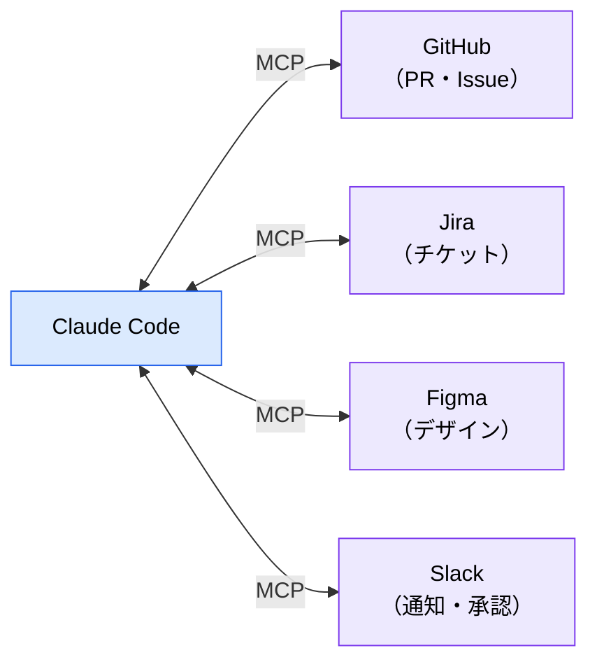
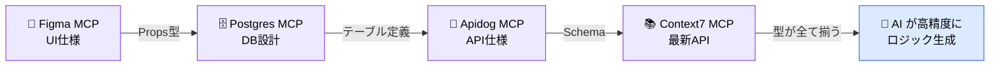
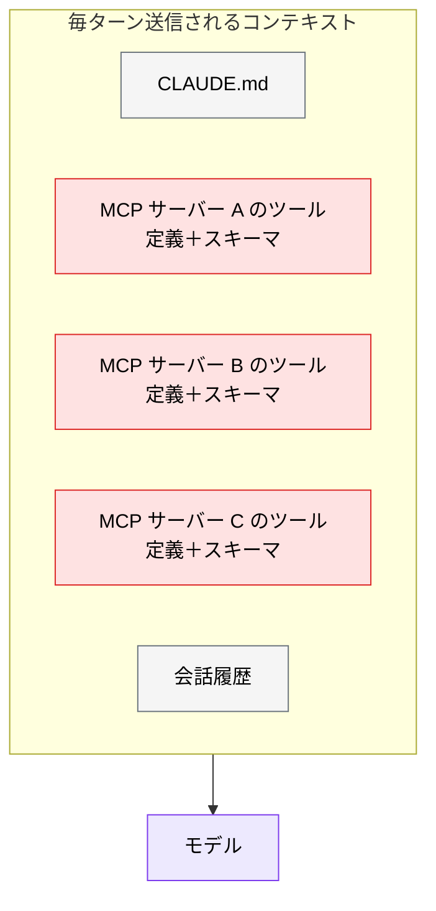

# MCP とは（概念編）

> **この記事でわかること**：MCP が何を解決するプロトコルか、そして「繋ぐほど良い」わけではない理由。個別サーバーの使い方は [`../02_mcp/`](../02_mcp/) にまとめている。

## 結論

MCP（**Model Context Protocol**）は、**AI エージェントを外部システムに繋ぐ標準プロトコル**である。効能は1つに集約できる。

> **AI の知識カットオフを迂回し、「推測」を「事実」に置き換える。**

ただし接続したサーバーのツール定義は**毎ターン、常時コンテキストを消費する**。繋ぐほど精度が上がるわけではなく、むしろ入れすぎると劣化する。

## 背景・課題

AI がコードを書くとき、知らない情報は推測で埋める。テーブルのカラム名、API のレスポンス型、ライブラリの最新シグネチャ——これらを推測されると、動かないコードが生成される。

MCP はこの推測を潰す。Postgres MCP を繋げば実際のスキーマを読み、Context7 MCP を繋げば現行の API ドキュメントを読む。



MCP は 2025年12月9日に Linux Foundation 傘下の Agentic AI Foundation（AAIF）へ移管され、特定ベンダーに依存しない業界標準となった。2026年3月時点で SDK の月次ダウンロードは 9,700万に達しており、同じサーバーを Claude Code でも他のエージェントでも使える。

## 具体的な方法

### 情報の精度が上がる仕組み

MCP の数と AI の挙動には、次の関係がある。

| MCP 数 | AI の挙動 | 人間の役割 |
| --- | --- | --- |
| なし | 汎用的な命名・型で**推測**して生成 | 書く + 直す |
| 1つ | 一部正確、残りは推測 | 書く + 確認する |
| **複数チェーン** | **全層の型が事実ベース**で整合 | **確認する**に集中 |

型（UI の Props・API の Schema・DB の Column）が事実ベースで揃えば、その間を繋ぐロジックは機械的に導出できる。これが MCP を複数組み合わせる価値である。



> ただし**ビジネスルール（割引計算・権限判定など）には MCP の SSoT が存在しない**。ここは仕様書で人間が定義するしかない。MCP で埋まるのは「型」であって「意図」ではない。

### 用途別の分類

個別の使い方は [`../02_mcp/`](../02_mcp/) に譲り、ここでは全体像だけ示す。

| カテゴリ | 代表サーバー | 解決すること |
| --- | --- | --- |
| **ドキュメント** | Context7 | 知識カットオフ後のライブラリ仕様 |
| **コード検索** | Serena | 大規模リポジトリのトークン消費（symbol 単位で取得） |
| **プロジェクト管理** | GitHub / Jira | Issue・PR の参照と操作 |
| **データベース** | Postgres | 実際のスキーマに基づく SQL / ORM 生成 |
| **API 仕様** | Apidog | 仕様と実装の乖離検知 |
| **デザイン** | Figma | デザイントークン・コンポーネント仕様 |
| **テスト** | Playwright / Chrome DevTools | ブラウザ操作・E2E 生成 |
| **社内情報** | Notion / Box / Slack / Google Drive | 既存権限を継承した社内資料の参照 |
| **運用** | Datadog / Terraform / Docker | 監視・IaC・コンテナ |

### コストの正体

MCP の「隠れコスト」を理解しておく必要がある。



**一度も呼び出さなくても消費される。** サーバーを繋いだ瞬間から、ツール名・説明・引数スキーマが毎ターン送られる。10 個繋げば、その全部が毎回である。

結果として次が起きる。

- 本題に使えるコンテキストが減る
- 選択肢が多すぎてモデルがツール選定を誤る
- IDE に大量接続すると、補完・レビューまで遅延・劣化する

> **推奨される分業**：重い仕様読み込みと MCP ツールの利用は**ターミナルの Claude Code に一任**し、IDE はコード差分の確認・補完に専念させる。

### 導入の進め方

| ステップ | やること |
| --- | --- |
| 1 | **1つだけ入れる。** 最も推測が多い領域（多くの場合 Context7 か DB）から |
| 2 | 2週間使い、実際に呼ばれた回数を振り返る |
| 3 | 呼ばれていないサーバーは外す |
| 4 | 次の1つを入れる |

「便利そうだから全部入れる」が最も失敗しやすい。

## 実際のプロンプト例

```bash
# 接続中のサーバーとツール数を確認する
/mcp
```

```text
# 棚卸しさせる
接続中の MCP サーバーを一覧して、
このリポジトリの内容から見て「実際に使う見込みが低いもの」を指摘して。
それぞれのツール定義がどれくらいコンテキストを消費しているかの目安も添えて。
```

```text
# 推測させない指示
Postgres MCP で users テーブルの実際のスキーマを確認してから、
ユーザー検索の SQL を書いて。カラム名は推測せず、必ず取得した定義に従って。
```

## 注意点

> **MCP は「繋ぐ」ではなく「選ぶ」もの。** プロジェクトに本当に必要なものだけを選定し、定期的に棚卸しする（→ [`../02_mcp/02_tool-reduction.md`](../02_mcp/02_tool-reduction.md)）。

> **MCP サーバーは外部プロセスである。** 認証情報の扱い、サーバー自体の信頼性、権限範囲には固有のリスクがある（→ [`../22_security/05_mcp-risks.md`](../22_security/05_mcp-risks.md)）。

> **MCP は外部コンテンツをコンテキストに取り込む経路である。** 取得した Issue 本文や Web ページに指示めいた文字列が含まれていれば、それがモデルに作用しうる（プロンプトインジェクション）。外部由来の内容は「データとして扱え」と明示する。

> **`.mcp.json` はユーザーごとに初回の信頼承認が必要である。** リポジトリに設定を置いても、各自が承認するまで有効にならない。「チームに配ったのに人によって動かない」の主因はこれである。

> **MCP で埋まるのは「事実」であって「判断」ではない。** スキーマは取れても、そのカラムをどう使うべきかは仕様書側の責務である。

## 参考リンク

- [Model Context Protocol 公式](https://modelcontextprotocol.io/)
- 個別サーバーの使い方：[`../02_mcp/`](../02_mcp/)
- 関連：[`02_architecture.md`](02_architecture.md) — MCP がコンテキストに載る位置
- 関連：[`10_context-management.md`](10_context-management.md) — 消費量の管理
