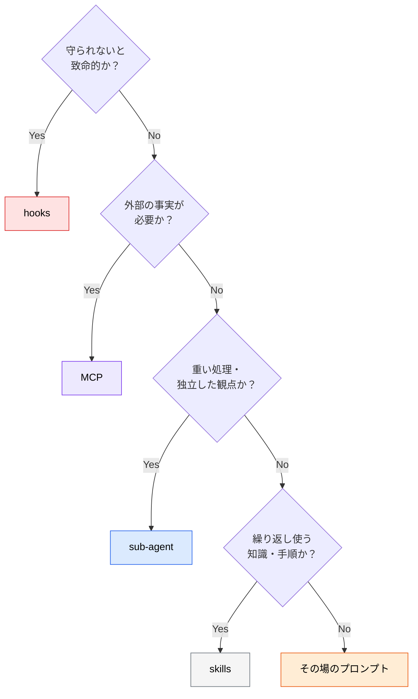
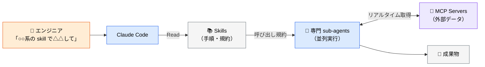
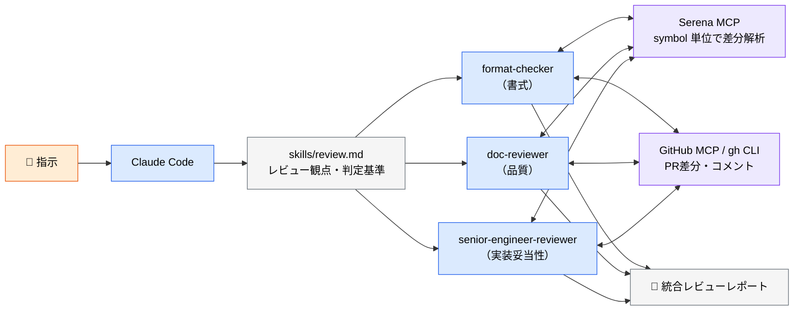
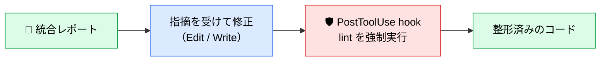

# 4部品の使い分けと組み合わせ

> **この記事でわかること**：skills / sub-agent / hooks / MCP のどれを使うかの判断基準と、4つを連結した定型フローの作り方。

## 結論

4部品は競合しない。**それぞれ担当が違う。**

| 部品 | 担当 | 一言で |
| --- | --- | --- |
| **skills** | 知識の提供 | 「**やり方**」を渡す |
| **sub-agent** | 処理の実行 | 「**役割**」を持たせて並列で動かす |
| **hooks** | 制約の強制 | 「**破れないルール**」をかける |
| **MCP** | 外部接続 | 「**事実**」を取ってくる |

そして実務で最も価値が出るのは、**skill に「どの sub-agent を起動し、どの MCP を呼ぶか」まで書いて定型フロー化する**ことである。

## 背景・課題

個々の部品を理解しても、「このタスクではどれを使うのか」は別問題である。よくある誤用は次の3つ。

- 全部 CLAUDE.md に書いて肥大化させる
- 調査をメインセッションでやってコンテキストを潰す
- 禁止事項をお願いベースで書いて破られる

判断基準を持てば、この3つは避けられる。

## 具体的な方法

### skills と sub-agent の違い

最も混同されやすいのがこの2つである。

| | skills | sub-agent |
| --- | --- | --- |
| **役割** | ナレッジ・手順を注入する | 処理を外注・並列実行する |
| **実行タイミング** | メインセッション内で参照 | 別プロセスで隔離実行 |
| **コンテキスト消費** | 読み込んだ分だけ消費 | メインを汚染しない |
| **向いているもの** | 規約・テンプレート・手順書 | 調査・レビュー・生成タスク |
| **使うタイミング** | 毎セッション共通ルールを渡したい | 重い処理を外注・並列で捌きたい |

> skills は全 sub-agent の**共通知識**として機能し、文体・規約・調査手順を統一する。sub-agent はコンテキストが**隔離**されているため、並列実行しても互いに干渉しない。

**両者は排他ではなく、組み合わせて使う。** 複数の sub-agent に同じ skill を読ませることで、並列実行しても出力の基準が揃う。

### 選択フロー



### 連結の共通パターン

3要素（skills / sub-agent / MCP）を連結すると、「指示 → 知識参照 → 並列実行 → 外部データ取得 → 成果物」という一貫フローになる。



**skill に「どの sub-agent を起動し、どの MCP を呼ぶか」を記述する**ことで、エンジニアは短い指示だけで定型フローを再現できる。これが運用上の要点である。

### ユースケース別の構成

#### ① レビュー系

> 「**レビュー系 skill でこの PR をレビューして**」



| 層 | 担当 |
| --- | --- |
| skills | レビュー観点・判定基準・出力フォーマット |
| sub-agent | 書式・品質・実装妥当性の3観点を**並列実行** |
| MCP | Serena で symbol 単位の差分取得、GitHub MCP で PR 情報取得 |

#### ② その他のユースケース

同じ構造で組み替えられる。

| 系統 | skills に書く内容 | sub-agent | MCP |
| --- | --- | --- | --- |
| **リサーチ系** | 情報源の優先順位、信頼度の判定基準 | research-agent + fact-checker（並列） | Context7、WebSearch |
| **テスト系** | テスト方針、境界値の考え方 | test-generator、test-reviewer | Playwright、Chrome DevTools |
| **実装系** | 実装手順、コミット規約 | researcher（調査）→ implementer | Serena、Context7、GitHub |
| **ドキュメント系** | 文体・書式ガイド、テンプレート | doc-writer → doc-reviewer | Notion、Box |

### 設計原則

| 層 | 書き方のコツ |
| --- | --- |
| **skills** | 「**いつ・なぜ・どの sub-agent / MCP を呼ぶか**」まで書く |
| **sub-agent** | 役割を1つに絞り、**成果物のフォーマットを固定する** |
| **MCP** | skill で指名して呼ぶ。**必要なときだけ**接続する |
| **hooks** | 判断を挟まない。機械的に判定できるものだけ |

> **命名を揃えると運用が回る。** ユースケース名を skill ファイル名の接頭辞に揃える（`review-*.md`、`research-*.md`）と、「○○系でやって」という短い指示で該当 skill 群が呼ばれる運用が実現する。

### 4部品が揃った状態

前掲のレビュー系フローに hooks を足すと4部品が揃う。hooks は**レビューの成果物ではなく、指摘を受けて修正したときのツール実行に割り込む**。



hooks だけがコンテキストの外側にあり、モデルの判断を経ずに必ず実行される。この一点が他の3部品との決定的な違いである。

## 実際のプロンプト例

```text
# 定型フローを skill として設計させる
このリポジトリ向けに「レビュー系」の skill を設計して。
.claude/skills/review/SKILL.md として作成し、以下を必ず含めて。

- どの sub-agent を、どの順序・並列度で呼ぶか
- 各 sub-agent に読ませる共有ナレッジのパス
- 使用する MCP と、その用途
- 統合レポートの出力フォーマット（表形式）
```

```text
# 現状の構成を診断させる
.claude/ 配下を読んで、現在の構成を次の観点で診断して。

1. CLAUDE.md に書かれているが skills へ切り出すべきもの
2. CLAUDE.md に書かれているが hooks で強制すべきもの
3. 役割が重複している sub-agent
4. 実際には使われていない MCP

それぞれ「現状 → あるべき姿 → 理由」の表で示して。
```

## 注意点

> **最初から4部品を揃えようとしない。** 順序は `CLAUDE.md → hooks → skills → sub-agent → MCP` が扱いやすい。CLAUDE.md すら整っていない段階で sub-agent を量産しても、基準が無いので出力が揃わない。

> **並列実行のコストは体数分では済まない。** 全 PR ではなく、コアロジックやセキュリティ上重要な変更に絞る。**`opus` は1体まで**（詳細は [`../04_multi-agent/00_sub-agent-orchestration.md`](../04_multi-agent/00_sub-agent-orchestration.md)）。

> **skill が肥大化したら分割する。** 「開発ルール全部」のような skill は、読み込まれた瞬間に CLAUDE.md 肥大化と同じ問題を再現する。1 skill = 1 関心事に保つ。

## 参考リンク

- [Claude Code 公式ドキュメント](https://docs.anthropic.com/ja/docs/claude-code/)
- 各部品：[`04_skills.md`](04_skills.md) / [`05_sub-agents.md`](05_sub-agents.md) / [`06_hooks.md`](06_hooks.md) / [`07_mcp-basics.md`](07_mcp-basics.md)
- 発展：[`../04_multi-agent/`](../04_multi-agent/) — 連携パターンと多モデル議論
- 発展：[`../05_prompt-engineering/03_skills-integration.md`](../05_prompt-engineering/03_skills-integration.md)
