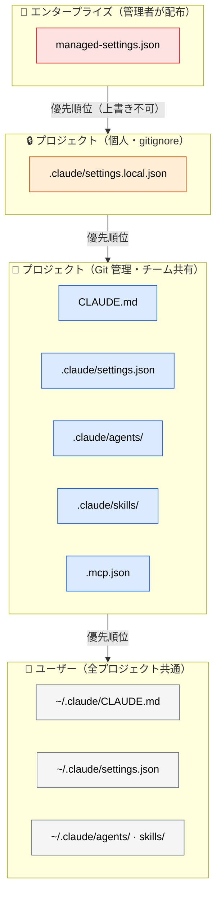

# .claude/ のディレクトリ構成

> **この記事でわかること**：設定ファイルがどこに置かれ、どの順で優先されるか。そして「チームで共有するもの」と「個人環境に留めるもの」の線引き。

## 結論

設定は **3つのスコープ**を持ち、より狭いスコープが優先される。

```text
エンタープライズ（管理者）          ←  絶対的制約・上書き不可
        ↓
CLI 引数（--model など）
        ↓
.claude/settings.local.json        ←  個人の一時的な上書き
        ↓
.claude/settings.json              ←  チーム共有・Git 管理
        ↓
~/.claude/settings.json            ←  個人の全体設定
```

エンタープライズ設定は「スコープの広い / 狭い」とは別次元の**絶対的な制約**である。それ以外は、**より狭いスコープが優先**される。

> **`settings.local.json` は `settings.json` より優先される。** 「チーム設定を入れたのに効かない」というトラブルの多くは、誰かの local 設定が勝っていることが原因である。

そして **Git にコミットするのは `.claude/` のうち共有すべきものだけ**である。`settings.local.json` は個人設定なので `.gitignore` に入れる。

## 背景・課題

Claude Code の設定ファイルは複数の場所に分散する。どこに何を置くかを決めていないと、次の問題が起きる。

- 「自分の環境では動くのにチームメンバーの環境では動かない」
- 個人の実験的な設定がチームに漏れる
- 認証情報を含む設定を誤ってコミットする

スコープの構造を理解すれば、この3つは設計で防げる。

## 具体的な方法

### 全体像



### プロジェクト側の構成

```text
プロジェクトルート/
├── CLAUDE.md                      # プロジェクトの憲法（毎回読まれる）
├── .mcp.json                      # MCP サーバー定義（チーム共有）
└── .claude/
    ├── settings.json              # hooks・権限（Git 管理）
    ├── settings.local.json        # 個人設定（.gitignore）
    ├── hooks/                      # hooks から呼ぶスクリプト
    │   └── guard-path.sh
    ├── agents/                     # サブエージェント定義
    │   ├── doc-writer.md
    │   └── format-checker.md
    ├── commands/                   # スラッシュコマンド定義
    │   └── deploy.md               # → /deploy
    └── skills/                     # スキル（description で自動発火）
        ├── review/SKILL.md         # ディレクトリ + SKILL.md が必須形式
        └── research/SKILL.md
```

モノレポではサブディレクトリにも `CLAUDE.md` を置ける。作業対象のディレクトリに応じて追加読み込みされる。

```text
packages/
├── api/
│   └── CLAUDE.md      # API パッケージ固有のルール
└── web/
    └── CLAUDE.md      # フロントエンド固有のルール
```

### ファイルごとの役割

| パス | 役割 | Git |
| --- | --- | --- |
| `CLAUDE.md` | 毎セッション読まれる規約。200行以内 | ✅ |
| `.claude/settings.json` | hooks・権限設定。**チームで揃えたいもの** | ✅ |
| `.claude/settings.local.json` | 個人の権限緩和・実験設定 | ❌ |
| `.claude/agents/*.md` | サブエージェント定義 | ✅ |
| `.claude/hooks/*.sh` | hooks から呼ぶスクリプト（実行権限を付ける） | ✅ |
| `.claude/commands/*.md` | スラッシュコマンド定義 | ✅ |
| `.claude/skills/<name>/SKILL.md` | スキル。**ディレクトリ + `SKILL.md` が必須形式** | ✅ |
| `.mcp.json` | MCP サーバー定義。**認証情報は環境変数参照にする** | ✅ |

認証情報は次のように環境変数を参照させる。値は `.mcp.json` に書かない。

```json
{
  "mcpServers": {
    "github": {
      "command": "npx",
      "args": ["-y", "@modelcontextprotocol/server-github"],
      "env": { "GITHUB_TOKEN": "${GITHUB_TOKEN}" }
    }
  }
}
```

**`commands/` と `skills/` の使い分け**

| | `.claude/commands/` | `.claude/skills/` |
| --- | --- | --- |
| 起動 | 人間が `/name` と打つ | モデルが description を見て必要時に読む |
| 形式 | `name.md` 単体 | `name/SKILL.md`（ディレクトリ必須） |
| 向いているもの | 定型フロー（デプロイ・リリース手順） | ドメイン知識・規約 |

### ユーザースコープ（`~/.claude/`）

全プロジェクトに効く個人設定を置く。

```text
~/.claude/
├── CLAUDE.md          # 個人の作業スタイル（全プロジェクト共通）
├── settings.json      # 個人の権限・hooks
├── agents/            # よく使う自作エージェント
├── skills/            # 個人用スキル
└── keybindings.json   # キーバインド
```

> **チームに効かせたいものを `~/.claude/` に書かない。** 「自分の手元では守られるのに CI では守られない」という最も分かりにくい不具合の原因になる。

### エンタープライズスコープ

組織として強制したい設定は、管理者が配布するファイルで指定する。**ユーザーやプロジェクト側から上書きできない。**

| OS | パス |
| --- | --- |
| macOS | `/Library/Application Support/ClaudeCode/managed-settings.json` |
| Linux | `/etc/claude-code/managed-settings.json` |
| Windows | `C:\ProgramData\ClaudeCode\managed-settings.json` |

禁止コマンド、利用可能モデル、MCP サーバーの許可リストなど、統制が必要な項目をここで固定する（→ [`../22_security/07_claude-code-hardening.md`](../22_security/07_claude-code-hardening.md)）。

### `.gitignore` の設定

```gitignore
# 個人設定はコミットしない
.claude/settings.local.json

# 認証情報を含む可能性のあるもの
.mcp.local.json
```

逆に、**`.claude/agents/` と `.claude/skills/` は必ずコミットする**。これらはチームの資産であり、個人環境にしか無いと出力基準がばらつく。

### 導入順序

新規プロジェクトでは次の順で整備する。後ろに行くほど「なくても動く」。

```mermaid
flowchart LR
    A["1. CLAUDE.md<br/>/init で叩き台生成"] --> B["2. .gitignore<br/>settings.local.json を除外"]
    B --> C["3. settings.json<br/>hooks で禁止事項を強制"]
    C --> D["4. skills/<br/>繰り返す手順を切り出し"]
    D --> E["5. agents/<br/>重い調査・並列レビュー"]
    E --> F["6. .mcp.json<br/>必要なものを1つずつ"]

    style A fill:#dbeafe,stroke:#2563eb,color:#000
    style B fill:#dbeafe,stroke:#2563eb,color:#000
    style C fill:#fee2e2,stroke:#dc2626,color:#000
    style D fill:#f5f5f5,stroke:#6c757d,color:#000
    style E fill:#f5f5f5,stroke:#6c757d,color:#000
    style F fill:#ede9fe,stroke:#7c3aed,color:#000
```



## 実際のプロンプト例

```bash
# CLAUDE.md の叩き台を生成する
/init

# 読み込まれている設定を確認する
/memory

# 権限設定の確認
/permissions

# hooks の確認
/hooks
```

```text
# 構成を監査させる
.claude/ 配下と .gitignore を読んで、次を確認して。

1. Git 管理すべきなのに ignore されているファイル
2. 個人設定なのにコミット対象になっているファイル
3. .mcp.json に認証情報が直書きされていないか

問題があれば、修正案を diff 形式で示して。
```

## 注意点

> **`.mcp.json` に API キーを直書きしない。** 環境変数参照にする。このファイルは Git 管理下に置くことが多い。

> **`settings.local.json` で権限を緩めたまま放置しない。** 一時的に許可した危険なコマンドが個人環境に残り続け、事故のときだけ発覚する。

> **サブディレクトリ `CLAUDE.md` は使いすぎない。** 階層が増えるほど「どのルールが効いているか」の把握が難しくなる。モノレポでパッケージ間の技術スタックが本当に違う場合に限る。

> **⚠️ `.claude/` の共有は任意コード実行の受け入れである。** `settings.json` の hooks は、そのブランチを checkout して Claude Code を起動した**全員のマシンで任意のシェルコマンドとして実行される**。悪意ある PR や外部リポジトリの `.claude/` を取り込むことは、実質的にサプライチェーン攻撃の入口になる。
>
> 対策：**hooks / settings.json / agents の差分を含む PR は、コード変更と同じかそれ以上の厳格さでレビューする。** CODEOWNERS で `.claude/` にレビュー必須を設定する。外部コントリビュータを受け入れるリポジトリでは特に重要である。

> **設定はセッション開始時に読み込まれる。** hooks は安全上スナップショットされるため、セッション中の書き換えは即時反映されない。裏を返せば、**起動前に差分を確認する意味がある**。

## 参考リンク

- [Claude Code 公式ドキュメント](https://docs.anthropic.com/ja/docs/claude-code/)
- 参考：[Claude Code の設定ファイル構成（Zenn）](https://zenn.dev/stockdatalab/articles/20260401_tech_claudecode_files)
- 関連：[`03_claude-md.md`](03_claude-md.md) / [`06_hooks.md`](06_hooks.md)
- 関連：[`../23_team-workflow/01_shared-resources.md`](../23_team-workflow/01_shared-resources.md) — チームでの共有設計
