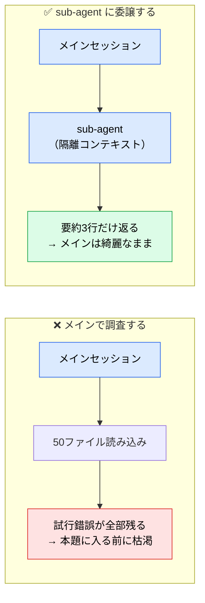

# コンテキスト管理戦略

> **この記事でわかること**：出力品質が落ちる最大の原因である「コンテキストの希釈」と、状況別の具体的な対処法。

## 結論

**コンテキストウィンドウは AI 開発における最重要リソースである。**

そして最も重要な実務ルールは1つ。

> **使用率 60〜70% 程度を超えたらセッションを切り替える。100% を待たない。**（経験則の目安。`/context` で自分のプロジェクトの劣化点を観察して調整する）

品質が落ちてから対処するのではなく、落ちる前に切る。

## 背景・課題

コンテキストが限界に近づくと、次が同時に起きる。

- 直前に指示したルールを忘れる
- 出力コードの品質が著しく下がる（ハルシネーションの増加）
- API コストが高騰する

これを**コンテキストの希釈**と呼ぶ。厄介なのは、**劣化が徐々に進むため気づきにくい**点である。「今日はなんだか調子が悪い」と感じたときには、すでに大幅に劣化している。


Sonnet 5 / Opus 5 / Fable 5 のコンテキスト窓はいずれも 1M トークンだが、**窓が広いこと**と**品質が保たれること**は別である。埋めてよいわけではない。加えて、一定量を超えると入力単価が割増になるため、コスト面でも「入るから入れる」は不利になる。

## 具体的な方法

### 状況別の対処法

| 状況 | 対処法 | 理由・背景 |
| --- | --- | --- |
| **無関係なタスクへの切り替え** | `/clear`（または新規チャット）で完全にリセットする | 前タスクの思考プロセスやコード差分が残っていると、次のタスクの生成にノイズとして働くため |
| **AI が同じ間違いを2回繰り返す** | `/clear` して、より詳細なプロンプトでやり直す | 「間違ったコード」と「修正のやり取り」が残っていると、自身の過去のミスに引きずられてループに陥るため |
| **大規模なコードベースの調査** | sub-agent に調査を委任する | メインで横断検索させると、試行錯誤の途中経過と大量のファイル内容でコンテキストが汚染されるため |
| **セッションが長く冗長になった** | `/compact` で重要なポイントだけ要約する | 履歴が長すぎると、CLAUDE.md など初期ルールの存在感が薄まり、指示を無視し始めるため |
| **使用率が 60〜70% を超過** | 新しいセッションに移行する（警戒ライン） | 100% を待つべきではない。60〜70% を超えたあたりから注意力が散漫になり、品質低下が顕著に現れるため |

### 消費の内訳を把握する

どこで消費しているかが分かれば、打ち手が決まる。

| 消費要因 | 増え方 | 打ち手 |
| --- | --- | --- |
| CLAUDE.md | 固定（毎回同じ量） | 200行以内に保つ |
| **MCP ツール定義** | **接続数に比例して常時消費** | 使わないサーバーを切る |
| ファイル読み込み | 読んだ分だけ累積 | `@` で対象を限定、Serena MCP で symbol 単位に |
| ツール実行結果 | 実行のたびに累積 | 重い調査を sub-agent へ |
| 会話履歴 | ターンごとに累積 | `/clear`・`/compact` |

### MCP の「隠れコンテキスト消費」

見落とされやすいのがここである。

> MCP サーバーは便利だが、**接続している各サーバーの「ツール説明文やスキーマ定義」は、毎回のやり取りの裏側で常にコンテキスト枠を消費している。**

一度も呼び出さなくても消費される。したがって、

- Cursor などの IDE に過剰な MCP を紐付けると、本来の軽快なコード補完やレビュー機能まで遅延・劣化する
- **推奨される分業**：重い仕様読み込みと MCP ツールの利用は**ターミナルの Claude Code に一任**し、IDE はコード差分の確認・補完に専念させる

プロジェクトごとに、本当に必要なツールだけを有効化する運用を徹底する。

### sub-agent によるオフロード

コンテキスト保護の最も効果的な手段である。



### `/clear` と `/compact` の使い分け

| | `/clear` | `/compact` |
| --- | --- | --- |
| 動作 | 完全リセット | 履歴を要約して圧縮 |
| 使うとき | **タスクが変わる**とき | 同じタスクを継続したいとき |
| 注意 | 文脈は完全に失われる | 要約時に細部が落ちる |

`/compact focus on X` のように重点を指定すると、残したい情報を明示できる。

```text
/compact 認証まわりの設計判断と、まだ未対応のTODOを重点的に残して
```

### 1セッション1課題

最も効果的な運用ルールは、**1セッションに複数の課題を混在させない**ことである。

| ❌ 避ける | ✅ 推奨 |
| --- | --- |
| 1セッションで「認証修正 → UI 調整 → テスト追加」 | 課題ごとに `/clear` して切り分ける |
| 調査も実装もメインでやる | 調査は sub-agent、実装はメイン |
| MCP を全部繋いだまま作業 | そのタスクで使うものだけ有効化 |

## 実際のプロンプト例

```bash
# 現在の使用状況を確認する
/context

# タスクを切り替える
/clear

# 重点を指定して圧縮する
/compact focus on the auth refactoring decisions

# 読み込まれている設定の確認
/memory
```

```text
# 調査をオフロードする定型文
サブエージェントを使って、○○の現状と影響範囲を調査して。
メインの会話には「該当ファイル一覧」と「要約3行」だけ返して。
```

```text
# セッションを引き継ぐときの申し送り作成
ここまでの作業内容を、新しいセッションで作業を再開できる形で要約して。
「決定した設計方針」「変更済みファイル」「残タスク」の3項目でまとめて。
```

## 注意点

> **窓が広いモデルでも埋めてよいわけではない。** 1M トークンは「入る」のであって「入れても品質が落ちない」わけではない。

> **`/compact` は万能ではない。** 要約は情報の欠落を伴う。重要な設計判断は、要約に頼らず設計書やコミットメッセージに書き出しておく。

> **コスト面では二重に効く。** コンテキストが大きいほど1ターンあたりの入力トークンが増えるうえ、**長コンテキスト（おおむね 200K トークン超）は入力単価そのものが割増になる**。こまめな `/clear` は品質だけでなく単価にも直接効く（→ [`../21_cicd-ops/06_finops.md`](../21_cicd-ops/06_finops.md)）。

> **「調子が悪い」と感じたら、まず `/clear` を試す。** プロンプトを工夫する前に、コンテキストをリセットするほうが早く解決することが多い。

## 参考リンク

- [Claude Code 公式ドキュメント](https://docs.anthropic.com/ja/docs/claude-code/)
- 関連：[`02_architecture.md`](02_architecture.md) — 何がコンテキストに載るか
- 関連：[`../13_implementation/03_recovery.md`](../13_implementation/03_recovery.md) — 失敗からの立て直し
- 関連：[`05_sub-agents.md`](05_sub-agents.md) — オフロードの実装
- 関連：[`../02_mcp/02_tool-reduction.md`](../02_mcp/02_tool-reduction.md) — MCP の棚卸し
