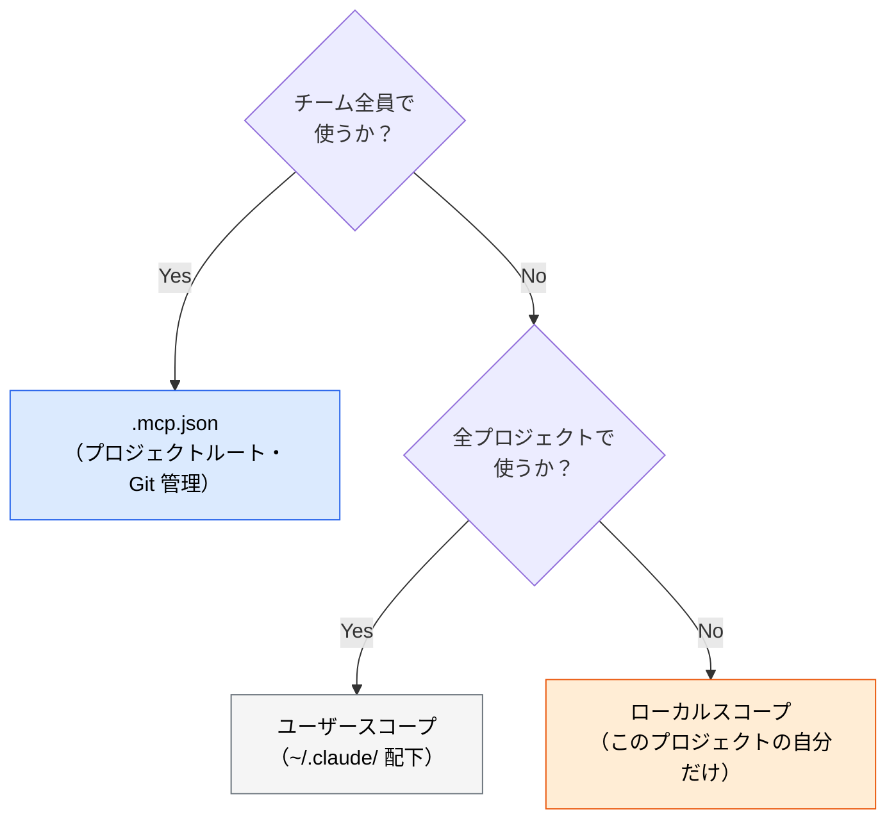
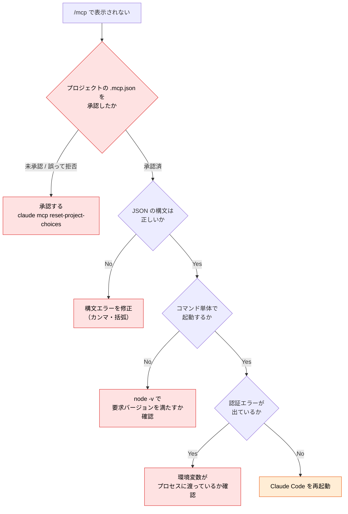

# MCP の導入と設定

> **この記事でわかること**：`.mcp.json` の書き方、スコープの選び方、認証情報を漏らさない設定、そして繋がらないときの切り分け手順。

## 結論

MCP の設定で押さえるべきは3点だけである。

1. **チーム共有するなら `.mcp.json`（プロジェクトルート）** に書く
2. **認証情報は必ず環境変数参照**にする。ファイルに直書きしない
3. **1つずつ入れて、2週間使って、呼ばれなければ外す**

3 が最も守られない。「便利そうだから」で足したサーバーが精度を下げる（→ [`02_tool-reduction.md`](02_tool-reduction.md)）。

## 背景・課題

MCP サーバーの導入でつまずく箇所は、機能そのものより**設定の置き場所と認証**に集中する。

- チームで共有したいのに個人環境にしか無い
- API キーを直書きしてコミットしてしまう
- 繋がらないが、原因がサーバー側か設定側か切り分けられない

ここを最初に整理しておくと、以降のサーバー追加は機械的な作業になる。

## 具体的な方法

### スコープの選択



| スコープ | 置き場所 | Git | 向いているもの |
| --- | --- | --- | --- |
| **プロジェクト** | `.mcp.json` | ✅ 管理する | Context7、Serena など全員が使うもの |
| **ユーザー** | `~/.claude.json`（ディレクトリではなくファイル） | ❌ | 個人の常用ツール |
| **ローカル** | `~/.claude.json` 内にプロジェクトパス単位で格納 | ❌ | 検証中のサーバー |

**迷ったらプロジェクトスコープにする。** 「自分の環境でだけ動く」状態は、チームで再現性のない挙動差を生む。

### `.mcp.json` の基本形

```json
{
  "mcpServers": {
    "context7": {
      "command": "npx",
      "args": ["-y", "@upstash/context7-mcp"]
    }
  }
}
```

`command` に実行コマンド、`args` に引数を並べるだけである。多くのサーバーは `npx` か `uvx` で起動する。

### 認証情報の扱い

**最重要のルール：`.mcp.json` に API キーを直書きしない。** このファイルは Git 管理下に置くことが多い。

```json
{
  "mcpServers": {
    "github": {
      "command": "docker",
      "args": [
        "run", "-i", "--rm",
        "-e", "GITHUB_PERSONAL_ACCESS_TOKEN",
        "ghcr.io/github/github-mcp-server",
        "--read-only"
      ],
      "env": {
        "GITHUB_PERSONAL_ACCESS_TOKEN": "${GITHUB_PERSONAL_ACCESS_TOKEN}"
      }
    }
  }
}
```

`${VAR}` 形式で環境変数を参照させる。`${VAR:-default}` 形式で既定値も書ける。

> **`.env` を置いても読まれない。** `${VAR}` が参照するのは **Claude Code を起動したシェルのプロセス環境変数**である。プロジェクト直下の `.env` を Claude Code が自動で読み込むことはない。

値は次のいずれかで**プロセス環境に載せる**。

```bash
# ① シェルの設定ファイル（~/.zshrc など、コミットされない場所）
export GITHUB_PERSONAL_ACCESS_TOKEN="ghp_..."

# ② direnv（.envrc をディレクトリごとに自動ロード。.envrc は gitignore する）
direnv allow

# ③ シークレットマネージャ経由（履歴にもファイルにも残らない）
op run -- claude
```

### リモートサーバー（HTTP / OAuth）の設定

主要どころ（GitHub・Slack・Notion・Datadog・Figma 等）は**リモート HTTP + OAuth 方式に移行している**。トークンがファイルに現れないため、選べるならこちらが安全である。

```json
{
  "mcpServers": {
    "example": {
      "type": "http",
      "url": "https://mcp.example.com/mcp",
      "headers": { "Authorization": "Bearer ${EXAMPLE_TOKEN}" }
    }
  }
}
```

OAuth の場合はヘッダーすら不要で、`/mcp` から認証フローを開始する。

```bash
claude mcp add --transport http --scope project example https://mcp.example.com/mcp
```

> **リモートは第三者サーバーにデータが渡る。** stdio 型（ローカル実行）とはリスクの質が違う。社内規程上の確認先も変わるため、導入判断を分けて考える。

### CLI での追加

ファイルを直接編集せず、コマンドで追加することもできる。

```bash
# サーバーを追加する（--scope を省くと local = 自分だけ になる）
claude mcp add --scope project context7 -- npx -y @upstash/context7-mcp

# 一覧・状態確認
claude mcp list

# 削除（追加時と同じスコープを指定する）
claude mcp remove --scope project context7
```

> **`--scope` の既定値は `local`（自分だけ）である。** 省略すると `.mcp.json` には一切書き込まれず、`~/.claude.json` に個人設定として登録される。チーム共有のつもりで省略すると、「自分の環境では動くのに他のメンバーで動かない」がそのまま起きる。

セッション内からは `/mcp` で接続状態を確認できる。

### 権限の設定

MCP のツール呼び出しにも権限確認が入る。毎回確認されるのが煩わしい場合は、`.claude/settings.json` で読み取り系だけ許可する。

```json
{
  "permissions": {
    "allow": [
      "mcp__context7__query-docs",
      "mcp__context7__resolve-library-id"
    ]
  }
}
```

> **ツール名は `/mcp` の一覧からコピーする。** permissions は**マッチしない文字列を書いてもエラーにならず黙って無視される**。手で書いて typo すると「許可したはずなのに毎回確認が出る」状態になり、原因が分からないまま `allow` を広げる方向に走ることになる。サーバー単位で許可する `mcp__context7`（ツール名を省く）記法もある。

> **書き込み系ツールは自動承認しない。** Slack への投稿、GitHub への PR 作成、DB への書き込みは、意図しない実行が外部に影響する。読み取り系だけを許可し、書き込みは都度確認するのが安全な既定である。

### 動作確認のチェックリスト

新しいサーバーを追加したら、次の順で確認する。

| # | 確認 | 方法 |
| --- | --- | --- |
| 1 | サーバーが起動しているか | `/mcp` で接続状態を見る |
| 2 | ツールが認識されているか | `/mcp` のツール一覧に出るか |
| 3 | 認証が通っているか | 最も軽い読み取り系ツールを1回呼ぶ |
| 4 | 実際に使われるか | 2週間後に「呼ばれた記憶があるか」を振り返る |

### 繋がらないときの切り分け



**チーム導入で全員が最初に踏むのが最上流の分岐である。** リポジトリから `.mcp.json` を取得した直後は、**各自が承認するまでサーバーが起動しない**。「JSON は正しい、コマンド単体では起動する、環境変数も入っている、なのに `/mcp` に出ない」の大半はこれである。

全員のクリックを省きたい場合は `.claude/settings.json` で許可できる。

```json
{
  "enableAllProjectMcpServers": true
}
```

```json
{
  "enabledMcpjsonServers": ["context7", "serena"]
}
```

次に多い原因は**環境変数がプロセスに渡っていないこと**である。`echo $GITHUB_PERSONAL_ACCESS_TOKEN` が空でないか確認する。

`npx` 起動のサーバーは初回にパッケージのダウンロードが走るため、最初の接続だけ時間がかかる。**要求される Node.js のバージョンはサーバーごとに違う**（例：`chrome-devtools-mcp` は Node 22 以上）。まず各サーバーの README の `engines` を見る。

## 実際のプロンプト例

```bash
# 接続中のサーバーとツールを確認する
/mcp
```

```text
# 設定を監査させる
.mcp.json と .gitignore を読んで、次を確認して。

1. 認証情報が直書きされていないか
2. Git 管理すべきなのに ignore されている設定がないか
3. 接続中のサーバーのうち、このリポジトリの内容から見て使う見込みが低いもの

問題があれば修正案を diff 形式で示して。
```

```text
# 導入を手伝わせる
Postgres MCP をこのプロジェクトに追加したい。
.mcp.json への追記内容を提案して。
接続先はローカルの開発用DBで、認証情報は環境変数で渡す前提で。
```

## 注意点

> **接続先は読み取り専用・開発用に限定する。** DB MCP は本番ではなくテスト用・ローカル開発用のインスタンスに繋ぐ。読み取り専用ユーザーを別途作るのが望ましい。

> **サーバー自体が第三者コードである。** `npx` で起動する MCP サーバーは、そのパッケージのコードを自分の環境で実行することを意味する。提供元（公式か、コミュニティか）を確認してから入れる。

> **`npx -y` は毎回最新版を取りに行く。** 昨日動いていた構成が今日壊れうるうえ、**毎回未検証の最新コードを実行している**ことになる。再現性と供給元の信頼を重視するなら `@upstash/context7-mcp@1.2.3` のようにバージョンを固定する。更新への追随性とのトレードオフになるため、チームで方針を決める。

> **リファレンス実装は数が減り続けている。** `modelcontextprotocol/servers` 配下の一部サーバーはアーカイブ済みである。**npm の最終公開日と GitHub の archived バッジを確認してから入れる。**

> **IDE に大量接続しない。** 重い MCP 利用はターミナルの Claude Code に寄せ、IDE は差分確認と補完に専念させる。IDE 側に繋ぎすぎると本来の補完まで遅延・劣化する。

> **設定変更後は再起動が要る場合がある。** `/mcp` に反映されないときは、まず Claude Code を再起動して切り分ける。

## 参考リンク

- [Model Context Protocol 公式](https://modelcontextprotocol.io/)
- [Claude Code 公式ドキュメント](https://docs.anthropic.com/ja/docs/claude-code/)
- 関連：[`02_tool-reduction.md`](02_tool-reduction.md) — 入れすぎを防ぐ
- 関連：[`../01_claude-code/07_mcp-basics.md`](../01_claude-code/07_mcp-basics.md) — 概念編
