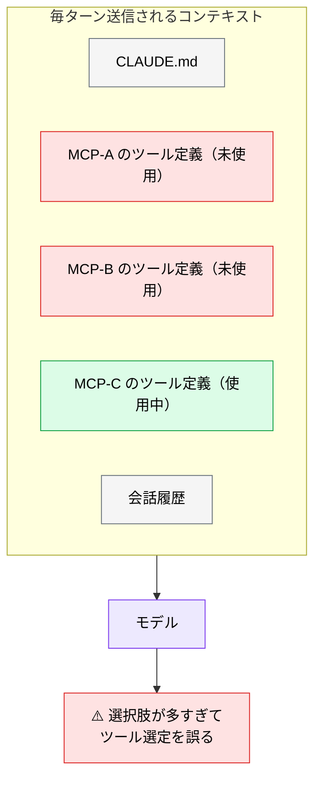
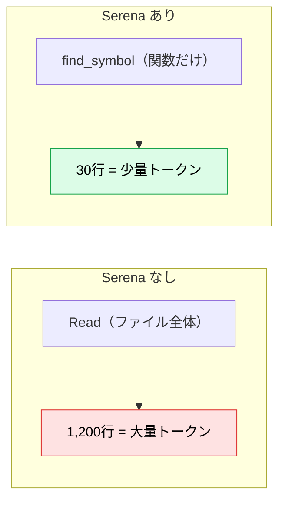
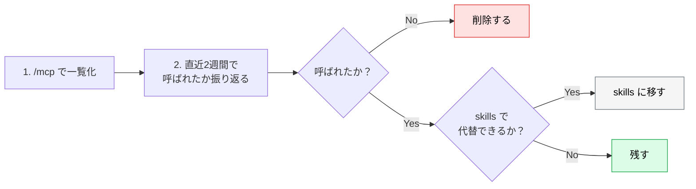

# MCP を「減らす」最適化

> **この記事でわかること**：MCP を増やすほど精度が落ちる理由と、棚卸しの具体的な手順。

## 結論

> **「多いほど賢くなる」は誤解である。**

登録した MCP が増えるほど、ツール説明だけでコンテキストを消費し、AI のツール選択ミスも増える。**使わない MCP を削ることが精度向上の近道**になる。

そして検討順序は次のとおりである。

> **まず skills で解決できないか考える。外部システムへの通信が本当に必要なときだけ MCP を足す。**

## 背景・課題

MCP サーバーは繋いだ瞬間から、**一度も呼び出さなくてもコストを払っている**。ツール名・説明文・引数スキーマが毎ターン送信されるためである。



登録 MCP が増えるほど、ツール説明だけで**コンテキストの数%〜十数%程度**を消費する（目安）。加えて、似た機能のツールが並ぶと、モデルがどれを呼ぶべきか迷い、遠回りな手順を取るようになる。

## 具体的な方法

### skills と MCP の使い分け

| 層 | 役割 | 採用順序 |
| --- | --- | --- |
| **skills** | 静的なナレッジ・定型手順を AI に注入 | **まずここで解決できないか検討する** |
| **MCP** | 外部システムへの通信・状態取得 | skills で済まないときだけ追加する |

skills はコンテキスト消費が小さく、Git で管理でき、更新履歴も追える。**「社内の API 設計規約を参照させたい」程度なら MCP は要らない**。skills に書けば済む。

MCP が必要なのは、次のように**内容が動的に変わる**場合に限られる。

- 現在の Issue 一覧（GitHub MCP）
- 実際の DB スキーマ（Postgres MCP）
- ライブラリの最新仕様（Context7 MCP）

### コンテキスト消費を抑える設計原則

| 原則 | 具体策 |
| --- | --- |
| **1呼び出しで必要情報を返しきる** | 複数ツールの往復を避け、集約エンドポイントを MCP 側に用意する |
| **遅延ロード（Modular MCP）** | 起動時は最小限にし、タスクに応じてツール群を動的に有効化する |
| **Intent 検索・信頼スコアで選別** | 類似機能の MCP が複数ある場合、成功率の高いものを優先する |
| **不要になった MCP は即削除** | `.mcp.json` を定期的に棚卸しする |

### 例外：追加すると総量が減る MCP

すべての MCP がコンテキストを増やすわけではない。**Serena MCP は追加してもトークン総量が減るタイプの例外**である。



`Read` / `Grep` の大部分を symbol 単位の操作が置換するため、ツール説明分の増加を実操作での削減が上回る（→ [`11_serena.md`](11_serena.md)）。

**判断基準**：そのサーバーが「情報を足す」のか「取得を効率化する」のか。後者なら追加で総量が減る可能性がある。

### 棚卸しの手順



月次で回すことを推奨する。「いつか使うかもしれない」で残したサーバーは、ほぼ確実に使われないまま消費を続ける。

### 導入時のルール

| ルール | 理由 |
| --- | --- |
| **1つずつ入れる** | 複数同時だと、精度が落ちたときの原因が特定できない |
| **2週間使ってから判断する** | 初日の物珍しさで「使った」と錯覚しやすい |
| **役割が重なるものは片方に絞る** | GitHub MCP と gh CLI の併用は不要（→ [`10_github.md`](10_github.md)） |
| **IDE には最小限だけ繋ぐ** | 補完・レビューの応答速度に直結する |

## 実際のプロンプト例

```bash
# 現状を把握する
/mcp

# コンテキスト使用状況
/context
```

```text
# 棚卸しを手伝わせる
接続中の MCP サーバーを一覧して、次の観点で分類して。

A: このリポジトリの技術スタックから見て必須
B: あると便利だが skills で代替できる
C: 使う場面が想定できない

分類理由も添えて、C は削除、B は skills 化の提案を出して。
```

```text
# skills で代替できるか検討させる
「社内の API 設計規約を参照させる」という目的に対して、
MCP サーバーを追加する場合と .claude/skills/ に書く場合の
メリット・デメリットを比較して。このプロジェクトではどちらが適切か判断して。
```

## 注意点

> **「減らす」は精度施策であってコスト施策ではない。** 副次的にコストも下がるが、主目的はモデルの注意力を本題に集中させることである。

> **IDE とターミナルで構成を分ける。** IDE 側は最小限（あるいはゼロ）にし、重い MCP 利用はターミナルの Claude Code に寄せる。IDE に過剰接続すると、エディタ本来の軽快な補完・レビューまで遅延・劣化する。

> **削除は可逆である。** 迷ったら削る。必要になれば `claude mcp add` で1行復活する。残す判断のほうがコストが高い。

## 参考リンク

- 関連：[`01_setup.md`](01_setup.md) — 導入と設定
- 関連：[`11_serena.md`](11_serena.md) — 追加すると総量が減る例
- 関連：[`../01_claude-code/10_context-management.md`](../01_claude-code/10_context-management.md)
- 関連：[`../05_prompt-engineering/03_skills-integration.md`](../05_prompt-engineering/03_skills-integration.md)
