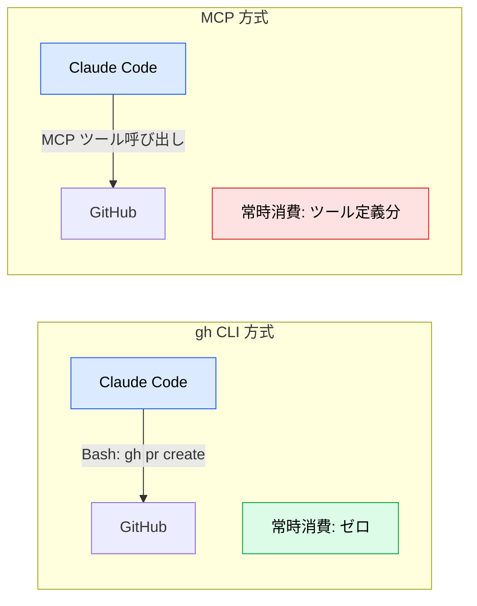
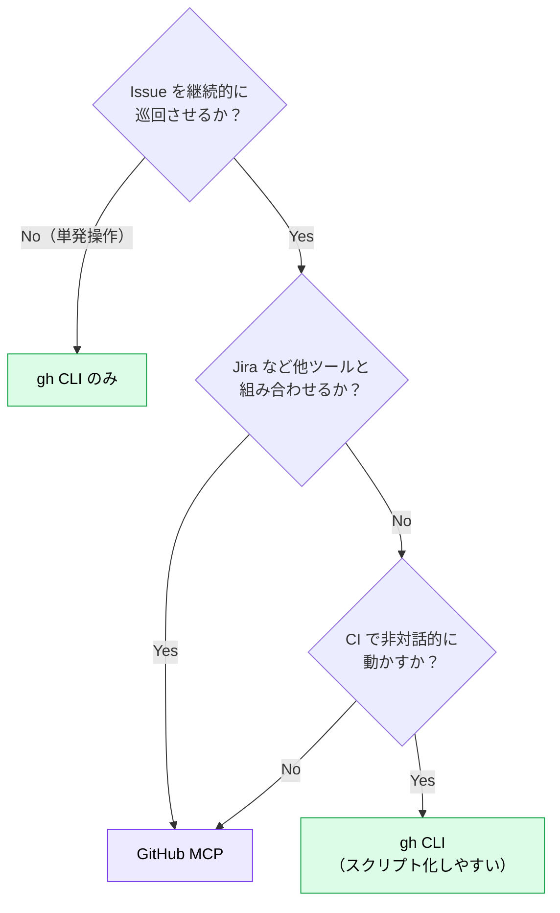
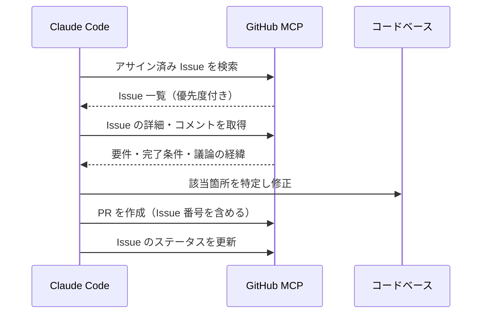

# GitHub MCP ― gh CLI との使い分け

> **この記事でわかること**：GitHub 連携には MCP と `gh` CLI の2通りがあり、どちらを選ぶべきか。両方入れる必要はない。

## 結論

**単発の PR / Issue 操作なら `gh` CLI で十分。MCP は不要である。**

MCP を採用するのは、**Issue を継続的に巡回する自律フロー**を組む場合に限る。

| | GitHub MCP | gh CLI（Bash 経由） |
| --- | --- | --- |
| セットアップ | `.mcp.json` に設定 | ローカルインストール + `gh auth login` |
| **コンテキスト消費** | ツール定義分が**常時ロード** | **ゼロ**（都度 Bash 実行） |
| 対話的操作 | AI がツールとして直接呼ぶ | AI が `gh pr create` を Bash で実行 |
| 推奨ケース | 継続的な Issue ドリブン開発・自動化 | 単発の PR / Issue 作成・コメント取得 |

## 背景・課題

「GitHub と連携させたい」と考えたとき、多くの人は反射的に GitHub MCP を入れる。しかし Claude Code は `gh` コマンドの存在を認識しており、**Issue 取得・PR 作成・コメント読み取りに自動で利用する前提で設計されている**。

つまり `gh` が入っていれば、MCP なしでも GitHub 連携は成立する。しかも `gh` はコンテキストを常時消費しない。



## 具体的な方法

### 判断フロー



### gh CLI での運用

```bash
# 初回のみ
gh auth login
```

あとは自然言語で指示するだけで、Claude Code が適切な `gh` コマンドを組み立てる。

```text
現在自分にアサインされている Issue を優先度順に一覧して。
```

```text
このブランチの変更内容から PR を作成して。
タイトルは変更の要点、本文には「変更点」「テスト方法」「関連 Issue」を含めて。
```

### GitHub MCP での自律フロー

MCP が本領を発揮するのは、**タスク取得から PR 作成までを一連で回す**構成である。



**ワークフロー**

1. アサインされている In Progress のチケット / Issue を検索・取得する
2. 詳細（ユーザー要件、完了条件）と関連コメントを読み込む
3. コードベース内の該当箇所を特定し、実装・修正する
4. チケット番号を含めた PR を作成し、ステータスを更新する

### 設定

> **⚠️ `@modelcontextprotocol/server-github`（リファレンス実装）はアーカイブ済みである。** 現行の公式は `github/github-mcp-server` で、`--read-only` や `--toolsets` といった**権限を絞る機能はこちらにしかない**。

**リモート HTTP 版（推奨・OAuth）**

```bash
claude mcp add --transport http --scope project github https://api.githubcopilot.com/mcp/
```

トークンをファイルに持たずに済む。

**ローカル起動（Docker）**

```json
{
  "mcpServers": {
    "github": {
      "command": "docker",
      "args": [
        "run", "-i", "--rm",
        "-e", "GITHUB_PERSONAL_ACCESS_TOKEN",
        "ghcr.io/github/github-mcp-server",
        "--read-only",
        "--toolsets", "repos,issues,pull_requests"
      ],
      "env": {
        "GITHUB_PERSONAL_ACCESS_TOKEN": "${GITHUB_PERSONAL_ACCESS_TOKEN}"
      }
    }
  }
}
```

**環境変数名は `GITHUB_PERSONAL_ACCESS_TOKEN` である**（`GITHUB_TOKEN` ではない）。`.mcp.json` に直書きせず環境変数で渡す。

`--read-only` と `--toolsets` を使えば、**トークン権限だけでなくサーバー側でも操作を絞れる**。レビュー用途なら読み取り専用にする。

| オプション | 内容 |
| --- | --- |
| `--read-only` | 書き込み系ツールを無効化（Docker では環境変数 `GITHUB_READ_ONLY=1` も可） |
| `--toolsets` | 有効化するツール群を選ぶ。既定は `repos,issues,pull_requests`。他に `actions` / `code_security` / `secret_protection` 等 |

> 環境変数 `GITHUB_TOOLSETS` は CLI 引数より優先される。

### Jira との併用

Jira MCP と組み合わせる場合、役割を明確に分ける。

| ツール | 担当 |
| --- | --- |
| **Jira MCP** | タスクの取得・優先度判定・ステータス更新 |
| **GitHub MCP / gh** | コード変更・PR 作成・レビューコメント |

両方を「タスク管理」に使うと、どちらが正なのか分からなくなる。**チケットの正は Jira、コードの正は GitHub** と決めておく。

## 実際のプロンプト例

```text
# 自律的なタスク消化（MCP 前提）
GitHub MCP（または Jira MCP）を使用して、現在私に割り当てられている
一番優先度の高いバグ修正チケットを取得してください。
チケットの詳細を読み、原因を調査して修正を実装してください。
完了後、チケット番号をコミットメッセージと PR のタイトルに含めて提出してください。
```

```text
# gh CLI で完結させる（MCP 不要）
gh コマンドを使って、直近1週間にマージされた PR を一覧し、
変更内容を機能追加 / バグ修正 / リファクタリングに分類して要約して。
```

```text
# レビュー観点の取得
この PR に付いているレビューコメントをすべて取得して、
対応済み / 未対応に分類して。未対応のものは修正案も添えて。
```

## 注意点

> **両方入れる必要はない。** MCP を減らしたい場合は gh CLI のみで十分なケースが多い。継続的な Issue 巡回や Jira と組み合わせた自律フローを組むときだけ GitHub MCP を採用する。

> **トークンの権限は最小限にする。** リポジトリへの書き込み権限を持つトークンを渡す以上、意図しない PR 作成やブランチ操作が起こりうる。組織全体に及ぶ権限は付けない。

> **PR 作成の自動承認は避ける。** 外部に見える成果物であり、一度作れば通知が飛ぶ。書き込み系ツールは都度確認する設定にしておく。

> **Issue の内容を鵜呑みにさせない。** Issue に書かれた「原因」が誤っていることは珍しくない。「Issue の記述を検証したうえで」と指示に含める。

## 参考リンク

- [GitHub CLI 公式](https://cli.github.com/)
- 関連：[`../20_github-claude/`](../20_github-claude/) — GitHub 活用の全体像
- 関連：[`02_tool-reduction.md`](02_tool-reduction.md) — 入れすぎを防ぐ
