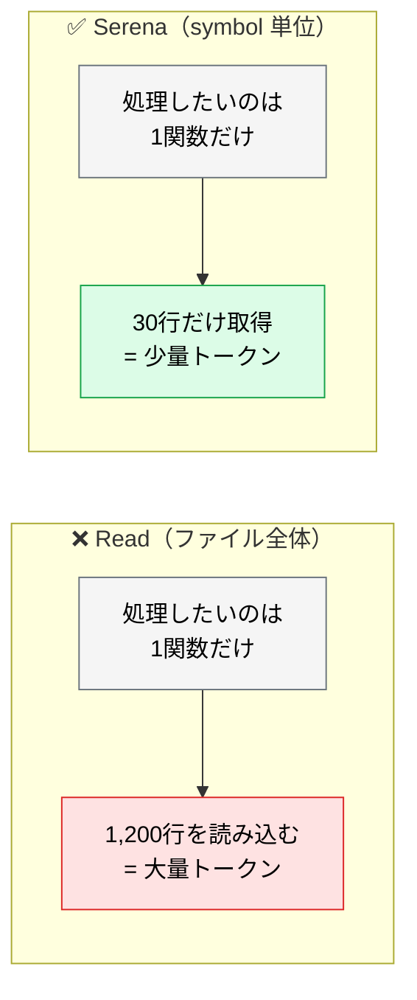
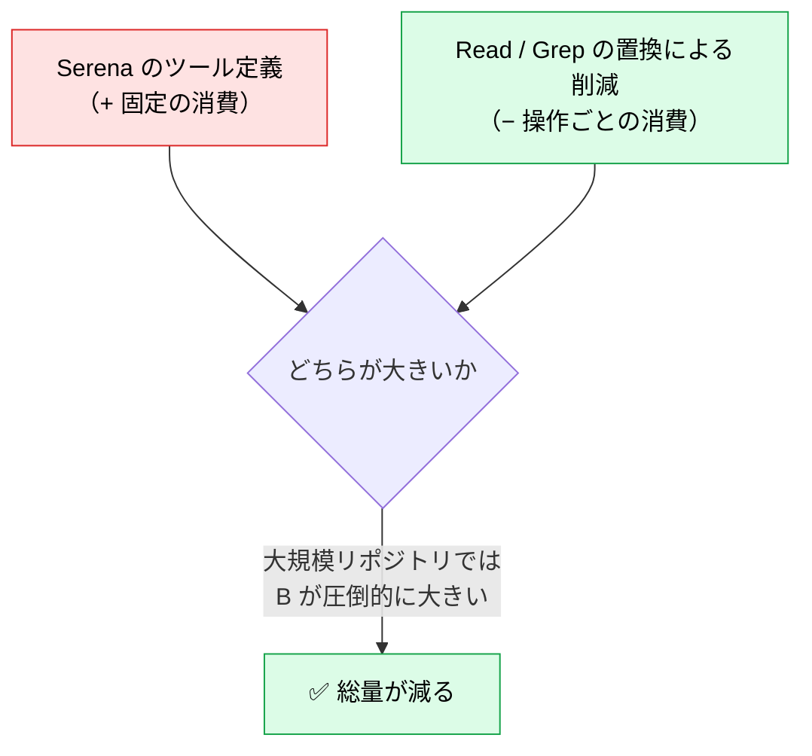

# Serena MCP ― 追加するとトークンが減る例外

> **この記事でわかること**：MCP は普通コンテキストを増やすが、Serena は減らす。その仕組みと、効果が出る条件・出ない条件。

## 結論

Serena MCP は **LSP（Language Server Protocol）を仲介して、シンボル単位でコードを取得・編集する**。ファイル全体を読む `Read` を置き換えるため、**追加しても総コンテキストが減る唯一に近い例外**である。

利用者報告では最大 70% 程度のトークン削減が観測されている（※公式計測値ではなく目安）。

ただし効果は **LSP の成熟度に依存する**。TypeScript / Python / Go / Rust では恩恵が大きく、LSP が貧弱な言語や独自 DSL では機能しない。

## 背景・課題

Claude Code の `Read` は**ファイル全体**を読み込む。1ファイル 1,000 行超のモノレポでは、数回の操作でコンテキストが膨張し、コンテキスト希釈に陥る。

しかし実際に必要なのは、その 1,000 行のうち特定の関数 30 行だけ、ということがほとんどである。



## 具体的な方法

### 代表的なツール

| ツール | 用途 |
| --- | --- |
| `find_symbol` | 関数・クラス・メソッドを名前で検索し、**その定義だけ**を返す |
| `find_referencing_symbols` | 指定シンボルを参照している箇所を列挙する |
| `insert_after_symbol` | 指定シンボルの直後にコードを挿入する |
| `replace_symbol_body` | シンボルの本体のみを置換する（周辺行を触らない） |

`replace_symbol_body` の価値は**トークン削減だけではない**。周辺行に触れないため、無関係な箇所への意図しない変更が構造的に起きない。差分レビューが楽になる。

### なぜ「減らす最適化」の例外なのか

通常、MCP を増やすとツール定義分だけコンテキストが増える。Serena も同様に増える。しかし、



**判断基準**：そのサーバーが「情報を足す」のか「取得を効率化する」のか。Serena は後者にあたる。

### 効果が出る条件

| 条件 | 効果 |
| --- | --- |
| 主要言語が TypeScript / Python / Go / Rust | ◎ LSP が成熟しており symbol 解決が確実 |
| 500 行を超えるファイルが多い | ◎ 削減幅が大きい |
| モノレポ・大規模コードベース | ◎ 横断検索の削減効果が大きい |
| 小規模プロジェクト（数十ファイル） | △ `Read` で足りる。導入の手間が上回る |
| 独自 DSL・LSP が貧弱な言語 | ✕ symbol 解決が通らず機能しない |

> **導入前に小規模検証する。** 対象プロジェクトの主要言語で `find_symbol` が期待どおり動くか確認してから本格導入する。LSP が動かない環境では、ツール定義分のコンテキストを払うだけの結果になる。

### 使い方

導入後は、明示的に指示しなくても Claude Code が適切に使い分ける。ただし**大規模ファイルを扱うと分かっている場合は明示したほうが確実**である。

```text
Serena で UserService クラスの authenticate メソッドだけを取得して、
ファイル全体は読まずに実装を確認して。
```

```text
PaymentProcessor を参照している箇所を find_referencing_symbols で列挙して。
このクラスのインターフェースを変更した場合の影響範囲を教えて。
```

### 設定

```bash
claude mcp add --scope project serena -- uvx --from git+https://github.com/oraios/serena serena start-mcp-server
```

起動には uv（`uvx`）が必要である。対象プロジェクトの言語に対応する LSP が動作することを事前に確認する。

## 実際のプロンプト例

```text
# 影響範囲調査（Read を使わせない）
calculateDiscount 関数のシグネチャを変更したい。
Serena の find_referencing_symbols で呼び出し元を全て列挙して、
それぞれどう修正が必要かを表にして。
ファイル全体の読み込みは行わないで。
```

```text
# 最小差分での編集
UserRepository の findByEmail メソッドの実装だけを、
replace_symbol_body で置き換えて。周辺のコードには一切触れないで。
```

```text
# 導入判断のための検証
このリポジトリの主要言語で Serena の symbol 解決が正しく動くか、
代表的なクラス3つで find_symbol を試して結果を報告して。
```

## 注意点

> **効果は LSP の成熟度に依存する。** 言語によって結果が大きく変わる。「入れれば必ず 70% 減る」ものではない。

> **小規模プロジェクトでは不要である。** ファイル数が少なく、1ファイルが短いなら `Read` で足りる。導入と検証の手間が削減効果を上回る。

> **symbol が解決できないとフォールバックする。** 生成コード、動的に定義されるシンボル、型情報が失われている箇所では期待どおりに動かない。結果が空なら `Read` に切り替える判断が要る。

> **削減効果は「操作の仕方」次第である。** Serena を入れても、モデルが `Read` を使い続ければ効果は出ない。大規模ファイルを扱うタスクでは、プロンプトで明示的に指定するのが確実である。

## 参考リンク

- [oraios/serena（GitHub）](https://github.com/oraios/serena)
- 関連：[`02_tool-reduction.md`](02_tool-reduction.md) — 減らす最適化の全体像
- 関連：[`../01_claude-code/10_context-management.md`](../01_claude-code/10_context-management.md)
