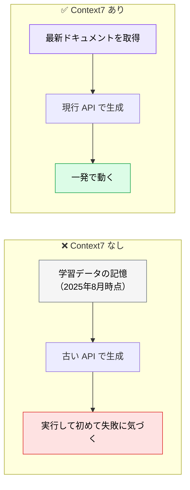
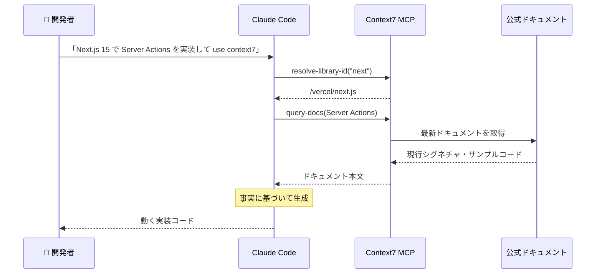

# Context7 MCP ― 知識カットオフを埋める

> **この記事でわかること**：AI が「もっともらしい嘘の API」を書く問題を、最新公式ドキュメントの参照で潰す方法。最初に入れる MCP として推奨する理由。

## 結論

**最初に入れる MCP として最も費用対効果が高い。**

LLM には知識カットオフがある。カットオフ以降に API が変わったライブラリでは、**すでに deprecated になった関数を自信満々に生成する**。Context7 MCP は、コード生成の直前に該当ライブラリの最新公式ドキュメントを取得してこれを潰す。

使い方は簡単で、**プロンプト末尾に `use context7` と書くだけ**である。

## 背景・課題

Claude の知識カットオフは 2025年8月時点である。React 19 / Next.js 15 / Tailwind 4 など、**カットオフ以降に API が変わったライブラリ**では次が起きる。

- 誤ったシグネチャを生成する
- deprecated になった関数を使う
- 存在しないオプションをもっともらしく書く

厄介なのは、**AI が自信を持って間違える**点である。動かして初めて気づく。



## 具体的な方法

### 利用フロー



1. `resolve-library-id` で曖昧なライブラリ名（例：`next`）を Context7 ID（例：`/vercel/next.js`）に解決する
2. `query-docs` で対象 API の現行シグネチャ・サンプルコードを取得する（**旧名は `get-library-docs`。`@upstash/context7-mcp` v2.0.0 で改名された**。旧名のまま動く連携もあるため、ツール一覧に出ない場合は両方試す）
3. 取得内容を踏まえて実装コードを生成する

### 設定

```json
{
  "mcpServers": {
    "context7": {
      "command": "npx",
      "args": ["-y", "@upstash/context7-mcp"]
    }
  }
}
```

初回起動時に `npx` がパッケージを取得するため、Node.js が必要である。認証不要で使えるが、API キーを使う場合は環境変数経由で渡す。

### 従来の WebSearch との違い

| | WebSearch | Context7 MCP |
| --- | --- | --- |
| 取得するもの | 検索結果ページ | **公式ドキュメント本文** |
| 情報の質 | ブログ記事・古い Q&A が混ざる | 一次情報 |
| 手順 | 検索 → ページ選択 → 解析 | ID 解決 → ドキュメント取得 |
| トークン効率 | 無関係な内容も読む | 該当 API に絞れる |

**「検索して読む」ではなく「ドキュメントを直接引く」**のが Context7 である。ノイズが混ざらない分、生成の精度が安定する。

### 対象範囲

| 対象 | 可否 | 代替 |
| --- | --- | --- |
| 公開 OSS・メジャーフレームワーク | ✅ | — |
| 社内ライブラリ | ❌ | Notion MCP / Confluence MCP |
| プライベートリポジトリ | ❌ | 社内ドキュメント系 MCP、RAG |

内製 SDK のドキュメント参照には、社内資料系の MCP を組み合わせる（→ [`40_notion.md`](40_notion.md)、[`../03_rag/`](../03_rag/)）。

## 実際のプロンプト例

```text
Next.js 15 の App Router で Server Actions を使ったフォーム送信を実装してください。
フォームは name / email を受け取り、Zod でバリデーションし、Prisma で保存します。
use context7
```

`use context7` を末尾に付けるだけで、Claude Code が Context7 MCP を自動で呼び出し、Next.js 15・Zod・Prisma それぞれの最新ドキュメントを参照して実装する。

```text
# バージョン移行の確認
このプロジェクトの package.json を読んで、
主要ライブラリのうち知識カットオフ以降にメジャーバージョンが上がっているものを特定して。
それぞれ Context7 で最新仕様を確認し、現在のコードに破壊的変更の影響がないか調べて。
use context7
```

```text
# 既存コードの検証
@src/api/route.ts の実装が Next.js 15 の現行仕様に沿っているか、
Context7 で公式ドキュメントを確認したうえで判定して。
deprecated な書き方があれば、現行の書き方に修正して。
use context7
```

## 注意点

> **こういう場合は入れなくていい**
> - 使っているライブラリが**知識カットオフ以降に更新されていない**（枯れた構成）
> - 社内ライブラリ中心で、公開 OSS への依存が薄い
> - すでにバージョンを固定しており、当面上げる予定がない
>
> Context7 の価値は「カットオフ以降の変化」を埋めることにある。変化がなければ払うのはコンテキスト消費だけになる。

> **`use context7` を付けないと呼ばれないことがある。** モデルが「知っている」と判断すれば、既存知識で生成する。**カットオフ以降に変わった可能性があるライブラリでは明示的に付ける**のが確実である。

> **API キーは環境変数経由で渡す。** `.mcp.json` に平文で書かない。

> **社内ライブラリは対象外である。** Context7 が見るのは公開ドキュメントに限られる。内製 SDK の仕様は別の手段で渡す必要がある。

> **ドキュメントが正しくても実装が正しいとは限らない。** Context7 は「API の使い方」を保証するが、「その API を使うべきか」は判断しない。設計判断は人間の責務である。

## 参考リンク

- [Context7 公式](https://context7.com/)
- 関連：[`01_setup.md`](01_setup.md) — 導入手順
- 関連：[`90_context-chain.md`](90_context-chain.md) — 他の MCP と繋ぐ
