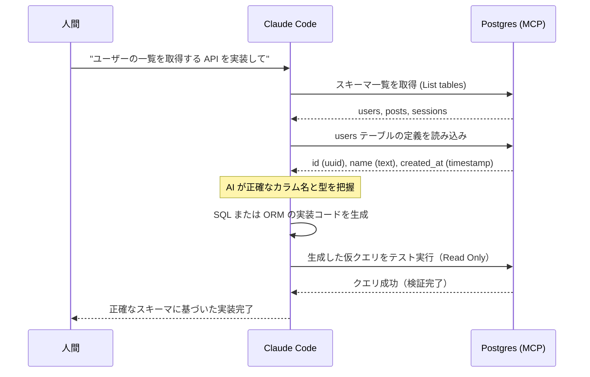
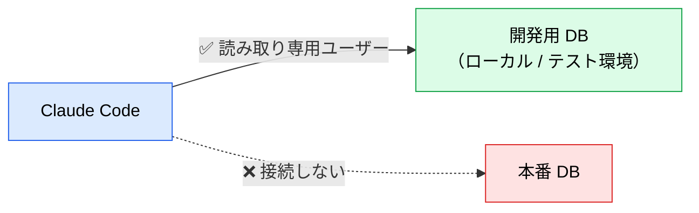

# Postgres MCP ― スキーマを推測させない

> **この記事でわかること**：AI が架空のテーブル・カラムを生成する問題を、実スキーマの参照で潰す方法と、接続先を安全に限定する設計。

## 結論

DB MCP の価値は1点に集約される。

> **カラム名と型を「推測」させず「取得」させる。**

そして最重要の運用ルールは接続先の限定である。

> **テスト用・ローカル開発用の DB にのみ、読み取り専用で接続する。本番には繋がない。**

## 背景・課題

バックエンド実装で AI が生成する誤りの多くは、スキーマの推測に由来する。

- 存在しないカラム名（`user_name` と `username` の取り違え）
- 型の誤り（`uuid` を `int` として扱う）
- ORM の型定義ミス
- 実在しないテーブルへの JOIN

これらは**実行するまで気づかない**。しかも一見それらしいコードなので、レビューでも見落とされやすい。

## 具体的な方法

### ワークフロー



注目すべきは**最後の検証ステップ**である。生成したクエリを読み取り専用で実行し、通ることを確認してから返す。この自己検証があるため、実装の一発成功率が上がる。

### 主な用途

| 用途 | 効果 |
| --- | --- |
| 正確な SQL / ORM 生成 | カラム名・型のハルシネーションを排除 |
| マイグレーション作成 | 既存スキーマを踏まえた差分を生成できる |
| 既存クエリのレビュー | 実スキーマと照合してインデックス不足・N+1 を指摘 |
| データモデルの把握 | 新規参画時にテーブル間の関係を要約させる |

### 安全な接続設計



**3段構えで守る。**

| 層 | 対策 |
| --- | --- |
| 1. 接続先 | 本番ではなくローカル / テスト環境の DB を指定する |
| 2. DB ユーザー | 読み取り専用の専用ユーザーを作成する |
| 3. 権限設定 | 書き込み系 MCP ツールを自動承認しない |

**「実行環境の DB にのみ MCP 接続権限を与える」** ことで、セキュアに「生きたスキーマ」を AI に共有できる。

読み取り専用ユーザーの例：

```sql
-- 実行は myapp_dev の所有者（マイグレーション実行ロール）で行う
CREATE USER ai_readonly WITH PASSWORD :'pw';

-- 保険：このロールの全トランザクションを読み取り専用に固定する
ALTER ROLE ai_readonly SET default_transaction_read_only = on;

REVOKE CONNECT ON DATABASE myapp_dev FROM PUBLIC;
GRANT  CONNECT ON DATABASE myapp_dev TO ai_readonly;

-- スキーマごとに繰り返す（public 以外がある場合は必ず追加）
GRANT USAGE  ON SCHEMA public TO ai_readonly;
GRANT SELECT ON ALL TABLES IN SCHEMA public TO ai_readonly;

-- 将来作られるテーブルにも効かせる（FOR ROLE を忘れると効かない）
ALTER DEFAULT PRIVILEGES FOR ROLE app_owner IN SCHEMA public
  GRANT SELECT ON TABLES TO ai_readonly;

-- PostgreSQL 14 以前のみ：public への CREATE を剥がす
REVOKE CREATE ON SCHEMA public FROM PUBLIC;
```

**4つの落とし穴がある。**

| 落とし穴 | 対処 |
| --- | --- |
| `GRANT SELECT ON ALL TABLES` は**実行時点のテーブルにしか効かない** | `ALTER DEFAULT PRIVILEGES` を併用する |
| `ALTER DEFAULT PRIVILEGES` は**実行ロールが作るオブジェクトにしか適用されない** | `FOR ROLE <マイグレーション実行ロール>` を付ける |
| `public` スキーマしかカバーしていない | 複数スキーマ構成では各スキーマに繰り返す |
| PostgreSQL 14 以前は `PUBLIC` が `public` に `CREATE` を持つ | `REVOKE CREATE` する |

**最も費用対効果が高いのは `default_transaction_read_only = on` の1行**である。サーバー実装に依存せず読み取り専用を担保できる。

### 設定

> **⚠️ `@modelcontextprotocol/server-postgres` は使わない。** 2025年5月にリポジトリがアーカイブされ、2025年7月10日付で正式に非推奨となった。**既知の SQL インジェクション脆弱性があり、read-only モードもバイパス可能との報告がある。**
>
> 代替として `crystaldba/postgres-mcp` などメンテナンスされている実装を選ぶ。`--access-mode=restricted`（読み取り専用＋実行時間制限）と `--access-mode=unrestricted`（開発用）の2モードがある。

**接続文字列は `env` で渡す。argv に置かない。**

```json
{
  "mcpServers": {
    "postgres": {
      "command": "npx",
      "args": ["-y", "<現行のサーバーパッケージ>"],
      "env": {
        "DATABASE_URI": "${DATABASE_URL_READONLY}"
      }
    }
  }
}
```

> **argv に渡すとパスワードが `ps` で見える。** 展開後の接続文字列は**プロセスの引数**になるため、同一マシンの他ユーザー・`ps aux`・監視エージェント・クラッシュダンプに平文で露出する。`.mcp.json` への直書きを避けても、argv 経由なら結局漏れる。argv しか受けないサーバーを使う場合は、**共用ホストでは使わない**。

### 開発環境にデータが無い場合

「ローカル DB は空でスキーマだけある」という状況は多い。この場合でも**スキーマ参照の価値は失われない**。カラム名・型・制約が取れれば、生成精度は大きく改善する。

サンプルデータが必要な場合は、本番データではなく生成データを投入する。個人情報を含む本番データを開発環境にコピーすること自体がリスクである。

## 実際のプロンプト例

```text
# 推測を禁止する
Postgres MCP で users テーブルと orders テーブルの実際のスキーマを確認してから、
「直近30日の注文がある会員一覧」を取得する SQL を書いて。
カラム名は推測せず、必ず取得した定義に従って。
書いたクエリは読み取り専用で実行して、通ることを確認して。
```

```text
# マイグレーション作成
現在の users テーブルの定義を Postgres MCP で確認して、
「最終ログイン日時」カラムを追加するマイグレーションを作成して。
既存データがある前提で、NOT NULL 制約をどう扱うかも提案して。
```

```text
# 既存実装のレビュー
@src/repositories/order.ts のクエリを、実際のスキーマと照合してレビューして。
インデックスが効かない書き方、N+1 になりうる箇所を指摘して。
```

## 注意点

> **こういう場合は入れなくていい**
> - **ORM の型生成（Prisma / Drizzle 等）が既に効いている。** 型定義ファイルを読ませれば同じ精度が出る
> - スキーマがほぼ固定で、テーブル数が少ない小規模プロジェクト
> - 開発用 DB を用意できない（本番しかない）環境 — **この場合は導入しないのが正しい**
>
> 判断基準は「スキーマ情報がコード上に存在するか」である。存在するなら MCP は要らない。

> **本番 DB には接続しない。** 読み取り専用であっても、個人情報を含むデータがコンテキストに載る可能性がある。開発用 DB を使う。

> **クエリ結果がコンテキストに載る。** `SELECT *` を大量行に対して実行させると、コンテキストを一気に消費する。「LIMIT を付けて」と指示する習慣をつける。

> **スキーマが取れても仕様は取れない。** カラムの型は分かるが、「このフラグが true のときの業務上の意味」は分からない。ビジネスルールは仕様書側で定義する（→ [`90_context-chain.md`](90_context-chain.md)）。

> **認証情報の露出経路はファイルだけではない。** argv・シェル履歴・プロセス一覧のいずれからも漏れる。`env` 経由で渡し、共用ホストでの利用を避ける。

> **「読み取り専用で実行して確認」はサーバー実装依存である。** サーバーが `BEGIN TRANSACTION READ ONLY` で包んでいるから成立する。乗り換え時は再確認する。`default_transaction_read_only = on` を設定しておけば実装によらず担保できる。

> **書き込み系ツールを自動承認しない。** `DROP TABLE` や `UPDATE` が意図せず実行される事故を防ぐ。読み取り専用ユーザーで接続していれば構造的に防げる。

## 参考リンク

- 関連：[`01_setup.md`](01_setup.md) — 認証情報の扱い
- 関連：[`90_context-chain.md`](90_context-chain.md) — API 仕様・UI 仕様との連結
- 関連：[`../22_security/05_mcp-risks.md`](../22_security/05_mcp-risks.md)
