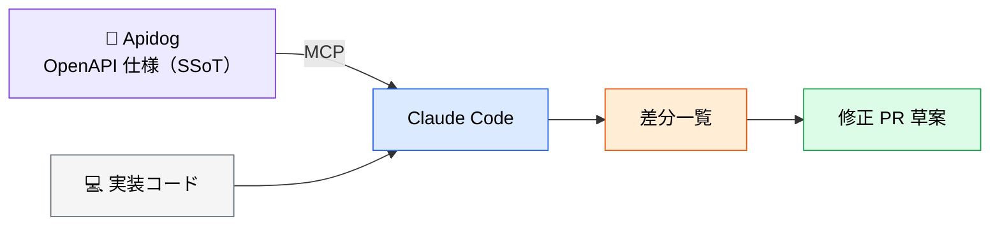

# Apidog MCP ― 仕様と実装の乖離を検知する

> **この記事でわかること**：OpenAPI 仕様を SSoT として、実装とのドリフトを自動検知し修正 PR 草案まで作る方法。

## 結論

Apidog MCP の価値は **「仕様と実装のどちらが正か」を機械的に判定できる**ことにある。

仕様を SSoT（Single Source of Truth）に固定し、実装との差分を AI に検出させる。並行開発で仕様変更が頻繁に起きるプロジェクトほど効果が大きい。

## 背景・課題

API 開発では、次のドリフトが日常的に発生する。

- 仕様書にはあるが実装されていないパラメータ
- 実装は変わったが仕様書が更新されていない
- レスポンスの型が仕様と微妙に違う（`number` vs `string`）
- ステータスコードの扱いが仕様と異なる

これらはフロントエンド側が実装して初めて発覚し、手戻りになる。**「仕様書を読んで実装を確認する」作業は機械的なので、AI に任せられる。**



## 具体的な方法

### 基本の使い方

仕様を取得させ、実装と比較させ、差分を出させる。この3ステップを1プロンプトにまとめる。

```text
Apidog MCP から `/users` エンドポイントの最新仕様を取得し、
@src/api/users/handler.ts の実装と比較してください。

出力:
1. 差分一覧（パラメータ・レスポンス型・ステータスコード・バリデーション）
2. 必要な修正箇所（ファイル:行）
3. 修正 PR 草案（コード diff 形式）

制約:
- 既存のユニットテストが落ちない範囲で最小変更に留めること
- どちらが正しいかは判断しないこと。更新日時など事実面の根拠だけ添えること
```

**出力形式を指定する**のが重要である。「差分を教えて」だけだと散文で返り、対応漏れが生じる。

### 比較すべき4項目

| 項目 | 見落としやすい点 |
| --- | --- |
| **パラメータ** | 必須／任意の別、デフォルト値 |
| **レスポンス型** | `number` と `string`、null 許容の有無 |
| **ステータスコード** | エラー時のコード体系（400 か 422 か） |
| **バリデーション** | 文字数上限、正規表現、列挙値 |

### CI での継続的モニタリング

PR 時に仕様との差分を検査し、未同期ならコメントで警告する運用が有効である。

```yaml
# .github/workflows/api-spec-check.yml（擬似例）
# ※ 実際は CI スクリプトから MCP クライアント経由で Apidog から仕様を取得し、
#    既存ハンドラと比較するジョブを組む想定
- name: Check API spec drift (pseudo)
  run: node scripts/check-apidog-drift.js --project ${{ secrets.APIDOG_PROJECT_ID }}
```

> 上記は構成イメージである。MCP は対話的な利用が前提のため、CI に組み込む場合は MCP クライアントをスクリプトから叩く形になる。仕組みを作る前に、まず手元での差分検知を運用に乗せるほうが確実である。

### フェーズをまたいだ活用

Apidog は要件定義フェーズでも使う。**同じ仕様を、フェーズをまたいで参照する**のが設計上の要点である。

| フェーズ | 使い方 |
| --- | --- |
| **要件定義** | AI と対話しながら API 仕様を起草する（→ [`../10_requirements/03_api-spec.md`](../10_requirements/03_api-spec.md)） |
| **実装** | 仕様を参照しながらハンドラを実装する |
| **レビュー** | 実装と仕様の差分を検知する |
| **テスト** | 仕様からテストケースを生成する |

仕様書が「作って終わり」にならず、開発サイクル全体で参照され続ける状態を作る。

### 設定

```bash
claude mcp add --scope project apidog -- npx -y apidog-mcp-server --project=<プロジェクトID>
```

**認証情報は Apidog 側の「環境変数」機能に登録し、MCP には渡さない。** 正確なパッケージ名と引数は公式ドキュメントで確認する。

## 実際のプロンプト例

```text
# 差分検知
Apidog MCP から /orders 配下の全エンドポイント仕様を取得して、
@src/api/orders/ の実装と突き合わせて。

未実装 / 仕様不一致、の2分類で表にして。
どちらが正しいかは判断せず、それぞれの最終更新日時など
事実面の情報だけを根拠として添えて。
```

```text
# 仕様からの実装
Apidog MCP で /payments/refund の仕様を取得して、
その仕様どおりのハンドラを実装して。
バリデーションとエラーレスポンスは仕様の定義に厳密に従って。
```

```text
# テスト生成
Apidog MCP から /users の仕様を取得して、
境界値・異常系を含むテストケースを生成して。
仕様に書かれた制約（文字数上限・必須項目）を全て網羅して。
```

## 注意点

> **こういう場合は入れなくていい**
> - **OpenAPI 仕様が形骸化・放置されている。** 古い仕様との差分を大量に検出しても、ノイズにしかならない
> - 仕様書がコードから自動生成されている（差分が構造的に発生しない）
> - API が少数で、変更頻度も低い
>
> 前提は「仕様書が SSoT として維持されていること」である。維持されていないなら、まず仕様書の運用を直すほうが先である。

> **認証情報を MCP に直接渡さない。** 認証付き API の差分検知では、Header / Cookie / 環境変数などの認証情報を **Apidog 側の「環境変数」機能に登録して参照させる**。MCP の設定ファイルにトークンを平文で書き込まない。

> **「仕様書が正しい」前提が崩れることがある。** 実装のほうが正しく、仕様書が古いケースは多い。AI に「どちらが正か」を判断させず、**差分を提示させて人間が決める**。プロンプトで「どちらが正しいかは判断せず、差分と根拠だけ出して」と指示するのが安全である。

> **最小変更に留めさせる。** 差分をすべて機械的に潰すと、意図的な逸脱まで巻き戻してしまう。「既存のユニットテストが落ちない範囲で」という制約を必ず添える。

## 参考リンク

- [Apidog 公式](https://apidog.com/)
- 関連：[`../10_requirements/03_api-spec.md`](../10_requirements/03_api-spec.md) — 仕様の起草
- 関連：[`90_context-chain.md`](90_context-chain.md) — DB / UI 仕様との連結
