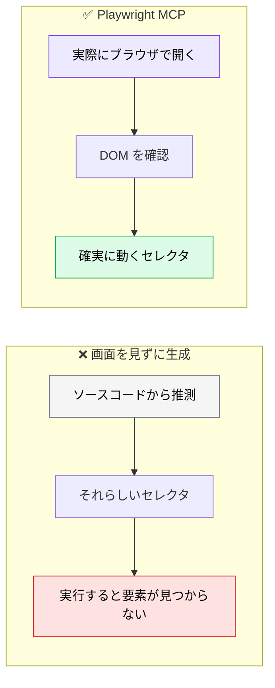
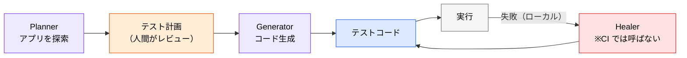

# Playwright MCP ― E2E テストを AI に書かせる

> **この記事でわかること**：ブラウザを実際に操作させながらテストを生成する方法と、Playwright Agents（Planner / Generator / Healer）の使いどころ。

## 結論

Playwright MCP の本質は **「AI にブラウザの目と手を与える」** ことである。

DOM を実際に見ながらセレクタを決めるため、**推測で書いたセレクタが動かない**という E2E テスト最大の苦痛が解消する。

v1.56 以降の Playwright Agents を併用すると、探索 → 計画 → 生成 → 自己修復まで自動化できる。

## 背景・課題

E2E テストが定着しない理由は、書くコストではなく**壊れるコスト**にある。

- UI が少し変わるとセレクタが壊れる
- 壊れたテストの修正が後回しになる
- やがて全体が信用されなくなり、無効化される

AI にテストを書かせても、**画面を見ずに書けばセレクタは推測になる**。この問題を解くのが Playwright MCP である。



## 具体的な方法

### 主な機能

| 機能 | 用途 |
| --- | --- |
| ブラウザ操作 | クリック・入力・遷移を実際に実行する |
| DOM 取得 | 現在の画面構造を取得し、セレクタを決定する |
| スクリーンショット | 視覚的な検証、差分比較 |
| ネットワーク監視 | API 呼び出しの確認 |

### Playwright Agents（v1.56〜）

2025年10月リリース。3つのコアエージェントで構成される。

| エージェント | 役割 |
| --- | --- |
| **Planner** | アプリを探索し、テスト計画を Markdown で出力する |
| **Generator** | テスト計画から実行可能なコードを生成する |
| **Healer** | テスト失敗時に自動修正する |

セットアップは**エージェント定義ファイル一式をスキャフォールドする**方式である。

```bash
# planner / generator / healer のエージェント定義と seed.spec.ts を生成
npx playwright init-agents --loop=claude
```

`--loop` には利用するエージェント環境を指定する（`claude` / `vscode` / `opencode` など）。生成された定義ファイル（`.claude/agents/playwright-*.md` 等）を通じて、以降は**エージェントとして呼び出す**。

生成されるのは **`.claude/agents/` 配下のエージェント定義（Markdown）と `.mcp.json`（Playwright MCP サーバーを指す）、および `seed.spec.ts`** である。

> **`npx playwright agent plan` のような CLI サブコマンドは存在しない。** Planner / Generator は生成されたエージェント定義であり、Claude Code などのホスト側から**エージェントとして**呼び出す。CLI から直接叩けるのは Healer に対する `npx playwright test --agent=healer` のみである。

### Healer の制御

Healer は **opt-in の設定フラグで有効化する**。デフォルトは無効である。

```typescript
// playwright.config.ts
import { defineConfig } from "@playwright/test";

export default defineConfig({
  // ⚠️ use の中ではなくトップレベル。キーは heal ではなく healer
  agents: { healer: true },
});
```

有効化したうえで `npx playwright test --agent=healer` を実行して初めて働く。

> **⚠️ 設定キー名は公式ドキュメントで確認してから使う。** v1.56 前後で仕様が動いており、二次情報では「`use` の中ではなくトップレベル」「キー名は `heal` ではなく `healer`」とされているが、一次情報での確認が取れていない。**キー名は腐るが運用ルールは腐らない。**

> **CI 用の設定では Healer を有効化しない。** Healer は人間がローカルで保守作業をするときだけ有効化する。
>
> セレクタの軽微な変更に追従してくれるのは有用だが、**本来検知すべき退行まで「修正」してしまう**危険がある。CI で自動的に走らせると、テストが存在する意味が失われる。

> v1.56 時点の情報である。CLI・設定仕様は変わりうるため、導入前に公式ドキュメントで確認する。

### Planner → Generator の流れ



**テスト計画を人間がレビューする工程を必ず挟む。** 計画段階なら修正が安い。コードになってから直すのは高い。

### 設定

```json
{
  "mcpServers": {
    "playwright": {
      "command": "npx",
      "args": ["-y", "@playwright/mcp"]
    }
  }
}
```

> `@latest` を付けると毎回最新版を取得する。再現性を優先するならバージョンを固定する（→ [`01_setup.md`](01_setup.md)）。

## 実際のプロンプト例

```text
# 仕様書からテストを生成する
@docs/spec/SPEC.md のログイン機能の受け入れ基準を読んで、
Playwright MCP で実際に http://localhost:3000 を操作しながら
E2E テストを作成して。

条件:
- セレクタは実際の DOM を確認してから決めること（推測しない）
- data-testid があれば優先して使うこと
- 正常系・異常系（パスワード誤り・未入力）を網羅すること
- 各テストは独立して実行できること
```

```text
# 既存テストの修正
このテストが失敗している。Playwright MCP で実際に画面を開いて、
現在の DOM 構造を確認したうえで原因を特定して。

セレクタの問題なら修正し、アプリ側のバグなら
「テストは正しい。アプリ側の問題」と報告して。勝手にテストを緩めないで。
```

```text
# 探索的にテスト観点を洗い出す
Playwright MCP で商品購入フローを一通り操作して、
テストすべき観点を洗い出して。
特に「エラーになりそうな入力」「途中で離脱した場合」を重点的に。
まだコードは書かないで、観点の一覧だけ出して。
```

## 注意点

> **こういう場合は入れなくていい**
> - **既に安定した E2E スイートがあり、保守も回っている。** 新規生成より既存の維持が課題なら効果は薄い
> - UI の変更頻度が低く、テストが壊れることが少ない
> - E2E より先に単体テストの整備が必要な段階
>
> Playwright MCP が効くのは「これから E2E を作る」「壊れたテストを実機で直す」局面である。

> **「テストを通す」ためにテストを緩めさせない。** AI は失敗したテストを通すために、アサーションを弱める・待機時間を伸ばす、という近道を取ることがある。**「テストが正しくアプリが間違っている可能性」を常に検討させる**指示を明示する。

> **Healer を CI で有効にしない。** 退行を自動で「修正」してしまうと、テストが存在する意味が失われる。ローカルでの保守に限定する。

> **ローカルサーバーが必要である。** 対象アプリが起動していないと何もできない。CI で使う場合はアプリの起動を先行させる。

> **生成されたテストも負債になる。** 大量に生成して放置すると、保守されないテスト群が積み上がる。生成量は「実際に維持できる量」に抑える（→ [`../15_test/05_test-debt.md`](../15_test/05_test-debt.md)）。

## 参考リンク

- [Playwright 公式](https://playwright.dev/)
- 関連：[`21_chrome-devtools.md`](21_chrome-devtools.md) — 実機ブラウザ操作との違い
- 関連：[`../15_test/01_e2e-automation.md`](../15_test/01_e2e-automation.md) — テスト戦略の中での位置づけ
- 関連：[`30_figma.md`](30_figma.md) — 視覚一致検証との組み合わせ
