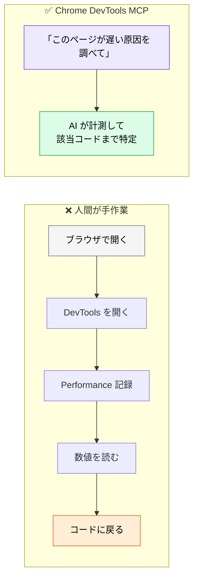
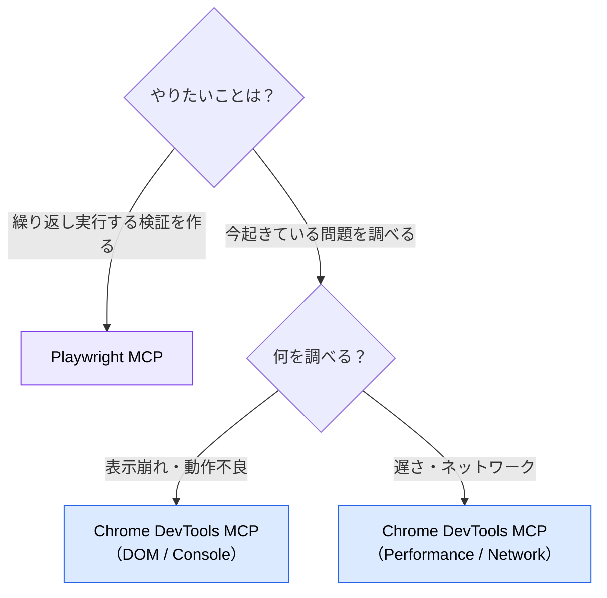

# Chrome DevTools MCP ― 実機ブラウザを操作させる

> **この記事でわかること**：Playwright MCP との違いと、パフォーマンス計測・実機デバッグという固有の使いどころ。

## 結論

Playwright MCP と役割が重なるが、**目的が違う**。

| | Playwright MCP | Chrome DevTools MCP |
| --- | --- | --- |
| 主目的 | **テストの生成・実行** | **調査・デバッグ・計測** |
| 成果物 | 再実行可能なテストコード | その場の分析結果 |
| 強み | CI に組み込める | DevTools の情報（Performance / Network / Console）にアクセスできる |
| 使う場面 | E2E テストを作る | 「なぜ遅いか」「なぜ動かないか」を調べる |

**テストを書くなら Playwright、原因を調べるなら Chrome DevTools。** 両方入れる必要は薄い。

## 背景・課題

「本番だけ表示が崩れる」「特定のページだけ体感が遅い」といった問題は、コードを読んでも分からない。実際にブラウザで開き、DevTools を見る必要がある。

この作業は手順が決まっているうえに繰り返しが多い。**AI に DevTools を操作させれば、調査の初動を任せられる。**



## 具体的な方法

### 主な機能

| 領域 | できること |
| --- | --- |
| **ページ操作** | ナビゲーション、クリック、入力、スクロール |
| **DOM / スナップショット** | 現在の要素構造の取得 |
| **Console** | エラー・警告ログの取得 |
| **Network** | リクエスト一覧、ステータス、サイズ、タイミング |
| **Performance** | トレース記録、Core Web Vitals の計測 |
| **スクリーンショット** | 視覚的な確認 |

**Network と Performance が Playwright MCP との差**である。「どのリクエストが遅いか」「LCP を悪化させているのは何か」といった問いに答えられる。

### 設定

```json
{
  "mcpServers": {
    "chrome-devtools": {
      "command": "npx",
      "args": ["-y", "chrome-devtools-mcp@latest"]
    }
  }
}
```

**`package.json` の `engines` は `^20.19.0 || ^22.12.0 || >=23`** である。README では Node 22 以上を推奨しているが、Node 20 系でも 20.19 以上なら動作する。加えて Chrome のインストールが必要である。

### 使い分けの判断



### 典型的な用途

| 用途 | 効果 |
| --- | --- |
| **パフォーマンス調査** | Core Web Vitals を計測し、悪化要因を特定させる |
| **表示不具合の再現** | 実際に開いて Console エラーと DOM を確認させる |
| **ネットワーク分析** | 不要な API 呼び出し、過大なペイロードの検出 |
| **修正の検証** | 修正前後で計測し、改善量を数値で示させる |

**「修正 → 計測 → 比較」のループを AI に回させられる**のが実用上の価値である。体感ではなく数値で判断できる。

## 実際のプロンプト例

```text
# パフォーマンス調査
Chrome DevTools MCP で http://localhost:3000/products を開いて、
Performance トレースを記録して。

LCP・CLS・TBT の値と、それぞれを悪化させている要因を特定して。
該当するコードの箇所（ファイル:行）まで辿って報告して。
まだ修正はしないで、原因の報告だけして。
```

```text
# 修正効果の検証
先ほどの修正を適用した状態で、もう一度同じページを計測して。
修正前後の LCP・転送量を表で比較して、改善したか判定して。
悪化した指標があれば正直に報告して。
```

```text
# 表示不具合の調査
Chrome DevTools MCP で /checkout を開いて、
Console のエラーとネットワークの失敗リクエストを全て取得して。
モバイル幅（375px）でも同じ手順を実行して、差分があるか確認して。
```

## 注意点

> **Playwright MCP と併用すると機能が重複する。** どちらもブラウザを操作できるため、両方繋ぐとモデルがどちらを使うか迷う。**用途が明確に分かれていない限り、片方に絞る**（→ [`02_tool-reduction.md`](02_tool-reduction.md)）。

> **計測値は環境に強く依存する。** ローカル開発環境の数値は本番と一致しない。相対比較（修正前後）には使えるが、絶対値を SLO の根拠にはできない。

> **INP は単発トレースからは取れない。** 実ユーザー操作に対する指標のため、ラボ計測では LCP / CLS / TBT を主に見る。

> **隔離プロファイルを既定にする。** 既存のブラウザプロファイルに接続すると、**社内システムにログイン済みの状態で AI が操作する**ことになる。意図しない操作が実データに及ぶ危険があるため、専用の空プロファイルを使う。

> **ログイン後の画面はセットアップが要る。** 認証が必要なページを調べさせる場合、事前にログイン手順を渡すか、認証済みのプロファイルを使う必要がある。認証情報をプロンプトに直接書かない。

> **「調べる」と「直す」を分ける。** 調査と修正を1回で頼むと、原因の特定が甘いまま対症療法的な修正をしがちである。まず原因報告だけをさせ、内容を確認してから修正を依頼する。

## 参考リンク

- [Chrome DevTools MCP（GitHub）](https://github.com/ChromeDevTools/chrome-devtools-mcp)
- 関連：[`20_playwright.md`](20_playwright.md) — テスト生成との使い分け
- 関連：[`../15_test/01_e2e-automation.md`](../15_test/01_e2e-automation.md)
