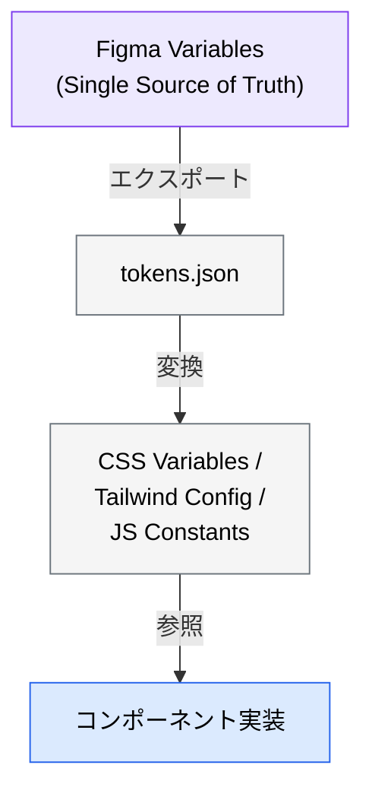
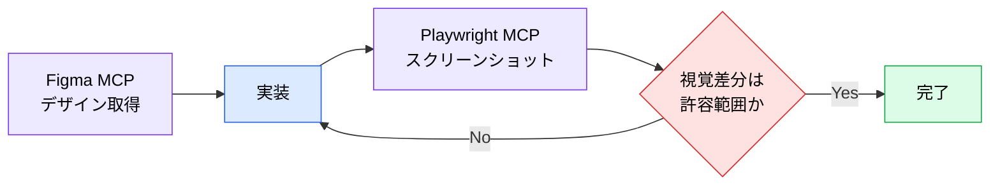

# Figma MCP ― デザインをコードに落とす

> **この記事でわかること**：Figma からデザイントークン・コンポーネント仕様を取得して実装させる方法。そして「AI に読める Figma ファイル」の作り方。

## 結論

Figma MCP の成否は **MCP の使い方ではなく Figma ファイルの構造**で決まる。

> **レイヤー名が `Rectangle 47` のままのファイルからは、まともなコードは出てこない。**

先に Figma 側を整えることが、実装精度への最短経路である。

## 背景・課題

「Figma の URL を渡せばコードになる」と期待して失敗する原因は、AI 側ではなくファイル側にある。

- レイヤー名が自動生成のまま → 何のコンポーネントか判別できない
- 色・余白が直値 → デザイントークンとして抽出できない
- Auto Layout 未適用 → レスポンシブの意図が読めない
- 状態（hover / error）の記述がない → 実装漏れが起きる

**AI は画像を見て推測するのではなく、構造化データを読む。** 構造がなければ推測に戻る。

## 具体的な方法

### Step 1：AI が読める Figma ファイルにする

| 要件 | 内容 |
| --- | --- |
| **変数（Variables）** | カラー・スペーシング・タイポグラフィ・ボーダーラジウスを Figma Variables で定義する |
| **オートレイアウト** | 全コンポーネントに Auto Layout を適用する（レスポンシブ対応） |
| **コンポーネント化** | バリアント付きの再利用可能コンポーネントを作る |
| **レイヤー命名** | 意味のある名前を付ける（**AI の解釈精度が最も上がる項目**） |
| **アノテーション** | インタラクティブな状態・ホバー・エラー状態を注釈で明示する |

### Step 2：デザイントークンをエクスポートする

Variables を書き出して、コード側の SSoT にする。Open Variable Visualizer プラグインを使うと、次の2ファイルが出力できる。

| ファイル | 用途 |
| --- | --- |
| `tokens.json` | 全デザイントークン |
| `resolver.ts` | プログラマティックアクセス用ユーティリティ |



**トークンは Git で管理する。** Figma の変更が自動的にコードへ反映される CI/CD を組めば、デザインとコードの乖離を継続的に防げる。

### Step 3：MCP サーバーを選ぶ

| アプローチ | 条件 | 特徴 |
| --- | --- | --- |
| **公式 MCP（リモート）** | **全シート・全プランで接続可（Dev 座席不要）。** ただし Starter / View / Collab は月6コール相当に制限される | `https://mcp.figma.com/mcp` に接続するだけで使える |
| **公式 MCP（デスクトップ）** | **Dev または Full 座席が必要** | Figma デスクトップアプリのローカルサーバー経由。Code Connect と組み合わせやすい |
| **Framelink MCP**（コミュニティ） | 無料プランでも利用可 | 設定が独立しており導入しやすい |

**Code Connect が使えるなら公式を選ぶ価値がある。** 「この Figma コンポーネントはコードのこのコンポーネントに対応する」という対応表を持てるため、AI が新規実装ではなく**既存コンポーネントの再利用**を選べるようになる。

### Step 4：実装させる

```text
[FigmaフレームURL] にあるコンポーネントを実装してください。
@tokens.json にあるデザイントークンを使用してください。

フレームワーク：React + Tailwind CSS
制約事項：
- 可能な限り /src/components 配下の既存コンポーネントを流用すること
- @CLAUDE.md に記載されたパターンに従うこと
- モバイルファーストの完全レスポンシブ対応にすること

実装完了後にスクリーンショットを撮り、元のデザインと比較してください。
```

**最後の1行が重要**である。生成して終わりではなく、**自分で見比べて差分を直させる**ループを閉じる。

### 視覚一致の検証ループ

Playwright MCP と組み合わせると、比較まで自動化できる。



### 設定

```bash
# 公式リモート版（座席を問わず接続できる）
claude mcp add --transport http --scope project figma https://mcp.figma.com/mcp
```

| 方式 | 接続 |
| --- | --- |
| **公式（リモート）** | 上記コマンド。**Dev 座席は不要**だが、下位シートはレート制限が厳しい |
| **公式（デスクトップ）** | Figma デスクトップアプリのローカルサーバー経由。**Dev / Full 座席が必要** |
| **Framelink MCP** | `npx figma-developer-mcp --figma-api-key=$FIGMA_TOKEN`（Personal Access Token） |

```json
{
  "mcpServers": {
    "figma": {
      "command": "npx",
      "args": ["-y", "figma-developer-mcp", "--stdio"],
      "env": { "FIGMA_API_KEY": "${FIGMA_TOKEN}" }
    }
  }
}
```

> **Personal Access Token のスコープはファイル読み取りのみに絞る。** 書き込み権限を渡す理由はない。
>
> **費用の注意**：リモート版は座席を問わず接続できるが、**実務に耐えるレート制限（1日200コール程度）を得るには Dev / Full シートが事実上必要**になる。デザイナー以外の開発者にも席が要る点が見落とされやすい。稟議前に「どちらの経路か」「必要なレート制限を満たす席種か」を確認する。

## 実際のプロンプト例

```text
# 導入前の診断
Figma MCP でこのファイルの構造を取得して、
AI がコード生成しやすい状態になっているか診断して。

チェック項目:
1. Variables でトークンが定義されているか
2. Auto Layout が適用されているか
3. レイヤー名が意味のある名前になっているか
4. 状態（hover / disabled / error）が定義されているか

問題があれば、デザイナーに依頼すべき修正を優先度付きで一覧にして。
```

```text
# トークンだけ先に同期する
Figma MCP で Variables を全て取得して、
tokens.json として出力して。
既存の tailwind.config.js と差分があれば、その一覧も出して。
```

```text
# 既存コンポーネントの再利用を優先させる
[FigmaフレームURL] を実装する前に、
/src/components 配下に流用できる既存コンポーネントがないか調べて。
「新規作成が必要なもの」と「既存で足りるもの」に分けて報告してから実装して。
```

## 注意点

> **Figma ファイルが整っていないと効果が出ない。** 導入して失敗する原因のほとんどはここにある。MCP を入れる前に、デザイナーと「AI が読める構造」の合意を取る。

> **生成コードをそのまま使わない。** 生成されるのは「見た目が合っているコード」であって、「保守しやすいコード」ではない。既存のコンポーネント設計に沿っているかは人間が判断する。

> **デザイントークンは一方向に流す。** Figma → コードの方向を SSoT とし、コード側で直値を書かない。双方向に編集すると必ず乖離する。

> **リモート版なら座席なしで試せる。** ただし下位シートは月6コール相当で実務には足りない。本格導入時は Dev / Full シートの費用を見込む。

## 参考リンク

- [Figma 公式 MCP ドキュメント](https://help.figma.com/)
- 関連：[`20_playwright.md`](20_playwright.md) — 視覚一致検証
- 関連：[`../12_ui-ux/04_design-tokens.md`](../12_ui-ux/04_design-tokens.md)
