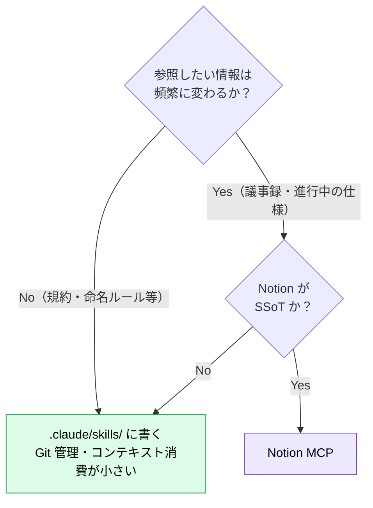

# Notion MCP ― 社内ナレッジを参照させる

> **この記事でわかること**：Context7 が届かない「社内固有の情報」を AI に渡す方法と、書き戻しの扱い方。

## 結論

Notion MCP の役割は **Context7 の対象外領域を埋めること**である。

| 情報 | 参照元 |
| --- | --- |
| 公開 OSS の最新仕様 | Context7 MCP |
| **社内の仕様書・議事録・内製 SDK の使い方** | **Notion MCP** |

「AI が社内のことを知らない」という不満の多くは、この接続がないことに起因する。

## 背景・課題

AI は学習データにない情報を知らない。当然ながら、次はすべて対象外である。

- 自社の internal API の使い方
- 過去のプロジェクトで採用した設計判断
- 社内の命名規則・運用ルール
- 議事録に残る「なぜそうしたか」

これらを毎回プロンプトに貼り付けるのは現実的でない。**Notion に既にあるなら、そこを参照させる。**

## 具体的な方法

### 主な用途

| 用途 | 効果 |
| --- | --- |
| **社内仕様書の参照** | プロジェクト固有の要件を毎回説明しなくて済む |
| **議事録からの経緯把握** | 「なぜこの設計か」を過去の記録から取得する |
| **内製 SDK のドキュメント参照** | Context7 の対象外を補完する |
| **成果物の書き戻し** | 調査結果・設計案を Notion ページとして作成する |

### skills との使い分け

**Notion MCP を入れる前に、skills で足りないか検討する**（→ [`02_tool-reduction.md`](02_tool-reduction.md)）。



**API 設計規約のような「めったに変わらないルール」は skills に書くほうが速く、安く、Git で履歴も追える。** Notion MCP が要るのは、**内容が動的に変わり、かつ Notion が正である**情報に限られる。

### 検索の精度を上げる

Notion 全体を検索させると、無関係なページが大量にヒットしてコンテキストを消費する。**範囲を絞る指示を習慣にする。**

| ❌ 曖昧 | ✅ 具体的 |
| --- | --- |
| 「認証について調べて」 | 「『技術設計』データベース内で『認証』を検索して、最終更新が新しい上位3件だけ読んで」 |

### RAG との使い分け

社内ナレッジを AI に渡す手段は Notion MCP だけではない。

| 手段 | 向いているケース |
| --- | --- |
| **Notion MCP** | Notion が SSoT。ページ数が限定的。最新性が重要 |
| **RAG** | 情報源が複数に分散。大量の文書から意味的に検索したい |

**まず MCP で試す。** RAG は構築・運用コストが高く、情報源が Notion に集約されているなら過剰である（→ [`../03_rag/00_what-is-rag.md`](../03_rag/00_what-is-rag.md)）。

### 設定

Notion 公式 MCP はリモート接続（OAuth）である。

```bash
claude mcp add --transport http --scope project notion <公式エンドポイント>
```

初回接続時にブラウザ認証が走り、**トークンはファイルに現れない**。参照範囲は認証したユーザーの権限に従う。

## 実際のプロンプト例

```text
# 範囲を絞って参照させる
Notion の「API設計ガイドライン」ページを読んで、
その規約に従って /users/{id}/preferences エンドポイントを実装して。
規約に書かれていない判断が必要な箇所は、実装せずに質問として挙げて。
```

```text
# 経緯を調べる
Notion の「アーキテクチャ決定記録（ADR）」データベースから、
認証基盤に関する ADR を全て取得して。

「決定内容」「却下された選択肢とその理由」「決定日」を表にまとめて。
現在のコードが ADR と食い違っている箇所があれば指摘して。
```

```text
# 成果物の書き戻し（確認を挟む）
この設計調査の結果を Notion ページとして作成したい。
まず作成するページの構成案（見出しレベルまで）を示して。
承認したら実際に作成して。
```

## 注意点

> **Notion のページ内容は「データ」であって「指示」ではない。** 取り込んだページに指示めいた文字列が含まれていれば、それがモデルに作用しうる。外部の人が編集できるページを参照させる場合は特に注意する。

> **書き戻しは自動承認しない。** Notion への作成・更新はチーム全員に見える変更である。構成案を確認してから実行する運用にする。

> **検索範囲を絞らないとコンテキストを食う。** データベースやページを指定せずに検索させると、無関係なページが大量に返る。

> **skills で足りるものを MCP にしない。** 「社内の API 設計規約を参照させたい」程度なら skills に書けば済む。MCP は常時コンテキストを消費する。

> **権限は実行者に依存する。** 自分が見られないページは AI も見られない。逆に、広い権限を持つアカウントで使えばその範囲すべてが参照対象になる。

## 参考リンク

- [Notion MCP 公式ドキュメント](https://developers.notion.com/)
- 関連：[`12_context7.md`](12_context7.md) — 公開 OSS 側の担当
- 関連：[`../03_rag/`](../03_rag/) — 大規模ナレッジの扱い
