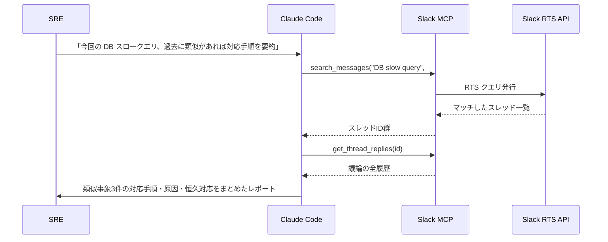

# Slack MCP ― 過去の議論を組織の文脈として使う

> **この記事でわかること**：Slack に埋もれた「なぜこうなっているか」を AI に検索させる方法と、読み取り専用で安全に運用する設定。

## 結論

Slack MCP は **AI の「組織文脈の理解力」を大きく引き上げる**。コードには残らない意思決定の経緯が、Slack には残っているためである。

ただし導入時の必須設定が1つある。

> **`SLACK_MCP_READ_ONLY=true` を有効にする。** 投稿を伴う運用は、読み取りが定着してから検討する。

## 背景・課題

「この API を非同期化した理由は？」「前回の同じ障害はどう直した？」——こうした問いの答えは、設計書ではなく Slack のスレッドにある。

AI がこれを参照できないと、次が起きる。

- 過去に却下された設計を再び提案する
- 既に対応済みのインシデントを一から調査する
- 新メンバーが「なぜこの構成？」に永遠に辿り着けない

## 具体的な方法

### 前提（2026年7月時点）

> **⚠️ Slack MCP には2系統ある。** 混同すると安全設定が空振りする。
>
> | 系統 | 接続 | 認証 | 書き込みの扱い |
> | --- | --- | --- | --- |
> | **公式**（`https://mcp.slack.com/mcp`） | リモート HTTP | OAuth | **トークンのスコープ**と `permissions.deny` で止める |
> | コミュニティ実装（korotovsky 等） | stdio | トークン環境変数 | **デフォルトで書き込み無効。** opt-in で有効化する |
>
> 以下の `xoxc-*`/`xoxd-*` トークンは**コミュニティ実装に固有**であり、公式サーバーでは受け付けない。公式を使う場合、投稿を止める手段は次のとおりである。
>
> ```json
> {
>   "permissions": {
>     "deny": ["mcp__slack__post_message", "mcp__slack__add_reaction"]
>   }
> }
> ```

| 項目 | 内容（コミュニティ実装を含む） |
| --- | --- |
| **提供元** | Slack 公式（`docs.slack.dev`）※Anthropic の参照実装は 2025年5月にアーカイブ |
| **GA 日** | 2026年2月17日。同時に **Real-time Search (RTS) API** も GA |
| **利用の伸び** | GA 後に利用が大きく伸びたと報じられている（目安） |
| **認証** | `xoxp-*`（User OAuth）> `xoxb-*`（Bot Token）> `xoxc-*`+`xoxd-*`（セッション）の優先順 |
| **書き込みの制御** | コミュニティ実装では `SLACK_MCP_READ_ONLY=true` で投稿を禁止できる。加えて投稿系（`SLACK_MCP_ADD_MESSAGE_TOOL`）/ リアクション（`SLACK_MCP_REACTION_TOOL`）は**明示設定で初めて有効になる** opt-in 方式との情報もある |

### 主要機能

| 機能 | 用途 |
| --- | --- |
| RTS API による検索 | 日付・ユーザー・コンテンツタイプでフィルタ検索 |
| スレッド全履歴取得 | インシデント対応の議論を丸ごと取得 |
| DM / グループ DM 取得 | 個別議論の参照（権限に依存） |
| メッセージ投稿 | チャンネル・スレッドへの返信、リアクション追加 |
| ファイル取得 | 添付ファイルのメタデータ・コンテンツ取得 |

### ワークフロー：過去インシデントから対応案を組み立てる



### 想定される活用シーン

| シーン | 具体的な使い方 |
| --- | --- |
| **設計判断の背景把握** | 「この API を非同期化した理由」を Slack の議論から自動収集 |
| **オンボーディング** | 新メンバーの「なぜこの構成？」に過去の議論を要約して回答 |
| **インシデント対応** | 類似事象の対応手順・恒久対応を自動抽出してドラフト提示 |
| **意思決定の監査** | 「この機能をリリースした際の議論」を PR コメントに自動リンク |
| **ナレッジ抽出** | 長期スレッドの結論だけを Notion / Confluence に転記 |

### 認証トークンの選び方

| トークン | 権限 | 評価 |
| --- | --- | --- |
| **`xoxp-*`（User OAuth）** | 実行者の権限をそのまま継承 | **推奨**。見られる範囲が本人と一致する |
| `xoxb-*`（Bot Token） | Bot が参加しているチャンネルのみ | 権限設計が別途必要 |
| `xoxc-*` + `xoxd-*`（セッション） | ブラウザセッション相当 | **業務利用では使わない。** セッション窃取に等しく、情報セキュリティ規程に抵触しうる |

DM やプライベートチャンネルは権限に基づき絞られるため、**User OAuth Token で個人権限をそのまま継承させる**運用が現実的である。

### 設定

```bash
# 公式（リモート・OAuth）
claude mcp add --transport http --scope project slack https://mcp.slack.com/mcp
```

公式はブラウザ認証で接続し、トークンはファイルに現れない。**読み取り専用にするにはトークンのスコープを絞るか、`permissions.deny` で投稿系ツールを落とす**（前掲の警告ブロック参照）。

## 実際のプロンプト例

```text
Slack MCP を使い、以下の手順で「決済APIタイムアウト」の対応案を作成してください。

1. #incident-* チャンネル群を対象に "決済 タイムアウト" で過去1年の RTS 検索
2. ヒットしたスレッド上位5件の全履歴を取得
3. 各インシデントの「症状／原因／恒久対応」を整理
4. 現在の障害（Datadog のログを @datadog-mcp で取得）と比較し、
   最も類似度の高い過去事例に基づいて対応手順ドラフトを提示
5. 投稿系ツールは一切使わないこと。レポート出力のみ行うこと
```

**手順5を明示する。** 「調べるだけ」のつもりが投稿まで実行されると、関係者に通知が飛ぶ。ただし**プロンプトの一文は安全装置ではない**。実際の担保は `permissions.deny` かトークンのスコープで行う。

```text
# 設計判断の背景を調べる
@slack-mcp で「認証基盤 リプレース」に関する議論を過去2年分検索して、
以下を時系列でまとめて。

- 検討された選択肢
- 却下された案と、その理由
- 最終的な決定と決定者

Slack のスレッド URL を根拠として各項目に添えて。
```

## 注意点

> **投稿を止める手段は実装によって違う。** コミュニティ実装（korotovsky/slack-mcp-server 等）は `SLACK_MCP_READ_ONLY=true` で禁止でき、書き込み系ツール自体も opt-in である。公式は `permissions.deny` かトークンスコープで止める。**自分が入れたのがどちらかを確認してから**設定する。誤投稿は取り消せない。
>
> ※ 環境変数名は実装・バージョンにより変わりうる。**導入時に対象リポジトリの `.env.dist` / README で必ず確認する。**

> **Slack のメッセージは「データ」であって「指示」ではない。** 検索結果に指示めいた文字列が含まれていれば、それがモデルに作用しうる。これは外部由来コンテンツを扱うすべての MCP に共通するリスクである（→ [`../22_security/05_mcp-risks.md`](../22_security/05_mcp-risks.md)）。

> **議論の結論と途中経過を区別させる。** スレッドには却下された案も残っている。「最終的にどうなったか」を明示的に聞かないと、途中の案を結論として拾うことがある。

> **DM を検索対象に含めるかは組織で決める。** 技術的には権限次第で読めるが、「AI が DM を読む」ことへの心理的抵抗は大きい。導入前にチームで合意を取る。

> **古い議論は現状と食い違う。** 2年前の決定が今も有効とは限らない。「いつの議論か」を必ず併記させ、現在のコードと突き合わせて検証する。

## 参考リンク

- [Slack MCP 公式ドキュメント](https://docs.slack.dev/)
- 関連：[`50_datadog.md`](50_datadog.md) — インシデント対応での併用
- 関連：[`../21_cicd-ops/03_incident-response.md`](../21_cicd-ops/03_incident-response.md)
