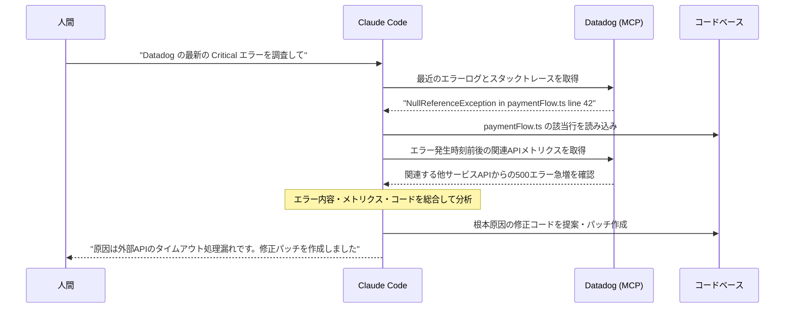
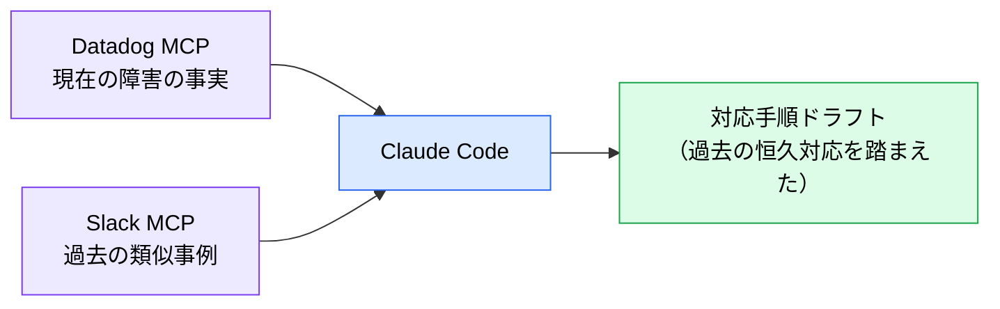

# Datadog MCP ― 障害調査の初動を任せる

> **この記事でわかること**：メトリクス・ログとソースコードを AI に横断させ、MTTR を短縮する方法。

## 結論

Datadog MCP の価値は **コンテキストスイッチの排除**にある。

障害対応で人間が消耗するのは、ダッシュボードとエディタとログを行き来する往復である。AI が両方を同時に見られれば、**「エラーログ → 該当コード → 関連メトリクス → 原因仮説」までを一息で辿れる**。

## 背景・課題

本番障害の初動は、ほぼ決まった手順の繰り返しである。

1. アラートを見る
2. エラーログとスタックトレースを探す
3. 該当コードを開く
4. 前後のメトリクスを確認する
5. 関連サービスの状態を見る

**手順が決まっているのに、毎回人間がやっている。** しかも深夜や休日に発生する。

## 具体的な方法

### ワークフロー



**「エラーの発生箇所」と「その時刻の周辺状況」を同時に見る**のが要点である。スタックトレースだけでは「なぜ今起きたか」が分からない。

### 主な用途

| 用途 | 内容 |
| --- | --- |
| **根本原因の初期分析（RCA）** | ログ・トレース・メトリクスとコードを突き合わせる |
| **SLO 違反の調査** | レイテンシ異常の発生時刻と、その時のデプロイ・トラフィックを照合 |
| **影響範囲の特定** | エラーが波及しているサービスの列挙 |
| **リリース後の確認** | デプロイ前後のメトリクス比較 |
| **モニターのドラフト作成** | 既存メトリクスから監視すべき項目を提案させる |
| **SLO 定義の叩き台** | 過去の実績値から現実的な目標値を算出させる |

### Slack MCP との組み合わせ

過去の類似インシデントを Slack から探させると、初動の質がさらに上がる。



「今の事実」と「過去の対応」を突き合わせることで、**同じ調査を二度やらない**（→ [`42_slack.md`](42_slack.md)）。

### 設定

> **前提**：Datadog MCP Server は **2026年3月に GA（一般提供）**に到達している。ただし **APM・code-exec・remote-actions など一部のツールセットは引き続き Preview 扱い**である。利用には**組織管理者による事前有効化が必須**で、Organization Settings の MCP Access / MCP Write Access を ON にし、利用者のロールに `mcp_read` 権限が必要になる。

```bash
claude mcp add --transport http --scope project datadog https://mcp.datadoghq.com/
```

リージョンによってドメインが異なる。OAuth（対話的）と API キー + Application キー（自動化向け）の両方をサポートする。

### 権限の設計

| 操作 | 推奨 |
| --- | --- |
| メトリクス・ログの参照 | ✅ 許可する |
| モニターの作成・変更 | ⚠️ 都度確認 |
| アラートの無効化 | ❌ AI にやらせない |

**Datadog に「読み取り専用 API キー」という区分は存在しない。** 実際に使うのは **スコープ付き Application Key** である。

| 用途 | 付与するスコープ（例） |
| --- | --- |
| メトリクス参照 | `metrics_read` / `timeseries_query` |
| ログ参照 | `logs_read_data` |
| モニター参照 | `monitors_read` |
| ダッシュボード参照 | `dashboards_read` |
| イベント・インシデント参照 | `events_read` / `incident_read` |

**read 系スコープのみを付けたキーを新規発行する。** 既存のフルスコープキーを流用しない。アラートの停止やモニターの変更を AI に委ねると、障害を「見えなくする」方向の対処が起こりうる。

## 実際のプロンプト例

```text
# 初動調査
Datadog MCP で直近1時間の Critical エラーを取得して、
最も件数の多いエラーについて次を調べて。

1. スタックトレースから該当ファイル:行を特定し、コードを読む
2. 同時刻の関連サービスのメトリクス（レイテンシ・エラー率）を取得
3. 直近のデプロイ履歴と時刻を照合

「原因の仮説」と「その根拠」を分けて報告して。
修正はまだしないで。
```

```text
# リリース後の確認
Datadog MCP で、30分前のデプロイの前後1時間について
エラー率・p95レイテンシ・スループットを比較して。
悪化している指標があれば、該当するエンドポイントまで特定して。
```

```text
# SLO 違反の調査
今週 SLO を割った時間帯を Datadog から特定して、
その時刻に何が起きていたか（デプロイ / トラフィック急増 / 依存サービスの障害）を調べて。
時系列で整理して報告して。
```

## 注意点

> **こういう場合は入れなくていい**
> - **Datadog を使っていない**（当然だが、これだけのために導入する理由にはならない）
> - オンコール体制がなく、障害調査の頻度が低い小規模チーム
> - ログに個人情報が含まれ、マスキングが未整備
>
> 価値が出るのは「障害調査が定期的に発生し、その初動に時間を取られている」チームである。

> **本番のログには個人情報が含まれうる。** 取得したログはコンテキストに載る。マスキングされているか事前に確認し、必要なら取得範囲を絞る。

> **「原因の仮説」と「事実」を分けさせる。** AI は断定的に原因を述べがちである。プロンプトで明示的に分離させ、根拠のない断定を鵜呑みにしない。

> **修正の適用は人間が判断する。** 障害時は判断が急かされるが、**本番への変更を AI に自動適用させない**。パッチの提案までに留める。

> **アラートを止める方向の提案に注意する。** 「このモニターの閾値を緩めれば解決」は、多くの場合解決ではない。

> **ログ取得はコンテキストを大量に消費する。** 期間とフィルタを必ず指定する。「直近1時間の Critical のみ」のように絞る。

## 参考リンク

- [Datadog MCP 公式ドキュメント](https://docs.datadoghq.com/)
- 関連：[`42_slack.md`](42_slack.md) — 過去事例との突き合わせ
- 関連：[`../21_cicd-ops/02_aiops-monitoring.md`](../21_cicd-ops/02_aiops-monitoring.md)
