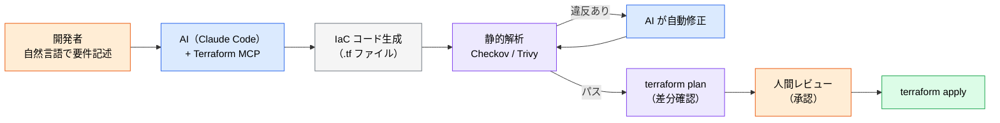

# Terraform MCP ― IaC を正確に生成させる

> **この記事でわかること**：最新の Registry 情報を参照させて古いリソース定義を防ぐ方法と、「生成 → 即 apply」が危険な理由。

## 結論

Terraform MCP は **Registry の最新ドキュメント・モジュール・プロバイダー情報を AI に渡す**。Context7 の IaC 版と考えればよい。

ただし IaC 特有の危険がある。

> **「AI 生成 → 静的解析 → plan → 人間レビュー → apply」のフローを必ず守る。**

インフラの設定ミスは、アプリのバグと違って**気づいたときには公開されている**。

## 背景・課題

AI が IaC を書くと、次の誤りが起きやすい。

- 古いプロバイダーのリソース定義を使う（属性名が変わっている）
- セキュリティグループを広く開けてしまう（`0.0.0.0/0`）
- 暗号化・ログ設定をデフォルトのまま省略する

1つ目は Terraform MCP で潰せる。**2つ目・3つ目は潰せない**ため、静的解析が必須になる。

## 具体的な方法

### ツールの位置づけ

| ツール | 提供元 | 役割 |
| --- | --- | --- |
| **Terraform MCP Server** | HashiCorp（公式） | Registry の最新ドキュメント・モジュール情報を AI に提供 |
| **Pulumi Neo** | Pulumi | 自然言語から IaC を生成し PR 作成まで実行 |
| **Checkov** | Prisma Cloud（Bridgecrew を買収した Palo Alto Networks 傘下） | Terraform / OpenTofu プランのセキュリティ静的解析（組み込みポリシーは 1,000〜1,500 程度・目安） |
| **Firefly MCP** | Firefly | 自然言語でリソースをコード化・ドリフト修正 |

**Terraform MCP と Checkov はセットで導入する。** 前者は「正しい書き方」を、後者は「安全な設定か」を担保する。役割が違う。

### 設定

Terraform MCP は Registry の公開情報を参照するため、クラウドの認証情報は渡さない。

```bash
claude mcp add --scope project terraform -- <公式が案内する起動コマンド>
```

**あわせて `.claude/settings.json` で破壊的操作を禁止する。** これが最重要のガードレールである。

```json
{
  "permissions": {
    "deny": [
      "Bash(terraform apply:*)",
      "Bash(terraform destroy:*)",
      "Bash(terraform state rm:*)",
      "Bash(terraform import:*)",
      "Read(**/*.tfstate)",
      "Read(**/*.tfstate.backup)"
    ]
  }
}
```

> **`deny` には抜け道がある。** `-auto-approve` を含むラッパースクリプト（Makefile、独自の `tf` コマンド）経由だと `Bash(terraform apply:*)` にマッチしない。ラッパーがあるなら、そのコマンド名も `deny` に加える。

### 安全なワークフロー



**`terraform plan` の差分を人間が読む工程は省略しない。** ここが最後の防波堤である。

### リスクと対策

| リスク | 対策 |
| --- | --- |
| AI が古いリソース定義を生成する | Terraform MCP で最新の Registry 情報を参照させる |
| セキュリティ設定ミス（ポートの全開放等） | Checkov / Trivy を CI の**必須ステップ**として組み込む |
| `apply` の意図しない破壊的変更 | 必ず `plan` の差分を人間がレビュー。**自動 apply は禁止** |
| ステートファイルの競合 | リモートバックエンド（S3 + DynamoDB ロック等）を必須とする |
| 生成コードの保守性低下 | モジュール化を徹底し、AI 生成コードもコードレビューを通す |

> ある大規模組織では IaC の 30% 程度が AI 生成になった一方、静的解析なしでは設定ミスが増加したとの報告もある（目安）。**生産性の向上と品質の低下は同時に起こりうる。**

## 実際のプロンプト例

```text
# Terraform MCP を使った安全なインフラ構築（まず捨てられる環境で試す）
Terraform MCP Server を参照して、以下の AWS インフラを構築する .tf ファイルを作成してください：

1. VPC（10.0.0.0/16）+ パブリック/プライベートサブネット
2. ALB + ターゲットグループ
3. ECS Fargate サービス（2タスク）
4. RDS PostgreSQL（単一AZ・開発用）

要件：
- 最新のプロバイダーバージョンを使用
- セキュリティグループは最小権限の原則に従う
- タグ付けは company=example, env=dev で統一
- Checkov のスキャンに通るセキュリティ設定にすること

制約：
- 既存の workspace には一切触れないこと
- -target オプションは使わないこと
```

> **本番相当の構成をいきなり生成させない。** サンドボックス環境で挙動を確認してから、本番向けに書き換える。

```text
# 生成後の自己検証
作成した .tf に対して checkov を実行して、
違反があれば修正して。修正のたびに再スキャンして、パスするまで繰り返して。

ただし「違反を除外設定で黙らせる」対処はしないで。
どうしても除外が必要なら、理由を添えて報告して。
```

**「除外設定で黙らせない」を明示する。** AI は静的解析を通すために `# checkov:skip` を追加する近道を取ることがある。

```text
# 既存構成のレビュー
@infra/ 配下の .tf を読んで、Terraform MCP で最新のプロバイダー仕様と照合して。
deprecated な書き方、非推奨になった属性があれば一覧にして。
```

## 注意点

> **`terraform apply` を AI に実行させない。** 上記の `permissions.deny` で禁止する。`plan` までを AI、`apply` は人間の作業と明確に分ける。

> **`plan` は安全な読み取り操作ではない。** (a) `external` / `http` データソースや一部プロバイダは plan 時に実行される、(b) plan には**実際のクラウド認証情報が必要**で、`aws_secretsmanager_secret_version` 等のデータソース経由で**シークレットが plan 出力に平文で載る**。plan 用の認証情報も最小権限（ReadOnly 相当）にし、plan 出力をそのまま貼らせない。

> **`tfstate` を AI に読ませない。** ステートファイルには**シークレットが平文で格納される**。`Read(**/*.tfstate)` を `deny` に入れる。

> **静的解析を「通す」ことと「安全である」ことは別。** Checkov がパスしても、業務要件上あってはならない設定はある。人間のレビューを省略する理由にはならない。

> **クレデンシャルを MCP に渡さない。** Terraform MCP が参照するのは Registry の公開情報である。クラウドの認証情報は別管理（環境変数・IAM ロール）にする。

> **ステートファイルは共有前提で設計する。** ローカルステートのまま AI に触らせると、複数人での作業で破綻する。

> **生成量が増えると保守が破綻する。** 「動くから良い」で量産すると、半年後に誰も理解していないインフラが残る。モジュール化とレビューを人間の作業として残す。

## 参考リンク

- [Terraform MCP Server（HashiCorp）](https://developer.hashicorp.com/terraform)
- [Checkov 公式](https://www.checkov.io/)
- 関連：[`../21_cicd-ops/05_iac.md`](../21_cicd-ops/05_iac.md)
