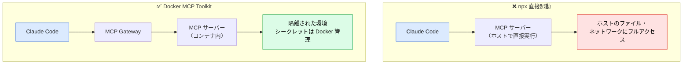
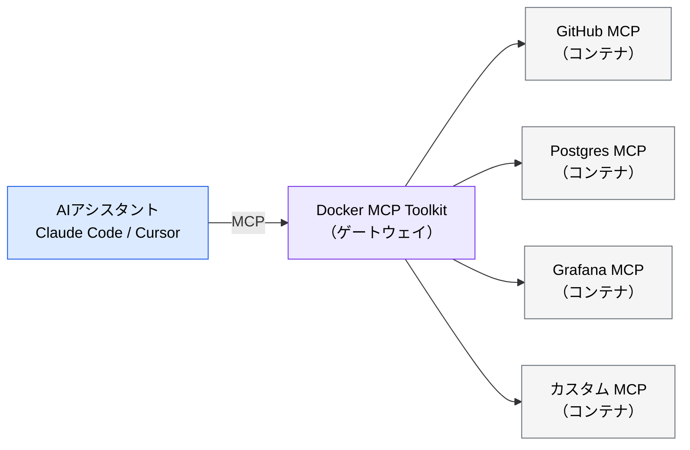
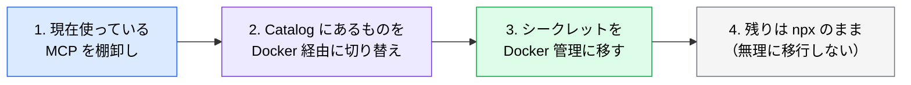

# Docker MCP ― MCP サーバーをコンテナで隔離する

> **この記事でわかること**：Docker MCP Toolkit の最大の価値は Docker 操作ではなく、**他の MCP サーバーをコンテナに閉じ込めること**である。

## 結論

Docker MCP には2つの顔がある。

| 側面 | 内容 |
| --- | --- |
| **MCP Toolkit（本命）** | 他の MCP サーバーを**コンテナとして隔離実行**する。ホストを汚染しない |
| Gordon AI | Dockerfile 生成・Compose 最適化を行う組み込みエージェント |

`npx` で起動する MCP サーバーは、**そのパッケージのコードを自分のマシンで直接実行している**。Docker MCP Toolkit はこれをコンテナ境界の内側に移す。

## 背景・課題

MCP サーバーを増やすと、セキュリティ上の問題が積み上がる。

- サーバーのコードがホスト環境で直接実行される
- 認証情報の管理方法がサーバーごとにばらばら
- どのサーバーがどこまでアクセスできるか把握できない
- チームで「誰がどの MCP を使ってよいか」を統制できない



## 具体的な方法

### 主要機能

| 機能 | 概要 | 対応バージョン |
| --- | --- | --- |
| **MCP Catalog** | 300以上の検証済み MCP サーバーをワンクリックで追加 | Docker Desktop 4.40+ |
| **MCP Toolkit** | MCP サーバーのライフサイクル管理（起動・停止・シークレット管理）。**コンテナ分離** | Docker Desktop 4.42+（ネイティブ統合） |
| **Gordon AI Agent** | Dockerfile 生成・`docker-compose.yml` 最適化・コンテナデバッグ | Docker Desktop 4.39+（GA） |
| **Dynamic MCP** | 会話中に必要な MCP サーバーを自動検出・オンデマンド追加 | Docker Desktop 4.42+ |
| **`docker mcp` CLI** | ターミナルから MCP サーバーの起動・設定・シークレット管理 | Docker Desktop 4.42+ |

### アーキテクチャ



Claude Code から見ると接続先は Gateway 1つである。**個々のサーバーの起動・認証・停止は Docker 側が引き受ける。**

### エンタープライズでの統制

Docker Business / Enterprise では、RAM（Registry Access Management）と IAM（Image Access Management）により、**チームが利用可能な MCP サーバーを管理者が一元制御**できる。未承認サーバーの利用を防ぎ、ポリシーを統一できる。

これは組織で MCP を展開する際の現実的な統制手段になる。

### Gordon AI（もう一方の顔）

Dockerfile や Compose の生成・最適化を行う。

```text
このNode.jsアプリケーション用に、マルチステージビルドの Dockerfile を作成してください。
- ビルドステージ: npm ci でビルド
- 実行ステージ: distroless イメージベース
- ヘルスチェック付き
```

```text
現在の docker-compose.yml を分析して、以下を改善してください：
- リソース制限（CPU/メモリ）の追加
- ヘルスチェックの設定
- ネットワーク分離の強化
```

### 導入の始め方

**新しく何かを始めるのではなく、既存の MCP サーバーを移行することから始める。**



### 設定

Docker Desktop の MCP Toolkit を有効化すると、Gateway が MCP サーバーとして公開される。

```bash
# CLI からサーバーを管理する
docker mcp server ls
docker mcp server enable <name>
```

Claude Code からは Gateway 1つに接続する。個々のサーバーの起動・認証は Docker 側が引き受ける。正確なコマンドは Docker Desktop のバージョンで異なるため公式ドキュメントを確認する。

## 実際のプロンプト例

```text
# 移行の計画
現在の .mcp.json を読んで、Docker MCP Catalog に存在するサーバーを特定して。
Docker 経由に移行した場合の設定と、移行によるメリット・デメリットを表にして。
Catalog にないものは npx のまま残す前提で。
```

```text
# Dockerfile の生成
このリポジトリの構成を読んで、本番用のマルチステージ Dockerfile を作成して。

要件:
- ビルドステージで npm ci、実行ステージは distroless
- 非 root ユーザーで実行
- ヘルスチェック付き
- イメージサイズを最小化

作成後、docker build が通ることを確認して。
```

## 注意点

> **Docker Desktop が前提である。** ライセンス条件（Docker Business は有償）を確認する。CI 環境では別の構成が要る。

> **コンテナ分離は万能ではない。** マウントしたボリューム経由でホストのファイルにはアクセスできる。**何をマウントするかが実質的な権限設計**になる。

> **Dynamic MCP は便利だが統制と相反する。** 会話中に自動でサーバーが追加される機能は、「何が繋がっているか」の把握を難しくする。統制が必要な組織では無効にする判断もある。

> **Gordon 生成の Dockerfile をそのまま本番に使わない。** ベースイメージの選定、脆弱性スキャン、レイヤ構成の妥当性は人間が確認する。

> **MCP を減らす原則は変わらない。** コンテナで隔離しても、ツール定義のコンテキスト消費は同じである。安全になっても軽くはならない（→ [`02_tool-reduction.md`](02_tool-reduction.md)）。

## 参考リンク

- [Docker MCP Toolkit 公式ドキュメント](https://docs.docker.com/)
- 関連：[`01_setup.md`](01_setup.md) — 通常の導入手順
- 関連：[`../22_security/05_mcp-risks.md`](../22_security/05_mcp-risks.md)
