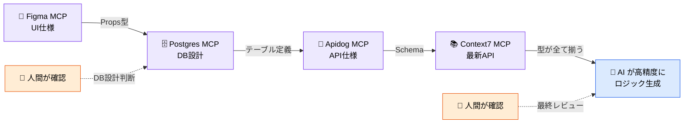
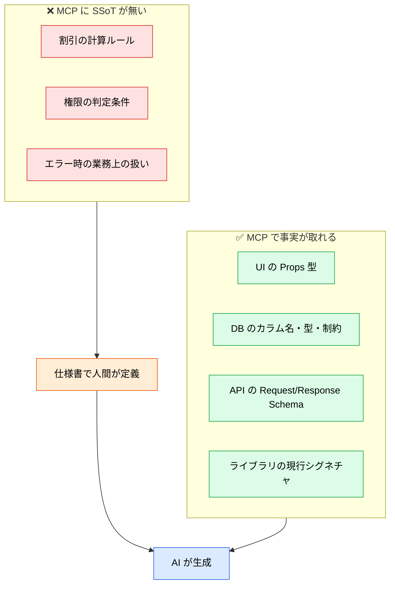

# MCP 横断コンテキストチェーン

> **この記事でわかること**：複数の MCP を連結して「推測で埋めていた部分」を事実に置き換える設計と、skill 側で呼び出しを指名する運用。

## 結論

MCP を複数繋ぐ価値は、**型が事実ベースで揃うこと**にある。

> **UI Props・API Schema・DB Column が事実で揃えば、その間を繋ぐロジックは機械的に導出できる。**

ただし**ビジネスルールは MCP からは取れない**。割引計算や権限判定の「意図」には SSoT が存在しない。ここは仕様書で人間が定義する。

## 背景・課題

MCP が1つもないとき、AI は全レイヤーを推測で埋める。1つ繋いでも、残りは推測のままである。

| MCP 数 | AI の挙動 | 人間の役割 |
| --- | --- | --- |
| なし | 汎用的な命名・型で**推測**して生成 | 書く + 直す |
| 1つ | 一部正確、残りは推測 | 書く + 確認する |
| **複数チェーン** | **全層の型が事実ベース**で整合 | **確認する**に集中 |

## 具体的な方法

### チェーンの全体像



各 MCP が持つ SSoT を段階的に積み上げることで、AI が「推測」で埋めていた部分が「事実」に置き換わる。

### skill で呼び出しを指名する

MCP を増やすとツール選択ミスが増える——という問題は、**skill 側に呼び出し規約を書く**ことで緩和できる。

「どの MCP をいつ呼ぶか」を skill に記述し、MCP は道具として静かに待機させる。この非対称な関係が、コンテキスト効率と再現性を両立させる。

> **役割分担・呼び出しフロー・skill の記法・推奨マッピングは [`../05_prompt-engineering/03_skills-integration.md`](../05_prompt-engineering/03_skills-integration.md) に集約している。** 本記事では扱わない。

### MCP で埋まらないもの



**チェーンを組んでも、仕様書の重要性は下がらない。むしろ上がる。** 型が自動で揃うぶん、人間が定義すべきは「意図」だけに絞られる。

## 実際のプロンプト例

```text
# チェーンを明示的に指示する
新しい「クーポン適用」機能を実装したい。以下の順で情報を集めてから実装して。

1. Postgres MCP で coupons / orders テーブルの実スキーマを取得
2. Apidog MCP で /orders/apply-coupon の仕様を取得
3. Context7 で使用中のバリデーションライブラリの現行 API を確認
4. @docs/spec/SPEC.md からクーポンの適用ルール（業務ルール）を読む

1〜3 は推測せず取得した事実に従い、4 に書かれていない業務判断が
必要になったら実装を止めて質問して。
```

```text
# 型の不整合を洗い出す
Figma MCP の Props 定義、Postgres MCP のカラム定義、
Apidog MCP の Schema を突き合わせて、
同じ概念なのに型や命名が食い違っている箇所を一覧にして。
どれが正しいかは判断せず、差分だけ示して。
```

## 注意点

> **チェーンが長いほど MCP 接続が増える。** 全部を常時接続すると、コンテキスト消費とツール選択ミスが増える。**タスクごとに必要なものだけ有効化する**運用と併せる。

> **各 MCP の「取得」を明示する。** 「推測せず取得した事実に従って」と書かないと、繋いでいても既存知識で生成することがある。

> **業務ルールは必ず人間が書く。** MCP が揃うほど「全部 AI で埋まる」錯覚が生じるが、意図の定義は代替できない。

> **どちらが正かを AI に判断させない。** 複数の SSoT が食い違うことは日常的にある。差分の提示までを AI に、正誤の判断は人間に。

## 参考リンク

- 各サーバー：[`12_context7.md`](12_context7.md) / [`13_postgres.md`](13_postgres.md) / [`14_apidog.md`](14_apidog.md) / [`30_figma.md`](30_figma.md)
- 関連：[`02_tool-reduction.md`](02_tool-reduction.md)
- 関連：[`../05_prompt-engineering/03_skills-integration.md`](../05_prompt-engineering/03_skills-integration.md)
