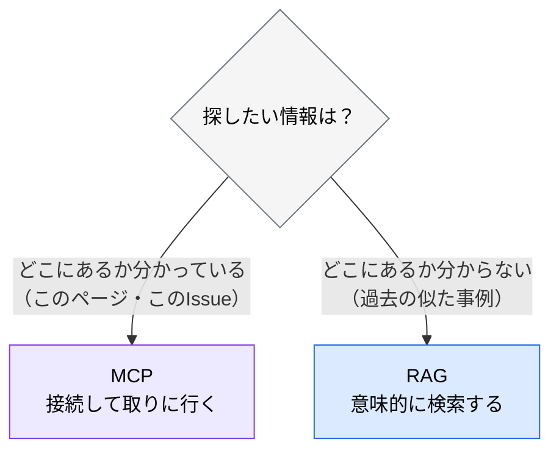
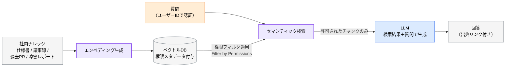
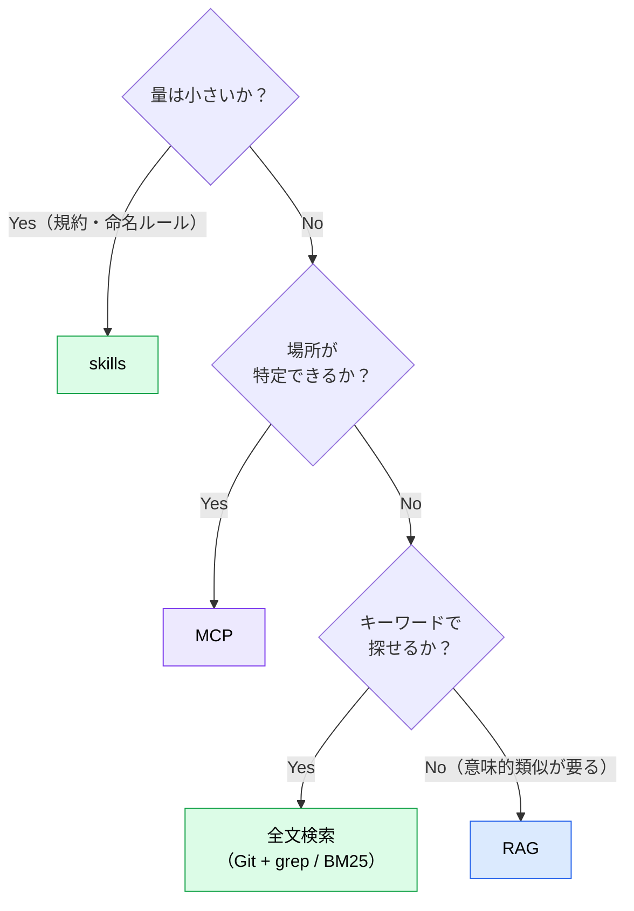

# RAG とは ― MCP との使い分け

> **この記事でわかること**：RAG が MCP と競合しない理由と、「どちらを使うか」の判断基準。

## 結論

**RAG と MCP は競合せず補完関係**にある。

| | MCP | RAG |
| --- | --- | --- |
| 取りに行くもの | **リアルタイムの状態** | **蓄積された静的ナレッジ** |
| 向いているデータ | Notion / Jira / GitHub など常に最新が要る外部 SaaS | 過去 PR・障害レポート・議事録など組織内に閉じた蓄積 |
| 強み | 常に最新 | **横断検索・意味的な類似検索** |
| 導入コスト | 低い（接続するだけ） | 高い（インデックス構築と運用） |

判断基準はこうなる。

> **まず MCP で試す。「大量の過去データを意味的に横断検索したい」という要求が出てから RAG を検討する。**

## 背景・課題

AI は学習データにない情報を知らない。社内固有の情報を渡す手段は主に2つある。

- **MCP** — 接続して、そのつど取りに行く
- **RAG** — あらかじめベクトル化して蓄積し、検索して渡す

MCP のほうが圧倒的に導入が軽い。それでも RAG が必要になるのは、**「どこにあるか分からないものを探す」**場面である。



「3年前に似た障害があったはずだが、どのドキュメントか分からない」——これは MCP では解けない。

## 具体的な方法

### 仕組み

社内ドキュメント・過去 PR・障害レポートをエンベディング（テキストを数値ベクトルに変換する処理）してベクトル DB に格納し、質問に対して**閲覧権限内のデータのみ**を検索して AI に渡す。



> **権限フィルタは「検索後」ではなく、ベクトル検索の**クエリ条件**として組み込む。** 検索結果を後でフィルタする方式は、**件数や類似度スコアから機密情報の存在が推測できてしまう**（→ [`02_access-control.md`](02_access-control.md)）。

### 主要ユースケース

社内に蓄積された経験を**組織の資産**として AI に参照させる用途が中心になる。

| ユースケース | 対象データ | 期待効果 |
| --- | --- | --- |
| **過去プロジェクトのベストプラクティス共有** | 成功 PR・設計レビュー記録・ADR | 過去知見を即座に引用、車輪の再発明を防止 |
| **障害レポートからの再発防止** | ポストモーテム・インシデント報告書・5Whys 記録 | 類似障害時に過去の根本原因と恒久対策を自動提示し MTTR を短縮 |
| **オンボーディング高速化** | 社内 Wiki・コーディング規約・ドメイン用語集 | 「誰に聞けば」問題を解消、初月の質問対応工数を削減 |
| **社内仕様書・議事録参照** | Confluence / Notion / 議事録 | 出典を提示しつつ正確な実装判断を支援 |
| **顧客対応ナレッジ** | FAQ・サポートチケット履歴 | CS 一次回答の自動化、品質均一化 |

**共通するのは「過去の蓄積を横断的に探す」**という性質である。ここが MCP との分かれ目になる。

### 使い分けの実例

| やりたいこと | 手段 |
| --- | --- |
| 「この Notion ページの仕様を読んで実装して」 | **MCP**（場所が特定できている） |
| 「決済まわりで過去に議論された設計判断を全部探して」 | **RAG**（横断検索が要る） |
| 「現在の Issue 一覧を取得して」 | **MCP**（最新が要る） |
| 「似たインシデントの対応履歴を探して」 | **RAG**（意味的類似検索） |
| 「API 設計規約に従って実装して」 | **skills**（そもそも RAG も MCP も要らない） |

> **最初に検討すべきは skills である。** めったに変わらない規約なら、`.claude/skills/` に書けば済む。コンテキスト消費も小さく、Git で履歴も追える（→ [`../02_mcp/02_tool-reduction.md`](../02_mcp/02_tool-reduction.md)）。

### 導入判断のフロー



**右に行くほど導入コストが上がる。** 左から順に検討する。

> **全文検索を飛ばさない。** 「Markdown を Git に置いて Claude Code に grep させる」だけで足りるケースは相当ある。ベクトル DB を立てずに済む**最有力の選択肢**であり、最も忘れられる。

## 実際のプロンプト例

RAG そのものは基盤であり、利用時のプロンプトは通常の質問と変わらない。**出典を必ず求める**のが要点である。

```text
# 出典を必須にする
過去のインシデント報告書から「決済APIのタイムアウト」に類似する事例を検索して、
それぞれの「症状 / 根本原因 / 恒久対応」を整理して。

各項目に出典（ドキュメント名・日付・URL）を必ず付けて。
該当する事例が見つからない場合は、無理に関連づけずに「該当なし」と答えて。
```

```text
# 導入判断を検討させる
以下の要求に対して、skills / MCP / RAG のどれで実現すべきか判断して。

要求：「過去3年分の設計レビュー記録から、似た判断をした事例を探したい」

判断理由と、選ばなかった選択肢を退けた理由も示して。
導入・運用コストの見積もりも添えて。
```

## 注意点

> **RAG は導入コストが高い。** インデックス構築、定期同期、権限管理、品質評価——運用の負担は MCP の比ではない。**MCP で足りるなら RAG は要らない。**

> **最大の障壁は技術精度ではなく権限管理である。** 全社データを無差別に統合すると、自然言語の質問を経由して本来閲覧権限のない情報を引き出せる経路が生まれる（→ [`02_access-control.md`](02_access-control.md)）。

> **検索結果が0件のときの挙動を決めておく。** 「該当情報なし」と答えさせないと、関係ないチャンクを無理に使って回答を作る。

> **出典を必ず提示させる。** RAG の価値は「根拠のある回答」であって、それらしい文章ではない。出典が辿れなければ検証できない。

## 参考リンク

- 次に読む：[`01_knowledge-base.md`](01_knowledge-base.md) — 構築の実装
- 重要：[`02_access-control.md`](02_access-control.md) — 権限設計
- 関連：[`../01_claude-code/07_mcp-basics.md`](../01_claude-code/07_mcp-basics.md) — MCP 側の担当範囲
