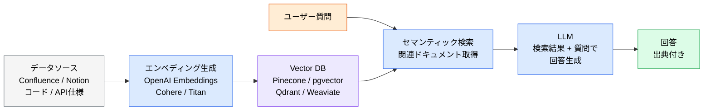
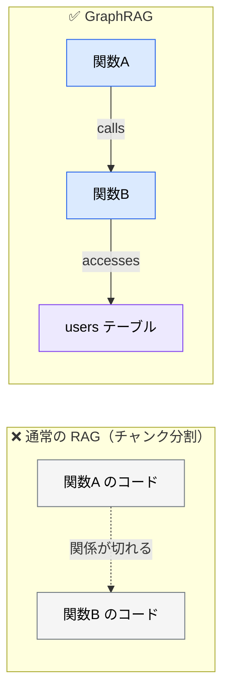

# ナレッジベースの構築

> **この記事でわかること**：実装方法の選択肢（MCP / フレームワーク / マネージド）と、精度が出ないときに効く改善策。

## 結論

構築方法は3段階あり、**下から順に検討する**。

| 段階 | 方法 | 導入コスト |
| --- | --- | --- |
| **1** | **MCP サーバー経由** | 最も低い。接続するだけ |
| 2 | クラウドネイティブ（マネージド） | 中。インフラ管理不要 |
| 3 | フレームワーク + ベクトル DB を自前構築 | 高い。全部自分で運用する |

**多くのケースは1で足りる。** 3を選ぶのは、横断検索・大量データ・独自のチャンキングが本当に必要なときだけである。

## 背景・課題

RAG は「ベクトル DB を立てる」から始めるものだと思われがちだが、実際にはもっと軽い選択肢がある。

そして自前構築を選んだ場合、運用の負担が継続的に発生する。

- インデックス構築パイプラインの保守
- データソースの定期同期
- 検索精度の評価と改善
- 権限変更の反映

**「作る」より「維持する」のほうが重い。** これを引き受けられるかを先に判断する。

## 具体的な方法

### アーキテクチャ



### 実装方法の選択肢

| 方法 | ツール | 特徴 |
| --- | --- | --- |
| **MCP サーバー経由** | Notion MCP / Atlassian 公式 MCP（Jira・Confluence）/ Postgres MCP | Claude Code が直接ドキュメントを参照。**セットアップが最も簡単** |
| **クラウドネイティブ** | Amazon Bedrock Knowledge Bases / Azure AI Search | マネージドサービスでインフラ管理不要 |
| **フレームワーク** | LangChain / LlamaIndex | インデックス構築・検索・生成のパイプラインを提供 |
| **ベクトル DB** | Pinecone / pgvector / Qdrant / Weaviate | エンベディングの保存・検索 |

> **`pgvector` は既存の PostgreSQL に載せられる。** 新しいインフラを増やしたくない場合、これが最も現実的な選択肢になることが多い。

### 活用パターン

| パターン | 組み込むデータ | 効果 |
| --- | --- | --- |
| **社内ドキュメント検索** | Confluence・Notion・社内 Wiki | 新人のオンボーディング、手順書参照の自動化 |
| **コードベース理解** | リポジトリのコード・PR・Issue 履歴 | 既存パターンに沿ったコード生成 |
| **API 仕様参照** | OpenAPI / Apidog の仕様書 | 仕様に即した実装・テスト生成 |
| **インシデント対応** | 過去の障害報告書・ポストモーテム | 類似障害の迅速解決 |
| **カスタマーサポート** | FAQ・チケット履歴 | 回答精度向上・CS 対応の自動化 |

### 品質改善

精度が出ないときは、**症状から原因を特定する**。

| 課題 | 対策 |
| --- | --- |
| **検索精度が低い** | チャンクサイズの調整（500〜1000トークン目安）、**ハイブリッド検索**（キーワード + セマンティック） |
| **検索は当たるが回答が的外れ** | **リランカー**（cross-encoder による再順位付け）を入れる。上位50件を取得して再スコアリングし上位5件に絞る |
| **古い情報が返る** | データソースの定期同期パイプラインを構築（CI/CD に組み込み） |
| **ハルシネーション** | 検索結果が0件の場合は「該当情報なし」と回答させるガードレール |
| **機密情報の漏洩** | アクセス制御（ロールベース）でユーザー権限に応じた検索結果を返す |
| **コストが高い** | エンベディング生成はバッチで計算。キャッシュレイヤーを導入 |

**精度が出ないとき、最も費用対効果が高いのはリランカーである。** チャンクサイズを触り続けても改善しない、という袋小路にはまりやすい。

**「ハイブリッド検索」が効くケースは多い。** セマンティック検索だけだと、固有名詞やエラーコードのような**完全一致で探したいもの**を取りこぼす。キーワード検索と組み合わせる。

### GraphRAG：コードベース理解の発展形

> GraphRAG 自体はコード専用の技術ではなく、汎用の「ナレッジグラフ + RAG」手法である。本記事ではコードベース理解への応用に絞る。

ソースコードは「関数 A が関数 B を呼び、それが DB にアクセスする」といった**グラフ構造**を持つ。単純なチャンク分割ではこの関係性が途切れる。



- 関数・クラス・モジュール間の呼び出し関係をグラフで表現する
- **「この関数を変更したら影響はどこか？」**といった質問に高精度で回答できる
- 大規模コードベースでのリファクタリング影響分析に有効

> **ただしコード理解には Serena MCP という軽い選択肢がある。** LSP を使って symbol 単位で参照関係を取得できるため、GraphRAG を構築せずに同種の問いに答えられる場合が多い（→ [`../02_mcp/11_serena.md`](../02_mcp/11_serena.md)）。**まず Serena を試す。**

### 導入チェックリスト

```markdown
## データ準備

- [ ] 組み込むドキュメントソースを決定（Confluence / Notion / Wiki / コード）
- [ ] チャンキング戦略を設計（ドキュメント種別ごとに最適化）
- [ ] 機密情報の分類とアクセス制御を設計

## インフラ構築

- [ ] ベクトルDBを選定・構築
- [ ] エンベディングモデルを選定
- [ ] インデックス構築パイプラインを作成

## 品質担保

- [ ] 検索精度の評価指標を定義（Hit Rate / MRR）
- [ ] 回答が検索結果に根拠づけられているかの評価指標を定義
- [ ] 定期同期パイプラインをCI/CDに組み込み
- [ ] ハルシネーションガードレールを設定
```

**「検索精度の評価指標を定義」が最も飛ばされる。** 測っていなければ、改善したかどうかも分からない。

| 指標 | 意味 |
| --- | --- |
| **Hit Rate** | 正解チャンクが上位 N 件に含まれた割合 |
| **MRR**（Mean Reciprocal Rank） | 最初の正解が出た順位の逆数の平均 |

> **検索側の指標だけでは足りない。** Hit Rate / MRR が良くても「検索は当たっているのに嘘を書く」状態は検知できない。**回答が検索結果に根拠づけられているか**も別途評価する。

## 実際のプロンプト例

```text
# 構築方法の選定
社内の設計レビュー記録（Notion、約500ページ）を AI に参照させたい。

MCP / マネージド / 自前構築のどれが適切か判断して。
それぞれの初期コスト・運用コスト・実現できることを比較表にして。
「まず MCP で試す」場合の限界も示して。
```

```text
# 精度が出ないときの診断
RAG の検索精度が低い。次を確認して原因を切り分けて。

1. チャンクサイズが適切か（現状の設定と推奨値の比較）
2. キーワード検索を併用しているか
3. 取りこぼしているクエリの傾向（固有名詞か、概念的な問いか）

症状から最も可能性の高い原因を1つに絞って、対策を提案して。
```

```text
# 評価指標の設計
この RAG の検索精度を継続的に測る仕組みを作りたい。

代表的な質問20件と、その正解ドキュメントのセットを作って。
Hit Rate と MRR を算出するスクリプトも書いて。
CI で定期実行できる形にして。
```

## 注意点

> **まず MCP で試す。** 自前構築の運用負担は継続的に発生する。MCP で足りるなら、それが正解である。

> **⚠️ エンベディングモデルを変えると全件の再インデックスが必要になる。** 初期コストがそのまま再発生するため、**モデル選定は事実上のロックイン**として扱う。

> **コストは3層で見積もる。** ①初期：全文書のエンベディング生成（文書量に比例）、②運用：マネージド型ベクトル DB の月額（`pgvector` なら既存 RDS に相乗りで実質増分なし）、③人的：同期パイプラインと精度評価の維持工数。**③が最も見落とされ、最も重い。**

> **チャンクサイズに万能値はない。** 500〜1000トークンは目安であり、ドキュメント種別によって最適値は変わる。コードと議事録では適切な分割が違う。

> **定期同期を最初から組み込む。** 「後で自動化する」と決めた同期パイプラインは、たいてい作られない。古い情報を返す RAG は信頼を失う。

> **コード理解に GraphRAG を作る前に Serena を試す。** LSP ベースの symbol 検索で同じ問いに答えられることが多く、構築・運用コストが桁違いに小さい。

> **評価指標を先に決める。** Hit Rate / MRR を測らないまま改善作業をすると、良くなったかどうかが判断できない。

## 参考リンク

- 関連：[`00_what-is-rag.md`](00_what-is-rag.md) — MCP との使い分け
- 重要：[`02_access-control.md`](02_access-control.md) — 権限設計
- 関連：[`../02_mcp/11_serena.md`](../02_mcp/11_serena.md) — コード理解の軽い選択肢
