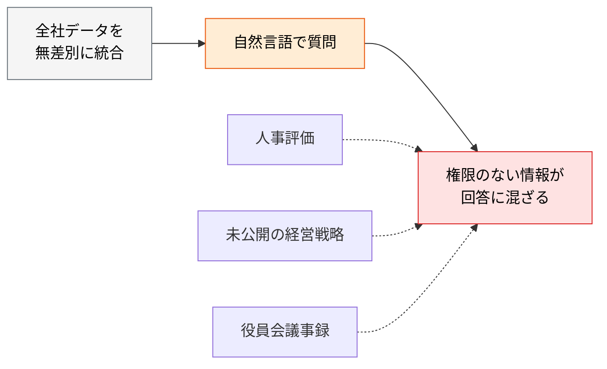
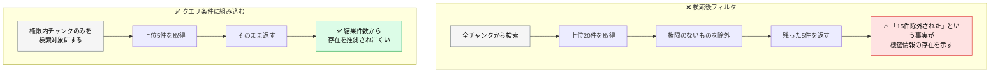
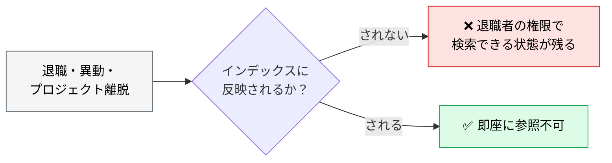
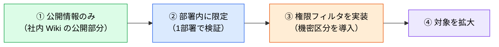

# RAG のアクセス権限制御

> **この記事でわかること**：RAG 導入の最大の障壁が権限管理である理由と、「検索後フィルタ」が危険な理由。

## 結論

> **RAG を社内展開する際、最大の障壁は技術精度ではなく権限管理である。**

そして実装上、最も重要な原則は1つである。

> **権限フィルタは「検索後」ではなく、ベクトル検索の**クエリ条件**として組み込む。**

検索結果を後からフィルタする方式は、**件数や類似度スコアから機密情報の存在が推測できてしまう**。

## 背景・課題

全社データを無差別にベクトル DB へ統合すると、新しい情報漏洩経路が生まれる。



厄介なのは、**従来のファイル権限では防げない**点である。元のドキュメントに権限が設定されていても、**ベクトル化した時点でその紐付けが切れる**。意図的に持ち込まない限り、権限情報はベクトル DB に存在しない。

## 具体的な方法

### 必須の3点

| # | 要件 | 強度 |
| --- | --- | --- |
| 1 | ベクトル DB の各チャンクに **`owner` / `group` / `confidentiality_level` 等のメタデータを付与**する | **MUST** |
| 2 | 検索クエリ時に**ユーザーのアクセストークンを検証**し、権限内データのみを候補とする | **MUST** |
| 3 | 権限変更（退職・異動・プロジェクト離脱）が**即座に反映される設計**にする | **MUST** |

> **#3 は SHOULD ではなく MUST である。** 退職者・異動者のアクセスが残るのは監査指摘・インシデントに直結する。ただし「再インデックス」は現実的でないため、**チャンクにはグループ識別子だけを持たせ、所属は認証時に解決する**設計にする。これなら権限変更に再インデックスが不要になる。

### なぜ「検索後フィルタ」が危険か

理由は3層ある。**上ほど頻繁に効く。**

| # | 理由 | 影響 |
| --- | --- | --- |
| ① | **取りこぼし（recall 劣化）** — top-k を取ってから権限で削るため、権限内に関連文書があるのに0件になる | **最も頻繁に起きる** |
| ② | **実装によっては素通し** — 「LLM に渡してからフィルタ」する実装は、権限外データがモデルに露出する | **最も危険** |
| ③ | サイドチャネル — 除外件数や類似度スコアから存在が推測されうる | 理論上の懸念 |

設計レビューでは①を根拠にする。③だけを持ち出すと「うちの UI では件数を出さないので post-filter で十分」と反論されて終わる。



**サイドチャネルの問題である。** 検索後にフィルタすると、

- 除外件数から「何かが存在する」ことが分かる
- 類似度スコアの分布から内容が推測できる
- 質問を変えながら繰り返すことで、存在の有無を特定できる

多くのベクトル DB は**メタデータフィルタ付きの検索**をサポートしている。これを使う。

### メタデータ設計

チャンクに付与する最低限の項目である。

| フィールド | 用途 |
| --- | --- |
| `owner` | 作成者・所有者 |
| `group` | 閲覧可能なグループ（部署・プロジェクト） |
| `confidentiality_level` | 機密区分（public / internal / confidential / restricted） |
| `source_uri` | 出典（回答に添える） |
| `indexed_at` | インデックス日時（鮮度判定と再同期の基準） |

**`source_uri` を必ず入れる。** 出典を提示できなければ、回答の検証ができない。

### 権限変更の反映

最も見落とされるのがここである。



**ID 管理システムと連動させる。** 手動更新に頼ると必ず漏れる。

- グループを直接埋め込まず、**認証時に解決する設計**にすると反映が速い
- チャンクには `group` の識別子だけを持たせ、所属は認証基盤側で判定する

### 段階的な導入

いきなり全社データを対象にしない。



**①の段階でも十分な価値が出ることが多い。** オンボーディングや規約参照は公開情報で足りる。機密データを含めるのは、権限機構が実証できてからでよい。

### MCP を選ぶという判断

RAG の権限管理を自前で作る代わりに、**MCP で既存の権限を継承する**という選択肢がある。

| 方式 | 権限の担保 |
| --- | --- |
| **RAG** | **自前で設計・実装する**（メタデータ + クエリフィルタ + 同期） |
| **MCP**（Box / Notion / Drive 等） | **既存サービスの権限がそのまま適用される** |

Box MCP や Notion MCP は、実行者の権限をそのまま継承する。**権限管理を自作しなくて済むのは大きな利点**である（→ [`../02_mcp/41_box.md`](../02_mcp/41_box.md)）。

## 実際のプロンプト例

```text
# 権限設計のレビュー
現在の RAG 構成のメタデータ設計とクエリ実装を読んで、
次の観点で監査して。

1. 権限フィルタが検索クエリの条件として組み込まれているか（検索後フィルタになっていないか）
2. 全チャンクに権限メタデータが付与されているか
3. 権限変更がインデックスに反映される仕組みがあるか
4. 出典（source_uri）が回答に含まれる設計か

問題があれば、危険度の高い順に修正案を示して。
```

```text
# 段階導入の計画
社内 RAG を導入したい。いきなり全社データを対象にせず、
段階的に広げる計画を立てて。

各段階について「対象データ」「必要な権限機構」「次に進む条件」を示して。
最初の段階は権限フィルタなしでも安全に運用できる範囲に絞って。
```

## 注意点

> **⚠️ 書き方が pre-filter でも、実行が pre-filter とは限らない。** SQL / API 上はクエリ条件に見えても、**エンジン内部では post-filter として実行される**ケースがある。代表例が `pgvector` で、HNSW インデックスに `WHERE` を併用すると、条件次第で「先に近傍 k 件を取ってから WHERE で削る」挙動になり、**返却件数が k を下回る／権限内の関連文書を取りこぼす**。
>
> 採用するベクトル DB が**フィルタを検索前に適用するのか事後に適用するのか**を必ずドキュメントで確認し、権限内文書が k 件未満になるケースを**実測で検証する**。`pgvector` なら PostgreSQL の行レベルセキュリティ（RLS）を併用する選択肢もある。

> **技術精度より権限管理が難しい。** 検索精度の改善は後からできるが、権限の設計ミスは情報漏洩に直結する。**先に権限、後から精度。**

> **「検索後フィルタ」を許容しない。** 実装が簡単なので選ばれがちだが、サイドチャネルで存在が漏れる。設計レビューで必ず確認する。

> **元ドキュメントの権限はベクトル化で失われる。** 意図的に持ち込まない限り、権限情報は存在しない。「元のファイルに権限があるから大丈夫」は誤りである。

> **取り込んだ文書は「信頼できない入力」である。** インデックス済み文書に混入した指示文が LLM を乗っ取りうる（間接プロンプトインジェクション）。社内 Wiki を丸ごと取り込む以上、**検索結果はデータであって指示ではない**とシステムプロンプトで明示し、出典外の指示に従わせない。

> **取得ログを監査可能にする。** 誰がいつどのチャンクを取得したかを残す。**漏洩疑いが発生したとき、記録がなければ漏洩の有無すら証明できない。**

> **エンベディングは匿名化ではない。** ベクトルから元テキストが推定されうるため、**ベクトル DB は平文と同じ機密区分**で扱う。個人情報の削除依頼に備え、チャンクと元文書の両方から確実に消せる設計にしておく。

> **権限管理を自作したくないなら MCP を選ぶ。** 既存サービスの権限を継承できるほうが、多くの場合は安全で安上がりである。

## 参考リンク

- 関連：[`00_what-is-rag.md`](00_what-is-rag.md) — MCP との使い分け
- 関連：[`01_knowledge-base.md`](01_knowledge-base.md) — 構築の実装
- 関連：[`../22_security/00_ai-code-risks.md`](../22_security/00_ai-code-risks.md) — OWASP LLM02 / LLM08
