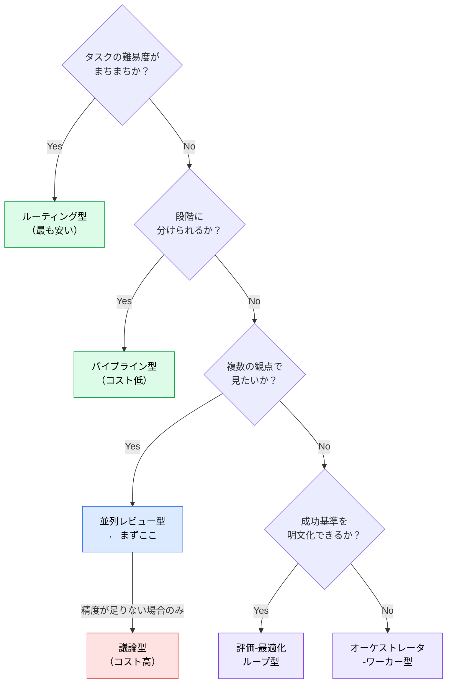
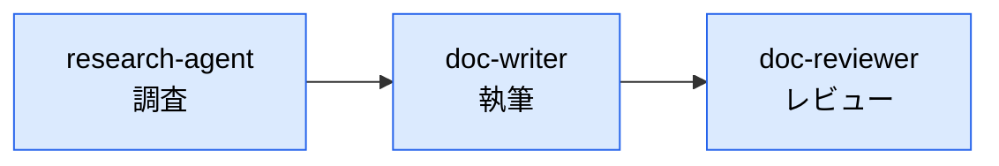
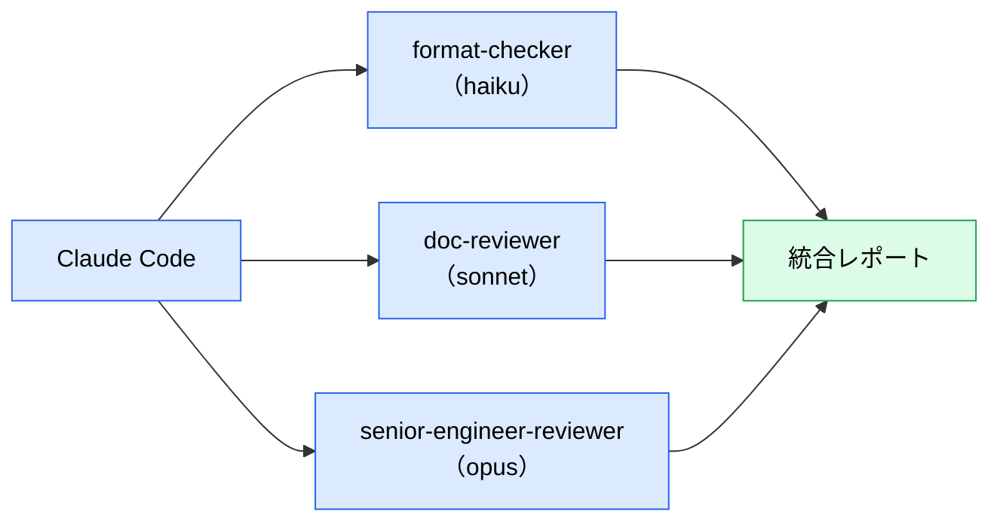
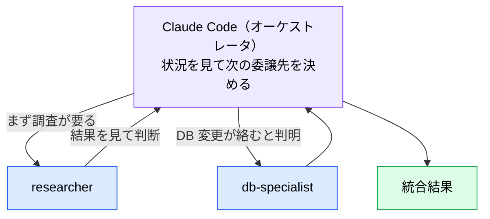

# サブエージェント連携パターン

> **この記事でわかること**：5つの連携パターンとコストの目安、そして「どれから試すべきか」。

## 結論

パターンは5つあるが、**選ぶ順序が決まっている**。

> **まず並列レビュー型を試す。それでも精度不足のときだけ議論型を検討する。**

理由は費用対効果である。議論型（Multi-Agent Debate）はコストが最も高いが、**精度向上の大部分は「議論」ではなく異種モデルのアンサンブル効果に由来する**と報告されている。並列レビュー型で同じ効果の大半が得られる。

## 背景・課題

sub-agent は単独で使うより、**役割を分けた複数を連携**させることで真価を発揮する。しかし連携の組み方によってコストが数倍変わる。

「とりあえず複数のエージェントに議論させる」構成は、最も高価で、しかも最も効果が読みにくい。

## 具体的な方法

### 5つのパターン

Anthropic 公式 "Building Effective Agents" が整理する **5パターン**に、マルチモデル前提の「議論型」を加えたものである。

| パターン | 公式の呼称 | 代表ユースケース | 強み | コスト目安 |
| --- | --- | --- | --- | --- |
| **ルーティング型** | Routing | 難易度に応じたモデル振り分け | **コスト効率が最も高い** | **最低** |
| **パイプライン型（逐次）** | Prompt chaining | 調査 → 執筆 → レビュー | 段階ごとの品質保証 | 低 |
| **並列レビュー型** | Parallelization（sectioning） | コードレビュー多角化・設計レビュー | 視点の網羅・独立性担保 | 中 |
| **オーケストレータ-ワーカー型** | Orchestrator-workers | 複雑タスクの動的分解 | 事前に分解できない課題に対応 | 中〜高 |
| **評価-最適化ループ型** | Evaluator-optimizer | 品質基準を満たすまでの反復改善 | 自動収束 | 中 |
| **議論型（Multi-Agent Debate）** | （公式外） | 難問の設計判断・ファクトチェック | 相互反論による誤り訂正 | **高** |

> **ルーティング型を見落とさない。** 「簡単な分類は `haiku`、深い判断は `opus`」とモデルを振り分けるだけで、コストが大きく下がる。**5つの中で最も費用対効果が高い**にもかかわらず、最も忘れられる。
>
> なお [`01_multi-model-debate.md`](01_multi-model-debate.md) が推す「独立に答えさせて突き合わせる」構成は、公式の **Parallelization の voting** に相当する。

> **議論型（MAD）** とは、複数 LLM が主張と反論を複数ラウンド重ねて合意形成するフレームワークを指す。

### 選択フロー



### パイプライン型

最も基本的で、コストが低い。段階ごとに責務が分かれるため、どこで品質が落ちたかも特定しやすい。



**各段階の出力形式を固定する**のが要点である。形式がばらつくと次段が受け取れない。

### 並列レビュー型

同じ対象を、観点の異なる複数エージェントが同時に見る。**1エージェントに複数観点をやらせると、後の観点ほど雑になる**ため、分けたほうが精度が上がる。



**役割ごとにモデルを変える**とコスト効率が上がる。書式チェックに `opus` は要らない（→ [`../01_claude-code/01_models.md`](../01_claude-code/01_models.md)）。

### オーケストレータ-ワーカー型

**事前にタスクを分解できない**ときに使う。メインが状況を見ながら動的に sub-agent へ委譲する。



パイプライン型との違いは、**順序を事前に決めないこと**である。調査の結果によって次に呼ぶエージェントが変わる。

> **コストが読めない**のが弱点である。委譲回数の上限をプロンプトで切る。

### 評価-最適化ループ型

品質基準を満たすまで反復させる。**基準を明示できるタスク**に限る。


> **停止条件を必ず設ける。** 「基準を満たすまで」だけだと無限ループになる。「最大3回」のように上限を切る。

### コストの実態

「並列3体 = トークン3倍」ではない。

| 要因 | 影響 |
| --- | --- |
| 各エージェントが独自のシステムプロンプトを持つ | 固定分が体数だけ増える |
| **同じファイルを重複して読み直す** | 体数分の倍率を**超える** |
| モデル単価の差 | `opus` は `sonnet` の数倍。課金額の乖離はさらに大きい |

> **並列構成に `opus` を入れるのは1体までに絞る。** トークン数とコストは比例しない。

### 適用範囲を絞る

多段構成は全 PR に適用しない。**コアロジックやセキュリティ上重要な変更に限る。**

## 実際のプロンプト例

```text
# 並列レビュー型
この PR を3つの観点で並列レビューして。

- 書式・構文（軽量モデルでよい）
- 内容の品質・構成
- 実装の妥当性・保守性（深い判断が要る）

各観点は独立して実行し、他の結果を参照しないで。
最後に統合し、2つ以上の観点で指摘された項目を「高優先」として分類して。
```

```text
# パイプライン型
以下の順で実行して。各段階の出力を次段の入力にして。

1. サブエージェントで既存の認証実装を調査（出力：ファイル一覧＋処理フロー3行）
2. その結果をもとに変更計画を作成（出力：変更ファイルと変更内容の表）
3. 計画をレビュー（出力：懸念点と代替案）

3が終わるまで実装はしないで。
```

```text
# 評価-最適化ループ型（停止条件付き）
この関数のドキュメントコメントを書いて。

評価基準：
- 引数と戻り値がすべて説明されている
- 例外が発生する条件が明記されている
- 使用例が1つ含まれる

別のサブエージェントに評価させ、基準未達なら書き直して。
ただし最大3回まで。3回で満たせなければ、何が不足しているか報告して。
```

## 注意点

> **まず並列レビュー型から試す。** 議論型はコストが高いわりに、効果の大部分は異種モデルのアンサンブルで得られる（→ [`01_multi-model-debate.md`](01_multi-model-debate.md)）。

> **sub-agent は sub-agent を呼べない。** ネストできないため、多段構成はメインセッション側で段階を管理する。

> **各段階の出力形式を固定する。** 形式がばらつくと統合できず、パイプラインが機能しない。

> **ループには必ず上限を切る。** 「基準を満たすまで」だけでは止まらない。

> **`opus` を並列に複数入れない。** コストが跳ねる。深い判断が要る1体だけにする。

## 参考リンク

- [Building Effective Agents（Anthropic）](https://www.anthropic.com/engineering/building-effective-agents) — 5パターンの原典
- 関連：[`01_multi-model-debate.md`](01_multi-model-debate.md) — 異種モデルの併用
- 関連：[`02_persona-parallel-review.md`](02_persona-parallel-review.md) — 並列レビューの実践
- 関連：[`../01_claude-code/05_sub-agents.md`](../01_claude-code/05_sub-agents.md) — sub-agent の基礎
