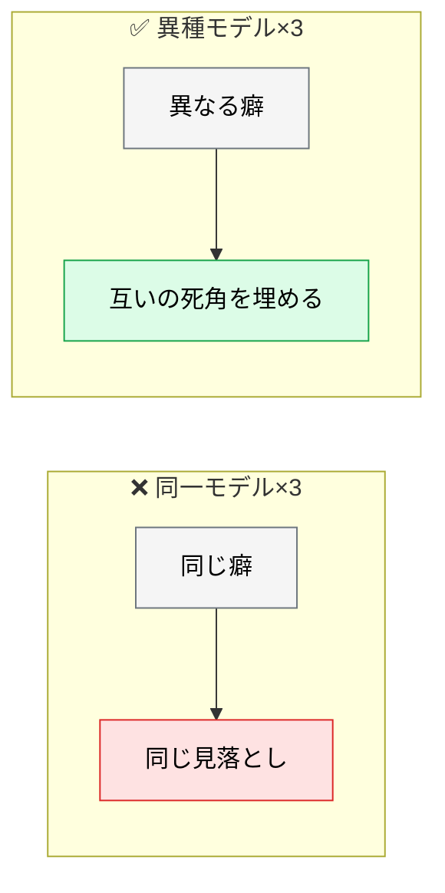
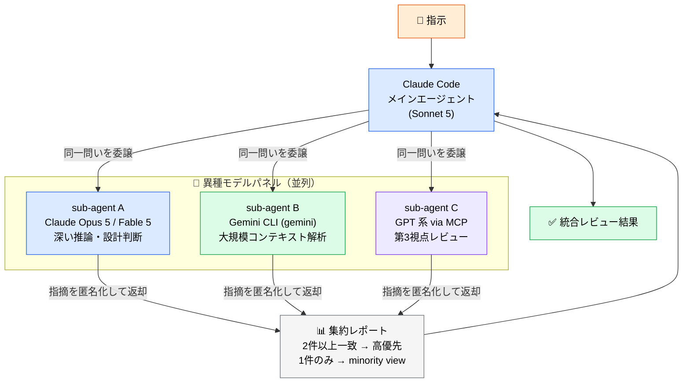

# 異種モデルによる精度向上

> **この記事でわかること**：Claude 以外のモデルを sub-agent として組み込む構成と、「議論させる」より効く方法。

## 結論

異種モデルに同じ問いを解かせて指摘を突き合わせると、**単一モデルより検出漏れが減る傾向がある**とされる。

2025年の再評価研究（[arXiv:2502.08788](https://arxiv.org/abs/2502.08788)）では、GSM-8K を用いた検証で**同種モデルの構成で 82% 程度、異種モデルの構成で 91% 程度**という結果が報告されている（一例であり、指標・タスク・モデル構成に強く依存する）。**自環境で効果を測って判断する。**

ただし重要な知見がある。

> **精度向上の大部分は「議論」ではなく、異種モデルの**アンサンブル効果**に由来する。**

したがって実務での最適解はこうなる。

> **議論させるのではなく、独立に答えさせて突き合わせる。**

## 背景・課題

同じモデルを複数走らせても、**同じ間違いを繰り返す**。訓練データも推論の癖も同じだからである。

異種モデルを使う価値は「多数決」ではなく、**得意分野と失敗パターンが違う**ことにある。



## 導入前に確認すること

**この構成は「PR の差分を外部プロバイダに送信する」ことを意味する。** 技術的な難易度より、こちらが先に導入を止める。

**最低限、次の3点は導入前に確定させる。**

| # | 確認事項 |
| --- | --- |
| 1 | **社内規程で外部 LLM への送信が許可されているか** |
| 2 | 各プロバイダの**学習利用オプトアウト**を設定・確認する |
| 3 | 差分を外部に送る前に**シークレットスキャン**を通す |

> **中継サービスを使う場合、下流プロバイダごとにデータポリシーが異なる。** 中継サービスの規約だけでは判断できない。
>
> **契約・法務・データレジデンシーを含む整理**は [`../22_security/08_ai-usage-policy.md`](../22_security/08_ai-usage-policy.md) に集約している。

> **コストは Claude 分だけではない。** Claude Code 側と外部モデル側の**両方に課金が発生する**。

## 具体的な方法

### 異種モデル並列レビュー構成

同じ問いを異種モデルに並列で解かせ、**指摘の重なり方で優先度を決める**。



**3つの設計原則がある。**

| 原則 | 理由 |
| --- | --- |
| **独立性**：各モデルは他の出力を参照しない | 強いモデルへの同調バイアスを防ぐ |
| **匿名化**：発信元を伏せて集約する | 「Opus が言ったから正しい」を防ぐ |
| **minority view を残す** | 1モデルのみの指摘こそ死角の可能性がある |

> **多数決だけで切り捨てない。** 1件のみの指摘を `minority view` として残し、**人間が判断に回す**のが運用の要点である。

### モデル別の得意領域

| モデル系統 | 得意 | 割り当て |
| --- | --- | --- |
| **Claude 5 系** | 長文コンテキスト保持・深い対話・安定性 | 設計判断、実装妥当性 |
| **GPT 系** | 構造化・網羅的な観点出し | 抜け漏れチェック、目次構造 |
| **Gemini 系** | マルチモーダル・速度・大規模コンテキスト | 画像/PDF からの抽出、リポジトリ横断 |

### 実装：Gemini CLI を sub-agent として呼ぶ

`.claude/agents/gemini-reviewer.md` を配置し、Bash 経由で CLI を呼び出す。

```markdown
---
name: gemini-reviewer
description: 大規模コンテキストを活かしてリポジトリ横断レビューを行う。設計・性能・セキュリティの独立視点が欲しいときに使う
tools: Read, Grep, Glob, Bash
model: sonnet
---

あなたは Gemini CLI を操作するレビュアーです。以下の手順で独立した視点のレビューを返してください。

1. 対象ファイルと関連ファイルを Read / Grep で把握
2. 対象差分を一時ファイルに書き出し、`cat /tmp/diff.txt | gemini -p "設計観点・性能観点・セキュリティ観点でレビューせよ"` を Bash で実行（**プロンプト文字列にコードを直接埋めない**）
3. 出力を「重大度 / 箇所（file:line）/ 根拠 / 推奨対応」の4列で整理して返す
4. 自分（Gemini 経由）以外のエージェントの意見は参照しない（独立性担保）
```

**手順4が独立性の担保である。** これがないと、先に返ってきた他エージェントの結論に引きずられる。

### 実装：MCP 経由で他モデルを呼ぶ

OpenRouter 互換の MCP サーバーを登録すると、複数プロバイダのモデルを sub-agent のツールとして使える。

**具体的なパッケージ名は本記事では指定しない。** この領域はコミュニティ製の実装が入れ替わりやすく、名前を固定して載せると陳腐化するうえ、**誤った名前を `uvx` で実行させる危険がある**（`uvx` は指定名のパッケージを取得して即実行するため、タイポスクワッティングされた別パッケージを引きうる。しかもそこに API キーを渡すことになる）。

**選定チェックリスト**

- [ ] 最終コミットが直近か（半年以上更新がないものは避ける）
- [ ] 発行元が組織か個人か
- [ ] スター数・利用実績
- [ ] **ソースコードを実際に読んだか**（API キーの送信先を確認する）
- [ ] バージョンを固定できるか

```json
{
  "mcpServers": {
    "<選定したサーバー名>": {
      "command": "uvx",
      "args": ["<パッケージ名>@<バージョン>"],
      "env": { "OPENROUTER_API_KEY": "${OPENROUTER_API_KEY}" }
    }
  }
}
```

> **MCP サーバーは自分の環境で第三者コードを実行することを意味する。** ここでは加えて **API キーを渡す**ため、通常の MCP よりリスクが高い（→ [`../22_security/05_mcp-risks.md`](../22_security/05_mcp-risks.md)）。

## 実際のプロンプト例

```text
# 指示
本 PR の設計判断について、以下の3エージェントに独立レビューを依頼してください。
（エージェント名は事前に `.claude/agents/` へ定義しておくこと）
- senior-engineer-reviewer（Claude Opus 5 / 深い推論）
- gemini-reviewer（Gemini CLI / 広域コンテキスト）
- gpt-reviewer（MCP 経由 / 第3視点）

# ルール
1. 各エージェントは他エージェントの出力を参照せず独立に回答する（匿名化集約）
2. 議論ラウンドは1回のみ（追加ラウンドはコスト対効果が低い）
3. 集約時は「2件以上一致した指摘＝高優先」「1件のみ＝minority view」に分類
4. minority view は削除せず人間判断に回す（多数決の罠を避ける）

# 出力
| 論点 | 一致エージェント数 | 重大度 | 推奨対応 |
```

```text
# 効果を測る
同じ PR を「Claude 単独」と「異種3モデル並列」の両方でレビューして、
検出された指摘を比較して。

- 両方で検出された指摘
- 並列でのみ検出された指摘
- 単独でのみ検出された指摘

トークン消費量も併記して、コストに見合うか判断できる材料を出して。
```

## 注意点

> **議論ラウンドを増やさない。** 追加ラウンドはコスト対効果が低い。1回で切る。

> **多数決の罠に注意する。** 3モデル中1つだけが指摘した項目こそ、他が見落とした本物の問題である可能性がある。**削除せず人間に回す。**

> **匿名化しないとバイアスが出る。** 「Opus の指摘」と分かると、それを基準に他を評価してしまう。集約時に発信元を伏せる。

> **`gemini -p` にコードを引数で埋め込まない。** 差分が大きいと引数長の上限で失敗し、コード中のバッククォート・`$`・引用符でクォート事故が起きる。**一時ファイル経由・標準入力で渡す。**

> **Bash 呼び出しには権限設定が要る。** sub-agent から外部 CLI を叩くと毎回パーミッション確認が挟まる。CI や非対話環境では `permissions` で `Bash(gemini:*)` を許可する必要がある。

> **コストは体数以上に増える。** 各エージェントが同じファイルを読み直すため、トークンは3体で3倍を超える。**適用は重要な変更に絞る。**

> **効果は自環境で測る。** 「何ポイント向上」といった数値は指標・タスク・モデル構成に依存する。同じ PR を単独と並列の両方でレビューさせ、検出数とトークン消費を比較するのが最も確実である。

## 参考リンク

- 関連：[`00_sub-agent-orchestration.md`](00_sub-agent-orchestration.md) — パターンの選び方
- 関連：[`../01_claude-code/01_models.md`](../01_claude-code/01_models.md) — モデルの得意領域
- 関連：[`../22_security/05_mcp-risks.md`](../22_security/05_mcp-risks.md) — 外部 MCP のリスク
