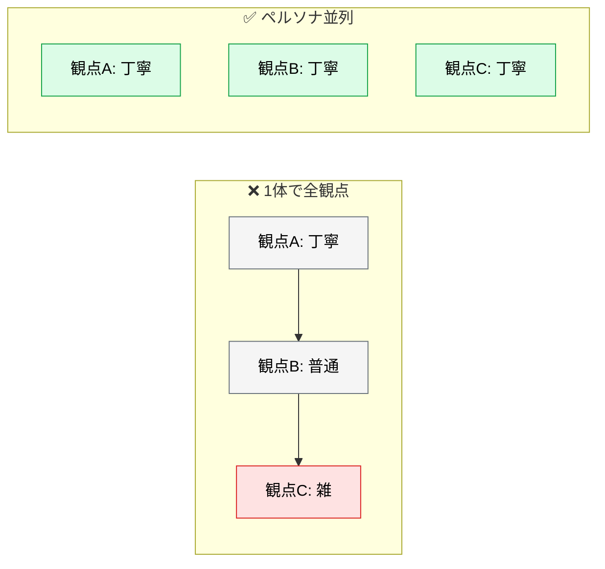
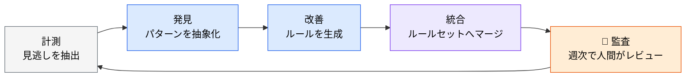
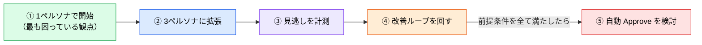

# ペルソナ並列レビューと自動改善ループ

> **この記事でわかること**：役割の異なるペルソナを並列で走らせる構成と、レビュールール自体を改善し続ける仕組み。

## 結論

単一の AI レビューでは観点が偏る。**役割の異なる複数ペルソナを並列で走らせる**ことで検出精度が上がる。

ただし前提は変わらない。

> **AI レビューは人間レビューの補助であり、最終的な Approve 権限は人間が持つ。**

AI が「問題なし」と判断した PR であっても、人間が設計意図・ビジネスロジック・チーム方針との整合性を確認したうえで Approve する。

## 背景・課題

1つのエージェントに「セキュリティも設計も性能も見て」と頼むと、**後の観点ほど雑になる**（→ [`../01_claude-code/05_sub-agents.md`](../01_claude-code/05_sub-agents.md)）。

ペルソナを分けると、各エージェントは1つの観点に集中できる。



## 具体的な方法

### 3ペルソナ並列レビュー

| ペルソナ | レビュー観点 |
| --- | --- |
| **Language Engineer** | 言語固有のイディオム・並行性・パフォーマンス |
| **Software Architect** | 設計の一貫性・モジュール境界・依存方向 |
| **Cloud / Infra Expert** | クラウドリソースの設定・コスト・セキュリティ境界 |

各ペルソナを独立したセッションとして PR に並列適用し、コメントを集約する。

**ペルソナは「肩書き」ではなく「見るもの」で定義する。** 「シニアエンジニアとして」より「モジュール境界と依存方向を見る人として」のほうが出力が安定する。

### 夜間自動改善ループ

レビュールール自体を改善し続ける仕組みである。

| ステージ | 役割 |
| --- | --- |
| **計測** | 過去 PR でのレビュー見逃し（後続コミットでの修正）を抽出 |
| **発見** | 共通する見逃しパターンを LLM で抽象化 |
| **改善** | 新しいレビュールールを生成 |
| **統合** | 既存ルールセットへマージ（重複は効果スコアでマージ） |
| **監査** | **生成ルールを人間が週次レビューし、不要分を削除** |



> **「監査」ステージを省略してはならない。** AI が生成したルール自体に偏りがある可能性があるため、**週次の人間チェックが品質の最終防衛ライン**となる。

「計測」の起点が巧妙である。**後続コミットでの修正**＝「レビューで見逃された問題」として扱える。ここから実際の弱点が抽出できる。

### 発展パターン：「却下理由なければ Approve」

十分な品質基盤が整ったチームでは、AI レビューで却下理由が見つからなかった PR を自動 Approve する運用も検討できる。ただし**以下の前提条件をすべて満たす場合に限る**。

```markdown
> **「却下理由なければ Approve」導入の前提条件チェックリスト**
> - [ ] E2E テストカバレッジが主要フロー全体に整備されている
> - [ ] 即時ロールバック手順が文書化・テスト済みである
> - [ ] カナリアデプロイまたはフィーチャーフラグによる段階的リリースが可能
> - [ ] 本番モニタリング・アラートが設定済みである
> - [ ] AI レビューの偽陰性率を計測・追跡する仕組みがある
```

> **1つでも欠けている場合は、デフォルトの「人間 Approve 必須」を維持する。** ロールバック手段が無いまま自動マージを許すと、**AI レビューの偽陰性が即座に本番障害に直結する。**

5項目のうち最後の「偽陰性率の計測」が最も難しい。**測れていないなら、この運用に進んではいけない。**

### 段階的な導入



**①から始める。** いきなり3ペルソナを走らせると、指摘が多すぎて読まれなくなる。

## 実際のプロンプト例

```text
# 3ペルソナ並列レビュー
この PR を3つのペルソナで並列レビューして。各ペルソナは他の結果を参照しないで。

1. 「言語固有のイディオム・並行性・パフォーマンス」を見る人
2. 「設計の一貫性・モジュール境界・依存方向」を見る人
3. 「クラウドリソースの設定・コスト・セキュリティ境界」を見る人

集約時：
- 2人以上が指摘した項目 → 高優先
- 1人のみ → minority view（削除せず残す）

最終 Approve は私が判断するので、承認可否の断定はしないで。
```

```text
# 見逃しの計測
過去3ヶ月のマージ済み PR を gh で取得して、
「マージ後1週間以内に同じファイルが修正された」ケースを抽出して。

その修正内容から、レビューで見逃されていた問題の傾向を分類して。
最も多いパターン3つについて、レビュー観点として追加すべきルールを提案して。
```

```text
# ペルソナ定義の作成
このリポジトリの技術スタックと過去のレビュー指摘を踏まえて、
このプロジェクトに適したレビューペルソナを3つ設計して。

各ペルソナについて .claude/agents/ 配下のエージェント定義を作成し、
「肩書き」ではなく「何を見るか」で役割を記述して。
tools は読み取り専用に絞って。
```

## 注意点

> **最終 Approve は人間が持つ。** AI が「問題なし」と判断しても、設計意図・ビジネスロジック・チーム方針との整合性は人間が確認する。

> **「監査」ステージを省略しない。** AI が生成したレビュールールには偏りがありうる。週次の人間チェックが最終防衛ラインである。

> **ペルソナを増やしすぎない。** 3つで十分なことが多い。増やすほど指摘が重複し、読まれなくなる。

> **自動 Approve は前提条件をすべて満たしてから。** 特に「偽陰性率を計測する仕組み」がないなら進んではいけない。

> **並列実行はコストが乗算される。** 全 PR ではなく、コアロジックやセキュリティ上重要な変更に絞る。

## 参考リンク

- 関連：[`00_sub-agent-orchestration.md`](00_sub-agent-orchestration.md) — 並列レビュー型の位置づけ
- 関連：[`../14_code-review/00_ai-human-split.md`](../14_code-review/00_ai-human-split.md) — 分担の設計
- 関連：[`../22_security/02_vibe-coding-risk.md`](../22_security/02_vibe-coding-risk.md) — レビューの形骸化を防ぐ
