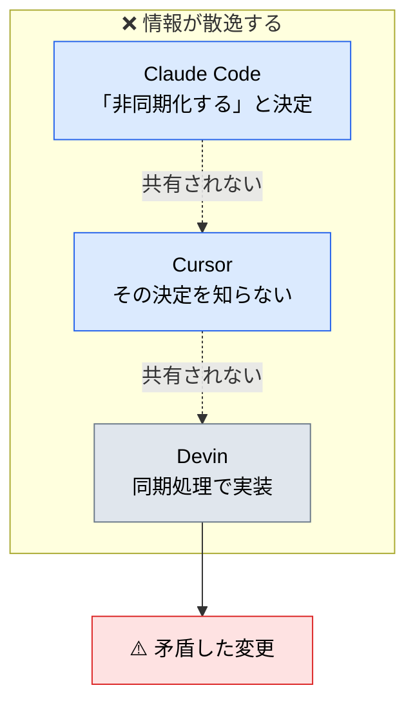
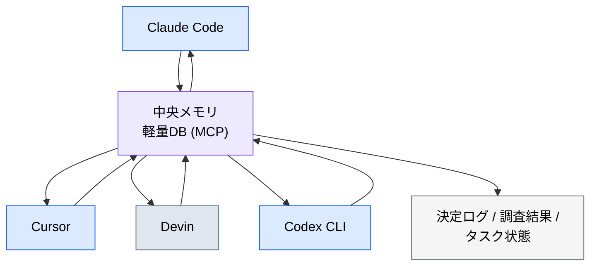
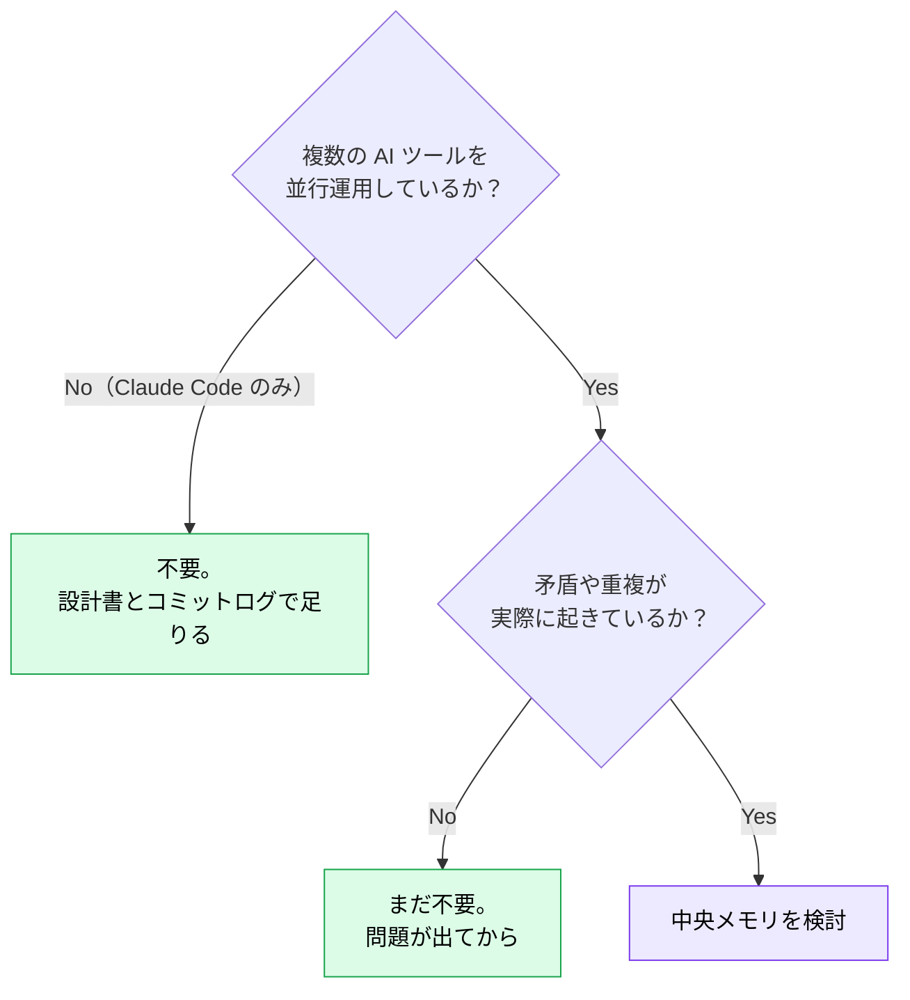

# マルチエージェント協調時の中央メモリ

> **この記事でわかること**：複数の AI ツールが同時に動くチームで情報が散逸する問題と、その解決構成。

## 結論

Claude Code / Cursor / Devin / Codex CLI など**複数の AI エージェントが同時に動くチーム**では、エージェント間で情報が散逸する。

> **各エージェントが独立したコンテキストを持つため、同じ調査を重複したり、ある AI の結論を別の AI が知らずに矛盾した変更を入れたりする。**

解決策は、**軽量 DB を MCP 経由で「中央メモリ」として共有する**構成である。

## 背景・課題

sub-agent の「コンテキストが隔離されている」という利点は、複数ツールを跨ぐと欠点に転じる。



具体的には次が起きる。

- 同じ調査を複数のエージェントが重複して行う（トークンの二重消費）
- ある AI が得た結論を別の AI が知らず、矛盾した実装をする
- 誰が何を進行中か分からず、作業が衝突する

## 具体的な方法

### 構成



**MCP 経由で共有する**のが要点である。各ツールが同じ DB を参照できれば、ツールの種類を問わず情報が繋がる。

### 保存する内容

| 用途 | 保存内容 |
| --- | --- |
| **決定ログ** | 設計判断・採用したパターンと理由 |
| **調査結果キャッシュ** | 既に調べた API 仕様・ライブラリ挙動 |
| **タスク状態** | 誰が（どのエージェントが）何を進行中か |

**「調査結果キャッシュ」の効果が最も分かりやすい。** 同じライブラリの仕様を3回調べる無駄がなくなる。

### AI ゲートウェイとの違い

混同されやすいが、レイヤーが違う。

| | AI ゲートウェイ | 中央メモリ |
| --- | --- | --- |
| 位置づけ | **LLM 呼び出しの関所** | **エージェント間の共有ホワイトボード** |
| 担うもの | セキュリティ・コスト・監査 | 情報の一貫性 |
| 通るもの | プロンプトとレスポンス | 決定・調査結果・状態 |

> **両者を併用することで、コスト管理（ゲートウェイ）と情報一貫性（中央メモリ）を両立できる**（→ [`../22_security/04_ai-gateway.md`](../22_security/04_ai-gateway.md)）。

### 導入の前に

**この構成が必要なのは、複数の AI ツールを並行運用しているチームだけ**である。



**単一ツールなら不要である。** 設計判断は ADR に、進行状況は Issue に書けば済む。

### 軽量に始める

いきなり DB を立てなくてよい。段階を踏む。

| 段階 | 手段 |
| --- | --- |
| 1 | **リポジトリ内のファイル**（`docs/decisions/` に ADR を書く） |
| 2 | Issue / PR のコメント（GitHub MCP で全ツールから読める） |
| 3 | 軽量 DB + MCP（本記事の構成）。SQLite / Postgres など既存の軽量 DB を MCP で公開する |

**1と2で足りることが多い。** 3に進むのは、ツール横断の状態管理が本当に必要になってからでよい。

## 実際のプロンプト例

```text
# 決定ログを書かせる（段階1）
この設計判断を docs/decisions/ に ADR として記録して。

含める項目:
- 決定内容
- 検討した選択肢と却下理由
- 影響範囲
- 決定日

他のエージェント・他のメンバーが後から読んで、
同じ検討を繰り返さずに済む粒度で書いて。
```

```text
# 重複作業の検出
docs/decisions/ と直近のコミットログを読んで、
「既に決まっているのに、別の場所で再検討されている」論点がないか調べて。

見つかったら、どちらが新しい決定かと、統一すべき方針を示して。
```

```text
# 中央メモリの必要性を判断させる
このチームの AI ツール利用状況（複数ツールの並行利用の有無、
実際に起きている矛盾や重複作業）を踏まえて、
中央メモリの導入が必要か判断して。

不要と判断した場合は、代わりに何で代替できるかを示して。
```

## 注意点

> **単一ツールなら不要である。** Claude Code だけで完結しているチームには過剰な構成になる。設計書とコミットログで足りる。

> **中央メモリも古くなる。** 決定ログを書きっぱなしにすると、実装と乖離した記録が残る。**更新の責任者を決める。**

> **中央メモリ自体が機密になる。** 決定ログには未公開の意思決定が、調査結果には認証情報が混ざりうる。**誰が読めるか・保持期間をどうするか**を最初に決める。

> **保存内容を絞る。** 何でも書き込むと、検索してもノイズしか返らなくなる。「決定」「調査結果」「進行状況」の3種に限定する。

> **AI ゲートウェイとは別レイヤーである。** どちらか一方では、コスト管理と情報一貫性のどちらかが欠ける。

> **まず ADR とファイルで試す。** DB を立てる前に、リポジトリ内のファイルで運用してみる。それで回るなら、それが最良である。

## 参考リンク

- 関連：[`00_sub-agent-orchestration.md`](00_sub-agent-orchestration.md) — 単一ツール内の連携
- 関連：[`../22_security/04_ai-gateway.md`](../22_security/04_ai-gateway.md) — 別レイヤーの仕組み
- 関連：[`../23_team-workflow/01_shared-resources.md`](../23_team-workflow/01_shared-resources.md) — チーム共有の設計
