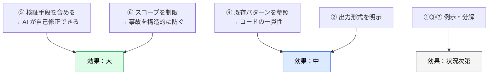

# プロンプト設計の基本原則

> **この記事でわかること**：高品質なプロンプトの7原則と、プロンプトを AI 自身に書かせる「メタプロンプティング」。

## 結論

7原則あるが、**効果が最も大きいのは2つ**である。

| 原則 | なぜ効くか |
| --- | --- |
| **検証手段を含める** | AI が自分で確認・修正できるループが閉じる |
| **スコープを制限する** | 予期しない変更が構造的に起きなくなる |

そして、プロンプトを練るのが苦手なら**AI 自身に書かせればよい**（メタプロンプティング）。

## 背景・課題

「うまくいかないからプロンプトを工夫する」という発想になりがちだが、多くの場合の原因は表現の巧拙ではない。

- 何をもって成功とするかを伝えていない
- 触ってよい範囲を伝えていない
- 参照すべき既存パターンを渡していない

**渡す情報の設計**であって、言い回しの問題ではない。

## 具体的な方法

### GOLDE 構造

構造化のテンプレートとして、次の5要素で整理する（Goal / Output / Limits / Data / Evaluation の頭文字）。

> **GOLDE は本資料が実践知を整理するために付けた呼称であり、一般的な用語ではない。** 検索しても出てこない。**AI に渡すときは必ず5要素を展開して書く**（モデルは「GOLDE」を知らない）。

```text
GOAL: [具体的な達成目標]
OUTPUT: [出力形式・構造]
LIMITS: [制約・使ってはいけないもの]
DATA: [参照すべきファイル・コンテキスト]
EVALUATION: [成功基準・検証方法]
```

**EVALUATION が最も抜けやすく、最も効く。** ここがあると AI は自分で検証して直す。

### 高品質プロンプトの7原則

| # | 原則 | 具体例 |
| --- | --- | --- |
| 1 | **具体例を先に** | 抽象的な要件より前に入出力例を示す |
| 2 | **出力形式を明示** | JSON schema / TypeScript interface で形式を指定 |
| 3 | **ネガティブ例を含める** | `Do NOT use X` で誤った方向性を排除 |
| 4 | **既存パターンを参照** | `@file` で既存コードのパターンを示す |
| 5 | **検証手段を含める** | テストコマンド・成功基準を含める |
| 6 | **スコープを制限** | 「このファイルのみ変更すること」で予期しない変更を防ぐ |
| 7 | **段階的に詳細化** | 大きなタスクは分解して順に進める |

### 効果の大きさ

7つを均等に扱わない。**投資対効果には差がある。**



### 「検証手段」の具体形

⑤は「テストを書かせる」ことではない。**成果を確認する方法を渡す**ことである。

| 種類 | 渡し方 |
| --- | --- |
| テスト | 「実装後に `npm test` を実行して、失敗したら修正して」 |
| 型チェック | 「`npx tsc --noEmit` が通ることを確認して」 |
| 視覚 | 「実装後にスクショを撮り、元のデザインと比較して」 |
| データ | 「生成した SQL を読み取り専用で実行して、通ることを確認して」 |
| 仕様 | 「`@SPEC.md` の受け入れ基準を1つずつ満たしているか確認して」 |

### 「スコープ制限」の具体形

⑥は事故防止として効く。**AI に判断させず、範囲を宣言する。**

```text
変更してよいのは @src/api/users/ 配下のみ。
それ以外のファイルは、必要だと判断しても変更せずに理由を報告して。
```

> より強い保証が要るなら `permissions.deny` で構造的に禁止する。プロンプトは「お願い」であり、確実性が要る場面では設定で担保する（→ [`../01_claude-code/06_hooks.md`](../01_claude-code/06_hooks.md)）。

### メタプロンプティング

プロンプトをゼロから練るのではなく、**AI 自身に最適なプロンプトを作らせる**。

```text
以下のタスクを実行するための最適なプロンプトを作成してください。
プロンプトは次の5要素で構成してください。

- GOAL: 具体的な達成目標
- OUTPUT: 出力形式・構造
- LIMITS: 制約・使ってはいけないもの
- DATA: 参照すべきファイル・コンテキスト
- EVALUATION: 成功基準・検証方法

タスク: [やりたいことの概要]
コンテキスト: [技術スタック・制約など]

EVALUATION には必ず具体的な検証コマンドを含めてください。
```

**経験が浅いメンバーでも高品質なプロンプトを即座に作れる。** チーム展開において、プロンプト研修より効率がよいことが多い。

### アンチパターン

| ❌ | なぜ悪いか | ✅ |
| --- | --- | --- |
| 「いい感じにして」 | 成功基準がない | 「〜を満たすように。満たしたか `npm test` で確認して」 |
| 「全部直して」 | スコープが無限 | 「`@src/api/` 配下のみ。それ以外は理由を報告して」 |
| 「バグを直して」 | 症状しか伝えていない | 「[エラー全文]。根本原因を直して。握りつぶさないで」 |
| 長大な指示を1回で | 途中が無視される | 段階に分けて、各段階で確認する |

## 実際のプロンプト例

```text
# GOLDE 構造の実例
GOAL: ユーザー検索 API にページネーションを追加する

OUTPUT: 変更後のハンドラのコードと、追加したテスト

LIMITS:
- 変更してよいのは @src/api/users/ 配下のみ
- 既存のレスポンス形式を壊さないこと（後方互換）
- 新しいライブラリを追加しないこと

DATA:
- 既存パターン: @src/api/posts/handler.ts のページネーション実装
- 仕様: @docs/spec/API.md の「一覧取得」節

EVALUATION:
- npm test が全件通ること
- 既存の呼び出し側（@src/client/）が壊れないこと
```

```text
# メタプロンプティングを使う
「レガシーな決済モジュールをリファクタリングする」ための最適なプロンプトを作成して。
プロンプトは GOAL / OUTPUT / LIMITS / DATA / EVALUATION の5要素で構成して。

コンテキスト: TypeScript / Express、テストカバレッジは60%程度、
本番稼働中で挙動を変えてはいけない

作成したプロンプトには、検証手段とスコープ制限を必ず含めて。
```

```text
# 既存プロンプトの改善を依頼する
以下のプロンプトを7原則に照らして評価し、改善案を出して。

「決済まわりのバグを直して」

どの原則が欠けているかを指摘し、改善後のプロンプトを提示して。
```

## 注意点

> **プロンプトの巧拙より、渡す情報の設計が効く。** 表現を練る前に「検証手段」と「スコープ」を渡しているか確認する。

> **`Do NOT` は具体的に書く。** 「危険なことをしないで」では機能しない。「`migrations/` を変更しないで」のように対象を特定する。

> **長すぎるプロンプトは逆効果。** コンテキストが膨らみ、後半の指示ほど効きが弱くなる。段階に分ける。

> **プロンプトは「お願い」である。** 破られたら困るものは `permissions` や hooks で担保する。

## 参考リンク

- 次に読む：[`01_cheatsheet.md`](01_cheatsheet.md) — フェーズ別の定型プロンプト
- 関連：[`02_versioning.md`](02_versioning.md) — 効果の高いプロンプトを資産化する
- 関連：[`../00_overview/00_what-is-ai-driven-dev.md`](../00_overview/00_what-is-ai-driven-dev.md) — 3大原則
