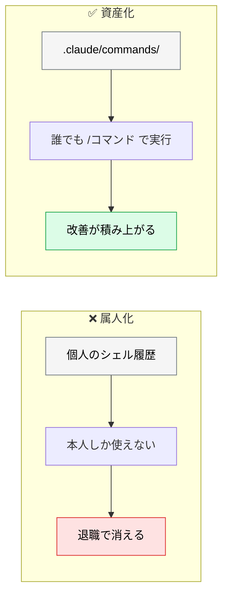
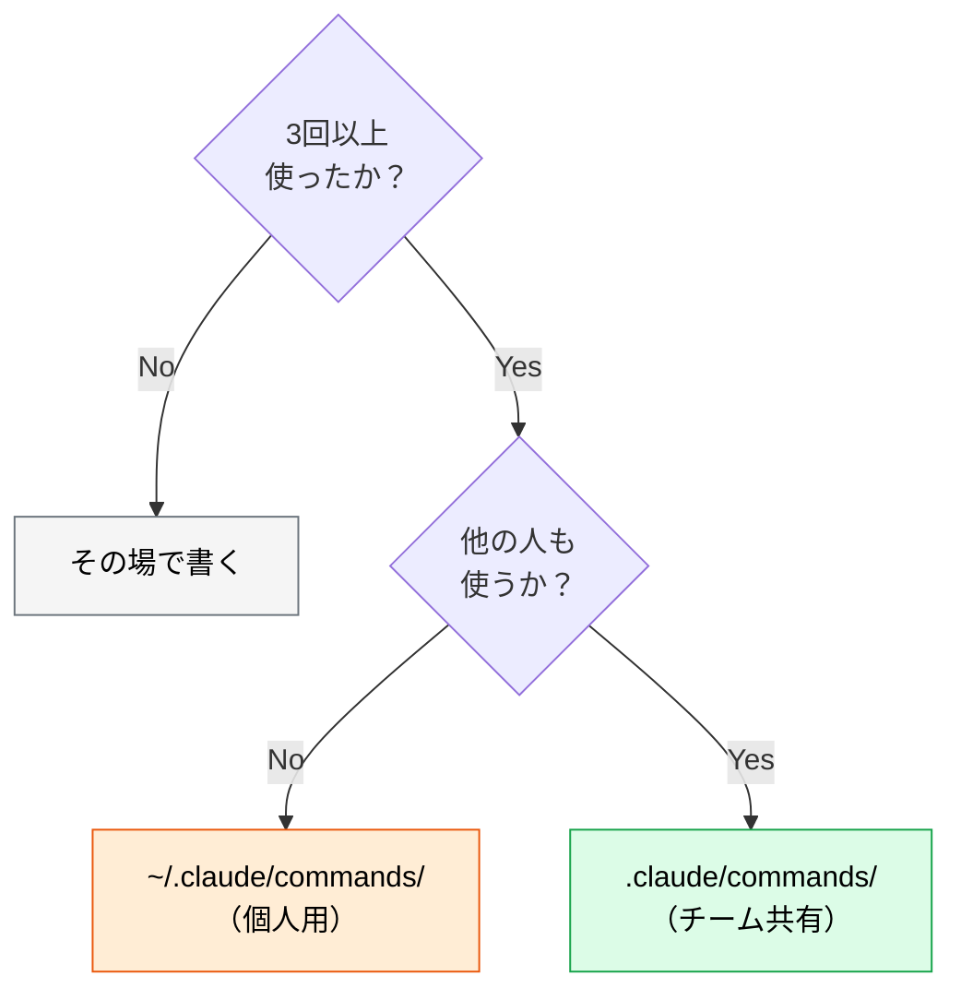

# プロンプトのバージョン管理

> **この記事でわかること**：効果の高かったプロンプトを個人の暗黙知からチームの資産に変える方法。

## 結論

> **プロンプトもコードと同様に Git でバージョン管理する。**

そして運用の要点は1つである。

> **効果が高かったプロンプトを `.claude/commands/` に格上げし、チーム全体で共有・標準化する。**

「うまくいったプロンプト」が個人のシェル履歴にしか残らない状態を解消する。

## 背景・課題

AI 活用が定着してくると、次の状態になる。

- ベテランは効果的なプロンプトを持っているが、共有されていない
- 新メンバーは毎回ゼロから試行錯誤する
- 同じ作業なのに人によって出力の質が違う

**プロンプトは属人化しやすい。** コードなら共有される仕組みがあるのに、プロンプトにはない。



## 具体的な方法

### 配置

```text
.claude/
  commands/        # カスタムスラッシュコマンド（ファイル名 = コマンド名）
    review.md      # → /review
    test-gen.md    # → /test-gen
    spec.md        # → /spec
  skills/          # 再利用可能な専門知識（<name>/SKILL.md 形式）
  prompts/         # その他の共有プロンプト（任意の置き場。@ で参照するだけ）
```

> `prompts/` は Claude Code の公式ディレクトリではない。**特別な意味はなく、`@` で参照するだけの置き場**である。

| ディレクトリ | 用途 | 起動 |
| --- | --- | --- |
| `commands/` | **人間が明示的に呼ぶ定型フロー** | `/review` のように打つ |
| `skills/` | モデルが必要時に読む知識・手順 | 自動発火（`description` で判断） |
| `prompts/` | コマンド化するほどでもない共有文 | `@` で参照 |

**すべて Git 管理下に置く。** チームの資産である。

### 格上げの基準

すべてのプロンプトをコマンド化する必要はない。



**「3回使ったらコマンド化」**を目安にする。1〜2回では、汎用化すべき部分が見えない。

### コマンドの書き方

```markdown
---
description: PR の差分をレビューする。マージ前の品質確認に使う
argument-hint: [対象ブランチ]
allowed-tools: Read, Grep, Glob
---

# レビュー

現在のブランチの差分を、以下の観点でレビューする。

## 観点

1. セキュリティ：インジェクション・シークレット露出・認証漏れ
2. 仕様との整合性：@docs/spec/SPEC.md との乖離
3. テストカバレッジ：正常系・異常系・境界値

## 出力形式

| 重要度 | 指摘 | 該当箇所 | 修正案 |
|---|---|---|---|

重要度は [Blocker] / [Suggestion] / [Nit] の3段階とする。

## 制約

- 挙動を変える修正は提案に留め、勝手に適用しない
- 判断が分かれる点は両論を併記する
```

> **コマンド名はファイル名から決まる。** `review.md` なら `/review` になる。frontmatter に `name` キーはない（`skills/` の `SKILL.md` とは異なる点に注意）。

**主な frontmatter キー**

| キー | 用途 |
| --- | --- |
| `description` | **必須級。** 一覧で「いつ使うか」が分かるように書く |
| `argument-hint` | 引数の説明（入力補助に表示される） |
| `allowed-tools` | このコマンド実行中に許可するツール |
| `model` | 使用モデル |

**引数を受け取る**

コマンド本文では `$ARGUMENTS`（全引数）や `$1` `$2`（位置引数）が使える。

```markdown
---
description: 指定ファイルのテストを生成する
argument-hint: [ファイルパス]
---

$1 のテストを生成して。
境界値・異常系を必ず含めて、実装後に npm test を実行して。
```

`/test-gen src/api/users.ts` のように呼ぶと `$1` が置換される。

### 改善のサイクル

コマンド化した後が本番である。

| 段階 | やること |
| --- | --- |
| 1. 使う | 実際のタスクで使う |
| 2. 気づく | 「毎回この指示を足している」に気づく |
| 3. **取り込む** | その指示をコマンド本体に追記する |
| 4. **PR で共有** | 変更を PR にして、チームで議論する |

**プロンプトの変更を PR にする**のが要点である。コードレビューと同じ扱いにすることで、改善が個人に閉じなくなる。

### 変更履歴が意味を持つ

Git 管理の実利は「戻せる」ことだけではない。


「テストを緩めて通すな」という一文が追加されたコミットには、それが必要になった経緯がある。**コミットメッセージに理由を書く**ことで、後から来た人が消さずに済む。

### commands と skills の使い分け

| | `.claude/commands/` | `.claude/skills/` |
| --- | --- | --- |
| 起動 | 人間が `/name` と打つ | モデルが `description` を見て自動で読む |
| 形式 | `name.md` 単体 | `name/SKILL.md`（ディレクトリ必須） |
| 向いているもの | 定型フロー（レビュー・デプロイ手順） | ドメイン知識・規約 |

**「実行したいもの」はコマンド、「知っていてほしいこと」はスキル**と考えるとよい（→ [`../01_claude-code/04_skills.md`](../01_claude-code/04_skills.md)）。

## 実際のプロンプト例

```text
# コマンド化を依頼する
私が繰り返し使っている以下の指示を、
.claude/commands/ 配下のコマンドとして整理して。

[実際に使っていたプロンプトを貼る]

汎用化すべき部分（毎回変わる箇所）は引数として受け取る形にして。
description には「いつ使うか」を必ず書いて。
```

```text
# 既存コマンドの棚卸し
.claude/commands/ 配下を読んで、次を判定して。

1. 実際に使われていそうか（内容の具体性・鮮度から推測）
2. 内容が重複しているコマンド
3. description が曖昧で、いつ使うか分からないもの

統廃合の提案を出して。
```

```text
# 改善を取り込む
/review を使うとき、毎回「テストの網羅性も見て」と追記している。
この指示を .claude/commands/review.md 本体に取り込んで。

なぜ追加したかがわかるコミットメッセージも作って。
```

## 注意点

> **最初から完璧なコマンドを作ろうとしない。** 3回使って共通部分が見えてから作る。早すぎる汎用化は、使いにくいコマンドを生む。

> **`description` が曖昧だと使われない。** 「レビュー用」ではなく「PR の差分をレビューする。マージ前の品質確認に使う」と書く。

> **コマンドが増えすぎたら統廃合する。** 一覧から選べなくなった時点で、コマンド化の利点が失われる。

> **プロンプトにもテストがない、という非対称に注意する。** コードなら CI が守るが、コマンドの変更は誰も検証しない。**代表タスク5件を新旧コマンドで流して出力を目視比較する**程度の軽量な回帰セットを用意する。これがないと、PR レビュアーは差分の良し悪しを判断できず、レビューが形骸化する。

> **プロンプトの変更も PR を通す。** コマンドはチーム全員の出力に影響する。勝手に書き換えない。

> **個人用とチーム用を分ける。** 実験中のものは `~/.claude/commands/` に置き、定着してから共有に移す。

## 参考リンク

- 関連：[`01_cheatsheet.md`](01_cheatsheet.md) — コマンド化の候補
- 関連：[`../01_claude-code/04_skills.md`](../01_claude-code/04_skills.md) — skills との使い分け
- 関連：[`../23_team-workflow/01_shared-resources.md`](../23_team-workflow/01_shared-resources.md) — チーム共有の設計
